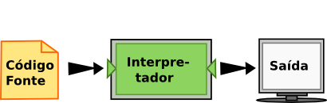
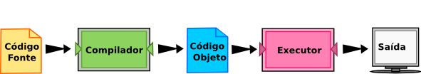

.. -- coding: utf-8 --

..  Copyright (C)  Brad Miller, David Ranum, Jeffrey Elkner, Peter Wentworth, Allen B. Downey, Chris
    Meyers, and Dario Mitchell.  Permission is granted to copy, distribute
    and/or modify this document under the terms of the GNU Free Documentation
    License, Version 1.3 or any later version published by the Free Software
    Foundation; with Invariant Sections being Forward, Prefaces, and
    Contributor List, no Front-Cover Texts, and no Back-Cover Texts.  A copy of
    the license is included in the section entitled "GNU Free Documentation
    License".

..  shortname:: Introdução
..  description:: Essa é uma introdução à Ciência da Computação.

O Caminho do Programa
=====================

O objetivo deste livro é ensinar você a pensar como um cientista da
computação. Essa maneira de pensar combina algumas das melhores
características da matemática, da engenharia e das ciências
naturais. Como os matemáticos, os cientistas da computação usam
linguagens formais para representar ideias (especificamente,
computações). Como os engenheiros, eles projetam coisas, montando
sistemas a partir de componentes e avaliando as vantagens e
desvantagens entre as alternativas. Como os cientistas, eles observam
o comportamento de sistemas complexos, formam hipóteses e testam
previsões.

A habilidade mais importante de um cientista da computação é a de
**solucionar problemas**. A solução de problemas requer a habilidade
de formular questões, pensar criativamente sobre soluções possíveis e
expressar uma solução de forma clara e precisa. Ocorre que aprender a
programar é uma excelente oportunidade de praticar a habilidade da
solucionar problemas. É por isso que este capítulo se chama *O Caminho
do Programa*.

Em um certo nível, você aprenderá a programar, uma habilidade que é
útil em si mesma. Em um outro nível, você usará a programação como um
meio para atingir um objetivo. À medida que você for avançando na
leitura, esse objetivo se tornará mais claro.

.. index:: linguagem de programação, portabilidade, linguagem de alto nível, linguagem de baixo nível, compilação, interpretação

Algoritmos
----------

Se a habilidade de resolver problemas é uma parte central da ciência
da computação, então as soluções que você cria por meio do processo de
resolução de problemas também são importantes. Na ciência da
computação, essas soluções são conhecidas como **algoritmos**. Um
algoritmo é uma lista passo-a-passo de instruções que, caso seguidas
exatamente, resolvem o problema sendo considerado.

Nosso objetivo na ciência da computação é considerar um problema e
desenvolver um algoritmo que possa servir como uma solução
genérica. Uma vez obtida tal solução, um computador pode ser utilizado
para automatizar a execução. Dessa forma, programação é uma habilidade
que permite ao cientista da computação pegar um algoritmo e
representá-lo em uma notação (um programa) que possa ser executado por
um computador. Esses programas são escritos utilizando **linguagens de
programação**.

**Teste seu entendimento**

.. mchoice:: question1_1_1
   :answer_a: Pensar como um computador.
   :answer_b: Ser capaz de escrever código muito bem.
   :answer_c: Ser capaz de resolver problemas.
   :answer_d: Ser muito bom de matemática.
   :correct: c
   :feedback_a: Computadores não pensam, eles somente fazem o que os humanos lhes dizem param fazer por meio dos programas.
   :feedback_b: Embora seja necessário saber programar para a maioria dos cientistas da computação, essa não é a habilidade mais importante.
   :feedback_c: Cientistas da computação resolvem problemas! Os computadores são utilizados para automatizar as soluções e fazer computações mais rapidamente e com maior precisão que nós conseguimos fazer manualmente.
   :feedback_d: A Ciência da Computação e a Matemática são similares em muitas formas e ajuda possuir um fundamento matemático forte, porém você não precisa ser bom de matemática para ser um bom cientista da computação.

   Qual a habilidade mais importante para um cientista da computação?

.. mchoice:: question1_1_2
   :answer_a: Uma solução para um problema que pode ser resolvido por um computador.
   :answer_b: Uma lista passo-a-passo de instruções que, caso seguidas exatamente, resolvem o problema sendo considerado.
   :answer_c: Uma série de instruções implementadas em uma linguagem de programação.
   :answer_d: Um tipo especial de notação usado por cientistas da computação.
   :correct: b
   :feedback_a: Embora seja verdade que um algoritmo em geral resolve problemas, essa não é a melhor resposta. Um algoritmo é mais que apenas uma solução de um problema para um computador. Um algoritmo pode ser utilizado para resolver todos os tipos de problemas, incluindo aqueles que não tenham nada a ver com computadores.
   :feedback_b: Algoritmos são como receitas: elas precisam ser seguidas exatamente, elas precisam ser claras e não ter ambiguidades, e precisam ter um fim.
   :feedback_c: Linguagens de programação são usadas para expressar algoritmos mas um algoritmo não precisa ser expresso na forma de uma linguagem de programação.
   :feedback_d: Cientistas da computação as vezes se utilizam de notações especiais para ilustrar ou documentar um algoritmo, mas essa não é a definição de um algoritmo.

   Um algoritmo é:

A linguagem de programação Python
---------------------------------

A linguagem de programação que você vai aprender é Python. Python é um
exemplo de **linguagem de programação de alto nível**; outras
linguagens de alto nível que você já pode ter ouvido falar são C++,
PHP e Java.

Como você deve ter imaginado, existem também as **linguagens de baixo
nível**, às vezes chamadas de "linguagens de máquina" ou "linguagens
assembly" ("linguagens de montagem"). Dito de maneira simples, o
computador só consegue executar programas escritos em linguagens de
baixo nível. Deste modo, programas escritos em linguagens de alto
nível precisam ser processados antes que possam rodar. Esse
processamento extra toma algum tempo, o que é uma pequena desvantagem
das linguagens de alto nível. Mas as vantagens são enormes.

Primeiro, é muito mais fácil programar em uma linguagem de alto nível.
É mais rápido escrever programas em uma linguagem de alto nível; os
programas ficam mais curtos, mais fáceis de ler, mais simples de
alterar, e é mais provável que estejam corretos. Segundo, as
linguagens de alto nível são **portáveis**, o que significa que podem
rodar em diferentes tipos de computador, com pouca ou nenhuma
modificação. Programas em baixo nível só podem rodar em um único tipo
de computador e precisam ser re-escritos para rodar em outro tipo.

Devido a essas vantagens, quase todos os programas são escritos em
linguagens de alto nível. As de baixo nível são utilizadas somente
para umas poucas aplicações especializadas.

Dois tipos de programas processam linguagens de alto nível,
traduzindo-as para linguagens de baixo nível: **interpretadores** e
**compiladores**. O interpretador lê um programa escrito em linguagem
de alto nível e o executa, ou seja, faz o que o programa diz. Ele
processa o programa um pouco de cada vez, alternadamente: ora lendo
algumas linhas, ora realizando computações.

O compilador lê o programa e o traduz completamente antes que o
programa comece a rodar. Neste caso, o programa escrito em linguagem
de alto nível é chamado de **código fonte**, e o programa traduzido é
chamado de **código objeto** ou **executável**. Uma vez que um
programa é compilado, você pode executá-lo repetidamente, sem que
precise de nova tradução.
 

    
Muitas linguagens modernas se utilizam desses dois processos. O código
fonte é primeiramente compilado para uma linguagem de baixo nível,
chamado de **código em bytes** ("byte code"), e então são
interpretados por um programa chamado de **máquina virtual**. O Python
usa ambos os processos, mas devido a forma com que os programadores
interagem com essa linguagem, ela é em geral considerada uma linguagem
interpretada.

 Existem duas maneiras de usar o interpretador: no modo *linha de
 comando* ("shell mode") e no modo de *script* ("program mode"). No
 modo de linha de comando, você digita programas em Python e o
 interpretador mostra o resultado. O exemplo a seguir ilustra o
 funcionamento do **terminal Python** (Python shell).

::

    $ python3
    Python 3.4.2 (default, Oct  8 2014, 13:08:17) 
    [GCC 4.9.1] on linux
    Type "help", "copyright", "credits" or "license" for more information.
    >>> 2 + 3
    5
    >>>

O símbolo ``>>>`` é chamado de **prompt** do Python. O interpretador
usa o prompt para indicar que está pronto para receber um comando. Ao
digitar ``2 + 3``, o interpretador avalia a expressão e responde
``5``. A seguir, ele fornece um novo prompt na linha seguinte,
indicando que ele está pronto para um novo comando.

Trabalhar diretamente no interpretador é conveniente para testar
pequenos pedaços de código pois você recebe uma resposta rapidamente,
como se você estivesse trabalhando nos seus problemas em uma folha de
rascunho. Qualquer coisa maior que algumas linhas deve ser colocada em
um script.

Você pode escrever um programa inteiro em um arquivo e usar o
interpretador para executar o conteúdo do arquivo como um todo. Esse
arquivo é normalmente chamado de **código fonte**. Por exemplo, nós
podemos usar um editor de texto para criar o código fonte no arquivo
chamado "programa1.py" com o seguinte conteúdo:

.. sourcecode:: python
   
    print("Meu primeiro programa soma os numeros 2 e 3:")
    print(2 + 3)

Por convenção, arquivos que contém programas em Python tem nomes que terminam com a extensão ``.py``. 
Seguir essa convenção vai ajudar o seu sistema operacional e outros programas a identificar um arquivo contendo código python.

::
    
    $ python programa1.py
    Meu primeiro programa soma os numeros 2 e 3:
    5

Esse exemplo mostra o Python sendo executado a partir da linha de comando de um terminal Unix. Em outros ambientes de desenvolvimento, os detalhes de execução de programas podem ser diferentes. Além disso, a maioria dos programas também vão ser mais interessantes.

.. admonition:: Você quer aprender mais sobre Python?

    Se você quiser aprender mais sobre como instalar e usar Python, aqui estão alguns links para vídeos:
   
        * `Installing Python for Windows <http://youtu.be/9EfGpN1Pnsg>`__ mostra como instalar o Python no ambiente Windows Vista,
        * `Installing Python for Mac <http://youtu.be/MEmEJCLLI2k>`__ mostra como instalar no Mac OS/X, e 
	* `Installing Python for Linux <http://youtu.be/RLPYBxfAud4>`__ mostra como instalar no Linux a partir da linha de comando.
	* `Using Python <http://youtu.be/kXbpB5_ywDw>`__ mostra alguns detalhes sobre o terminal Python e código fonte.

**Teste seu entendimento**

.. mchoice:: question1_2_1
   :answer_a: São as instruções de um programa, armazenadas em um arquivo 
   :answer_b: A linguagem de programação que você usa (por exemplo, Python)
   :answer_c: O ambiente/ferramenta que você usa para programar
   :answer_d: A senha (ou “código”) que você precisa fornecer no início de cada programa para que ele possa ser executado.
   :correct: a
   :feedback_a: O arquivo que contém as instruções escritas em uma linguagem de alto nível é chamado de arquivo de código fonte.
   :feedback_b: Essa linguagem é chamada simplesmente de linguagem de programação, ou mais simplesmente ainda de linguagem.
   :feedback_c: O ambiente pode ser chamado de IDE (integrated development environment - ambiente integrado de desenvolvimento), mas nem sempre.
   :feedback_d: Essa senha que você precisa fornecer para rodar o programa não existe.

   O que é código fonte?

.. mchoice:: question1_2_2
   :answer_a: Ela é de alto nível se você estiver de pé e de baixo nível se você estiver sentado.
   :answer_b: Ela é de alto nível se você estiver programando para um computador e de baixo nível se você estiver programando para um telefone ou dispositivo móvel.
   :answer_c: Ela é de alto nível se o programa precisa ser processado antes de rodar, e de baixo nível se o computador pode executá-lo sem processamento adicional.
   :answer_d: Ela é de alto nível se ela for fácil de programar e os programas serem curtos, e de baixo nível se for realmente difícil de programar e seus programas ficarem muito longos.
   :correct: c
   :feedback_a: Nesse caso, o alto e baixo nível não tem nada a ver com a sua altura.
   :feedback_b: Alto e baixo não tem a ver com o tipo de dispositivo a ser utilizado. Ao contrário, pense no que é necessário para executar o programa escrito na linguagem.
   :feedback_c: Correto. Python é uma linguagem de alto nível que precisa ser interpretada para o código de máquina (binário) antes de ser executada.
   :feedback_d: Apesar de ser verdade que as linguagens de alto nível são mais fáceis de programar e geram programas mais curtos, isso nem sempre é verdade.
   
    Qual a diferença entre uma linguagem de programação de alto nível e uma de baixo nível?

.. mchoice:: question1_2_3
   :answer_a: 1 = um processo, 2 = uma função
   :answer_b: 1 = traduzir um livro inteiro, 2 = traduzir uma linha de cada vez
   :answer_c: 1 = software, 2 = hardware
   :answer_d: 1 = código objeto, 2 = código em bytes.
   :correct: b
   :feedback_a: Compilar é um processo de software, e rodar o interpretador equivale a chamar uma função, mas como um processo é diferente de uma função?
   :feedback_b: Compiladores pegam todo o código fonte e produzem código objeto ou executável e os interpretadores executam o código linha a linha.
   :feedback_c: Tanto os compiladores quanto os interpretadores são softwares.
   :feedback_d: Os compiladores podem produzir tanto código objeto quanto código em bytes, dependendo da linguagem. Um interpretador não produz esses códigos.

   Escolha a melhor alternativa para completar os espaços 1 e 2 na
   seguinte frase:  Ao comparar compiladores e interpretadores, um
   compilador é como 1 enquanto um interpretador é como 2.

Formas especiais para rodar Python nesse livro
----------------------------------------------

.. video:: videoinfo
    :controls: 
    :thumb: ../_static/activecodethumb.png  

    http://media.interactivepython.org/thinkcsVideos/activecodelens.mov
    http://media.interactivepython.org/thinkcsVideos/activecodelens.webm

Esse livro fornece duas formas adicionais para executar os programas
em Python. Ambas as técnicas foram projetadas para ajudar você a
aprender a linguagem de programação Python. Elas vão ajudar você a
melhorar o seu entendimento sobre o funcionamento dos programas.

Primeiro, você pode escrever, modificar e executar programas usando um
interpretador especial de **activecode** que permite você executar
código Python diretamente no texto do seu navegador. Embora essa não
seja a forma com que os programas reais são escritos, esse
interpretador fornece um excelente ambiente para aprender uma
linguagem de programação como Python, pois você pode ir experimentando
a linguagem a medida que você avança com a leitura.

Dê uma olhada no interpretador de activecode em funcionamento. Se você
usar o código Python do exemplo anterior e torná-lo ativo, você verá
que ele pode ser executado diretamente simplesmente clicando no botão
*Run*. Experimente clicar no botão *Run* abaixo.

.. activecode:: ch01_1
     
   print("Meu primeiro programa soma os numeros 2 e 3:")
   print(2 + 3)

Agora tente modificar o programa. Primeiro modifique o texto do
primeiro print, mudando a palavra *soma* por *multiplica*. Agora
clique em *Run*. Você pode ver que o resultado do programa mudou,
embora ele ainda forneça "5" como resposta. Modifique o segundo print
trocando o símbolo de soma "+" pelo símbolo de multiplicação
"*". Clique em *Run* para ver o resultado.

Você pode também salvar as suas alterações para serem utilizadas mais
tarde. As opções *Save* e *Load* permitem que você mantenha uma cópia
do programa que você estiver trabalhando. Por exemplo, clique no botão
*Save* agora. Você acaba de salvar o programa que está na janela do
activecode. Agora faça algumas modificações e execute o programa
clicando em *Run*. Esse programa foi modificado, mas clicando em
*Load* você pode restaurar a versão salva previamente.
(NOTA: esses recursos ainda não estão funcionando na versão em português).

Além do activecode, você pode também executar código Python por meio
de uma ferramenta especial para visualização. Essa ferramenta,
denominada **codelens**, permite que você controle os passos de
execução de um programa. Ele também permite observar o conteúdo de
todas as variáveis a medida em que elas são criadas e modificadas. O
exemplo a seguir mostra o codelens em funcionamento, utilizando o
mesmo programa visto anteriormente. Note que em activecode, o código
fonte é executado do início ao fim e você só vê o resultado final. No
codelens, você pode ver e controlar a execução do programa
passo-a-passo.

Os exemplos nesse livro usam uma mistura do interpretador Python
padrão, código fonte, activecode e codelens. Você será capaz de
distinguir entre essas formas olhando para o prompt do Python no caso
de código executado em linha de comando, o botão *Run* no activecode
ou para os botões *forward/backward* no codelens.

.. codelens:: firstexample
    :showoutput:
   
    print("Meu primeiro programa soma os números 2 e 3:")
    print(2 + 3)

**Teste seu entendimento**

.. mchoice:: question1_3_1
   :answer_a: Salve programas e (re)carregue programas salvos.
   :answer_b: Digitar programas em Python.
   :answer_c: Executar código Python diretamente no texto do navegador.
   :answer_d: Receber uma resposta sim/não sobre se o código está correto ou não.
   :correct: a,b,c
   :feedback_a: Você pode (e deve) salvar o seu programa na janela do activecode.
   :feedback_b: Você não precisa se limitar a rodar os programas que já estão lá. Experimente modificar ou criar o seu próprio programa.
   :feedback_c: O interpretador de activecode permite que você digite código Python na caixa de texto, que pode ser executado.
   :feedback_d: Embora você possa (e deva) verificar se o seu código está correto verificando a seu resultado (saída), o activecode não diz diretamente se você implementou o programa corretamente. 

   O interpretador de activecode permite que você (selecione todas as verdadeiras):

.. mchoice:: question1_3_2
   :answer_a: Medir a velocidade de execução de um programa.
   :answer_b: Controlar a execução de um programa passo-a-passo.
   :answer_c: Escrever e executar seu próprio programa em Python.
   :answer_d: Executar o código Python que estiver no Codelens.
   :correct: b,d
   :feedback_a: De fato, o Codelens executa uma linha do programa a cada clique, o que é MUITO mais lento que o interpretador Python.
   :feedback_b: Ao utilizar o Codelens, você pode controlar a execução do programa passo-a-passo. Você pode até voltar na execução!
   :feedback_c: O CodeLens funciona apenas nos exemplos pré-programados.
   :feedback_d: Executa o código Python que estiver no Codelens.

   O codelens permite (selecione todas as verdadeiras):

.. index:: programa, algoritmo

Mais sobre programas
--------------------

Um **programa** é uma sequência de instruções que especificam como executar uma computação. A computação pode ser algo tão complexo quanto exibir uma página de html em um navegador ou codificar um vídeo e transmití-lo pela internet. 
Pode ser também uma computação simbólica, como buscar e substituir uma palavra em um documento ou (estranhamente) compilar um programa.

Os detalhes são diferentes em diferentes linguagens, mas algumas instruções básicas aparecem em
praticamente todas as linguagens.

entrada
    Pega os dados do teclado, de um arquivo ou outro dispositivo.

saída
    Mostra os dados na tela ou envia os dados para um arquivo ou outro dispositivo.

lógica e matemática
    Realiza operações matemáticas básicas como soma e multiplicação, e operações lógicas como ``e``, ``ou``, e ``negação``.

execução condicional
   Verifica se certas condições são satisfeitas antes de executar a sequência apropriada de comandos.

repetição
   Realiza algumas ações repetidamente, em geral com alguma variação.

Acredite se quiser: isso é praticamente tudo. Todos os programas que você já usou, não importa quão complicados, são feitos de instruções mais ou menos
parecidas com essas. Assim, poderíamos definir programação como o processo de dividir uma tarefa grande e complexa em sub-tarefas cada vez menores, até que as sub-tarefas sejam simples o suficiente para serem executadas com uma dessas instruções básicas. 

.. Isso pode parecer um pouco vago, mas vamos voltar a esse tópico mais adiante, quando falarmos sobre **algoritmos**.

**Teste seu entendimento**

.. mchoice:: question1_4_1
   :answer_a: Uma sequência de instruções que especifica como uma computação é realizada.
   :answer_b: Algo que você segue em uma peça de teatro ou concerto.
   :answer_c: Uma computação, mesmo uma computação simbólica.
   :answer_d: O mesmo que um algoritmo.
   :correct: a
   :feedback_a: É apenas uma sequência de instruções passo-a-passo que o computador consegue entender e executar. Em geral, um programa implementa um algoritmo, mas note que algoritmos são tipicamente menos precisos que programas e não precisam ser escritos em uma linguagem de programação.
   :feedback_b: Verdade, mas não nesse contexto. Nos referimos a programas de computador.
   :feedback_c: Um programa pode realizar uma computação, mas não é uma computação em si.
   :feedback_d: Em geral, um programa implementa um algoritmo, mas eles não são a mesma coisa. Um algoritmo é um lista de instruções passo-a-passo, mas essas instruções não são necessariamente precisas o suficiente para um computador executar. Um programa precisa ser escrito em uma linguagem de programação que o computador consiga entender. 

   Um programa é:

.. index:: depuração, bug

O que é depuração?
------------------

Programar é um processo complicado e, como é feito por seres humanos, frequentemente conduz a erros. 
Erros em programas são chamados de **bugs** e o processo de encontrá-los e corrigi-los é chamado de **depuração** (*debugging*). 
Alguns afirmam que, em 1945, uma mariposa morta causou um problema no relé número 70 do painel F de um
dos primeiros computadores da Universidade de Harvard, e o termo **bug** permaneceu em uso desde então. Para saber mais sobre este episódio histórico, veja  `first bug <http://en.wikipedia.org/wiki/File:H96566k.jpg>`__.

Três tipos de erro podem acontecer em um programa: 
`erros de sintaxe <http://en.wikipedia.org/wiki/Syntax_error>`__, 
`erros de execução <http://en.wikipedia.org/wiki/Runtime_error>`__, 
e `erros de semântica <http://en.wikipedia.org/wiki/Logic_error>`__.  
É importante distinguir entre eles para encontrá-los mais rapidamente.

**Teste seu entendimento**

.. mchoice:: question1_5_1
   :answer_a: Encontrar erros de programação e corrigí-los.
   :answer_b: Filtrar o ar para eliminar o mal cheiro.
   :answer_c: Encontrar todos os bugs em um programa.
   :answer_d: Corrigir todos os bugs em um programa.
   :correct: a
   :feedback_a: Erros de programação, conhecidos como bugs, são encontrados e removidos pelo processo de depuração.
   :feedback_b: Talvez, mas não é sobre isso que estamos falando nesse contexto.
   :feedback_c: Essa resposta está parcialmente correta. Depuração é mais que encontrar bugs.
   :feedback_d: Essa resposta está parcialmente correta. Depuração é mais que corrigir bugs. O que a gente precisa fazer antes de corrigí-los?

   Depuração é:

.. index:: sintaxe, erro de sintaxe

Erros de sintaxe
----------------

Python só executa um programa se ele estiver sintaticamente correto; caso contrário, o processo falha e devolve uma mensagem de erro. 
**Sintaxe** se refere à estrutura de um programa e às regras sobre esta estrutura. Por exemplo, em português, uma frase deve começar com uma letra maiúscula e terminar com um ponto.

esta frase contém um **erro de sintaxe**. Assim
como esta

Para a maioria dos leitores, uns errinhos de sintaxe não chegam a ser um problema significativo e é por isso que conseguimos ler a poesia moderna de E. 
E. Cummings sem cuspir mensagens de erro. Python não é tão indulgente. Se o seu programa tiver um único erro de sintaxe em algum lugar, o interpretador Python vai exibir uma mensagem de erro e vai terminar - e o programa não vai rodar. Durante as primeiras semanas da sua carreira como programador, você provavelmente perderá um bocado de tempo procurando erros de sintaxe. Conforme for ganhando experiência, entretanto, cometerá menos erros e os localizará mais rápido.

**Teste seu entendimento**

.. mchoice:: question1_6_1
   :answer_a: Tentativa de divisão por 0
   :answer_b: Esquecer de digitar dois pontos (:) no final de um comando, quando necessário.
   :answer_c: Esquecer de dividir por 100 ao imprimir a porcentagem de uma quantia.
   :correct: b
   :feedback_a: Um erro de sintaxe é um erro na estrutura do código python que pode ser detectada antes do programa ser executado. O interpretador Python normalmente não pode dizer se você está tentando dividir por 0 até que esteja executando o programa (por exemplo, o programa pode pedir ao usuário para entrar com um valor e depois dividir por esse valor, e você não tem como saber qual o valor que o usuário vai entrar antes de executar o programa).
   :feedback_b: Este é um problema com a estrutura formal do programa. O Python sabe onde os dois pontos são necessários e pode detectar quando um está faltando simplesmente olhando o código sem executá-lo.
   :feedback_c: Isso irá produzir uma resposta errada, mas o Python não vai considerá-la um erro. O programador é que entende que a resposta produzida está errada.

   Qual alternativa corresponde a um erro de sintaxe?

.. mchoice:: question1_6_2
   :answer_a: Programador 
   :answer_b: Compilador / Interpretador
   :answer_c: Computador
   :answer_d: Professor / Instrutor
   :correct: b
   :feedback_a: Os programadores raramente encontram todos os erros de sintaxe. Nós temos um programa que faz isso por nós.
   :feedback_b: O compilador e/ou o interpretador é um programa que determina se o seu programa está escrito de forma que possa ser traduzido para linguagem de máquina e executado.
   :feedback_c:  Correto, mas há algo mais específico no computador que faz isso. O computador sozinho, sem essa parte específica, não é capaz de fazer.
   :feedback_d: Talvez. Seu professor ou instrutor pode ser capaz de encontrar a maior parte dos erros de sintaxe, mas só porque eles são experientes na leitura e possivelmente na escrita de código. Ganhando experiência, os erros de sintaxe ficam fáceis de achar. Mas nós temos também uma forma automática de encontrar esse tipo de erro. 

   Quem ou o que, tipicamente, encontra erros de sintaxe?

.. index:: erro de execução, exceção, linguagem segura

Erros de Execução (Runtime Errors)
-----------------------------------------

O segundo tipo de erro é o **erro de execução** (runtime), que só aparece quando você roda o programa. Esses erros são também conhecidos como **exceções**, porque normalmente indicam que alguma coisa excepcional (e ruim) aconteceu.

Erros de execução são raros nos programas simples que você vai ver nos primeiros capítulos - então, pode demorar um pouco até você se deparar com um erro desse tipo.

**Teste seu entendimento**

.. mchoice:: question1_7_1
   :answer_a: Tentativa de divisão por 0
   :answer_b: Esquecer de digitar dois pontos (:) no final de um comando, quando necessário.
   :answer_c: Esquecer de dividir por 100 ao imprimir a porcentagem de uma quantia.
   :correct: a
   :feedback_a:  O interpretador Python normalmente não pode dizer se você está tentando dividir por 0 até que esteja executando o programa (por exemplo, o programa pode pedir ao usuário para entrar com um valor e depois dividir por esse valor, e você não tem como saber qual o valor que o usuário vai entrar antes de executar o programa).
   :feedback_b:  Este é um problema com a estrutura formal do programa. O Python sabe onde os dois pontos são necessários e pode detectar quando um está faltando simplesmente olhando o código sem executá-lo.
   :feedback_c: Isso irá produzir uma resposta errada, mas o Python não vai considerá-la um erro. O programador é que entende que a resposta produzida está errada.

   Qual alternativa corresponde a um erro de execução?

.. index:: semântica, erro semântico

Erros de semântica
------------------

O terceiro tipo de erro é o erro de semântica (também chamado de erro de lógica). Mesmo que o seu programa tenha um erro semântico, ele vai rodar com sucesso, no sentido de que o computador não vai gerar nenhuma mensagem de erro. Só que o programa não vai fazer a coisa certa, vai fazer alguma outra coisa. Especificamente, aquilo que você tiver dito para ele fazer.

O problema é que o programa que você escreveu não é aquele que você queria escrever. O significado do programa (sua semântica ou lógica) está errado. Identificar erros semânticos pode ser complicado, porque requer que você trabalhe de trás para frente, olhando a saída do programa e tentando imaginar o que ele está fazendo.

**Teste seu entendimento**

.. mchoice:: question1_8_1
   :answer_a: Tentativa de divisão por 0
   :answer_b: Esquecer de digitar dois pontos (:) no final de um comando, quando necessário.
   :answer_c: Esquecer de dividir por 100 ao imprimir a porcentagem de uma quantia.
   :correct: c
   :feedback_a: Um erro semântico é um erro de lógica. O programa não produz o resultado correto pois o problema não foi resolvido corretamente. Esse seria considerado um erro de execução.
   :feedback_b:  Este é um problema com a estrutura formal do programa. O Python sabe onde os dois pontos são necessários e pode detectar quando um está faltando simplesmente olhando o código sem executá-lo.
   :feedback_c: Isso irá produzir uma resposta errada, mas o Python não vai considerá-la um erro. O programador é que entende que a resposta produzida está errada.

   Qual alternativa corresponde a um erro semântico?

.. index::
    single: Holmes, Sherlock
    single: Doyle, Arthur Conan 
    single: Linux

Depuração experimental
----------------------

Uma das habilidades mais importantes que você vai desenvolver é a de depurar. Embora possa ser frustrante, depurar é uma das partes intelectualmente mais ricas, desafiadoras e interessantes da programação.

De certa maneira, a depuração é como um trabalho de detetive. Você se depara com pistas e tem que deduzir os processos e eventos que levaram aos resultados que aparecem.

Depurar também é como uma ciência experimental. Uma vez que você tem uma ideia do que está errado, você modifica o seu programa e tenta de novo. Se a sua hipótese estava correta, então você consegue prever o resultado da modificação e fica um passo mais perto de um programa que funciona. Se a sua hipótese estava errada, você tem que tentar uma nova. Como Sherlock Holmes mostrou, "Quando você tiver eliminado o impossível, aquilo que restou, ainda que improvável, deve ser a verdade." (A.
Conan Doyle, *O signo dos quatro*).

Para algumas pessoas, programação e depuração são a mesma coisa. Ou seja, programar é o processo de gradualmente depurar um programa, até que ele
faça o que você quer. A idéia é começar com um programa que faça *alguma coisa* e ir fazendo pequenas modificações, depurando-as conforme avança, de modo que você tenha sempre um programa que funciona.

Por exemplo, o Linux é um sistema operacional que contém milhares de linhas de código, mas começou como um programa simples, que Linus Torvalds usou para explorar o chip Intel 80386. De acordo com Larry Greenfield, um dos primeiros projetos de Linus Torvalds foi um programa que deveria alternar entre imprimir AAAA e BBBB. Isso depois evoluiu até o Linux. (*The Linux User's Guide* Versão Beta 1).

Capítulos posteriores farão mais sugestões sobre depuração e outras práticas de programação.

**Teste seu entendimento**

.. mchoice:: question1_9_1
   :answer_a: Programação é o processo de depurar um programa gradualmente até que ele faça o que você quer.
   :answer_b: Programação é criativa e depuração é rotina.
   :answer_c: Programação é divertimento e depuração é trabalho.
   :answer_d: Não há diferenças entre elas.
   :correct: a
   :feedback_a: Programar é escrever o código fonte e depurar é o processo de encontrar e corrigir todos os erros até que o programa esteja correto.
   :feedback_b: Programar pode ser criativo mas também segue um processo e depurar pode ser criativo na forma de encontrar os erros.
   :feedback_c: Algumas pessoas acham que depurar é até mais divertido que programar (eles em geral se tornam bons testadores de software). Depuração está mais ligada a resolver quebra-cabeças, o que algumas pessoas acham que é divertido!
   :feedback_d: Não é possível depurar sem que haja um programa, o que significa que alguém teve que programar primeiro.

   A diferença entre programação e depuração é:

.. index:: linguagem formal, linguagem natural, parse, token

Linguagens formais e naturais
-----------------------------

**Linguagens naturais** são as linguagens que as pessoas falam, como o português, o inglês e o espanhol. Elas não foram projetadas pelas pessoas (muito embora as pessoas tentem colocar alguma ordem nelas); elas evoluíram naturalmente.

**Linguagens formais** são linguagens que foram projetadas por pessoas para aplicações específicas. Por exemplo, a notação que os matemáticos usam é uma linguagem formal, que é particularmente boa em denotar relações entre números e símbolos. Os químicos usam uma linguagem formal para representar a estrutura química das moléculas. E, mais importante:

    *Linguagens de programação são linguagens formais que foram desenvolvidas para expressar computações.*

As linguagens formais tendem a ter regras estritas quanto à sintaxe. Por exemplo, 
``3+3=6``
é uma expressão matemática sintaticamente correta, mas ``3=+6$`` não
é. H\ :sub:`2`\ O é um nome químico sintaticamente correto, mas  :sub:`2`\ Zz não é.

As regras de sintaxe são de dois tipos, um relacionado aos **tokens**, outro à estrutura. "Tokens" são os elementos básicos da linguagem, como as palavras, números, e elementos químicos. Um dos problemas com ``3=+6$`` é que  ``$``  não é um token válido em linguagem matemática (pelo menos
até onde sabemos). Do mesmo modo, :sub:`2`\ Zz é inválida porque não existe nenhum elemento cuja abreviatura seja ``Zz``. 

O segundo tipo de erro de sintaxe está relacionado à **estrutura** de uma expressão--- 
quer dizer, ao modo como os tokens estão arrumados. A expressão ``3=+6$`` é
estruturalmente inválida, porque você não pode colocar um sinal de "mais" imediatamente após um sinal de "igual". Do mesmo modo, fórmulas moleculares devem ter índices subscritos colocados depois do nome do elemento, não antes. 

Quando você lê uma frase em português ou uma expressão em uma linguagem formal, você tem de imaginar como é a estrutura da frase (embora, em uma
linguagem natural, você faça isso inconscientemente). Este
processo é chamado **parsing** (análise sintática).

Por exemplo, quando você ouve a frase, "O outro sapato caiu", você entende que "o outro sapato" é o sujeito e "caiu" é o verbo. Uma vez que você analisou a frase, consegue entender o seu significado, ou a **semântica** da frase. Assumindo que você saiba o que é um sapato e o que significa cair, você entenderá o sentido geral dessa frase.

Muito embora as linguagens formais e as naturais tenham muitas características em comum --- tokens, estrutura, sintaxe e semântica --- existem muitas diferenças:

.. glossary::

    ambiguidade
        As linguagens naturais estão cheias de ambiguidades, que as pessoas contornam usando pistas contextuais e outras informações. Já as linguagens formais são desenvolvidas para serem quase ou totalmente desprovidas de ambiguidade, o que significa que qualquer expressão tem precisamente só um sentido, independentemente do contexto.

    redundância
        Para compensar a ambiguidade e reduzir mal-entendidos, emprega-se muita redundância nas linguagens naturais, o que frequentemente as torna prolixas. As linguagens formais são menos redundantes e mais concisas.

    literalidade
        As linguagens naturais estão cheias de expressões idiomáticas e metáforas. Se uma pessoa diz "O outro sapato caiu", é possível que não haja sapato algum e nada caindo.

	.. tip::
	    
	    Você vai precisar encontrar a piada original para entender o significado de "o outro sapato caiu". O *Yahoo! Answers* pensa que sabe!

Pessoas que crescem falando uma linguagem natural---todo mundo---muitas vezes têm dificuldade de se acostumar com uma linguagem formal. De certa maneira, a diferença entre linguagens formais e naturais é como a diferença entre poesia e prosa, porém mais acentuada: 

.. glossary::

    poesia 
        As palavras são usadas pela sua sonoridade, além de seus sentidos, e o poema como um todo cria um efeito ou uma reação emocional. A ambiguidade não é apenas frequente, mas na maioria das vezes, proposital.

    prosa 
        O sentido literal das palavras é mais importante, e a estrutura contribui mais para o significado. A prosa é mais fácil de analisar do que a poesia, mas ainda é muitas vezes ambígua.

    programa 
        O significado de um programa de computador é exato e literal, e pode ser inteiramente entendido pela análise de seus tokens e de sua estrutura.

Aqui vão algumas sugestões para a leitura de programas (e de outras
linguagens formais). Primeiro, lembre-se de que linguagens formais são
muito mais densas do que linguagens naturais, por isso, levam mais
tempo para ler. A estrutura também é muito importante, logo, geralmente não é uma boa ideia ler de cima para baixo, da esquerda para a direita. Em vez disso, aprenda a analisar o programa na sua cabeça, identificando os tokens e interpretando a estrutura. Finalmente, os detalhes são importantes. Pequenas coisas como erros ortográficos e má pontuação, com as quais você pode se safar nas linguagens naturais, podem fazer uma grande diferença em uma linguagem formal.

**Teste seu entendimento**

.. mchoice:: question1_10_1
   :answer_a: Linguagens naturais podem ser analisadas e as linguagens formais não.
   :answer_b: Ambiguidade, redundância e literalidade
   :answer_c: Não há diferença entre linguagens formais e naturais
   :answer_d: Tokens, estrutura, sintaxe e semântica
   :correct: b
   :feedback_a: Na verdade, ambas as linguagens podem ser analisadas para determinar a estrutura de uma sentença, mas as linguagens formais são mais fáceis de serem analisadas por software.
   :feedback_b: Todas essas podem estar presentes em linguagens naturais mas não podem existir em linguagens formais.
   :feedback_c: Há várias diferenças entre as duas mas elas também são muito similares. 
   :feedback_d: Essas são similaridades entre elas.

   Entre as diferenças das linguagens formais e naturais podemos citar:

.. mchoice:: question1_10_2
   :answer_a: Verdadeiro
   :answer_b: Falso
   :correct: b
   :feedback_a: Em geral gasta-se mais tempo para ler um programa pois como a sua estrutura é tão importante quanto o conteúdo, o programa deve ser lido em pedaços pequenos para facilitar o seu entendimento.
   :feedback_b: Em geral gasta-se mais tempo para ler um programa pois como a sua estrutura é tão importante quanto o conteúdo, o programa deve ser lido em pedaços pequenos para facilitar o seu entendimento. 
   
   Verdadeiro ou Falso: ler um programa é como ler outras formas de texto.

Um primeiro programa típico
---------------------------

Tradicionalmente, o primeiro programa escrito em uma nova linguagem de
programação é chamado de "Ola Mundo!" porque tudo que ele faz é apresentar as palavras "Ola Mundo!". Em Python, ele é assim:

.. sourcecode:: python
    
    print("Ola Mundo!")

Isso é um exemplo da **função print**, que na realidade não "imprime"
nada em papel. Ela apresenta um valor na tela. Neste caso, o resultado
é o texto:

.. sourcecode:: 
    
    Ola Mundo!

Experimente a seguir o activecode usando esse mesmo exemplo.

.. activecode:: ch01_2

   print("Ola Mundo!")

As aspas no programa marcam o começo e o fim do texto. Elas não
aparecem no resultado final.

Algumas pessoas julgam a qualidade de uma linguagem de programação
pela simplicidade do programa "Ola Mundo!". Por esse padrão, Python se
sai tão bem quanto possível.

.. note::

     Nota sobre a versão em Português: embora seja possível o uso de
     acentos no Python, a versão do activecode que estamos utilizando
     ainda não suporta palavras acentuadas, como em "Olá Mundo!".

**Teste seu entendimento**

.. mchoice:: question1_11_1
   :answer_a: Manda informação para a impressora, para ser impressa em papel.
   :answer_b: Mostra um valor na tela.
   :answer_c: Diz ao computador para colocar a informação no formato print, ao invés do formato cursivo.
   :answer_d: Diz ao computador para falar a informação.
   :correct: b
   :feedback_a: Na linguagem Python, a função print não está relacionada à impressora.
   :feedback_b: Sim, a  função print mostra o valor do objeto passado para a função na tela.
   :feedback_c: O formato dos caracteres é chamado de fonte mas não tem relação com função print.
   :feedback_d: Essa seria uma outra função.

   A função print: 

.. index:: comentários

Comentários
-----------

À medida que os programas se tornam maiores e mais complicados, eles se tornam mais difíceis de ler. As linguagens formais são densas e em geral é difícil olhar para um pedaço de código e entender o que ele faz ou porquê. Por isso, é uma boa ideia colocar anotações em seus programas para explicar, em linguagem natural, o que ele está fazendo. Essas anotações são chamadas de comentários.

Um **comentário** em um programa é um texto que serve para ser lido apenas por humanos - ele é completamente ignorado pelo interpretador. Em Python, o símbolo `#` é usado para dar início a um comentário, e o resto da linha é ignorado. Temos a seguir uma nova versão do *Olá Mundo!*.

.. activecode:: ch01_3

    #---------------------------------------------------------
    # Esse exemplo de programa mostra como o Python é elegante
    # Escrito por Joe Soap, Dezembro 2010.
    # Qualquer pessoa pode usar e modificar esse programa.
    #---------------------------------------------------------
    
    print("Ola Mundo!")     # Muito fácil!

Observe que ao rodar esse programa, ele continua imprimindo apenas a frase "Ola Mundo!" na tela. Nenhum comentário é exibido. Note também que nós deixamos uma linha em branco no programa, antes do print. Linhas em branco também são ignoradas pelo interpretador, mas essas linhas e os comentários podem tornar o seu programa muito mais fáceis de serem analisados por humanos. Use-os livremente!

**Teste seu entendimento**

.. mchoice:: question1_12_1
   :answer_a: Para dizer ao computador o que você quer do seu programa.
   :answer_b: Para as pessoas que forem ler o seu código saberem, em linguagem natural, o que o programa está fazendo.
   :answer_c: Nada, são informações desnecessárias.
   :answer_d: Nada em um programa pequeno. Eles são necessários apenas em programas grandes.
   :correct: b
   :feedback_a: Os comentários são ignorados pelo computador.
   :feedback_b: O computador ignora os comentários. Essas informações são voltadas para os humanos.
   :feedback_c: Comentários podem fornecer muita informação útil para alguém lendo o programa.
   :feedback_d: Mesmo os programas pequenos podem se beneficiar de comentários.

   Para que servem comentários?

.. admonition:: Scratch Editor

   .. actex:: introscratch_1

Glossário
---------

.. glossary::

    activecode
        Um interpretador Python especial que permite executar código Python dentro de um navegador da web.

    algoritmo
        Um processo passo-a-passo para a solução de um problema.

    bug
        Um erro em um programa.

    codelens
        Um ambiente interactivo que permite ao utilizador controlar a execução do passo a passo de um programa Python

    código em bytes (*byte code*)
        Uma linguagem intermediária entre o código-fonte e código objeto. Muitas linguagens modernas primeiramente compilam o código-fonte em código em bytes e então interpretam o código em bytes com um programa chamado *máquina virtual*.

    código fonte (*source code*)
        Um programa, armazenado em um arquivo, em uma linguagem de alto nível antes de ser compilado ou interpretado.

    código objeto (*object code*)
        A saída do compilador, depois que traduz o programa.

    comentário
        Informação em um programa que se destina a outros programadores (ou qualquer um lendo o código-fonte) e não tem efeito sobre a execução do programa.

    compilar
        Traduzir um programa escrito em uma linguagem de alto nível em um de baixo nível de uma só vez, em preparação para execução posterior.

    depuração
        O processo de encontrar e remover qualquer um dos três tipos de erros de programação.

    erro de execução
        Um erro que só ocorre durante a execução do programa e evita que o programa continue.

    erro de semântica
        Um erro que faz o programa fazer algo diferente do que o programador pretendia.

    erro de sintaxe
        Um erro em um programa que o torna impossível de analisar --- e
        portanto impossível de interpretar.

    exceção
        Outro nome para um erro de execução.

    executável
        Outro nome para o código-objeto que está pronto para ser executado.

    interpretar
        Executar um programa em uma linguagem de alto nível, traduzindo apenas uma linha de cada vez.

    linguagem de alto nível
        Uma linguagem de programação como Python que é projetada para ser fácil de ler e escrever por seres humanos.
    
    linguagem de baixo nível 
        Uma linguagem de programação que é projetada para ser fácil para um computador executar. Também chamada de linguagem de máquina ou linguagem de montagem.

    linguagem de programação
        Uma notação formal para representar soluções.

    linguagem formal
        Qualquer linguagem projetada pelas pessoas para um propósito específico, como para representar ideias matemáticas ou programas de computador; todas as linguagens de programação são linguagens formais.

    linguagem natural
        Qualquer linguagem falada por pessoas, que evoluiu naturalmente.

    modo linha de comando
        Um modo de usar o Python onde os comandos são digitados na linha do prompt e os resultados são exibidos imediatamente. Compare com o **modo script** e veja também a entrada em **terminal Python**.

    parse (análise sintática)
        Para examinar um programa e analisar a estrutura sintática.

    portabilidade
        Propriedade de um programa que permite a sua execução em mais de um tipo de computador.

    print
        Função usada em um programa ou script que faz com que o interpretador Python mostre um valor no seu dispositivo de saída (por exemplo, a tela do computador).

    programa
        Uma sequência de instruções que especificam as ações e cálculos a serem realizados por um computador.

    prompt
        Símbolo ">>>" usado pelo terminal Python quando está pronto para receber um comando.
        
    resolução de problemas
        O processo de formulação de um problema, encontrar uma solução, e
        expressar a solução.

    script
        Um pequeno programa. Nesse livro, script será usado como sinônimo de um programa em Python.

    semântica
        O significado de um programa.

    sintaxe
        A estrutura de um programa.

    terminal Python (Python shell)
        Uma interface para o interpretador Python. O usuário de um terminal Python digita comandos no prompt (>>>), e pressiona a tecla "return" para enviar esses comandos para o interpretador processar.

    token
        Um dos elementos básicos da estrutura sintática de um programa,
        análogo a uma palavra em uma linguagem natural. Também 
        chamado de item léxico.

