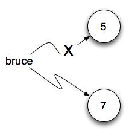

..  Copyright (C)  Brad Miller, David Ranum, Jeffrey Elkner, Peter Wentworth, Allen B. Downey, Chris
    Meyers, and Dario Mitchell.  Permission is granted to copy, distribute
    and/or modify this document under the terms of the GNU Free Documentation
    License, Version 1.3 or any later version published by the Free Software
    Foundation; with Invariant Sections being Forward, Prefaces, and
    Contributor List, no Front-Cover Texts, and no Back-Cover Texts.  A copy of
    the license is included in the section entitled "GNU Free Documentation
    License".
    
..  shortname:: TiposDeDados
..  description:: Uma introdução aos tipos de dados e variáveis em python

Variáveis, Expressões e Comandos
================================


.. index:: valor, tipo de dados, string, inteiro, int, float, class

.. index::
    string com aspas simples e triplas

.. _values_n_types:

.. video:: typesnconvert
    :controls:
    :thumb: ../_static/valuesNtypes.png

    http://knuth.luther.edu/~bmiller/thinkcsVideos/TypesNTypeConversion.mov
    http://knuth.luther.edu/~bmiller/thinkcsVideos/TypesNTypeConversion.webm

No início do aprendizado de qualquer linguagem de programação existem
alguns conceitos e idéias básicas que são necessários.  O objetivo deste
capítulo é introduzi-lo ao vocabulário básico de programação e alguns
dos conceitos fundamentais de Python.

Variáveis e tipos de dados
--------------------------

Um **valor** é um dos coisas fundamentais --- como uma palavra ou
número --- que um programa manipula. Os valores que vimos até o
momento são ``5`` (o resultado quando fazemos a adição ``2 + 3``), e
``"Olá, mundo!"``. Nós frequentemente nos referimos a esses valores
como **objetos** e usaremos as palavras valor e objeto
indiscriminadamente.


.. note::
    Na verdade, o 2 e o 3 que são parte da adição acima são também 
    valores (objetos). 

Esses objetos são classificados em **classes** ou **tipos de dados**
diferentes: ``4`` é um *inteiro*, e ``"Olá, mundo!"`` é um *string* ou *texto*  
*cadeia de caracteres*, que recebe esse nome pois contém uma sequência
de letras ou caracteres.  (N.T. Utilizamos também o termo em inglês 
*string* já que esse é comumente usado por programadores.)  
Você (e o interpretador) podem identificar
strings pois estes estão envolvidos por aspas.

Se você não está seguro sobre a classe a que pertence um valor, Python
tem uma função chamada **type** que pode dizer-lhe isto.

.. activecode:: ch02_1
    :nocanvas:

    print(type("Ola, mundo!"))
    print(type(17))
    print("Ola, mundo")

Não é surpresa que strings pertençam a uma classe chamada **str** e inteiros
pertencem a classe chamada **int**.

.. note:: 
    Quando mostramos o valor de um string usando a função
    ``print``, como na terceira linha acima, as aspas não estão
    presentes. O valor de um string é a sequência de caracteres entre
    as aspas.  As aspas são apenas necessárias para ajudar o Python a
    saber qual é o valor delimitando-o.

No Python shell, não é necessário usar a função ``print``` para ver o
valor mostrado acima.  O shell executa a função e automaticamente
imprime o resultado. Por exemplo, consider a seção do shell exibida
abaixo.  Quando pedimos para o shell executar ``type("Hello,
World!")``, ele imprime a reposta apropriada e na próxima linha continua
exibindo o prompt para um novo uso.

::

	Python 3.3.0 (default, Sep 29 2012, 17:14:58) 
	[GCC 4.7.2] on linux
	Type "copyright", "credits" or "license()" for more information.
	>>> type("Ola, mundo!")
	<class 'str'>
	>>> type(17)
	<class 'int'>
	>>> "Ola, mundo!"
	'Ola, mundo!'

Observe que no último exemplo, nós simplesmente pedimos ao shell que
avaliasse o string "Ola, mundo".  O resultado é como você poderia
imaginar, o próprio string.

Continuando com nossa discussão sobre tipos de dados, números com
ponto decimal (e não vírgula decimal) pertencem à classe chamada
**float**, pois esses números são representados em uma forma que é
chamada de *ponto flutuante* (*floating-point*). No presente estágio,
você pode usar as palavras *classe* e *tipo* indiscriminadamente.  Em
capítulos mais adiante nós voltaremos a tratar de classe e a buscar uma
compreensão mais profunda desse conceito.

.. activecode:: ch02_2
    :nocanvas:

    print(type(3.2))


E valores como ``"17"`` e ``"3.2"``?  
Eles parecem números, mas eles estão envolvoltos entre aspas como um string.

.. activecode:: ch02_3
    :nocanvas:

    print(type("17"))
    print(type("3.2"))

Eles são strings!

Strings em Python podem ser delimitados por apóstrofos (``'``) aspas
(``"``), ou três de cada (``'''`` ou ``"""``)

.. activecode:: ch02_4
    :nocanvas:

    print(type('Esse e um string.') )
    print(type("E esse tambem eh um string.") )
    print(type("""e esse.""") )
    print(type('''e mesmo esse...''') )


Strings com aspas podem conter apóstrofos, como em ``"O símbolo ' é um
apóstrofo"``, e strings com apóstrofos podem conter aspas, como em
``'Os cavaleiros que dizem "Ni!"'``.  Strings delimitados por três
aspas ou apóstrofos são chamadas de strings triplos (*triple quoted
strings*).  Eles podem conter aspas, apóstrofos ou strings entre aspas
ou apóstrofos:

.. activecode:: ch02_5
    :nocanvas:

    print('''"Oh nao", exclamou ela, "A bicleta esta quebrada!"''')


Strings triplos podem até se estender por várias linhas:

.. activecode:: ch02_6
    :nocanvas:

    mensagem = """Esta mensagem ira
    se estende varias 
    linhas."""
    print(mensagem)

    print("""Esta mensagem se estende
    por varias linhas
    do texto.""")

Python não se importa se você usa aspas, apóstrofes, aspas triplas ou
apóstrofes triplos para envolver um string. Uma vez verificado que o
texto do seu programa ou comando está sintaticamente correto, a
maneira com que o valor será armazenada é identica em todos os casos 
e o símbolos delimitadores não fazem parte do valor. 
Entretanto, quando o interpretador exibe um string, ele tem que
decidir qual símbolo usar para fazer com que ele se pareça um string.

.. activecode:: ch02_7
    :nocanvas:

    print('Este e um string.')
    print("""E este tambem e.""")

Os projetista da linguagem Python usualmente decidem delimitar seus
strings por apóstrofos. O que você acha que aconteceria se o string já
possui-se um apóstrofo? 

Quando você digita um inteiro grande, você poderia ficar tentado a
usar vírgulas (N.T. em países de língua inglês) ou ponto (N.T. em
países de língua portuguesa) entre grupos de três dígitos, como em
``42,000`` ou ``42.000``. Esses não são inteiros legítimos em Python,
mas têm outros significados, que são legitimos:

.. activecode:: ch02_8
    :nocanvas:

    print(42000)
    print(42,000)
    print(42.000)


Bem, isto não é de maneira alguma o que esperávamos!  Devido à
vírgula, Python decide tratar ``42,000`` como um *par* de valores.
Já, no caso do ponto, Python trata ``42.000`` como uma representação
como *float* do número 42. De fato, a função print pode imprimir
qualquer número de valores, contanto que estejam separados por
vírgulas. Observe que os valores são separados por espaços quando são
exibidos.

.. activecode:: ch02_8a
    :nocanvas:

    print(42, 17, 56, 34, 11, 4.35, 32)
    print(3.4, "hello", 45)

Lembre-se de não escrever os seus números inteiros com vírgulas,
pontos ou espaços, não importa quão grande eles sejam. Também reveja o
que dissemos no capítulo anterior: linguagens formais são rigorosas, a
notação é concisa, e mesmo com a menor das modificações o resultado
pode significar algo bem diferente do que você pretendia.


**Teste seu entendimento**

.. mchoice:: test_question2_1_1
   :answer_a: Imprimindo o valor e determinando o tipo de baseado no valor exibido.
   :answer_b: Usando a função type.
   :answer_c: Usando o valor em uma equação conhecida e imprimindo o valor resultante.
   :answer_d: Olhando para a declaração da variável.
   :correct: b
   :feedback_a: Você pode ser capaz de determinar o tipo de dados baseado no valor exibido, 
		mas isto pode ser enganoso, como quando strings são impressas, 
		elas são exibidas sem aspas ou apóstrofos envolvendo-as.
   :feedback_b: A função type lhe dirá a que classe pertence o valor.
   :feedback_c: Somente valores numéricos podem ser usados em equações.
   :feedback_d: Em Python variáveis não são declaradas. 

   Como você pode determinar o tipo de uma variável?

.. mchoice:: test_question2_1_2
   :answer_a: caractere
   :answer_b: inteiro
   :answer_c: float
   :answer_d: string
   :correct: d
   :feedback_a: Não é um simples caractere.
   :feedback_b: o valor não é numérico.
   :feedback_c: O valor não é númerico com um ponto decimal.
   :feedback_d: Strings podem ser envolvidas por apóstrofos.

   Qual é o tipo do valor 'que tipo de dado é esse'?


.. index:: funções de conversão de tipos, int, float, str, truncamento

Funções para conversão de valores
---------------------------------
 
Algumas vezes é necessário converter valores de um tipo para o
outro. Python fornece alguns funções simples que permitirão que
façamos isso. As funções `int`, `float` e `str` irão (tentar)
converter seus argumentos para os tipos `int`, `float` e `str`,
respectivamente.  Nós as chamamos de funções para 
**conversão de valores**.

A função `int` pode converter para int um argumento numérico em ponto
flutuante ou um string.  Para números em ponto flutuante, a parte
decimal do número é *descartada* - um processo que chamaremso de
*trucamento para zero* ou simplesmente *truncamento* do número. 
Vejamos isto isto em ação:

.. activecode:: ch02_20
    :nocanvas:

    print(3.14, int(3.14))
    print(3.9999, int(3.9999))       # Isto não arredonda para o inteiro mais próximo 
    print(3.0,int(3.0))
    print(-3.999,int(-3.999))        # Observe que o resultado está mais próximo de zero

    print("2345",int("2345"))        # examina um string para produzir um int
    print(17,int(17))                # int também funciona sobre inteiros
    print(int("23garafas"))


O último exemplo mostra que o string deve representar um número
sintaticamente legal, em caso contrário você receberá um daqueles
erros de execução desagradáveis. Modifique o exemplo removendo
``garafas`` e execute novamente o programa. Você deverá ver o inteiro
``23``.

O conversor de tipos `float` transforma um inteiro, um float ou um
string representado um float de maneira sintaticamente legal em um
float.

.. activecode:: ch02_21
    :nocanvas:

    print(float("123.45"))
    print(type(float("123.45")))


O conversor de tipo `str` transforma os seus argumentos em um
string. Lembre-se que quando imprimimos um string, os apóstrofes ou
aspas que o delimitam são removidos. 
Entretanto, se imprimimos o tipo de um string vemos que ele é `str`.

.. activecode:: ch02_22
    :nocanvas:

    print(str(17))
    print(str(123.45))
    print(type(str(123.45)))

**Teste seu entendimento**

.. mchoice:: test_question2_2_1
   :answer_a: Nada, é produzido um erro de execução.
   :answer_b: 53
   :answer_c: 54
   :answer_d: 53.785
   :correct: b
   :feedback_a: Este é um comando válido em Python.  
                 Ele chama a função int com o argumento 53.785 e então imprime o valor retornado
   :feedback_b: A função int remove a parte fracionária de um número, esse será o valor impresso.
   :feedback_c: Na conversão para um inteiro, a função int não arredonda.
   :feedback_d: A função int remove a parte parte fracionária de 53.785 e 
                retorna o inteiro resultante, que será impresso em seguida.

   Qual valor é exibido pelo seguinte comando:
   <pre>
   print( int(53.785) )  
   </pre>

.. index:: variável, atribuição, comando de atribuição, estado instantâneo

Variáveis
---------

.. video:: assignvid
    :controls:
    :thumb: ../_static/assignment.png

    http://knuth.luther.edu/~bmiller/thinkcsVideos/Variables.mov
    http://knuth.luther.edu/~bmiller/thinkcsVideos/Variables.webm


Uma das características mais poderosas de uma linguagem de programação
é sua capacidade de manipular **variáveis**. 
Uma variável é um nome que se refere a um valor.


**Comandos de atribuição** (*assignment statement*) criam uma nova
variável e também fornecem a elas o valor ao qual farão referência.

.. sourcecode:: python
    
    mensagem = "O que ha velhinho?"
    n = 17
    pi = 3.14159

Este exemplo faz três atribuições. A primeira atribui o string ``"O
que há velhinho?"`` a uma nova variável chamada ``mensagem``. 
O segundo atribui o inteiro `17`` a ``n``, e o terceiro atribui o 
número em ponto-flutuante ``3.14159`` a variável chamada ``pi``.


O **operador de atribuição**, ``=``, não deve ser confundido com
*igualdade*, para a qual usamos ``==``. O comando de atribuição
associa o *nome*, que está à esquerda do operador, como o *valor*, que
está à direita. Por esta razão é que você receberá um mensagem de erro
se fizer:
 

.. sourcecode:: python
    
    17 = n
    
.. tip::

    Quando estiver lendo ou escrevendo um programa, diga para você mesmo "17 é 
    atribuído a n" ou "n recebe o valor 17" ou "n é uma referência ao objeto 17" ou "n 
    se refere ao objeto 17". Não diga "n é igual a 17".
 
Uma maneira comum de se representar variáveis no papel é escrevendo o
nome da variável com uma flecha apontado para o valor da
variável. Este tipo de representação, conhecido como **diagrama de
referência**, é frequentemente chamado de **estado instantâneo** pois
mostra o estado de cada variável em um instante de tempo
particular. (Imagine isto como sendo o "estado de mente" da variável.)
Este diagrama mostra o resultado da execução de comandos de
atribuição.
 

.. image:: Figures/refdiagram1.png
   :alt: Reference Diagram

Se você pedir para que o valor de uma variável seja impresso, Python
exibirá o valor que está atualmente associado à variável. Em outras
palavras, ao imprimir uma variável será exibido o valor ao qual a
variável se refere.


.. activecode:: ch02_9
    :nocanvas:

    mensagem = "O que ha velhinho?"
    n = 17
    pi = 3.14159

    print(mensagem)
    print(n)
    print(pi)

Em cada comando o resultado será o valor da váriável. Para ver isto em
mais detalhes, podemos executar o programa usando codelens.

.. codelens:: ch02_9_codelens
    :showoutput:

    mensagem = "O que ha velhinho?"
    n = 17
    pi = 3.14159

    print(mensagem)
    print(n)
    print(pi)

Agora, como você pode executar um comando por vez, você pode ver as
variáveis e os valores a que elas se referem a medida que são criadas.


Variáveis também tem tipos; novamente, podemos perguntar ao interpretador o tipo das variáveis.


.. activecode:: ch02_10
    :nocanvas:

    mensagem = "O que ha velhinho?"
    n = 17
    pi = 3.14159

    print(type(mensagem))
    print(type(n))
    print(type(pi))


O tipo de uma variável é o tipo do objeto a que ela está se referindo no momento.
 
Usamos variáveis em programas para "lembrar" coisas, como o placar
atual de um jogo de futebol. Mas variáveis são *variáveis*. 
Isto significa que elas podem ser alterados ao longo do tempo,
exatamente como o placar de um jogo de futebol. Você pode atribuir um
valor a uma variável e mais tarde atribuir um valor diferente a mesma
variável.
 

.. note::

    Isso é diferente do que ocorre em matemática. Em matemática, se
    você dá a `x` o valor 3, esse valor não pode ser alterado durante
    os seus cálculos.


Para verificar isso, leia e execute o seguinte programa.  Você notará
que mudamos o valor da variável `dia` três vezes e na terceira vez
atribuímos um valor de um tipo diferente dos anteriores


.. codelens:: ch02_11
    :showoutput:

    dia = "quinta-feira"
    print(dia)
    dia = "sexta-feira"
    print(dia)
    dia = 21
    print(dia)


Uma tarefa grande em programação diz respeito a fazer o computador
lembrar coisas, e.g. *O número de chamadas perdidas do seu telefone*,
e atualiza ou modificar a variável quando uma nova chamada é perdida. 
 

**Teste seu entendimento**

.. mchoice:: test_question2_3_2
   :answer_a: Nada é impresso, ocorre um erro de execução.
   :answer_b: quinta-feira
   :answer_c: 32.5
   :answer_d: 19
   :correct: d
   :feedback_a: Não é ilegal alterar o tipo de um dado ao qual uma variável se refere
   :feedback_b: Este é o primero valor atribuído à variável dia, mas o comando seguinte atribui à variável outro valor.
   :feedback_c: Esse é o segundo valor atribuído à variável dia, mas o comando seguinte atribui à variável um outro valor.
   :feedback_d: A variável dia contém o último valor que lhe foi atribuído antes do comando de impressão.

   Qual é o valor impresso ao final da seguinte sequência de comandos?
   <pre>
   dia = "quinta-feira"
   dia = 32.5
   dia = 19
   print(dia)
   </pre>

.. index:: palavra reservada, caractere underscore

Nomes de variáveis e palavras reservadas
----------------------------------------

**Nomes de variáveis** podem ser arbitrariamente longos.  Eles podem
conter letras e dígitos, mas eles devem começar com uma letra um
caractere underscore.  Apesar de ser possível usar letras maiúsculas,
por convenção não usaremos. Se você usar, lembre-se que a letra ser
maiúscula ou minúscula faz diferença. ``Beto` e ``beto`` são variáveis
diferentes.

O caractere underscore (``_``) pode aparecer no nome.
Ele é usado frequentemente em nomes formados por mais de uma palavra,
como ``meu_nome`` ou ``preço_do_chá_na_china``. 
Existem algumas situações em que os nomes começando com um underscore
têm um significado especial, portanto é mais seguro que iniciantes 
usem variáveis que começam com uma letra.  

Se você der a uma variável um nome ilegal, ocorrerá um erro de sintaxe. 
No exemploa seguir, cada nome de variável é ilegal.

::

    76trombones = "grande parada"
    mais$ = 1000000
    class = "Ciencia da Computacao 101"

O nome ``76trombones`` é ilegal pois não começa com uma letra.
Já  ``mais$`` é ilegal pois contém um caractere ilegal, o símbolo de
cifrão. Mas o que está errado com ``class``?

Ocorre que ``class`` é uma das **palavras reservadas** (*keywords*) de Python.
As palavras reservadas definem a sintaxe da linguage e sua estrutura e
não podem ser usadas como nomes de variáveis.
Python tem pouco mais de trinta palavras reservadas (e uma vez ou
outra melhorias em Python introduzem ou eliminam uma ou duas): 

======== ======== ======== ======== ======== ========
and      as       assert   break    class    continue
def      del      elif     else     except   exec
finally  for      from     global   if       import
in       is       lambda   nonlocal not      or       
pass     raise    return   try      while    with
yield    True     False    None
======== ======== ======== ======== ======== ========

Você pode desejar mater está lista à mão.
Se o interpretador reclamar sobre um dos nomes de suas variáveis e
você  não sabe a razão, veja se ele está nesta lista.

.. caution::

   Iniciantes algumas vezes confundem "significado para leitores humanos"
   com "significativo para o computador". Assim, eles imaginarão erroneamente 
   que ao chamarem uma variável de ``média`` ou ``pi``, ele irá de
   alguma maneira automática calcular a média ou automaticamente
   associará a vaŕiável ``pi`` com o valor 3.14159. Não! O computador
   não associa um significado semântico aos nomes de veriáveis.
   
   Assim, você encontrará professores que deliberadamente não escolhem
   nomes significativos de variáveis quando estão lecionando para
   iniciantes --- não por não acharem que é um bom hábito, mas porque
   eles estão tentando enfatizar a mensagem que você, o programador,
   deve escrever o código de programa para calcular a média, ou que
   você deve escrever um comando de atribuição para dar a uma variável
   o valor que você deseja que ela receba.

**Teste seu entendimento**

.. mchoice:: test_question2_4_1
   :answer_a: Verdadeiro
   :answer_b: Falso
   :correct: b
   :feedback_a: -  O caractere + não é permitido no nome de uma variável.
   :feedback_b: -  O caractere + não é permitido no nome de uma variável (tod o resto neste nome é legal, inclusive acento).

   Verdadeiro ou falso: o seguinte nome é legal para uma variável em Python: Uma_boa_nota_é_A+

.. index:: comando

Comandos e expressões
----------------------

.. video:: expression_vid
    :controls:
    :thumb: ../_static/expressions.png

    http://knuth.luther.edu/~bmiller/thinkcsVideos/Expressions.mov
    http://knuth.luther.edu/~bmiller/thinkcsVideos/Expressions.webm

Um **comando** (*statement*) é uma instrução que o interpretador
Python pode executar. Até agora só vimos o comando de atribuição.
Outros tipos de comando que veremos em breve são o comando ``while``,
o comando ``for``, o comando ``if`` e o comando ``import``. (Existem
outros tipos também!)


.. index:: expressão

Uma **expressão** (*expression*) é uma combinação de valores,
variáveis, operadores e chamadas de funções. Expressões necessitam ser
calculadas. Se você pde ao Pyhton que 


.. activecode:: ch02_13
    :nocanvas:

    print(1 + 1)
    print(len("Ola"))


Neste exemplo ``len`` é uma função nativa (*built-in*) no Python que
returna o número de caracteres em um string. Vimos anteriormente que
as funções ``print`` e ``type``, logo este é o nosso terceiro exemplo
de uma função!

O *cálculo de uma expressão* (*evaluation of an expression*) produz um
valor, que é a razão do expressão poder aparecer do lado direito de em
um comando de atribuição. Um valor por si só é uma expressão e o mesmo
para uma variável. Calcular o valor de uma variável resulta no valor
ao qual a variável se refere.


.. activecode:: ch02_14
    :nocanvas:

    y = 3.14
    x = len("Ola")
    print(x)
    print(y)


Se dermos uma olhada neste exemplo simples do Python shell, veremos uma
das diferenças entre comando e expressões.

.. sourcecode:: python

	>>> y = 3.14
	>>> x = len("Ola")
	>>> print(x)
	3
	>>> print(y)
	3.14
	>>> y
	3.14
	>>> 
	


.. Note that when we enter the assignment statement, ``y = 3.14``,
   only the prompt is returned.  There is no value.  This is due to
   the fact that statements, such as the assignment statement, do not
   return a value.  They are simply executed.

Note que quando entramos com o comando de atribuição, ``y = 3.14``,
somente o prompt é retornado.  Não existe valor. Isto é devido ao fato
de que comando, como comando de atribuição, não retornam valor
algum. Eles são simplesmente executados.


.. On the other hand, the result of executing the assignment statement is the creation of a reference from a variable, ``y``, to a value, ``3.14``.  When we execute the print function working on ``y``, we see the value that y is referring to.  In fact, evaluating ``y`` by itself results in the same response.

Por outro lado, o resultado da execução de um comando de atribuição é a criação de uma referência da variável, ``y``, para o valor, ``3.14``. Quando executamos a função print com ``y`` como argumento, nós vemos o valor ao qual y se refere. De fato, digitando apenas ``y`` obtermos o mesmo resultado.

..operator, operand, expression, integer division

.. index:: operador, operando, expressão, divisão inteira


Operadores e operandos
----------------------

.. **Operators** are special tokens that represent computations like addition,
.. multiplication and division. The values the operator works on are called
.. **operands**.

**Operadores** são símbolos especiais que representam computações como adição, 
multiplicação e divisão. Os valores sobre os quais o operador trabalha são 
chamados operandos.

.. The following are all legal Python expressions whose meaning is more or less clear

As seguintes expressões são legais em Python e os seus significados são 
mais ou menos claros::
 
    20 + 32   
    hora - 1   
    hora * 60 + minutos  
    minutos / 60   
    5 ** 2
    (5 + 9) * (15 - 7)


.. The tokens ``+``, ``-``, and ``*``, and the use of parenthesis for grouping,
.. mean in Python what they mean in mathematics. The asterisk (``*``) is the
.. token for multiplication, and ``**`` is the token for exponentiation.
.. Addition, subtraction, multiplication, and exponentiation all do what you
.. expect.

Os símbolos ``+``, ``-``, ``*`` e o uso de parênteses têm o mesmo significado 
em Python do que têm em matemática. O asterisco (``*``) é i símbolo 
usado para indicar multiplicação, e o ``**`` é os ímbolo da exponenciação. 
Adição, subtração, multiplicação e exponenciação fazem o que você espera.  

.. activecode:: ch02_15
    :nocanvas:

    print(2 + 3)
    print(2 - 3)
    print(2 * 3)
    print(2 ** 3)
    print(3 ** 2)

.. When a variable name appears in the place of an operand, it is replaced with
.. the value that it refers to before the operation is performed.
.. For example, what if we wanted to convert 645 minutes into hours.

Quando o nome de uma variável aparece no lugar de um operando, ele é 
substituido pelo valor a que ele se refere antes da operação ser realizada.
Por exemplo, veja o que pode ser feito se desejamos converter 645 minutos em horas; 

.. activecode:: ch02_16
    :nocanvas:

    minutos = 645
    horas = minutos / 60
    print(horas)


.. In Python 3, the division operator uses the token `/` which always evaluates to a floating point
.. result.  

Em Python 3, operador de divisão usa o símbolo `/` que sempre
apresenta o resultado em ponto flutuante.

.. In the previous example, what we might have wanted to know was how many *whole* hours there
.. are, and how many minutes remain.  Python gives us two different flavors of
.. the division operator.  The second, called **integer division**, uses the token
.. `//`.  It always *truncates* its result down to the next smallest integer (to
.. the left on the number line).  

No exemplo anterior, suponha que desejamos agora saber o número de
horas *cheias* e quantos minutos restantes temos em 645
minutos. Python oferece divisão de dois sabores diferentes.  O segundo
é chamado de **divisão inteira** (*integer division*) e usa os
operador `//`. Ele sempre *trunca* o resultado para o menor inteiro (à
esquerda da linha real).


.. activecode:: ch02_17
    :nocanvas:

    print(7 / 4)
    print(7 // 4)
    minutos = 645
    horas = minutos // 60
    print(horas)

    
.. Take care that you choose the correct flavor of the division operator.  If
.. you're working with expressions where you need floating point values, use the
.. division operator `/`.  If you want an integer result, use `//`.

Tome cuidado para escolher o operador de divisão correto.  Se você
está trabalhando com um expressão que necessita de ponto flutuante,
use o operador `/`.  Se você deseja um resultado inteiro use `//`.

.. index:: modulus

.. The **modulus operator**, sometimes also called the **remainder operator** or **integer remainder operator**.. works on integers (and integer expressions) and yields
.. the remainder when the first operand is divided by the second. In Python, the
.. modulus operator is a percent sign (``%``). The syntax is the same as for other
.. operators:

O **operador módulo** (*modulus operator*), também chamado de
**operador resto** (*remainder operator*) ou **operador resto da
divisão** (*integer remainder operator*) trabalho sobre os inteiros (e
expressões inteiras) e devolve o resto da divisão do primeiro operando
pelo segundo.  In Python, o operador resto utiliza o símbolo de
porcentagem (``%``). A sintaxe é a mesma da dos outros operadores

.. activecode:: ch02_18
    :nocanvas:

    quociente = 7 // 3  # divisão inteira
    print(quociente)
    resto = 7 % 3
    print(resto)


.. So 7 divided by 3 is 2 with a remainder of 1.

Assim, 7 dividido por 3 é 2 com resto 1.

.. The modulus operator turns out to be surprisingly useful. For example, you can
.. check whether one number is divisible by another---if ``x % y`` is zero, then
.. ``x`` is divisible by ``y``.
.. Also, you can extract the right-most digit or digits from a number.  For
.. example, ``x % 10`` yields the right-most digit of ``x`` (in base 10).
.. Similarly ``x % 100`` yields the last two digits.

O operador resto é surpreendentemente útil.
Por exemplo, você pode utilizá-lo para verificar se um número é
divisível por outro --- se ``x % y`` é zero, então ``x`` é divisível
por ``y``. Também, você pode extrair o dígito ou dígitos mais à
direita de um número. Por exemplo, ``x % 10`` é o dígito mais a
direita de ``x`` (na base 10). Similarmente ``x % 100`` é o número
formao pelos dois último dígitos de ``x``. 


.. Finally, returning to our time example, the remainder operator is
.. extremely useful for doing conversions, say from seconds, to hours,
.. minutes and seconds.  If we start with a number of seconds, say 7684,
.. the following program uses integer division and remainder to convert
.. to an easier form.  Step through it to be sure you understand how the
.. division and remainder operators are being used to compute the correct
.. values.

Finalmente, retornando ao nosso exemplo de tempo, o operador resto é
extremamente útil para fazermos conversões, digamos, de segundos para
horas, minutos e segundos. Se começamos com um certo número de segundos,
digamos 7684, o programa a seguir usa divisão inteira e resto de
divisão para converter segundos para uma forma mais clara. 
Siga o código passo a passo para se
certificar que você entende como os operadores divisão e resto são
usados para computar os valores corretos.


.. codelens:: ch02_19_codelens

    total_segs = 7684
    horas = total_segs // 3600
    segs_restantes = total_segs % 3600
    minutos =  segs_restantes // 60
    segs_restantes_final = segs_restantes  % 60


**Teste seu entendimento**

.. mchoice:: test_question2_6_1 
   :answer_a: 4.5
   :answer_b: 5
   :answer_c: 4
   :answer_d: 2
   :correct: a
   :feedback_a: O operator / faz divisão exeta e retorna um número
	       em ponto flutuante.
   :feedback_b: O operador / faz divisão exata e retorna um número
		em ponto flutiante.
   :feedback_c: O operador / faz divisão exata e retorna um número
		em ponto flutiante.
   :feedback_d: O operador / faz divisão exata e retorna um número
		em ponto flutiante.
  
   O que imprime o seguinte comando?
   <pre>
   print (18 / 4)
   </pre>

	
.. mchoice:: test_question2_6_2
   :answer_a: 4.25
   :answer_b: 5
   :answer_c: 4 
   :answer_d: 2
   :correct: c
   :feedback_a: - O operador // faz divisão inteira e retorna um inteiro.
   :feedback_b: - O operador // faz divisão inteira e retorna um
		inteiro, mas ele trunca o valor da divisão. Ele não o arredonda.
   :feedback_c: - O operador // faz divisão inteira e retorna um
		inteiro truncado.
   :feedback_d: - O operador // faz divisão inteira e retorna o
		resultado da divisão (não o resto).
   
   O que imprime o seguinte comando?
   <pre>
   print (18 // 4)
   </pre>


.. mchoice:: test_question2_6_3
   :answer_a: 4.25
   :answer_b: 5
   :answer_c: 4 
   :answer_d: 2
   :correct: d
   :feedback_a: O operador % retorna o resto da divisão.
   :feedback_b: O operador % retorna o resto da divisão.
   :feedback_c: O operador % retorna o resto da divisão.
   :feedback_d: O operador % retorna o resto da divisão.

    O que imprime o seguinte comando?
   <pre>
   print (18 % 4)
   </pre>

.. index:: input, input dialog

.. _input:

Input
-----

.. video:: inputvid
    :controls:
    :thumb: ../_static/inputthumb.png

    http://knuth.luther.edu/~pythonworks/thinkcsVideos/input.mov
    http://knuth.luther.edu/~pythonworks/thinkcsVideos/input.webm


.. The program in the previous section works fine but is very limited in
.. that it only works with one value for ``total_secs``.  What if we
.. wanted to rewrite the program so that it was more general.  One
.. thing we could do is allow the use to enter any value they wish for
.. the number of seconds.  The program would then print the proper
.. result for that starting value.

O program da seção anterior funciona corretamente, mas é muito
limitado pois somente trabalha com o valor ``total_segs``. E se
desejássemos reescrever o programa de maneira que ele fique mais
geral. Uma coisa que poderíamos fazer é permitir o usuário entrar com
qualquer número de segundos. O programa então imprimiria o resultado
apropriado para para esse valor inicial.


.. In order to do this, we need a way to get **input** from the user.  Luckily, in Python
.. there is a built-in function to accomplish this task.  As you might expect, it is called ``input``.

Para fazermos isto necessitamos de uma maneira para receber valores (*input*) do
usuário. Felizmente, Python possui uma função nativa para
realizar essa tarefa. Essa função é chamada ``input``. 
 
.. sourcecode:: python

    n = input("Por favor, entre com o seu nome: ")

.. The input function allows the user to provide a **prompt string**.
.. When the function is evaluated, the prompt is shown.  The user of the
.. program can enter the name and press `return`. When this happens the
.. text that has been entered is returned from the `input` function, and
.. in this case assigned to the variable `n`.

A função imput permite que apresentemos um texto ou **prompt** ao
usuário (*prompt string*). Quando a função é executada o texto é
exibido. O usuário da programa pode digitar o nome e pressionar a tecla
`enter`. Quando isto ocorre o texto que foi digitado é retornado pela
função `input` e, no presente caso, atribuído à variável `n`.
  

.. activecode:: inputfun

    n = input("Por favor, entre com o seu nome: ")
    print("Ola", n)

.. Even if you asked the user to enter their age, you would get back a string like
.. ``"17"``.  It would be your job, as the programmer, to convert that string into
.. a int or a float, using the `int` or `float` converter functions we saw
.. earlier.

Mesmo que você pessa ao usuário para digitar a sua idade, você
receberá como resposta um string como ``"17"``. Será o se trabalho,
como programador, converter esse string para int ou float, usando as
funções de conversão `int` ou `float` que vimos anteriormente.


.. To modify our previous program, we will add an input statement to
.. allow the user to enter the number of seconds.  Then we will convert
.. that string to an integer.  From there the process is the same as
.. before.

.. activecode:: int_secs

    segundos_str = input("Por favor, entre com o número de segundos que deseja converter: ")
    total_segs = int(secondos_str)
    
    horas = total_segs // 3600
    segs_restantes = total_segs % 3600
    minutos =  segs_restantes // 60
    segs_restantes_final = segs_restantes  % 60

    print("Hrs=", horas, "mins=", minutos, "segs=", segs_restantes_final)


.. The variable ``str_seconds`` will refer to the string that is entered
.. by the user. As we said above, even though this string may be
.. ``7684``, it is still a string and not a number.  To convert it to an
.. integer, we use the ``int`` function.  The result is referred to by
.. ``total_secs``.  Now, each time you run the program, you can enter a
.. new value for the number of seconds to be converted.


A variável ``segundos_str`` irá se referir ao atring que foi digitado
pelo usuário. Como dissemos anteriormente, mesmo que esse string seja
``7684`, ele é ainda um string e não um número. Para convertê-lo para
um inteiro usamos a função ``int``. O resultado será referenciado por 
``total_segs``. Agora, cada vez que executamos o programa, você pode
entrar com um novo valor para o número de segundos a serem convertidos.


**Teste seu entendimento**

.. mchoice:: test_question2_7_1 
   :answer_a: &lt;class 'str'&gt;
   :answer_b: &lt;class 'int'&gt;
   :answer_c: &lt;class 18&gt;
   :answer_d: 18
   :correct: a
   :feedback_a: Tudo que é digitado pelo usuário é lido como um string.
   :feedback_b: Mesmo que o usuário digite um inteiro, esse valor não
		é lido pelo programa como um inteiro.
   :feedback_c: 18 é o valor do que foi digitado, não o tipo do dado.
   :feedback_d: 18 é o valor do que foi digitado, não o tipo do dado.

   O que é impresso pelo seguinte comando?
   <pre>
   n = input("Por favor, entre com sua idade: ")
   # usuário entra com 18
   print ( type(n) )
   </pre>


.. index:: ordem da operações, regras de precedência


Ordem das operações
-------------------

.. video:: precedencevid
    :controls:
    :thumb: ../_static/precedencethumb.png

    http://knuth.luther.edu/~pythonworks/thinkcsVideos/precedence.mov
    http://knuth.luther.edu/~pythonworks/thinkcsVideos/precedence.webm


.. video:: associativityvid
    :controls:
    :thumb: ../_static/associativitythumb.png

    http://knuth.luther.edu/~pythonworks/thinkcsVideos/associativity.mov
    http://knuth.luther.edu/~pythonworks/thinkcsVideos/associativity.webm


.. When more than one operator appears in an expression, the order of evaluation
.. depends on the **rules of precedence**. Python follows the same precedence
.. rules for its mathematical operators that mathematics does. 

Quando mais de um operador aparece em um expressão, a ordem em que são
realizadas as operações dependem das **regras de precedência** (*rules
of precedence*). Python segue as regras de precedência dos seus
operadores matemáticos da mesma forma que matemática.

.. The acronym PEMDAS
.. is a useful way to remember the order of operations:

#. Parenteses tem a mais alta precedência e podem ser usados para
   forçar que uma expressão seja calculada na ordem que você
   deseja. Como expressões entre parênteses são calculadas primeiro
   ``2*(3-1)`` é 4, e ``(1+1)**(5-2)`` é 8. Você pode usar parântese
   para tornar uma expressão mais legível, como em ``(minutos * 100) /
   60``, mesmo que isto não mude o resultado.
#. Exponeciação tem a segunda precedência mais alta, assim
   ``2**1+1```é 3 e não 4, e ``3*1**3`` é 3 e não 27. Você pode
   explicar o por que?
#. Multiplicação e ambas as divisões têm a mesma precedência, que são
   mais altas que adição e subtração, que também têm a mesma
   precedência. Logo, ``2*3-1``é 5 e não 4, e ``5-2*2`` é 1 e não 6.
#. Operadores com a *mesma* precedência são executados  da esquerda
   para a direira. Em álgebra dizemos que eles são *associativos à
   esquerda* (*left-associative*). Desta forma na expressão ``6-3+3``
   a subtração é realizada primeiro e tem como resultado 3.
   Depois adicionamos 2 e obtemos o resultado 5. Se os operadores
   tivessem sido executados da direira para a esquerda o resultado
   seria ``6-(3+2)`` que é 1.

.. (The
..   acronym PEDMAS could mislead you to thinking that division has higher
..   precedence than multiplication, and addition is done ahead of subtraction -
..   don't be misled.  Subtraction and addition are at the same precedence, and
..   the left-to-right rule applies.)

.. note::

      Devido a alguma peculiaridade histórica, uma  exceção à regra
      associativa à esquerda é o operador exponenciação `**`. Uma dica
      útil é sempre usar parênteses para forçar a ordem exata que você
      deseja quando há exponenciações envolvidas.

    .. activecode:: ch02_23
        :nocanvas:

        print(2 ** 3 ** 2)     # o ** mais a direira e executado primeiro!
        print((2 ** 3) ** 2)   # use parenteses para forçar a ordem desejada!

.. The immediate mode command prompt of Python is great for exploring and
.. experimenting with expressions like this.       

**Teste seu entendimento**    

.. mchoice:: test_question2_8_1 
   :answer_a: 14
   :answer_b: 24
   :answer_c: 3
   :answer_d: 13.667
   :correct: a
   :feedback_a: Usando parênteses, a éxpressão (2*5) é calculada
		primeiro, depois (10 // 3), então (16-3), e então
		(13+1).
   :feedback_b: Lembre que * tem precedência sobre -.
   :feedback_c: Lembre que // tem preceDência sobre -.
   :feedback_d: Lembre que // faz divisão inteira.

   Qua é o valor a expressão a seguir?
   <pre>
   16 - 2 * 5 // 3 + 1
   </pre>


.. mchoice:: test_question2_8_2 
   :answer_a: 768
   :answer_b: 128
   :answer_c: 12
   :answer_d: 256
   :correct: a
   :feedback_a: Exponenciação tem precedência sobre multiplicação, mas
		a precedência é da direita para a esquerda! Assim 2 **
		3 é 8, 2 ** 8 é 256 e 256 * 3 é 768.
   :feedback_b: Exponenciação (**) é calculada da direita para a
		esquerda, assim calcule 2 ** 3 primeiro.  
   :feedback_c: Há duas exponenciações.
   :feedback_d: Lembre de multiplicar por 3.
   
   What is the value of the following expression:
   <pre>
   2 ** 2 ** 3 * 3
   </pre>


Reatribuição
------------ 

.. video:: reassignmentvid
    :controls:
    :thumb: ../_static/reassignmentthumb.png

    http://knuth.luther.edu/~pythonworks/thinkcsVideos/reassignment.mov
    http://knuth.luther.edu/~pythonworks/thinkcsVideos/reassignment.webm


.. As we have mentioned previously, it is legal to make more than one assignment to the
.. same variable. A new assignment makes an existing variable refer to a new value
.. (and stop referring to the old value).

Como mencionamos anteriormente, é legal fazer mais que uma atribuição
para a mesma variável. Uma nova atribuição faz com que a variável
existente se refira a um novo valor (e pare de se referir ao valor antigo).

.. activecode:: ch07_reassign1
    
    bruce = 5
    print(bruce)
    bruce = 7
    print(bruce)


.. The first time ``bruce`` is
.. printed, its value is 5, and the second time, its value is 7.  The assignment statement changes
.. the value (the object) that ``bruce`` refers to.

A primeira vez que ``bruce`` é impresso, o seu valor é 5, e na segunda
vez, seu valor é 7. O comando de atribuição muda o valor (o objeto) ao
qual ``bruce`` se refere.

.. Here is what **reassignment** looks like in a reference diagram:

Aqui está como uma **reatribuição** se parece em um diagrama de
referências:




.. It is important to note that in mathematics, a statement of equality
.. is always true.  If ``a is equal to b`` now, then ``a will always
.. equal to b``. In Python, an assignment statement can make two
.. variables equal, but because of the possibility of reassignment, they
.. don't have to stay that way:

É importante notar que em matemática, uma igualdade é sempre
verdadeira. Se ``a é igual a b`` agora, então ``a será sempre igual a
b``
Em Python, um comando de atribuição pode fazer duas variáveis iguais,
mas devido a possibilidade de reatribuição, elas não precisam
permanecer desta forma.


.. activecode:: ch07_reassign2
    
    a = 5
    b = a    # depois desta linha, a e b são iguais
    print(a,b)
    a = 3    # depois desta linha, a e b não são mais iguais
    print(a,b)

.. Line 4 changes the value of ``a`` but does not change the value of
.. ``b``, so they are no longer equal. We will have much more to say about equality in a later chapter.

Linha 4 altera o valor de ``a`` mas não altera o valor de ``b``, logo
eles não são mais iguais. Teremos muito mais a dizer sobre igualdade
em um capítulo mais adiante.
 

.. note::

	In some programming languages, a different
	symbol is used for assignment, such as ``<-`` or ``:=``.  The intent is
	that this will help to avoid confusion.  Python
	chose to use the tokens ``=`` for assignment, and ``==`` for equality.  This is a popular
	choice also found in languages like C, C++, Java, and C#.


        Em algumas linguagens, um símbolos diferentes são usado para
	indicar atribuição, como ``<-`` ou ``:=``. A intensão é evita
	confusão. Python optou por usar ``=`` para atribuição e ``==``
	para igualdade. Esta é uma escolha popular e também encontrada
	em liguagens como C, C++, Java e C#.

        
**Teste seu entendimento**

.. mchoice:: test_question2_9_1 
   :answer_a: x é 15 e y é 15
   :answer_b: x é 22 e y é 22
   :answer_c: x é 15 e y é 22
   :answer_d: x é 22 e y é 15
   :correct: d
   :feedback_a: A última atribuição dá a x um valor diferente.
   :feedback_b: Não, x e y são duas variáveis diferentes. Só porque x
		é alterada nna última atribuição isto não altera o
		valor que foi copiado em y pela segunda atribuição.
   :feedback_c: A última atribuição altera x, mas não altera y.
   :feedback_d: Sim, x tem o valor 22 e y o valor 15.


   Depois das atribuições a seguir, quais são os valores de x e y?
   <pre>
   x = 15
   y = x
   x = 22
   </pre>


Atualização de variáveis
------------------------

.. video:: updatevid
    :controls:
    :thumb: ../_static/updatethumb.png

    http://knuth.luther.edu/~pythonworks/thinkcsVideos/update.mov
    http://knuth.luther.edu/~pythonworks/thinkcsVideos/update.webm

.. One of the most common forms of reassignment is an **update** where the new
.. value of the variable depends on the old.  For example,

Uma das forma mais comuns de reatribuição é **atualização** (*update*)
onde o novo valor da variável depende do antigo. Por exemplo.


.. sourcecode:: python
    
    x = x + 1

.. This means get the current value of x, add one, and then update x with the new
.. value.  The new value of x is the old value of x plus 1.  Although this assignment statement may
.. look a bit strange, remember that executing assignment is a two-step process.  First, evaluate the
.. right-hand side expression.  Second, let the variable name on the left-hand side refer to this new
.. resulting object.  The fact that ``x`` appears on both sides does not matter.  The semantics of the assignment
.. statement makes sure that there is no confusion as to the result.

Isto significa pegue o valor de x, adicione um, e atualize x com o
novo valor. O novo valor de x é o anterior mais 1. Apesar desse
comando de atribuição parecer um pouco estranho, lembre-se que
executar uma atribuição é um processo de dois passos. Primeiro, o
valor da lado direito da expressão é calculado. Segundo, faça com que
o nome da variável que está no lado esquerdo se refira ao novo objeto 
resultante. O fato que ``x`` aparece em ambos os lados não importa. 
A semântica do comando de atribuição se encarrega que não haja
confusão sobre o resultado.


.. activecode:: ch07_update1

    x = 6        # inicialize x
    print(x)
    x = x + 1    # atualize x
    print(x)


.. If you try to update a variable that doesn't exist, you get an error because
.. Python evaluates the expression on the right side of the assignment operator
.. before it assigns the resulting value to the name on the left.
.. Before you can update a variable, you have to **initialize** it, usually with a
.. simple assignment.  In the above example, ``x`` was initialized to 6.

Se você tentar atualizar uma variável que não existe, você receberá
uma mensagem de erro pois Python calcula o valor da expressão que está
do lado direito do operador de atribuição antes de atribuir o
resultado ao nome a variável do lado esquerdo. Antes que você possa
atualizar uma variável, você deve ***inicializá-la** (*initialize*
it), usualmente com uma atribuição simples. No exemplo anterior, ``x``
foi inicializada com 6.

.. Updating a variable by adding 1 is called an **increment**; subtracting 1 is
.. called a **decrement**.  Sometimes programmers also talk about **bumping**
.. a variable, which means the same as incrementing it by 1.

Atualizar uma variável adicionando-se 1 é chmado de **incremento**
(*increment*); subtrair 1 é chamado **decremento**
(*decrement*). Alguns programadores também falam sobre **bumping** uma
variável, que também significa incrementá-la de 1.


.. admonition:: Advanced Topics

   * `Topic 1: <at_1_1.html>`_ Python além do Navegador.  Está é uma
     introdução gentil ao uso de Python a partir da linha de comando.
     Vermos isto mais adiante, entretanto se você está curiosos sobre
     como é Python fora do contexto deste livro eletrônico, você pode
     dar uma olhada aqui. Também há instruções para a instalação de 
     Python em seu computador.


   * `Topic 2: <http://interactivepython.org/courselib/static/diveintopython3/index.html>`_ Dive Into Python 3,
     este é um livro online escrito por Mark Pilgrim. Se você teve
     alguma experiência prévia de programação esse livro leva você
     mais a fundo com os dois pés.

..  this is an online textbook by Mark Pilgrim.  If you've had some
..  programming experience already this book takes you off the deep end with
..   both feet.

**Teste o seu entendimento**

.. mchoice:: test_question2_10_1 
   :answer_a: 12
   :answer_b: -1
   :answer_c: 11
   :answer_d: Nada.  Ocorre um erro pois x não pode igual a x - 1
   :correct: c
   :feedback_a: O valor de x é alterado pelo segundo comando.
   :feedback_b: No segundo comando, utilize o valor de  x antes de subtrair 1.
   :feedback_c: Sim, o comando atribui a x o valor atual mesnos 1.
   :feedback_d: Lembre que variáveis em Python são diferentes de
		variáveis em matemática e que elas guardam valores
		(temporariamente), mas podem ser alteradas.

   O que é impresso pelo comando a seguir?
   <pre>
   x = 12
   x = x - 1
   print (x)
   </pre>


.. admonition:: Scratch Editor

   .. actex:: sf_scratch_1


Glossário
---------

.. glossary::

    avaliar (*evaluate*)
       Simplificar uma expressão realizando as operações em ordem para
       obter um valor simples.

    classe (*class*)
	Veja **tipo de dado** (*data type*) abaixo

    comando (*statement*)
        Instrução que o interpretador Python pode executar. Até agora
	vimos apenas o comando de atribuição, mas logo encontraremos
	outros comandos como ``import`` e ``for``.

    comando de atribuição (*assignment statement*)
        Um comando que atribui um valor a um nome (variável). À
	esquerdo do operador de atribuição, ``=``, fica o nome. Á 
        direita do símbolo de atribuição fica a expressão que é
	calculada pelo interpretador Python e é atribuído ao nome. 
        A diferença entre os lados esquerdo e direito do comando de
	atribuição é sempre confuso para os novos programadores. Na 
        atribuição a seguir:

        .. sourcecode:: python
    
             n = n + 1

        ``n`` tem papeis bem diferentes em cada um dos lados do ``=``.
        Do lado direito ´´n´´'é um *valor* e faz parte da *expressão*
	que será calculada pelo interpretador Python antes de ser
	atribuído ao nome do lado direito.

    comentário (*comment*)
        Informação em um programa que dirigido a outros programadores
	(ou qualquer um que esteja lendo o código fonte) e não tem
	efeito algum na execução do programa.

    decremento (*decrement*)
        Decrescer de 1.

    diagrama de referência (*reference diagram*)
        Um figura mostrando uma variável com um flecha apontado para o
	valor (objeto) ao qual a variável se refere. Veja também **
        A picture showing a variable with an arrow pointing to the
	value (object) that the variable refers to. See also **estado
	instantâneo** (*state snapshot*).

    divisão inteira (*integer division*)
        um operador que divide um inteiro por outro e retorna um
	número inteiro. Divisão inteira resulta no número de vezes que
	o numerador é divisivel pelo denominador e discarta qualquer
	resto.

    estado instantâneo (*state snapshot*)
        Uma representação gráfica de um conjunto de variáveis e dos
	valores aos quais elas se referem durante um instante
	particular da execução do programa.

    expressão (*expression*)
        Uma combinação de operadores e operandos (variáveis e valores)
	que tem valor simples como resultado. Expressão são avaliadas 
        para dar o resultado.

    float
        Um tipo de dado do Python que armazena um número em *ponto
	flutuante*. Números em ponto flutuante são armazenados em duas
	partes: uma *base* e um *expoente*. Quando o número é impresso
	na forma padrão eles se parecem com números decimais. Cuidado
	com erros de arredondamento quando você usa ``float`` e
	lembresse que ele são apenas valores aproximados.

    função para conversão de tipo (*type conversion function*)
        Uma função que pode converter um valor de um tipo para outro.


    incremento/incrementar (*increment*)
        Substantivo e verbo, incrementar significa adicionar 1 a uma variável.

    inicialização (de uma variável) (*initialization (of a variable)*)
        Inicializar uma variável é dar a ele um valor inicial.
        como em Python variáveis não existem até que elas recebam
	algum valor, elas são inicializadas quando são criadas. Em
	outras linguagens de programação este não é o caso, e
	variáveis podem ser criadas sem terem sido inicializadas,
	nesse caso elas  tem um valor *default* ou *lixo*.
  
    int 
        Um tipo de dado do Python que contém números inteiros
	positivos e negativos.

    palavra reservada (*keyword*)
        Uma palavra que é utilizada pelo compilador/interpretador na
	análise sintática do programa; você não pode usar palavras
	reservadas como ``if``, ``def`` e ``while`` como nomes de variáveis.

    nome de uma variável (*variable name*)
        Nome dado a uma variável. Em Python nomes de variáveis são uma
        sequência de letras (a..z, A..Z, e _) e dígitos (0..9) que
	começa com uma letra. Em uma prática de programação boa, nomes
	de variáveis devem ser escolhido de tal maneira que descrevam
	o seu uso pelo programa, fazendo que o programa seja *auto
	documentado* (*self documenting*).

    objeto (*object*)
	Também conhecido como valor. Objetos são elementos
	fundamentais. Programas são projetados para manipular esses
	elementos (ou programadores dão ordens para que operações sejam
	realizadas sobre eles). 
 
    operador (*operator*)
        Um símbolo especial que representa um computação simples como
	adição, multiplicação ou concatenação de strings.

    operador módulo (*modulus operator*)
	Chamado também de operador resto ou operado resto
	da divisão. Fornece o resto da divisão depois de uma divisão inteira.

    operando (*operand*)
        Um dos valores manipulados por um operador. 

    prompt string
	Texto apresentado ao usuário indicando o tipo valor que se espera
	que seja digitado e de entrada ao programa.

        
    regras de precedência (*rules of precedence*)
        Conjunto de regras que governam a ordem em que expressões
	envolvendo vários operadores e operandos é
	avaliada/calculada.

    símbolo de atribuição (*assignment token*)
        ``=`` é o símbolo de atribuição usado por Python e não deve
	ser confundido com o operador matemático de comparação que usa 
        o mesmo símbolo.

    str
        Tipo de dado do Python que armazena um atring de caracteres.


    tipo de dado (*data type*)
        Um conjunto de valores. O tipo de um valor determina como ele
	pode ser usado em uma expressão. Até agora, os tipos de dado
	que você viu são inteiros (``int``), números em ponto
	flutuante (``float``) e strings (``str``).
        program *self documenting*.

    valor (*value*)
        Um número ou string (ou outras coisas que veremos mais tarde)
	que podem ser armazenados em uma variável ou calculado por uma
	expressão.

    variável (*variable*)
        Nome que se refere a um valor.


Exercícios
----------

1. Calcule de cabeça as seguintes expressões numéricas e depois use a
   janela do *active code* para verificar as suas respostas:


    #. ``5 ** 2``
    #. ``9 * 5``
    #. ``15 / 12``
    #. ``12 / 15``
    #. ``15 // 12``
    #. ``12 // 15``
    #. ``5 % 2``
    #. ``9 % 5``
    #. ``15 % 12``
    #. ``12 % 15``
    #. ``6 % 6``
    #. ``0 % 7``

  .. activecode:: ch02_ex1

      print(5**2)

2. Você olha para um relógio e são exatamente 2 da tarde. Você coloca um
   alarme para tocar daqui a 51 horas. A que horas o alarme ira tocar?
   
   .. actex:: ex_2_2

#. Escreva um programa em Python que resolve a versão geral do
   problema acima. Peça ao usuário que entre com a hora atual (em
   horas) e que entre com o número de horas que deverá esperar antes
   do alarme tocar. Seu programa deve imprimir a hora que o alarme irá
   tocar.

   .. actex:: ex_2_3

#. Você terá umas férias maravilhosas que começam no dia 3,
   quarta-feira. Você retornará das sua férias  depois de 137 noites
   (Uauu!). Escreva um programa que pede o dia do mês e o dia da
   semana em que  você irá viajar e pede ainda o número de dias que
   você ficará de férias e imprime o dia da semana que você voltará.
 
   .. actex:: ex_2_4

       # Problem 4
       # Meu Nome:

#.  Considere a sentença: *Só trabalho sem diversão faz de João em chato.* 
    Armazene cada palavra em uma variável, então imprima a sentença em uma linha usando a função 
    ``print``.

   .. actex:: ex_2_5


#. Acrescente parênteses à expressão ``6 * 1 - 2`` para mudar o esu
   valor de 4 para -6.

   .. actex:: ex_2_6

#. A fórmula para calcular o valor final de juros compostos
   (*compound interest*) é mostrada  na Wikipedia como

   .. image:: Figures/compoundInterest.png
      :alt: formula for compound interest


   Escreva um programa em Python que atribui o valor 10000 para a
   variáveç `P `, atribui para `n`o valor 12 e atribui para `r` a taxa
   de juros de 8% (0.08). O programa deve pedir ao usuário o número
   `t` de anos. Calcule e imprima o valor final depois de `t` anos.

   .. actex:: ex_2_7


#. Escreva um programa que calcula a área do círculo.
   O programa deve pedir ao usuário que entre com o valor do raio. 
   Em seguida o programa deve imprimir uma mensagem  com a resposta.

   .. actex:: ex_2_8

#. Escreva um programa que calcula a área de um retângulo.
   O programa deve pedir ao usuário que entre com a altura e a largura
   do retângulo. Em seguida deve imprimir uma mensagem com a resposta.

   .. actex:: ex_2_9

#. Escreva um programa que calcula o consumo de gasolina de uma carro
   em quilômetros por litro.
   O programa deve pedir ao usuário que entre com o número de
   quilômetros percorridos e o número de litros de gasolina
   consumidos. Em seguida o programa deve imprimir a resposta.


   .. actex:: ex_2_10

#. Escreva um programa que converta uma temperatura de graus Celsius para
   Fahrenheit.

   .. actex:: ex_2_11

#. Escreva um programa que converta uma temperatura de Farenheit 
   para graus Celsius.

   .. actex:: ex_2_12

