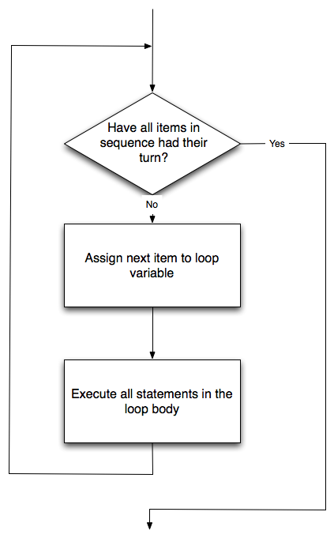

..  Copyright (C)  Brad Miller, David Ranum, Jeffrey Elkner, Peter Wentworth, Allen B. Downey, Chris
    Meyers, and Dario Mitchell.  Permission is granted to copy, distribute
    and/or modify this document under the terms of the GNU Free Documentation
    License, Version 1.3 or any later version published by the Free Software
    Foundation; with Invariant Sections being Forward, Prefaces, and
    Contributor List, no Front-Cover Texts, and no Back-Cover Texts.  A copy of
    the license is included in the section entitled "GNU Free Documentation
    License".
    
..  shortname:: OlaTartaruga
..  description:: Uma introdução ao uso do módulo turtle em Python
 
Olá, tartaruguinhas!
====================

.. index::  
    single: módulo
    single: função
    single: definição de função
    single: definição; função
    single: módulo turtle

.. video:: assignvid00
    :controls:
    :thumb: ../_static/turtleintro.png

    http://media.interactivepython.org/thinkcsVideos/turtleintro.mov
    http://media.interactivepython.org/thinkcsVideos/turtleintro.webm

Existem vários *módulos* em Python que fornecem recursos muito
poderosos que podemos utilizar em nossos programas. Alguns desses 
permitem enviar email ou buscar uma página na web. Outros tornam
possível realizar cálculos matemáticos bastante complexos. Neste
capítulo vamos introduzir um módulo que nos permite criar um objeto
chamado **turtle** (N. do T.: para facilitar a leitura, embora o objeto
seja do tipo **turtle**, vamos muitas vezes chamar de tartaruga mesmo)
que pode ser usado para desenhar figuras (gráfico de tartarugas).

.. turtles and get them
.. turn left, etc.  Your turtle's tail is also endowed with the ability to leave
.. to draw shapes and patterns.  

O gráfico de tartaruga é baseado em uma metáfora bem simples.
Imagine que você tem uma tartaruga que entende inglês. Você pode
dar comandos simples à tartaruga tais como "siga em frente" ou "vire à
direita". A medida que a tartaruga se move, se o seu rabo está virado
para baixo, tocando o chão, ela desenha uma linha (deixa um rastro) ao
se mover. Se você mandar a tartaruga levantar o rabo ela ainda pode se
mover mas não vai deixar nenhum rastro. Como você vai ver, é possível
fazer desenhos muito impressionantes usando esse mecanismo simples.

.. note : :
   
.. admonition:: Nota 

	Embora seja muito divertido brincar com as tartarugas, o
        propósito real desse capítulo é ensinar um pouco mais de Python e
        desenvolver o nosso tema sobre *raciocínio computacional* ou
        *pensando como um cientista da computação*. A maior parte dos
        assuntos sobre Python tratados aqui serão cobertos com maior
        profundidade mais tarde. 

.. index:: objeto, chamada, método, atributo, estado, canvas

Nosso primeiro programa com tartarugas
--------------------------------------

Vamos experimentar algumas linhas de código em Python para criar uma nova
tartaruga e desenhar uma figura simples como um retângulo. Vamos dar o
nome de `alex` à variável que vai fazer referência a nossa primeira
tartaruga, mas você pode escolher outro nome se desejar (para isso
basta criar um outro nome segundo as regras descritas no capítulo
anterior). 

O trecho de programa a seguir desenha apenas os dois primeiros lados
do retângulo. Após a linha 3 você terá uma linha reta partindo do
centro do canvas para a direita e, após a linha 6, o canvas vai
mostrar a tartaruga e metade do retângulo desenhado. Pressione o botão
run para ver o resultado.

.. activecode:: ch03_1
    :nopre:

    import turtle            # permite usar as funções e objetos do módulo turtle
    wn = turtle.Screen()     # cria uma janela gráfica
    alex = turtle.Turtle()   # cria um turtle chamado alex
    alex.forward(150)        # manda o alex se mover 150 unidades para frente
    alex.left(90)            # roda de 90 graus para a esquerda
    alex.forward(75)         # desenha o segundo lado do retângulo

    

A primeira linha desse programa diz ao Python para carregar o
**módulo** chamado ``turtle``. Esse módulo inclui dois novos tipos que
agora podem ser utilizados: o tipo ``Turtle`` e o tipo ``Screen``. A
notação utilizando ponto como em ``turtle.Turtle`` quer dizer
*"O tipo Turtle que está definido no módulo turtle"*. Lembre-se que em
Python o uso de letras maiúsculas e minúsculas tornam os nomes
diferentes, ou seja, o nome do módulo que começa com a letra minúscula
`t` é diferente do tipo Turtle. 
  
A segunda linha cria um objeto do tipo Screen (que é costumeiramente
chamada de janela em uma interface gráfica) e a atribui à variável
``wn``. Toda janela contém um **canvas**, que é a área dentro da
janela sobre a qual podemos desenhar.

A linha 3 cria uma tartaruga (``Turtle``) e a atribui à variável
`alex`, ou seja, `alex` é uma referência para essa tartaruga recém
criada. Essas primeiras três linhas criam os recursos necessários para
que possamos começar a desenhar.

Nas linhas 4-6, o **objeto** alex é instruido a se mover e a
virar. Isso é feito **chamando** ou ativando **métodos** do objeto
alex (que é do tipo Turtle) --- essas são as instruções que todas as
tartarugas conhecem e sabem como responder.
        

.. admonition:: Complete o retângulo ...
    
    Modifique o programa adicionando os comandos necessários
    para que *alex* complete o retângulo.
 

Um objeto pode possuir vários métodos --- coisas que ele é capaz de
fazer --- e ele pode ter também **atributos** --- (chamados também de
*propriedades*). Por exemplo, cada tartaruga tem um atributo *color*
(cor). A chamada do método `alex.color("red")` faz com que alex fique
vermelho e as linhas que ele desenhar a seguir serão vermelhas também.

A cor da tartaruga, a espessura da caneta (o rabo), a posição da
tartaruga dentro da janela, a direção que ela aponta, etc.,
são partes do seu **estado** atual. De forma semelhante, o objeto
Screen tem uma cor de fundo, que faz parte do estado do objeto
referenciado pela variável `wn`. 

Existem vários métodos que nos permite modificar objetos do tipo Turtle e
Screen. Vamos aqui mostrar apenas alguns. Para isso, comentamos apenas
as linhas que são diferentes do exemplo anterior. Note também que
estamos chamando a tartaruga de *tess*.

    
.. activecode:: ch03_2
    
    import turtle

    wn = turtle.Screen()
    wn.bgcolor("lightgreen")         # define a cor de fundo da janela

    tess = turtle.Turtle()
    tess.color("blue")               # tess fica azul
    tess.pensize(3)                  # define a espessura da caneta

    tess.forward(50)
    tess.left(120)
    tess.forward(50)

    wn.exitonclick()

A última linha desse programa tem uma papel importante. A variável wn
faz referência à janela (Screen). Quando chamamos o método
``exitonclick``, a execução do programa é interrompida e ele fica
esperando que o usuário clique em algum lugar na janela com o
mouse. Quando o programa recebe o clique, o programa fecha a janela
com a tartaruga e termina sua execução.

Cada vez que rodamos esse programa, uma nova janela é criada, e seu
conteúdo é mostrado até receber um clique.

.. admonition:: Estenda esse programa ...
    
    #. Modifque esse programa para que
       ele pergunte ao usuário a cor de fundo desejada antes da janela
       ser criada. O programa deve armazenar a resposta em uma
       variável e modificar a cor de fundo conforme o desejo do
       usuário.
       (Dica: você pode encontrar uma lista com os nomes das cores
       permitidas em
       http://www.w3schools.com/html/html_colornames.asp.  A lista
       inclui cores bem exóticas, como "PeachPuff" e "HotPink".)
    #. Faça uma mudança semelhante para permitir que o usuário
       modifique a cor da tartaruga tess.
    #. Faça o mesmo para a espessura da caneta. *Dica:* o seu diálogo
       com o usuário vai retornar um string, mas o método ``pensize``
       deve ser chamado utilizando um inteiro como argumento. Portanto
       você deve converter o string para um inteiro antes de chamar o método
       ``pensize``. 
 

**Teste o seu entendimento**

.. mchoice:: test_question3_1_1
   :answer_a: Ela cria um novo objeto turtle que pode ser utilizado para desenhar
   :answer_b: Ela nos permite criar um objeto chamado Turtle que pode ser usado para desenhar
   :answer_c: Ele faz a tartaruga desenhar metade de um retângulo na janela
   :answer_d: Nada, a linha é desnecessária
   :correct: b
   :feedback_a: A linha &quotalex = turtle.Turtle()&quot é que cria o objeto turtle
   :feedback_b: Essa linha carrega o módulo chamado turtle, que contém todas as funções necessárias para desenhar com objetos do tipo Turtle
   :feedback_c: Esse é o resultado das linhas &quotalex.forward(150)&quot, &quotalex.left(90)&quot, e &quotalex.forward(75)&quot
   :feedback_d: Se essa linha não for incluída, o Python vai dar um erro dizendo que não conhece o nome &quotturtle&quot quando executar a linha &quotwn = turtle.Screen()&quot
   
   Considere o seguinte código:
   <pre>
   import turtle            
   wn = turtle.Screen()     
   alex = turtle.Turtle()   
   alex.forward(150)        
   alex.left(90)            
   alex.forward(75)  
   </pre>       
   Para que serve a linha "import turtle"?

.. mchoice:: test_question3_1_2
   :answer_a: Apenas para melhorar a clareza. Podemos escrever também "Turtle()" ao invés de "turtle.Turtle()"
   :answer_b: O ponto (.) diz ao Python que queremos criar um novo objeto.
   :answer_c: O primeiro "turtle" (antes do ponto) diz ao Python que estamos nos referindo ao módulo turtle, que é onde o objeto "Turtle" deve ser encontrado.
   :correct: c
   :feedback_a: É necessário definir o nome do módulo onde o Python pode encontrar o objeto Turtle.
   :feedback_b: O ponto separa o nome do módulo do nome do objeto. O parênteses ao final diz ao Python que se trata da chamada para criação de um novo objeto.
   :feedback_c: Sim, o tipo Turtle é definido no módulo turtle. Lembre-se que Python trata letras maiúsculas e minúsculas de forma diferente, ou seja, Turtle é diferente de turtle.

   Por que é necessário escrever "turtle.Turtle()" para se criar um novo objeto Turtle?

.. mchoice:: test_question3_1_3
   :answer_a: Verdadeiro
   :answer_b: Falso
   :correct: a
   :feedback_a: No capítulo vimos um objeto nomeado alex e outro tess, mas qualquer outro nome que siga a conveção é permitido.
   :feedback_b: Um objeto do tipo Turtle, como qualquer outro dado, pode ser atribuido para qualquer variável, que por sua vez pode ter qualquer nome desde que siga a convenção do capítulo 2.
   
   Verdadeiro ou Falso: O objeto Turtle pode ter qualquer nome, desde que o nome siga a convenção descrita no capítulo 2.

.. index:: instância
  
Instâncias --- um bando de tartarugas
-------------------------------------

Da mesma maneira que podemos ter vários inteiros em um programa,
podemos ter várias tartarugas. Cada uma delas é um objeto independente
que chamamos de **instância** do tipo (classe) Turtle.
Cada instância tem os seus próprios atributos e métodos --- assim alex
pode desenhar usando uma caneta preta fina e ficar em uma posição,
enquanto tess pode ir em outra direção desenhando com uma caneta
rosa. O seguinte ocorre quando alex completa um quadrado e tess
completa seu triângulo:

.. activecode:: ch03_3
   :nopre:

   import turtle
   wn = turtle.Screen()             # Cria uma janela e define seus atributos
   wn.bgcolor("lightgreen")

   tess = turtle.Turtle()           # cria tess e define seus atributos
   tess.color("hotpink")
   tess.pensize(5)

   alex = turtle.Turtle()           # cria alex

   tess.forward(80)                 # tess desenha um triângulo equilátero
   tess.left(120)
   tess.forward(80)
   tess.left(120)
   tess.forward(80)
   tess.left(120)                   # complete o triângulo

   tess.right(180)                  # tess muda de direção 
   tess.forward(80)                 # tess se move para longe da origem
 
   alex.forward(50)                 # alex desenha um quadrado
   alex.left(90)
   alex.forward(50)
   alex.left(90)
   alex.forward(50)
   alex.left(90)
   alex.forward(50)
   alex.left(90)

   wn.exitonclick()

Algumas observações sobre *Como pensar como um cientista da computação*:

* Há 360 graus em uma circunferência. Se você somar todas as mudanças
  de direção feitas por uma tartaruga, *independentemente dos passos
  que ocorreram entre as mudanças*, é fácil descobrir se a soma das
  alterações é um múltiplo de 360. Podemos concluir assim que alex
  termina virado para a mesma direção que tinha ao ser
  criado. (Convenções geométricas estabelecem que 0 graus aponta para
  o leste, e isso ocorre nesse caso também!)
* Poderíamos ter evitado a última virada de alex, mas dessa forma o
  resultado final não seria tão satisfatório. Sempre que você precisar
  desenhar uma forma fechada, como um quadrado ou retângulo, é uma boa
  prática deixar a tartaruga de volta ao estado original, apontando
  para a mesma direção inicial. Isso facilita o raciocínio, para nós
  humanos, sobre o programa e a composição de pedaços de código em
  programas maiores.
* Fizemos o mesmo com a tess: ela desenhou o seu triângulo e deu uma
  virada completa de 360 graus. Então nós a viramos e a movemos para o
  lado. Mesmo a linha 18 em branco é uma dica de como o *agrupamento
  mental* do programador está funcionando: de forma geral, os
  movimentos da tess foram agrupados como "desenhe o triângulo"
  (linhas 12-17) e então "mova-se para longe da origem" (linhas 19 e
  20).
* Um dos principais usos para comentários é deixar gravado o seu
  agrupamento mental e as ideias grandes. Elas nem sempre ficam
  explícitas no código.
* Ok, duas tartarugas podem não ser suficientes para um bando,
  mas deu para você ter uma ideia!

.. index:: laço for
  
O laço **for**
--------------

.. video:: forloopvid
   :controls:
   :thumb: ../_static/for_loop.png

   http://media.interactivepython.org/thinkcsVideos/for_loop.mov
   http://media.interactivepython.org/thinkcsVideos/for_loop.webm

Foi muito tedioso desenhar o quadrado. Nós tivemos de mover e então
girar, mover e então girar, etc. etc. quatro vezes. Se estivéssemos
desenhando um hexágono, ou um octágono, ou um polígono com 42 lados,
seria um pesadelo ter de duplicar todo aquele código.

Um bloco básico de qualquer programa é o que permite repetir
algum código várias e várias vezes. Na ciência da computação nos
referimos a essa ideia repetitiva de **iteração**. Nesse
capítulo vamos explorar alguns mecanismos básicos de iteração.

Em Python, o comando **for** nos permite escrever programas que
implementam iterações.
Por exemplo, vamos assumir que temos alguns amigos e que gostaríamos
de enviar para cada um deles um email convidando-os para a nossa
festa. Ainda não sabemos como enviar emails, então por enquanto
vamos apenas imprimir uma mensagem para cada amigo.

.. activecode:: ch03_4
    :nocanvas:

    for amigo in ["Joe", "Amy", "Brad", "Angelina", "Zuki", "Thandi", "Paris"]:
        print("Ola ", amigo, "  Por favor venha a minha festa no sabado!")
      

Dê uma olhada na saída produzida quando você pressiona o botão ``run``. Existe uma linha impressa para cada amigo. Isso funciona assim:

* **amigo** nesse comando ``for`` é chamado de **variável do laço**.
* A lista de nomes em colchetes é chamada de **lista** em Python.
  Listas são muito úteis. Veremos muito mais sobre elas mais tarde.
* A linha 2 é o **corpo do laço**. O corpo do laço é sempre recuado
  de um tab. Esse recuo determina exatamente que comandos estão
  "dentro do laço". O corpo do laço é executado uma vez para cada
  nome na lista.
* A cada **iteração** ou **passagem** do laço, primeiro é feita um
  teste que verifica se ainda existem itens para serem processados.
  Se não há mais nenhum (isso é chamado de **condição de parada** do
  laço), o laço termina. A execução do programa continua na próxima
  instrução após o corpo do laço.
* Se ainda houver itens a serem processados, a variável do laço é
  atualizada para referenciar o próximo item da lista. Isto significa,
  neste caso, que o corpo do laço é executado sete vezes, e em cada
  vez **amigo** fará referência a um amigo diferente.
* No final de cada execução do corpo do laço, o Python volta ao
  comando ``for`` para ver se há mais itens a serem manipulados.

**Teste o seu entendimento**

.. mchoice:: test_question3_2_1
   :answer_a: Verdadeiro
   :answer_b: Falso
   :correct: b
   :feedback_a: Você pode criar e usar tantas tartarugas desejar. Desde que elas tenham nomes diferentes, você pode operá-las de forma independente, e fazê-las se mover em qualquer ordem que desejar. Para se convencer de que isso é verdade, tente intercalar as instruções para o alex e a tess na caixa 3 do ActiveCode.
   :feedback_b:  Você pode criar e usar tantas tartarugas desejar. Desde que elas tenham nomes diferentes, você pode operá-las de forma independente, e fazê-las se mover em qualquer ordem que desejar. Para se convencer de que isso é verdade, tente intercalar as instruções para o alex e a tess na caixa 3 do ActiveCode.

   Verdadeiro ou Falso: você pode ter apenas uma tartaruga ativa de cada vez. Se você criar uma segunda, você não será mais capaz de acessar ou usar a primeira.
   

.. index:: fluxo de controle, fluxo de execução

.. admonition:: Editor Scratch 

    .. actex:: turtle_scratch_1

Fluxo de execução do laço for
-----------------------------

A medida que o programa executa, o interpretador sempre mantém registro sobre o comando que está prestes a ser executado. Chamamos isso de **fluxo de controle** ou **fluxo de execução** do programa. Quando seres humanos executam programas, muitas vezes eles usam um dedo para apontar para cada comando executado. Então você pode pensar em fluxo de controle como sendo o "dedo do Python em movimento". 

Até agora o fluxo de controle foi estritamente de cima para baixo, uma instrução de cada vez. Nós chamamos esse tipo de controle **sequencial**. O fluxo de controle sequencial é sempre assumido como o comportamento padrão para um programa de computador. O comando ``for`` muda isso.

O fluxo de controle é muitas vezes fácil de visualizar e entender se traçarmos um fluxograma. Este fluxograma mostra exatamente os passos e a lógica de como o comando ``for`` executa.

Uma demonstração usando o codelens é uma boa maneira de ajudá-lo a visualizar exatamente como o fluxo de controle funciona com o laço for. Tente avançar e retroceder no programa pressionando os botões. Você pode ver o valor de ``amigo`` mudar a medida que o laço itera pela lista de amigos.

.. codelens:: vtest

    for amigo in ["Joe", "Amy", "Brad", "Angelina", "Zuki", "Thandi", "Paris"]:
        mensagem = "Olá " + amigo + ".  Por favor venha a minha festa!"

.. index:: range function, chunking

Iteração simplifica o programa de tartaruga
-------------------------------------------

Para desenhar um quadrado gostaríamos de fazer a mesma coisa quatro vezes --- mover a tartaruga alguma distância para frente e girar 90 graus. Anteriormente usamos 8 linhas de código Python para fazer alex desenhar os quatro lados de um quadrado. Este próximo programa faz exatamente a mesma coisa mas, com a ajuda do comando for, usa apenas três linhas (não incluindo o código de inicialização). Lembre-se que o comando for repetirá o `forward` e `left` quatro vezes, uma vez para cada valor na lista.

.. activecode:: ch03_for1
   :nopre:

   import turtle            # cria alex
   wn = turtle.Screen()
   alex = turtle.Turtle()
   
   for i in [0,1,2,3]:      # repita 4 vezes
       alex.forward(50)
       alex.left(90) 

   wn.exitonclick()

Mesmo que "economizar algumas linhas de código" seja conveniente, isso não é a parte mais relevante. O mais importante é que nós encontramos um "padrão de repetição" de comandos e nós reorganizamos o programa para repetir o padrão. 
Encontrar os pedaços e, de alguma forma, organizar nossos programas ao redor desses pedaços é uma habilidade vital para se aprender *Como pensar como um cientista da computação*.

Os valores [0,1,2,3] foram fornecidos para fazer o corpo do laço executar 4 vezes.
Poderíamos ter usado quatro valores quaisquer. Por exemplo, considere o seguinte programa.

.. activecode:: ch03_forcolor
   :nopre:

   import turtle            # cria alex
   wn = turtle.Screen()
   alex = turtle.Turtle()
   
   for aColor in ["yellow", "red", "purple", "blue"]:  # repita 4 vezes
       alex.forward(50)
       alex.left(90) 

   wn.exitonclick()

Como há quatro itens na lista, a iteração ainda irá ocorrer quatro vezes. A variável do laço ``aColor`` vai assumir cada cor na lista. Podemos até dar um passo adiante e usar o valor de ``aColor`` como parte da computação.

.. activecode:: colorlist

    import turtle            # cria alex
    wn = turtle.Screen()
    alex = turtle.Turtle()

    for aColor in ["yellow", "red", "purple", "blue"]: # repita 4 vezes
       alex.color(aColor)
       alex.forward(50)
       alex.left(90)

    wn.exitonclick()

Nesse caso, o valor de ``aColor`` é usado para modificar o atributo cor de ``alex``. Cada iteração causa a modificação de ``aColor`` para o próximo valor da lista.

**Check your understanding**

.. mchoice:: test_question3_4_1
   :answer_a: 1
   :answer_b: 5
   :answer_c: 6
   :answer_d: 10
   :correct: c
   :feedback_a: O corpo do laço imprime uma linha, mas o corpo será executado exatamente uma vez para cada elemento na lista [5, 4, 3, 2, 1, 0]. 
   :feedback_b: Embora o maior número na lista seja 5, há na realidade 6 elementos na lista. 
   :feedback_c: O corpo do laço será executado (e imprimira uma linha) para cada um dos 6 elementos na lista [5, 4, 3, 2, 1, 0]
   :feedback_d: O corpo do laço não será executado mais vezes que o número de elementos na lista.

   Quantas linhas são impressas pelo código a seguir?
   <pre>
   for numero in [5, 4, 3, 2, 1, 0]:
      print("Eu tenho", numero, "biscoitos. Vou comer um.")
   </pre>

.. mchoice:: test_question3_4_2
   :answer_a: As linhas ficam recuadas um tab do cabeçalho do laço
   :answer_b: Sempre há apenas 1 linha no corpo do laço
   :answer_c: O corpo do laço termina com um ponto e vírgula (;) que não foi mostrado no código acima
   :correct: a
   :feedback_a: O corpo do laço pode ter um número de linhas qualquer, todas recuadas do cabeçalho do laço.
   :feedback_b: O corpo do laço pode ter mais de uma linha.
   :feedback_c: O Python não usa ponto e vírgula em usa sintaxe. Ele se baseia na tabulação.
   
   Como o Python sabe quais linhas fazem parte do corpo do laço?

.. mchoice:: test_question3_4_3
   :answer_a: 2
   :answer_b: 4
   :answer_c: 5
   :answer_d: 1
   :correct: b
   :feedback_a: O Python atribui a numero o valor dos itens da lista, um de cada vez, em ordem (da esquerda para a direita). numero recebe um novo valor cada vez que o laço se repete.
   :feedback_b: Sim, o Python processa os itens da esquerda para a direita, assim da primeira vez o valor é 5 e da segunda é 4.
   :feedback_c: O Python dá a numero o valor dos itens da lista, um de cada vez, em ordem (da esquerda para a direita). numero recebe um novo valor cada vez que o laço se repete.
   :feedback_d: O Python dá a numero o valor dos itens da lista, um de cada vez, em ordem (da esquerda para a direita). numero recebe um novo valor cada vez que o laço se repete.
   
   No código a seguir, qual o valor de numero da segunda vez que o Python executa o laço?
   <pre>
   for numero in [5, 4, 3, 2, 1, 0]:
      print("Eu tenho", numero, "biscoitos. Vou comer um.")
   </pre>

.. mchoice:: test_question3_4_4
   :answer_a: Desenha um lado de um quadrado, usando a mesma cor todas as vezes.
   :answer_b: Desenha um lado de um quadrado, usando uma cor diferente a cada vez.
   :answer_c: Desenha um quadrado completo.
   :correct: a
   :feedback_a: Os itens da lista não são realmente utilizados para controlar a cor da tartaruga porque aColor nunca é usado dentro do laço.
   :feedback_b: Observe que aColor nunca é usado dentro do laço.
   :feedback_c: O corpo do laço contém apenas duas instruções: siga em frente e vire à esquerda. Isso não é o suficiente para desenhar um quadrado completo.
   
   Considere o seguinte código:
   <pre>
   for aColor in ["yellow", "red", "green", "blue"]:
      alex.forward(50)
      alex.left(90)
   </pre>
   O que cada iteração do loop (ou seja, "pedaço de código") faz?

A função range
--------------

.. video:: advrange
   :controls:
   :thumb: ../_static/advrange.png

   http://media.interactivepython.org/thinkcsVideos/AdvancedRange.mov
   http://media.interactivepython.org/thinkcsVideos/AdvancedRange.webm

No exemplo da última sessão (mostrado novamente abaixo), usamos uma lista de quatro inteiros para causar que a iteração se repetisse quatro vezes. Dissemos que poderíamos ter usado quatro valores quaisquer. De fato, até usamos quatro cores.

.. sourcecode:: python

   import turtle            # cria alex
   wn = turtle.Screen()
   alex = turtle.Turtle()

   for i in [0,1,2,3]:      # repita 4 vezes
       alex.forward(50)
       alex.left(90) 

   wn.exitonclick()

Acontece que a geração de listas com um número específico de inteiros é uma coisa muito comum de se fazer, especialmente quando você quer escrever uma iteração simples controlada por um laço for. Mesmo que você possa usar quatro itens quaisquer, ou quaisquer quatro números inteiros, o convencional é usar uma lista de inteiros que começa com 0.
Na verdade, essas listas são tão populares que o Python fornece um objeto ``range`` (intervalo) nativo que pode ser usado para fornecer uma sequência de valores para o laço ``for``. As sequências começam de 0 e nos casos mostrados abaixo não incluem o 4 e o 10. 

  .. sourcecode:: python

      for i in range(4):
          # Executa o corpo com i = 0, depois 1, depois 2, depois 3
      for x in range(10):
          # x recebe um valor de [0, 1, 2, 3, 4, 5, 6, 7, 8, 9] de cada vez

.. note : :
   
.. admonition:: Nota

    Cientistas da computação gostam de contar a partir do 0!

Assim, para repetir algo quatro vezes, um bom programador de Python faria:

.. sourcecode:: python

    for i in range(4):
        alex.forward(50)
        alex.left(90)

A função `range <http://docs.python.org/py3k/library/functions
.html?highlight=range#range>`_ é na verdade uma função muito poderosa para a criação de sequências de inteiros. Ela pode receber um, dois ou três argumentos. Nós vimos o caso mais simples de um argumento, como ``range(4)`` que cria ``[0, 1, 2, 3]``. 
Mas e se na verdade quisermos a sequência ``[1, 2, 3, 4]``?
Podemos obter isso passando dois argumentos a ``range``, onde o primeiro argumento define o início do intervalo e o segundo argumento define o fim. A chamada ``range(1, 5)`` retorna a sequência desejada. Mas o que aconteceu com o 5? Nesse caso interpretamos os argumentos de range para significar range(início, fim+1).

.. note : :

.. admonition:: Nota
		
    Mas por que o range simplesmente não funciona como range(início, fim)?
    Pense nisso da seguinte forma. Como os cientistas da computação gostam de
    começar a contar a partir do 0 ao invés de 1, ``range(N)`` produz a
    sequência de sequência de coisas que tem comprimento N, mas a consequência
    de começar com 0 é que o número final da sequência é N-1. No caso de início e
    fim, é mais fácil pensar que a sequência começa do início e continua até
    o fim, mas não inclui o fim.
    
Execute os dois exemplos a seguir. Adicione uma outra linha abaixo para criar uma sequência que comece em 10 e vai até 20 (incluindo o 20). 

.. activecode:: ch03_5
    :nocanvas:

    print(range(4))
    print(range(1,5))

O codelens pode nos ajudar também a entender como a função range funciona. Nesse caso, a variável ``i`` receberá os valores produzidos por ``range``. 

.. codelens:: rangeme

    for i in range(10):
       print(i)
       

Finalmente, suponha que nós queremos ter uma sequência de números pares.
Como é que vamos fazer isso? Fácil, nós adicionamos um outro parâmetro, um passo,
que diz ao range o quanto pular.
Então, se queremos os 10 primeiros números pares podemos usar 
``range(0,19,2)``. A forma mais geral de range é
``range(início, fim, passo)``. Você também pode criar uma sequência de números que
começa grande e fica menor, usando um valor negativo para o passo.

.. activecode:: ch03_6
    :nocanvas:

    print(range(0,19,2))
    print(range(0,20,2))
    print(range(10,0,-1))

Experimente no codelens.

.. codelens:: rangeme2

    for i in range(0,20,2):
       print(i)

**Teste o seu entendimento**

.. mchoice:: test_question3_5_1
  :answer_a: Range deve gerar uma lista que pára em 9 (incluindo 9).
  :answer_b: Range deve gerar uma lista que começa em 10 (incluindo 10). 
  :answer_c: Range deve gerar uma lista a partir de 3, que pára em 10 (incluindo 10). 
  :answer_d: Range deve gerar uma lista usando todo décimo número entre o início e o fim.
  :correct: a
  :feedback_a: Range vai gerar a lista [3, 5, 7, 9]
  :feedback_b: O primeiro argumento (3) define o início.
  :feedback_c: Range pára no número anterior (não inclui) o número que define o fim da sequência.
  :feedback_d: O terceiro elemento (2) define quantos números devem ser pulados (passo) entre cada elemento da lista.

  No comando range(3, 10, 2), o que é definido pelo segundo argumento (10)?

.. mchoice:: test_question3_5_2
  :answer_a: range(2, 5, 8)
  :answer_b: range(2, 8, 3)
  :answer_c: range(2, 10, 3)
  :answer_d: range(8, 1, -3)
  :correct: c
  :feedback_a: Este comando gera a lista [2], porque o primeiro número (2) diz a range por onde começar, o segundo número diz o fim do intervalo (5, que não é incluído) e o terceiro número diz a range quantos números ele deve saltar entre elementos da lista (8). Como 10 >= 5, existe apenas um número nesta lista.
  :feedback_b: This command generates the list [2, 5] because 8 is not less than 8 (the specified ending number).
  :feedback_c: The first number is the starting point, the second is the maximum allowed, and the third is the amount to increment by.  
  :feedback_d: This command generates the list [8, 5, 3] because it starts at 8, ends at (or above 1), and skips every third number going down.
  
  Que comando gera a lista [2, 5, 8]?
  
.. mchoice:: test_question3_5_3
  :answer_a: Range vai gerar uma lista começando em 0, com todos os números até, mas não incluindo, o argumento que foi passado.
  :answer_b: Range vai gerar uma lista começando em 1, com todos os números até, mas não incluindo, o argumento que foi passado.
  :answer_c: Range vai gerar uma lista começando em 1, com todos os números até o argumento que foi passado, incluindo o mesmo.
  :answer_d: A chamada causa um erro: range requer sempre 3 argumentos.
  :correct: a
  :feedback_a: Sim, se você passar apenas um argumento, ele começa com zero e termina um número antes do argumento especificado.
  :feedback_b: Range começa do 0, a menos que outro número seja especificado.
  :feedback_c: Range começa do 0, a menos que outro número seja especificado e nunca inclui o número que define o fim (que é o caso quando apenas um argumento é passado).
  :feedback_d: Quando o range recebe apenas um argumento, ele o interpreta como sendo o fim da lista (não incluído). 

  O que acontece quando range recebe apenas um argumento? Por exemplo: range(4)

.. admonition:: Editor Scratch

  .. actex:: turtle_scratch_2

Observações e alguns outros métodos de Turtle
---------------------------------------------

Vamos ver mais algumas coisas de Turtle que lhe podem ser úteis.

* Os métodos de um objeto Turtle podem usar ângulos ou distâncias negativas.
  Assim, ``tess.foward(-100)`` move tess para trás e ``tess.left(-30)`` vira
  ela para a direita. Além disso, como há 360 graus em um círculo, girando
  30 para a esquerda vai deixá-la virada na mesma direção que girando 330
  para a direita! (No entanto, a animação na tela será diferente --- você
  será capaz de dizer se a tess está girando no sentido horário ou
  anti-horário!)

  Isso sugere que nós não precisamos de dois métodos para girar tanto à
  esquerda quanto à direita --- poderíamos ser minimalistas e ter apenas
  um método. Há também um método *backward*. (Se você é muito *nerdy*, pode
  gostar de escrever ``alex.backward(-100)`` para mover alex para frente!)

  Parte de *pensar como um cientista* é entender mais sobre a estrutura e
  as relações elaboradas existentes em sua área.
  Assim, uma revisão de alguns conceitos básicos de geometria como fizemos aqui
  é um bom começo para continuar brincando com as tartarugas.

* O rabo da tartaruga pode ser deixado para baixo ou para cima. Isso permite
  que a tartaruga se mova sem desenhar uma linha. Os métodos são ``penup``
  e ``pendown``. 

  .. sourcecode:: python

     alex.penup()
     alex.forward(100)     # this moves alex, but no line is drawn
     alex.pendown()   
       
* Cada tartaruga pode ter sua própria forma. As formas já prontas são
  ``arrow``, ``blank``, ``circle``, ``classic``, ``square``, ``triangle``,
  ``turtle``.

  .. sourcecode:: python

     ...            
     alex.shape("turtle")  # experimente as outras formas           
     ...                 

* Você pode controlar a velocidade de animação da tartaruga. (A animação
  controla a velocidade usada para a tartaruga virar e se mover). A velocidade
  pode ser configurada entre 1 (a mais baixa) e 10 (mais rápida). A velocidade 0
  tem um significado especial --- a animação é desativada e o programa é executado
  o mais rápido possível.
  
  .. sourcecode:: python
       
     alex.speed(10)
          
* Uma tartaruga pode "carimbar" a sua pegada no canvas, que vai permanecer
  mesmo após a tartaruga tenha se mudado para outro lugar. O carimbo
  funciona mesmo quando o rabo está voltado para cima.
      
Vamos fazer um exemplo que mostra alguns desses novos recursos.
 
.. activecode:: ch03_7

   import turtle
   wn = turtle.Screen()             
   wn.bgcolor("lightgreen")
   tess = turtle.Turtle()            
   tess.color("blue")
   tess.shape("turtle")

   print(range(5,60,2))
   tess.penup()                    # isso é novo
   for size in range(5,60,2):      # começar com size = 5 e passo 2
       tess.stamp()                # deixar um carimbo no canvas
       tess.forward(size)          # tess, vá para frente 
       tess.right(24)              # tess, vire 24 graus a direita

   wn.exitonclick()

A lista de inteiros mostrada acima é criada ao imprimir o resultado de ``range(5,60,2)``. Isso foi feito apenas para lhe mostrar as distâncias
sendo usadas para mover a tartaruga.
O uso real é feito dentro do laço ``for``.

Mais uma coisa para se ter cuidado. Todas exceto uma das formas que você vê aqui
na tela são pegadas criadas por ``stamp``. Mas o programa possui apenas *uma*
instância de Turtle --- você consegue descobrir qual é a tess verdadeira?
(Dica: se você tem alguma dúvida, escreva algumas linhas de código depois
do laço ``for`` para mudar a cor de tess, ou colocar o seu rabo para baixo
para desenhar uma linha, ou mudar a sua forma etc.)

.. admonition:: Exercício

    * `Turtle Race <../Labs/lab03_01.html>`_ Nesse exercício dirigido você vai
      resolver alguns problemas relacionados à implementação de uma corrida de
      tartarugas.
      

.. _turtle_methods:

Resumo de métodos de Turtle
---------------------------

==========  ==========  =========================
Método      Parâmetros  Descrição
==========  ==========  =========================
Turtle      None        Cria e retorna um novo objeto turtle
forward     distância   Move para frente
backward    distância   Move para trás
right       ângulo      Vira no sentido horário
left        ângulo      Vira no sentido anti-horário
up          None        Levanta o rabo
down        None        Abaixa o rabo
color       cor         Muda a cor usada ao desenhar
fillcolor   cor         Muda a cor usada ao preencher um polígono
heading     None        Retorna a direção atual
position    None        Retorna a posição atual
goto        x,y         Move a tartarua para a posição x,y
begin_fill  None        Use a posição atual para preencher um polígono
end_fill    None        Termine o polígono na posição atual
dot         None        Deixe um ponto na posição atual
stamp       None        Deixe um carimbo da tartaruga na posição atual
shape       forma       Deve ser 'arrow', 'classic', 'turtle', ou 'circle'
==========  ==========  =========================

Depois que você se familiarizar com os componentes básicos do
módulo gráfico turtle
você pode conhecer ainda mais opções lendo a `documentação online do Python 
<http://docs.python.org/dev/py3k/library/turtle.html>`_.
Note que vamos falar mais sobre a documentação do Python no próximo capítulo.

Glossário
---------

.. glossary::

    atributo
        Algum estado ou valor que pertence a um objeto particular. Por exemplo,
        tess tem uma cor.

    canvas
        A superfície dentro de uma janela usada para desenhar.
	
    condição de parada.
        Uma condição que, ao ocorrer, faz com que um laço pare de repetir o seu corpo.
        Nos laços ``for`` que vimos neste capítulo, a condição de parada
        se torna verdadeira quando não há mais elementos para atribuir à *variável do laço*.

    corpo do laço
        Conjunto de comandos contidos dentro de um laço. A identificação do corpo é feita pelo recuo (tab) a partir da declaração do laço.

    estado
        A coleção de valores de atributos mantida por um objeto de dados específico.

    fluxo de controle
        Veja *fluxo de execução* no próximo capítulo.
	
    for (laço for)
        Um comando do Python que permite a repetição de comandos dentro do 
        *corpo* do laço for.

    instância
        Um objeto que pertence a uma classe. `tess` e `alex` são diferentes
        instâncias da classe `Turtle`.

    invocar
        Um objeto tem métodos. Usamos o verbo invocar para significar *ativar o método*. A invocação de um método é feita colocando parênteses após o nome do método, com alguns dos possíveis argumentos. Então ``wn.exitonclick()`` é
        uma invocação do método ``exitonclick``.

    iteração (comando de)
        Um bloco de construção básico de algoritmos (programas). Ele permite que passos sejam repetidos. Às vezes chamado *laço* (`loop`, ou `looping`). 

    método
        Uma função de um objeto. Invocando ou ativando o
        método faz com que o objecto responda de alguma forma, por exemplo, ``forward`` é o método que usamos para uma tartaruga se mova para frente (``tess.forward(100)``.

    módulo
        Um arquivo contendo definições e comandos do Python para uso em
        outros programas em Python. O conteúdo de um módulo é disponibilizado para outro programa usando o comando *import*.

    objeto
        Uma "coisa" que pode ser referida por uma variável. Essa coisa pode ser uma janela no monitor, ou uma das tartarugas que você criou.
	
    range
        Uma função nativa do Python para gerar sequências de números inteiros. Ela é especialmente útil quando precisamos escrever um laço que é executado um número de vezes determinado.
	
    sequencial
        O comportamento padrão de um programa. O processamento passo-a-passo de um algoritmo.

    variável do laço
        Uma variável usada como parte de um laço. Ela recebe um valor diferente
        em cada iteração do laço e é usada como parte da *condição de parada* do laço.

    Turtle
        Classe que define objetos de dados usados para criar imagens (gráficos de tartarugas). "turtle", com minúscula, é o nome do módulo gráfico do Python que contém Turtle.

Exercícios
----------
#. Escreva um programa que escreve ``Eu gosto das tartarugas do Python!`` 1000 vezes.

   .. actex:: ex_3_1

#. Dê três atributos de seu objeto `telefone celular`.
   Dê três métodos do seu celular. 

   .. actex:: ex_3_2

#. Escreva um programa que usa um laço for para imprimir
     |  ``Um dos meses do ano é janeiro``
     |  ``Um dos meses do ano é fevereiro``
     |  ``Um dos meses do ano é março``
     |  etc ... 

   .. actex:: ex_3_3

#. Considere a seguinte atribuição ``xs = [12, 10, 32, 3, 66, 17, 42, 99, 20]``
    
   a. Escreva um laço que imprima cada um dos números em uma nova linha.
   b. Escreva um laço que imprima cada um dos números e seu quadrado em uma nova linha.

   .. actex:: ex_3_4

#. Use o laço ``for`` para fazer uma tartaruga desenhar os seguintes polígonos
   regulares (reguar significa que todos os lados tem o mesmo comprimento
   e ângulo entre lados):
  
   * Um triângulo equilátero
   * Um quadrado
   * Um hexágono (seis lados)
   * Um octágono (oito lados)

   .. actex:: ex_3_5

#. .. _problema_do_aluno_bebado:

   Um pirata bêbado vira aleatoriamente e então dá 100 passos para frente,
   vira aleatoriamente novamente, dá mais 100 passos, vira aleatóriamente, etc.
   Um aluno de sociologia mede e grava o ângulo de cada virada antes dele dele
   andar 100 passos. O resultado experimentais é
   ``[160, -43, 270, -97, -43, 200, -940, 17, -86]``. (Ângulos positivos no
   sentido anti-horário). Use uma tartaruga para desenhar o caminho percorrido
   pelo nosso amigo bêbado.

   .. actex:: ex_3_6

#. Melhore o seu programa acima para dizer também a direção final do pirata bêbado, após percorrer todo o caminho.
 
   .. actex:: ex_3_7

#. Em uma folha de papel, simule o seguinte programa e mostre o desenho. Ao terminar, pressione o botão ``run`` e verifique a sua resposta.

   .. actex:: ex_3_8

       import turtle
       wn = turtle.Screen()
       tess = turtle.Turtle()
       tess.right(90)
       tess.left(3600)
       tess.right(-90)
       tess.left(3600)
       tess.left(3645)
       tess.forward(-100)

#. Escreva um programa que desenha uma forma como essa:

   .. image:: Figures/star.png
   
   .. actex:: ex_3_9

#. Escreva um programa que desenha a face de um relógio que se pareça com:
    
   .. image:: Figures/tess_clock1.png

   .. actex:: ex_3_10

#. Escreva um programa que desenhe alguma figura. Seja criativo e experimente
   os métodos de Turtle vistos nesse capítulo.

   .. actex:: ex_3_11

#. Crie uma tartaruga e a atribua a uma variável. O que você obtem ao imprimir o seu tipo? 

   .. actex:: ex_3_12

.. #. Escreva um programa para desenhar um Sprite onde o número de pernas é fornecido pelo usuário.

..   .. actex : : ex_3_13
