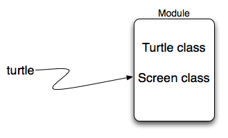

..  Copyright (C)  Brad Miller, David Ranum, Jeffrey Elkner, Peter Wentworth, Allen B. Downey, Chris
    Meyers, and Dario Mitchell.  Permission is granted to copy, distribute
    and/or modify this document under the terms of the GNU Free Documentation
    License, Version 1.3 or any later version published by the Free Software
    Foundation; with Invariant Sections being Forward, Prefaces, and
    Contributor List, no Front-Cover Texts, and no Back-Cover Texts.  A copy of
    the license is included in the section entitled "GNU Free Documentation
    License".
    
..  shortname:: ModulosEmPython
..  description:: O que é um módulo e como usá-lo (math, random)
 
Módulos e Obtendo Ajuda
=======================

Módulos
-------

.. video:: inputvid
    :controls:
    :thumb: ../_static/modules.png

    http://media.interactivepython.org/thinkcsVideos/modules.mov
    http://media.interactivepython.org/thinkcsVideos/modules.webm

Um **módulo** é um arquivo contendo definições e comandos em Python
para serem usados em outros programas em Python. Há diversos módulos
do Python que fazem parte da **biblioteca padrão**. Nós já
utilizamos um deles intensamente, o módulo ``turtle``. Lembre-se que
uma vez que o módulo é importado, podemos utilizar as coisas que estão
definidas dentro dele. 

.. activecode:: chmod_01
    :nopre:

    import turtle            # nos permite usar a biblioteca turtle

    wn = turtle.Screen()     # cria uma janela gráfica
    alex = turtle.Turtle()   # cria uma tartaruga chamada alex 

    alex.forward(150)        # diga a alex para se mover 150 unidades para frente 
    alex.left(90)            # gire 90 graus
    alex.forward(75)         # complete o segundo lado do retângulo
    wn.exitonclick()

Estamos usando aqui ``Screen`` e ``Turtle``, ambos definidos dentro do módulo turtle.

Mas e se ninguém tivesse nos avisado sobre o módulo turtle? Como ficaríamos sabendo da sua existência? Como saberíamos o que ele pode fazer para a gente?
A resposta é pedir ajuda e o melhor jeito para isso é consultando a documentação do Python.

A documentação para a versão 3 do Python está disponível (em inglês) no sítio
`<http://docs.python.org/py3k/>`_ (a página é mostrada abaixo). Essa é uma referência muito útil sobre todos os aspectos do Python. Esse sítio contém uma listagem de todos os módulos padrões disponíveis no Python (veja `Global Module Index <http://docs.python.org/py3k/py-modindex.html>`_). 
Observe também que existe um manual de referência à linguagem 
(`Language Reference <http://docs.python.org/py3k/reference/index.html>`_)
e um tutorial (`Tutorial <http://docs.python.org/py3k/tutorial/index.html>`_), bem como instruções para instalação, dicas de como fazer, e respostas a perguntas frequentes. Recomendamos que você tente se familiarizar com essas informações e se acostume a utilizá-las com frequência. 

.. image:: Figures/pythondocmedium.png

Se você ainda não o fez, dê uma olhada na lista de módulos (`Global Module Index <http://docs.python.org/py3k/py-modindex.html>`_). Nessa lista você vai encontrar, em ordem alfabética, todos os módulos disponíveis na biblioteca padrão. Procure pelo módulo turtle.

.. image:: Figures/moduleindexmedium.png

.. image:: Figures/turtlemodmedium.png

Observe que todas as funcionalidades de uma tartaruga (turtle) que já falamos anteriormente estão descritas. No entanto, há muitas outras. Aproveite para ler e conhecer melhor essas outras funcionalidades que as tartarugas podem fazer. 

.. admonition:: Nota: Módulos do Python e limitações do activecode

	Em todos os capítulos desse livro, as janelas do activecode permitem que você pratique as partes do Python que você está aprendendo.
	Nós mencionamos no primeiro capítulo que a atividade de programação é normalmente realizada dentro de um ambiente de desenvolvimento e que o activecode utilizado aqui serve apenas para nos ajudar a aprender. Essa não é a maneira de desenvolver programas reais.
	Por isso é necessário mencionar que muitos dos módulos da biblioteca padrão do Python **não** funcionarão no ambiente do activecode. De fato, apenas os módulos turtle, math e random estão funcionando no momento. Se você deseja explorar algum outro módulo, você precisa utilizar um ambiente de desenvolvimento mais poderoso.

**Teste seu entendimento**

.. mchoice:: question4_1_1
   :answer_a: Um arquivo contendo definições e comandos em Python para serem usados em outros programas em Python
   :answer_b: Um bloco separado de código dentro de um programa.program.
   :answer_c: Uma linha de código em um programa.
   :answer_d: Um arquivo que contem documentação sobre funções do Python.
   :correct: a
   :feedback_a: Um módulo pode ser reutilizado em programas diferentes.
   :feedback_b: Um módulo é um bloco separado de código mas ele é separado do programa.
   :feedback_c: A chamada de uma função de um módulo pode ser uma linha de código mas módulos são em geral constituídas de múltiplas linhas de código separadas do programa.
   :feedback_d: Cada módulo possui a sua própria documentação, mas o módulo em si é mais que apenas a documentação.

   Em Python um módulo é:

.. mchoice:: question4_1_2
   :answer_a: Visitar a Documentação do Python disponível online.
   :answer_b: Ver os comandos import do programa que você está fazendo.
   :answer_c: Perguntar ao professor.
   :answer_d: Procurar nesse livro.
   :correct: a
   :feedback_a: O sítio online contém a lista com todos os módulos da biblioteca padrão do Python.
   :feedback_b: Os comandos import informam apenas quais módulos são utilizados pelo programa, não informam como usá-los ou o que eles contém.
   :feedback_c: Mesmo que o professor conheça uma boa parte dos módulos do Python, o mais provável é que ele vai ter de olhar a documentação dos módulos, assim como você.
   :feedback_d: Esse livro explica apenas uma parte dos módulos disponíveis. Para a lista completa você deve procurar em outro lugar.

   Para saber mais sobre módulos da biblioteca padrão do Python você deve:
   
.. mchoice:: question4_1_3 
   :answer_a: Verdadeiro
   :answer_b: Falso
   :correct: b
   :feedback_a: Apenas os módulo turtle, math, e random foram implementados até agora no activecode.
   :feedback_b: Apenas os módulo turtle, math, e random foram implementados até agora no activecode.

   Verdadeiro / Falso: Todos os módulos da biblioteca padrão do Python funcionam no activecode.

Mais sobre o uso de módulos
---------------------------

Antes de prosseguir com a exploração dos outros módulos, nós vamos falar um pouco mais sobre o que são módulos e como são tipicamente usados. Uma das coisas mais importantes a saber sobre módulos é o fato de que eles são objetos de dados, assim como qualquer outro tipo de dado em Python. Objetos do tipo `module` simplesmente contém outros elementos do Python.

A primeira coisa que precisamos fazer quando queremos usar um módulo é fazer um ``import``. No exemplo acima, a instrução ``import turtle`` cria um novo nome, ``turtle``, que faz referência a um `objeto module`. Isso se parece muito com os diagramas de referência que vimos anteriormente para as variáveis simples.

A fim de utilizar algo contido em um módulo, usamos a notação de `ponto`, fornecendo o nome de módulo e o item específico unidos por um "ponto". Por exemplo, para usar a classe ``Turtle``, escrevemos ``turtle.Turtle``. Você deve ler
isso como: "No módulo turtle, acesse o elemento Python chamado Turtle".

Agora vamos mostrar alguns outros módulos que você pode achar útil.

.. video:: randmodvid
    :controls:
    :thumb: ../_static/mathrandommodule.png

    http://media.interactivepython.org/thinkcsVideos/mathrandommodule.mov
    http://media.interactivepython.org/thinkcsVideos/mathrandommodule.webm

O módulo `math`
---------------

O módulo ``math`` contém funções matemáticas que você costuma encontrar em calculadoras e algumas constantes matemáticas como `pi` e `e`. Como vimos acima, ao importar o módulo ``math``, obtemos uma referência para um objeto `module` que contém esses elementos.

.. image:: Figures/mathmod.png

Mostramos a seguir como usar alguns itens do módulo math. Se você quiser saber mais detalhes, dê uma olhada na documentação do módulo em 
`Math Module <http://docs.python.org/py3k/library/math.html#module-math>`_.

.. activecode:: chmodule_02

    import math

    print(math.pi)
    print(math.e)    

    print(math.sqrt(2.0))

    print(math.sin(math.radians(90)))   # seno de 90 graus
    
 

..  Like almost all other programming languages, angles are expressed in *radians*
.. rather than degrees.  There are two functions ``radians`` and ``degrees`` to
.. convert between the two popular ways of measuring angles.

Observe outra diferença entre este módulo e nosso uso de ``turtle``.
Em ``turtle`` criamos objetos (tanto ``Turtle`` quanto ``Screen``) e chamamos métodos desses objetos. Lembre-se que um turtle é um objeto de dados (lembre-se do ``alex`` e da ``tess``). Precisamos criar um objeto antes de usá-lo. Quando dizemos
``alex = turtle.Turtle()``, estamos chamando o construtor da classe Turtle que retorna um objeto turtle.

Funções matemáticas não precisam ser construídas. Elas simplesmente executam uma tarefa. Elas ficam todas alojadas no módulo chamado `math`. Uma vez que o
módulo math tenha sido importado, qualquer coisa definida lá
pode ser usada no nosso programa. Observe que usamos sempre o nome do módulo seguido de um `ponto` seguido pelo item específico do módulo (``math.sqrt``). Você pode pensar nisso como sobrenome.nome onde o sobrenome é o módulo
(família) e o nome indica o item individual no módulo.

Se você não tiver feito isso ainda, dê uma olhada na documentação do módulo `math`.  

**Teste seu entendimento**

.. mchoice:: question4_2_1
   :answer_a: import math 
   :answer_b: include math 
   :answer_c: use math
   :answer_d: Nenhum comando é necessário, você pode usar as funções sempre. 
   :correct: a
   :feedback_a: O módulo deve ser importado antes que você possa usar qualquer coisa declarada dentro do módulo.
   :feedback_b: O termo correto não é include, mas é parecido.
   :feedback_c: Você quer usar partes do módulo, mas esse não é o termo correto.
   :feedback_d: Você não pode usar um módulo do Python sem um comando no início do seu programa que diga ao Python explicitamente que você quer usar o módulo.

   Que comando permite que você utilize o módulo math em seu programa?

O módulo `random`
-----------------

Muitas vezes queremos usar **números aleatórios** em programas. Aqui estão alguns usos típicos:

* Para jogar um jogo de azar em que o computador precisa jogar
  alguns dados, escolher um número, ou jogar uma moeda,
* Para embaralhar um baralho de cartas aleatoriamente,
* Para permitir que uma nova nave inimiga apareça aleatoriamente e atire em você,
* Para simular a precipitação de chuva em um modelo computacional para
  estimar o impacto ambiental da construção de uma barragem, 
* Para criptografar sua sessão bancária na Internet.
  
O Python fornece um módulo ``random`` que ajuda com tarefas como esta. Você pode
dar uma olhada na documentação. Aqui estão as principais coisas que podemos fazer com esse módulo.

.. activecode:: chmodule_rand

    import random
    
    prob = random.random()
    print(prob)

    lanceDado = random.randrange(1,7)  # retorna um int, dentre 1,2,3,4,5,6
    print(lanceDado)

Pressione o botão *Run* algumas vezes. Note que os valores se modificam
a cada vez. Esses números são aleatórios.

A função ``randrange`` gera um inteiro no intervalo definido pelo
menor e maior argumento, usando a mesma semântica do ``range`` --- ou
seja, o valor inicial é incluído mas o final é excluído. Todos os
valores tem a mesma probabilidade de ocorrência (ou seja, os resultados
são *uniformemente* distribuídos).

A função ``random()`` retorna um número em ponto flutuante no
intervalo [0.0, 1.0) -- o colchete significa "intervalo fechado à
esquerda" e o parênteses significa "intervalo aberto à direita". Em
outras palavras, 0.0 é possível, mas todos os números retornados serão
estritamente menores que 1.0. É comum *escalar* os resultados após
chamar esse método para transformá-los para dentro de um intervalo
apropriado para a sua aplicação.

Nesse caso, nós convertemos o resultado da chamada do método em um número no intervalo [0.0, 5.0). Novamente, esses números são uniformemente distribuídos --- números perto do 0 são tão prováveis de aparecer quanto o 0.5, ou números perto de 1.0. Se você continuar a pressionar o botão *Run*, você verá valores aleatórios de 0.0 até o limite de, mas sem incluir o valor, 5.0.

.. activecode:: chmodule_rand2

    import random
    
    prob = random.random()
    resultado = prob * 5
    print(resultado)

.. index:: algoritmo determinístico, algoritmo, determinístico,
	   testes unitários.
   
É importante notar que geradores de números aleatórios são baseados em um algoritmo **determinístico** --- reproduzível e previsível.
Por isso eles são chamados de geradores **pseudo-aleatórios** --- pois eles não são verdadeiramente aleatórios.
Eles começam com um valor de *semente*. Cada vez que você pedir um outro número aleatório, você vai receber um com base no valor atual da semente, e o estado da semente (que é um dos atributos do gerador) é atualizado. A boa notícia é que cada vez que você executar o seu programa, o valor da semente é provavelmente diferente, significando que apesar dos números aleatórios estarem sendo criados usando  algoritmos determinísticos, você vai obter um comportamento aleatório cada vez que você executar.

.. admonition:: Lab

    * `Sine Wave <../Labs/sinlab.html>`_ Nesse exercício dirigido de
      laboratório você vai fazer a tartaruga desenhar uma onda senoidal.

**Teste seu entendimento**

.. mchoice:: question4_4_1
   :answer_a: math.pi
   :answer_b: math(pi) 
   :answer_c: pi.math 
   :answer_d: math->pi
   :correct: a
   :feedback_a: Para chamar ou referenciar algo contido em um módulo
		use a notação com ponto (.).
   :feedback_b: Essa sintaxe é usada para chamar um função e não para
		referenciar um item em um módulo.
   :feedback_c: O nome do módulo deve vir na frente para acessar
		valores ou funções do módulo.
   :feedback_d: A notação -> não é usada em Python.

   Qual das seguintes alternativas corresponde à forma correta de
   referenciar o valor de pi dentro do módulo math. Assuma que você já
   importou o módulo. 
   
.. mchoice:: question4_4_2
   :answer_a: o módulo math
   :answer_b: o módulo random 
   :answer_c: o módulo turtle
   :answer_d: o módulo game
   :correct: b
   :feedback_a: Embora você possa desejar usar o módulo math para realizar outras computações numéricas em seu programa, ele não contém funções que possam ajudar você a simular o lançamento de um dado.
   :feedback_b: Você provavelmente chamaria a função random.randrange.
   :feedback_c: O módulo turtle produz gráficos interessantes mas provavelmente não te ajudaria nessa questão.
   :feedback_d: O Python não possui um módulo game.

   Qual módulo você provavelmente deve utilizar para escrever uma
   função para simular o lançamento de um dado?

   
.. mchoice:: question4_4_3
   :answer_a: prob = random.randrange(1, 101)
   :answer_b: prob = random.randrange(1, 100)
   :answer_c: prob = random.randrange(0, 101)
   :answer_d: prob = random.randrange(0, 100)
   :correct: a
   :feedback_a: Este código gera um número entre 1 e 101, mas sem 
		incluir o 101.
   :feedback_b: Este código gera um número entre 1 e 100, mas sem 
		incluir o 100. O maior número gerado seria 99. 
   :feedback_c: Este código gera um número entre 0 e 100. O menor 
		número gerado seria 0 e o maior 100.
   :feedback_d: Este código gera um número entre 0 e 100, mas sem
		incluir o 100. O menor  
		número gerado seria 0 e o maior 99.
   
   O código correto para gerar um número aleatório entre 1 e 100
   (incluindo o 1 e o 100) é: 
   
.. mchoice:: question4_4_4
   :answer_a: Não há computadores no palco na hora do sorteio.
   :answer_b: Pois computadores não geram números realmente
	      aleatórios, eles geram números pseudo-aleatórios.
   :answer_c: Eles gerariam o mesmo número repetidamente.
   :answer_d: O computador não é capaz de dizer quais os números já
	      foram sorteados, de forma que ele pode gerar 5 números
	      idênticos ao invés de 5 números distintos.
   :correct: b
   :feedback_a: Eles poderiam facilmente colocar um computador no palco.
   :feedback_b: Computadores geram números aleatórios usando um
		algoritmo determinístico. Isso significa que se alguém
		descobrisse o algoritmo utilizado essa pessoa poderia
		prever os próximos valores a serem gerados e ganharia
		a loteria sempre.
   :feedback_c: Isso poderia acontecer se o mesmo valor de semente for
		utilizado repetidamente, mas eles poderiam se
		certificar que isso nunca ocorresse.
   :feedback_d: O programador deve criar um programa capaz de
		garantir que cada novo número sorteado seja
		distinto de todos os anteriores, o que é fácil de
		fazer em Python.
   
   Uma razão que loterias não utilizam computadores para sortear os
   números aleatórios é:

Glossário
---------

.. glossary::

    biblioteca padrão
        Uma coleção de módulos que faz parte de uma instalação padrão do Python.

    determinístico
        Um processo que é reproduzível e previsível.

    documentação
        Um lugar onde você pode pegar informação detalhada sobre aspectos da linguagem de programação.
 
    gerador de números aleatórios
        Uma função que te fornece números aleatórios, geralmente entre 0.0 e 1.0.

    módulo
        Um arquivo contendo definições e comandos em Python para serem
	usados em outros programas em Python. Os conteúdos de um
	módulo são disponibilizados para outro programa pelo uso do
	comando *import*.
	        
    número aleatório
        Um número que é gerado de forma a exibir aleatoriedade estatística.

    número pseudo-aleatório
        Um número que não é genuinamente aleatório mas criado a partir de um algoritmo.
	

Exercícios
----------

.. toctree::
    :hidden:

    ../Labs/sinlab

