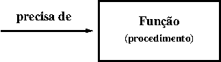
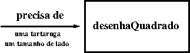
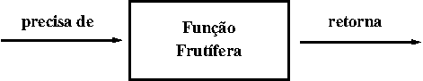
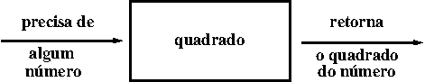

..  Copyright (C)  Brad Miller, David Ranum, Jeffrey Elkner, Peter Wentworth, Allen B. Downey, Chris
    Meyers, and Dario Mitchell.  Permission is granted to copy, distribute
    and/or modify this document under the terms of the GNU Free Documentation
    License, Version 1.3 or any later version published by the Free Software
    Foundation; with Invariant Sections being Forward, Prefaces, and
    Contributor List, no Front-Cover Texts, and no Back-Cover Texts.  A copy of
    the license is included in the section entitled "GNU Free Documentation
    License".
    
..  shortname:: IntroToFunctions
..  description:: Esta é uma introdução à idéia de definir e chamar uma função.

Funções
=========

.. index::
    single: função
    single: definição de função
    single: função; definição

Funções
---------
      
.. video:: function_intro
   :controls:
   :thumb: ../_static/function_intro.png

   http://media.interactivepython.org/thinkcsVideos/FunctionsIntro.mov
   http://media.interactivepython.org/thinkcsVideos/FunctionsIntro.webm

Em Python, uma **função** é uma sequência de comandos que executa
alguma tarefa e que tem um nome.
A sua principal finalidade é nos ajudar a organizar programas em
pedaços que correspondam a como imaginamos uma solução do problema.
 
A sintaxe de uma **definição de função** é:

::
    
    def NOME( PARÂMETROS ):
        COMANDOS

Você pode inventar qualquer nome para as funções que você cria, exceto
que você não pode usar um nome que é uma palavra reservada em Python,
e que os nomes devem seguir a regra de identificadores permitidos.
Os parâmetros especificam qual informação, se alguma, você deve
providenciar para que a função possa ser usada.
Outra forma de dizer isto é que os parâmetros especificam o que a
função necessita para executar a sua tarefa.

Pode existir qualquer número de comandos em uma função, mas eles tem
que ter a mesma tabulação a partir do ``def``. Nos exemplos neste livro,
usaremos a tabulação padrão de quatro espaços. Definição de função
é a segunda de vários **comandos compostos** que veremos, todos eles
tendo o mesmo padrão:

#. Uma linha de cabeçalho começando com uma palavra reservada e terminando com dois pontos.
#. Um **corpo** consistindo de um ou mais comandos, cada um deles
   com a mesma tabulação -- *4 espaços é o padrão em Python* -- em
   relação à linha de cabeçalho.

Já vimos o comando `for` que segue o mesmo padrão.
   
Na definição de uma função, a palavra reservada no cabeçalho é
``def``, que é seguida pelo nome da função e alguns *parâmetros* entre
parênteses. A lista de parâmetros pode ser vazia ou conter qualquer
número de parâmetros separados pos vírgulas. Em qualquer caso, os
parênteses são obrigatórios.

Precisamos falar um pouco mais sobre parâmetros. 
Na definição, a lista
de parâmetros é conhecida mais especificamente como os  **parâmetros
formais**. Esta lista de nomes descrevem o que a função precisará
receber do usuário da função. Quando você usa uma função, você fornece
valores aos parâmetros formais.

A figura abaixo mostra essa relação. A função precisa de certas
informações para poder executar a sua tarefa. Esses valores, frequentemente
chamados de **argumentos** ou **parâmetros reais**, são passados à
função pelo usuário.

Este tipo de diagrama é frequentemente chamado de **diagrama de caixa-preta** porque ele somente mostra os requisitos do ponto de vista do usuário. O usuário precisa saber o nome da função e quais argumentos precisam ser passados. Os detalhes de como a função funciona estão escondidos dentro da "caixa-preta".

Suponha que estamos trabalhando com tartarugas e uma operação comum que precisamos é desenhar quadrados. Faria sentido se nós não precisássemos duplicar todos os passos cada vez que precisarmos fazer um quadrado. "Desenhe um quadrado" pode ser pensado como uma *abstração* de um número de passos menores. Precisaremos passar duas informações para a função executar a sua tarefa: a tartaruga para fazer o desenho e o tamanho do lado do quadrado. Poderíamos representar isto usando o seguinte diagrama de caixa-preta.

Abaixo segue a função que captura essa ideia. Teste-a.

.. activecode:: ch04_1

    import turtle 

    def desenhaQuadrado(t, tam):
        """Faca a tartaruga t desenhar um quadrado de lado tam."""    
        
        for i in range(4):
            t.forward(tam)             
            t.left(90)
      
      
    wn = turtle.Screen()              # Inicializa a janela e seus atributos
    wn.bgcolor("lightgreen")

    alex = turtle.Turtle()            # cria alex
    desenhaQuadrado(alex, 50)         # Chama a função para desenhar um quadrado

    wn.exitonclick()

O nome desta função é ``desenhaQuadrado``. Ela tem dois
parâmetros --- um para dizer à função qual tartaruga mover e o outro
para dizer o tamanho do quadrado que desejamos desenhar. Na definição
da função eles são chamados ``t`` e ``tam`` respectivamente. Se
certifique que você sabe onde o corpo da função termina --- depende da
tabulação e as linhas em branco não valem para esta finalidade.

.. admonition::  docstrings 

    Se a primeira coisa depois do cabeçalho da função é um string
    (algumas ferramentas insistem em que isto precisa ser um string
    dentro de três aspas), ele é chamado de **docstring** e tem
    tratamento especial em Python e em algumas ferramentas de
    programação.

    Outra forma de recuperar esta informação é usar o interpretador
    interativo e digitar ``<nome_da_função>.__doc__``, que recuperará o
    docstring da função. Portanto, o string que você escreve como
    documentação no início da função é recuperável *online* pelas
    ferramentas do Python. Isto é diferente dos comentários no seu
    código, que são completamente eliminados quando o programa é
    analisado pelo interpretador.

    Por convenção, programadores em Python usam docstrings para
    documentar propriedades importantes de suas funções.    

Definindo uma nova função não a faz rodar. Para tanto, precisamos
fazer uma **chamada de função**. Isto é também conhecido como uma
**invocação de função**. Já vimos como chamar algumas funções
nativas como  **print**, **range** e **int**. Chamadas de
função contém o nome da função a ser executada seguida por uma lista
de valores, chamados *argumentos*, os quais são atribuídos aos
parâmetros da definição da função. Logo, na penúltima linha do
programa, chamamos a função e passamos ``alex`` como a tartaruga a ser
manipulada, e 50 como o tamanho do quadrado que queremos. 

.. The parameters being sent to the function, sometimes referred to as the **actual parameters** or **arguments**,
.. represent the specific data items that the function will use when it is executing.

Uma vez definida uma função, podemos chamá-la quantas vezes quisermos
e seus comandos serão executados cada vez que a chamamos. Neste caso,
poderíamos usá-la para que uma de nossas tartarugas desenhe um
quadrado e então podemos mover a tartaruga e fazê-la desenhar um
quadrado diferente num local diferente. Note que levantamos a cauda de
forma que quando ``alex`` se move não há rastro. Abaixamos a cauda
antes de desenhar o próximo quadrado.

.. activecode:: ch04_1a

    import turtle 

    def desenhaQuadrado(t, tam):
        """Faca a tartaruga t desenhar um quadrado de lado tam."""    
        
        for i in range(4):
            t.forward(tam)             
            t.left(90)
      
      
    wn = turtle.Screen()              # Inicializa a janela e seus atributos
    wn.bgcolor("lightgreen")

    alex = turtle.Turtle()            # cria alex
    desenhaQuadrado(alex, 50)         # Chama a função para desenhar um quadrado

    alex.penup()
    alex.goto(100,100)
    alex.pendown()

    desenhaQuadrado(alex,75)          # Desenha outro quadrado

    wn.exitonclick()

No próximo exemplo, mudamos um pouco a função ``desenhaQuadrado``
e fazemos que ``tess`` desenhe 15 quadrados com algumas variações. Uma
vez que a função esteja definida, a chamamos quantas vezes quisermos com
quais parâmetros quisermos.

.. activecode:: ch04_2

    import turtle 

    def desenhaQuadradoMulticolorido(t, tam):  
        """Faca a tartaruga t desenhar um quadrado multicolorido de lado tam."""
        for i in ['red','purple','hotpink','blue']:
            t.color(i)
            t.forward(tam)
            t.left(90)
      
    wn = turtle.Screen()              # Inicializa a janela e seus atributos
    wn.bgcolor("lightgreen")

    tess = turtle.Turtle()            # cria tess e seus atributos
    tess.pensize(3)

    tamanho = 20                      # tamanho do menor quadrado
    for i in range(15):
        desenhaQuadradoMulticolorido(tess, tamanho)
        tamanho = tamanho + 10       # aumenta o tamanho para a próxima vez
        tess.forward(10)             # move tess um pouco à frente
        tess.right(18)               # e dá uma virada nela

    wn.exitonclick()

.. admonition:: Rascunho

    .. actex:: scratch_1

**Teste seu entendimento**

.. mchoice:: test_question5_1_1
   :answer_a: Uma sequência de comando com um nome.
   :answer_b: Qualquer sequência de comandos.
   :answer_c: Uma expressão matemática que calcula um valor.
   :answer_d: Um comando da forma x = 5 + 4.
   :correct: a
   :feedback_a: Sim, uma função é uma sequência de comando com um nome.
   :feedback_b: Enquanto funções contém sequências de comandos, nem toda sequência de comandos é considerada uma função.
   :feedback_c: Enquanto algumas funções calculam valores, a ideia de uma função em Python é levemente diferente da ideia matemática de uma função na qual todas as funções calculam valores. Considere por exemplo as funções da tartaruga desta seção. Elas fazem a tartaruga desenhar uma forma específica, em vez de calcular um valor.
   :feedback_d: Este comando é chamado de comando de atribuição. Ele atribui o valor à direita (9) para o nome à esquerda (x).

   O que é uma função em Python?

.. mchoice:: test_question5_1_2
   :answer_a: Melhorar a velocidade de execução.
   :answer_b: Ajudar programadores a organizar programas em pedaços que correspondam a como eles pensam a solução do problema.
   :answer_c: Todos os programas em Python devem ser escritos usando funções.
   :answer_d: Para calcular valores.
   :correct: b
   :feedback_a: Funções tem muito pouco efeito em quão rápido o programa roda.
   :feedback_b: Enquanto funções não são obrigatórias, elas ajudam o programador a pensar melhor a solução pela organização dos pedaços em partes lógicas que podem ser reusados.
   :feedback_c: Nos primeiros capítulos, você viu muitos exemplos de programas em Python escritos sem o uso de funções.  Enquanto escrever e usar funções é desejado e essencial para um bom estilo de programação na medida em que os programas ficam maiores, elas não são obrigatórias.
   :feedback_d: Nem toda função calcula valores.

   Qual é uma das finalidades principais de uma função?

.. mchoice:: test_question5_1_3
   :answer_a: def desenhaCirculo(t):
   :answer_b: def desenhaCirculo:
   :answer_c: desenhaCirculo(t, tam):
   :answer_d: def desenhaCirculo(t, tam)
   :correct: a 
   :feedback_a: Uma função pode receber zero ou mais parâmetros. Não é necessário ter dois. No caso, o tamanho do círculo pode ser especificado no corpo da função.
   :feedback_b: Uma função precisa especificar seus parâmetros no cabeçalho.
   :feedback_c: Uma definição de função precisa incluir a palavra def.
   :feedback_d: Uma definição de função precisa terminar com dois pontos (:).

   Qual dos seguintes é um cabeçalho válido de uma função (a primeira linha da definição da função)?

.. mchoice:: test_question5_1_4
    :random:

    Qual é o nome da seguinte função?

    .. sourcecode:: python

        def desenhaQuadrado(t, tam):
            """Faca a tartaruga t desenhar um quadrado com lado tam."""
            for i in range(4):
                t.forward(tam)
                t.left(90)

    - def desenhaQuadrado(t, tam)

      - Esta linha é o cabeçalho completo da função (exceto pelos dois pontos) o que inclui o nome bem como vários outros componentes.

    - desenhaQuadrado
    
      + Sim, o nome da função é dado após a palavra reservada def e antes da lista de parâmetros.
    
    - desenhaQuadrado(t, tam)
    
      - Isto inclui o nome da função e seus parâmetros.
    
    - Faça a tartaruga t desenhar um quadrado com lado tam.

      - Isto é um comentário declarando o que a função faz.

.. mchoice:: test_question5_1_5

    Quais são os parâmetros da seguinte função?

    .. sourcecode:: python

        def desenhaQuadrado(t, tam):
            """Faca a tartaruga t desenhar um quadrado com lado tam."""
            for i in range(4):
	            t.forward(tam)
	            t.left(90)

    - i
    
      - i é uma variável usada internamente pela função, mas não é um parâmetro passado para a função.
    
    - t
    
      - t é somente um dos parâmetros para esta função.
    
    - t, tam
    
      + Sim, a função especifica dois parâmetros: t e tam.

    - t, tam, i

      - Os parâmetros incluem somente aquelas variáveis cujos valores a função espera receber como entrada. Eles são especificados no cabeçalho da função.

.. mchoice:: test_question5_1_6
    :multiple_answers:
    :random:

    Considerando a função abaixo, quais dos comandos seguintes chama a função corretamente (i.e., causa a execução da função)? Assuma que já definimos uma tartaruga de nome alex.

    .. sourcecode:: python 
    
        def desenhaQuadrado(t, tam):
            """Faca a tartaruga t desenhar um quadrado com lado tam."""
            for i in range(4):
                t.forward(tam)
	            t.left(90)

    - def desenhaQuadrado(t, tam)
    
      - Não, t e tam são os nomes dos parâmetros formais desta função. Quando a função é chamada, ela requer que valores reais seja passados à ela.
    
    - desenhaQuadrado
    
      - Uma chamada de função sempre requer parênteses depois do nome da função.
    
    - desenhaQuadrado(10)
    
      - Esta função tem dois parâmetros (recebe dois argumentos).
    
    - desenhaQuadrado(alex, 10):
    
      - Os dois pontos são somente requeridos na definição da função. Eles causarão um erro com a chamada da função.
    
    - desenhaQuadrado(alex, 10)
   
      + Uma vez que alex já foi definido previamente e 10 é um valor, passamos dois valores válidos para esta função.

.. mchoice:: test_question5_1_7

    Verdadeiro ou Falso: Uma função pode ser chamada várias vezes colocando-se uma chamada para a função no corpo de um laço.

    - Verdadeiro

      + Sim, você pode chamar uma função várias vezes colocando uma chamada em um laço.

    - Falso

      -  Uma das finalidades de uma função é permitir que você a chame mais do que uma vez. Colocando a chamada em um laço permite que ela seja executada várias vezes quando o corpo da função for executado várias vezes.

Funções que retornam valores
----------------------------

A maioria das funções requerem argumentos, valores que controlam como
a função faz seu serviço. Por exemplo, se você quer encontrar o valor
absoluto de um número, você tem que indicar qual é o valor do
número. Python tem um função nativa para computar o valor absoluto:

.. activecode:: ch04_4
    :nocanvas:

    print(abs(5))

    print(abs(-5))

Neste exemplo, os argumentos da função ``abs`` são 5 e -5.

Algumas funções são definidas com mais do que um argumento. Por
exemplo, o módulo matemático contém uma função chamada
``pow`` que usa dois argumentos, a base e o expoente.

.. Inside the function,
.. the values that are passed get assigned to variables called **parameters**.

.. activecode:: ch04_5
    :nocanvas:

    import math
    print(math.pow(2, 3))

    print(math.pow(7, 4))

.. note::

     Note que já vimos que elevar uma base a um expoente pode ser feito com o operador ** .

Outra função nativa que requer mais do que um argumento é a função ``max``.

.. activecode:: ch04_6
    :nocanvas:

    print(max(7, 11))
    print(max(4, 1, 17, 2, 12))
    print(max(3 * 11, 5**3, 512 - 9, 1024**0))

``max`` pode receber qualquer número de argumentos, separados por
vírgulas e retornará o maior valor recebido. Os argumentos podem ser ou
valores simples ou expressões. No último exemplo, 503 é retornado, uma
vez que ele é maior do que 33, 125 e 1. Note que ``max`` também
funciona com listas de valores.

Ademais, todas as funções como ``range``, ``int``, ``abs`` retornam
valores que podem ser usados para construir expressões mais complexas.

Logo, uma diferença importante entre estas funções e uma como
``desenhaQuadrado`` é que ``desenhaQuadrado`` não foi executada porque
queríamos que ela computasse um valor --- ao contrário, escrevemos
``desenhaQuadrado`` porque queríamos que ela executasse uma sequência
de passos que causassem à tartaruga desenhar um forma específica.

Funções que retornam valores são chamadas algumas vezes de **funções
frutíferas**. Em muitas outras linguagens, uma função que não retorna
um valor é chamado de **procedimento**. Mas ficaremos aqui com o jeito
do Python e também chamaremos isso de função, ou quando quisermos
enfatizar essa propriedade de não retornar valores,  chamaremos a
função de *não-frutífera*.

Funções frutíferas ainda permitem ao usuário fornecer informação
(argumentos). Entretanto, existe agora um dado adicional que é
retornado da função.

Como escrever funções futíferas? Vamos começar com uma função
matemática bem simples, a função ``quadrado``. A função quadrado terá
um número como parâmetro e retornará o resultado desse número ao
quadrado. Segue abaixo um diagrama do código Python seguinte.

.. activecode:: ch04_quadrado

    def quadrado(x):
        y = x * x
        return y

    aQuadrar = 10
    resultado = quadrado(aQuadrar)
    print("O resultado de", aQuadrar, "ao quadrado e'", resultado)

O comando **return** é seguido de uma expressão que é calculada. Seu
valor é retornado a quem chama a função como o *fruto* da chamada da
função. Como o comando return pode conter qualquer expressão,
podemos evitar de criar a **variável temporária** ``y`` e
simplesmente usar ``return x*x``.
Tente modificar a função quadrado acima para ver se funciona
da mesma forma. Por outro lado, usando **variáveis temporárias** como ``y``, o
programa acima permite que se encontrem erros mais facilmente. Estas
variáveis temporárias são chamadas de **variáveis locais**.

.. The line `toInvest = float(input("How much do you want to invest?"))`
..  also shows yet another example
..  of *composition* --- we can call a function like `float`, and its arguments
 .. can be the results of other function calls (like `input`) that we've called along the way.

Observe algo importante aqui. O nome da variável que passamos como um
argumento --- ``aQuadrar`` --- não tem nada a ver com o nome do
parâmetro formal --- ``x``. É como se ``x = aQuadrar`` fosse executado
quando ``quadrado`` é chamado.
Não interessa qual o nome da variável que armazenou o valor com o qual a função é chamada. Em
``quadrado``, o  nome da viarável é ``x``. Você pode ver isto
claramente no codelens, onde as variáveis globais e variáveis locais
para a função quadrado aparecem em lugares separados.

Na medida em que você simula passo-a-passo o exemplo no codelens, note
que o comando **return** não apenas causa a função retornar o valor,
mas também retorna o fluxo de execução de volta ao local do programa
onde a função foi chamada.

.. codelens:: ch04_clquadrado
    :showoutput:

    def quadrado(x):
        y = x * x
        return y

    aQuadrar = 10
    resultado = quadrado(aQuadrar)
    print(resultado)

Outra coisa importante para observar quando você simula os passos no
codelens, é o destaque dos números das linhas. O codelens coloca uma
flecha apontando para o número da linha que está sendo
executada. Quando você começa o codelens você pode notar a flecha que
aponta para a linha 1. A próxima linha a ser apontada é a linha 5. Por
que isto? 
Porque a definição de uma função não é o mesmo que a execução da
função. Linhas 2 e 3 não serão apontadas até que a função seja
chamada na linha 6.

Nomes curtos de variáveis são mais econômicos e às vezes facilita a
leitura do código:
E = mc\ :sup:`2` não seria tão memorável se Einstein tivesse usado
nomes de variáveis mais compridos! Se você prefere nomes curtos, se
certifique de colocar alguns comentários para esclarecer o leitor
sobre o papel de cada variável.

Todas as funções em Python retornam ``None``, a menos que
explicitamente exista um comando return com um valor diferente de ``None``.
Considere o seguinte erro comum feito por programadores iniciantes.
Na medida que você faz o passo-a-passo, preste bem atenção no que é
impresso quando a função retorna.

.. codelens:: ch04_clquadrado_ruim
    :showoutput:

    def quadrado(x):
        y = x * x
        print(y)   # Ruim! deveria usar return!

    aQuadrar = 10
    resultado = quadrado(aQuadrar)
    print(resultado)

.. index::
    single: variável local
    single: local; variável
    single: duração

.. admonition:: Rascunho

    .. actex:: scratch_2

**Teste seu entendimento**

.. mchoice:: test_question5_2_1
    :random:

    O que está errado com a seguinte definição de função:

    .. sourcecode:: python

        def somaEm(x, y, z):
            return x+y+z
            print('a resposta é', x+y+z)

    - Você nunca deve usar o comando print em uma definição de função.

      - Embora você não deva confundir print com return, você pode incluir comandos print dentro de suas funções.

    - Você não deveria ter nenhum comando na função depois do comando return. Uma vez que o comando return é atingido, a execução da função para imediatamente.

      + Este é um erro muito comum. Portanto, preste atenção sobre isso quando você escreve o seu programa. 

    - Você precisa calcular o valor de x+y+z antes de retorná-lo.

      - O Python calculará automaticamente o valor de x+y+z e então retornará esse valor como está escrito.

    - Uma função não pode retornar um número.

      - Funções podem retornar qualquer dado válido, incluindo (mas não limitado a) números, strings, tartarugas, etc.

.. mchoice:: test_question5_2_2

    O que a seguinte função retorna?
   
    .. sourcecode:: python

        def somaEm(x, y, z):
            print(x+y+z)

    - Nada (nenhum valor)

      + Acidentalmente usamos print onde deveríamos ter usado return.  Este erro é MUITO COMUM, portanto cuidado! Ele também é particularmente difícil de achar porque quando você roda a função a saída parece a mesma. Somente quando você tenta atribuir seu valor a uma variável é que você nota a diferença.
    
    - O valor de x+y+z

      - Cuidado! Este é um erro muito comum. A função imprime o valor de x+y+z mas não o retorna. Para retornar o valor você PRECISA usar o comando return.

    - O string 'x+y+z'

      - x+y+z calcula o número (assumindo que x, y e z são números) que representa a soma dos valores  x, y e z.
   

Variáveis e parâmetros são locais
---------------------------------

Um comando de atribuição em uma função cria uma **variável local**
para a variável à esquerda do =. Esta variável existe somente dentro
da função e não pode ser usada fora dela. Por exemplo, considere
novamente a função ``quadrado``:

.. codelens:: local_ruim

    def quadrado(x):
        y = x * x
        return y

    z = quadrado(10)
    print(z)

Quando você pressionar o botão 'last >>', você verá uma mensagem de
erro. Quando tentamos usar ``y`` na linha 6 (fora da função), Python
procura uma variável global chamada ``y`` mas não a encontra. Isto
resulta no erro: ``NameError: name 'y' is not defined.``

A variável ``y`` existe somente enquanto a função está sendo executada
--- chamamos isso de sua **duração**.
Quando a execução da função termina (retorna), as variáveis locais são
destruídas. Codelens ajuda você a visualisar isto porque as variáveis
locais desaparecem depois que a função retorna.

Parâmetros formais são também locais e funcionam como variáveis
locais. Por exemplo, a duração de ``x`` se inicia quando ``quadrado`` é
chamado e termina quando a função completa sua execução.

Logo, não é possível para uma função atribuir para alguma variável
local algum valor, completar sua execução, e então quando ela é
chamada outra vez, recuperar o valor da variável local. Cada chamada
da função cria novas variáveis locais e sua duração termina quando a
função retorna para quem a chamou.

Reciprocamente, a função pode acessar uma variável global. Mas isto é
considerado **péssima programação** por quase todos os
programadores. Veja a seguinte variação sem sentido da função quadrado.

.. activecode:: quadradoruim_1

    def quadradoruim(x):
        y = x ** expoente
        return y

    expoente = 2
    resultado = quadradoruim(10)
    print(resultado)

Embora a função ``quadradoruim`` funcione, ela está escrita de forma
estúpida e pobre. Mas ela ilustra uma regra importante sobre como
variáveis são procuradas em Python.
Primeiro, Python procura para variáveis que são definidas localmente
na função. Chamamos isso de **escopo local**. Se o nome da variável
não é encontrado no escopo local, então Python procura nas variáveis
globais, ou **escopo global**. Isto é exatamente o caso ilustrado no
código acima. ``expoente`` não é encontrada localmente em
``quadradoruim`` mas ela existe globalmente.
A forma apropriada de escrever esta função seria passar expoente como
parâmetro.
Para praticar, você deveria reescrever quadradoruim para ter um
segundo parâmetro chamado expoente.

Atribuições locais nas funções não podem mudar variáveis definidas
fora da função. Considere o seguinte exemplo em codelens:

.. codelens::  cl_expoentede_ruim
    :showoutput:

    def potencia(x,p):
        expoente = p   # Outro erro burro
        y = x ** expoente
        return y

    expoente = 3
    resultado = potencia(10,2)
    print(resultado)

Agora percorra o código passo-a-passo. O que você nota dos valores de
``expoente`` no escopo local comparado ao escopo global?

O valor de ``expoente`` no escopo local ficou diferente do valor do
escopo global.
Isto é porque no exemplo ``expoente`` foi usado do lado esquerdo da
atribuição ``expoente = p``. Quando o nome de uma variável aparece do
lado esquerdo de um atribuição, Python cria uma variável local.
Quando uma variável local tem o mesmo nome de uma variável global,
dizemos que a variável local esconde a global. Isso quer dizer que a
variável global não pode ser acessada porque a variável local é
encontrada primeiro. Esta é outra boa razão para não usar variáveis
globais. Como você pode ver, torna o seu código confuso e difícil de
entender. 

Para consolidar todas estas ideias, vamos olhar em um exemplo
final. Dentro da função ``quadrado`` vamos fazer uma atribuição para o
parâmetro ``x``. Não há nenhum bom motivo para fazer isto se não para
enfatizar o fato de que o parâmetro ``x`` é uma variável local. Se
você simular passo-a-passo no codelens o exemplo, você verá que embora 
``x`` é 0 como variável local em ``quadrado``, x permanece 2 no escopo
global.
Isto é confuso para muitos iniciantes que pensam que uma atribuição
para um parâmetro formal causará uma mudança ao valor da variável que
foi usada como parâmetro real; especialmente quando as duas
compartilham o mesmo nome.
Mas este exemplo demonstra claramente que não é assim que Python
funciona.

.. codelens:: cl_muda_parm
    :showoutput:

    def quadrado(x):
        y = x * x
        x = 0       # atribui um novo valor ao parâmetro x
        return y

    x = 2
    z = quadrado(x)
    print(z)

.. admonition:: Rascunho

    .. actex:: scratch_3

**Teste seu entendimento**

.. mchoice:: test_question5_3_1
   :answer_a: Seu valor.
   :answer_b: O trecho de código onde a variável tem um certo valor.
   :answer_c: Seu nome.
   :correct: b
   :feedback_a: Valor é o conteúdo da variável.  Escopo diz respeito a onde a variável é &quot;conhecida&quot;.  
   :feedback_b: 
   :feedback_c: O nome de uma variável é apenas um identificador ou apelido.  Escopo diz respeito a onde a variável é &quot;conhecida&quot;.

   Qual é o escopo de uma variável?

.. mchoice:: test_question5_3_2
   :answer_a: Uma variável temporária que é usada apenas dentro de uma função.
   :answer_b: O mesmo que parâmetro.
   :answer_c: Outro nome para qualquer variável.
   :correct: a
   :feedback_a: Sim, uma variável local é uma variável temporária que é somente conhecida na função e definida nela.
   :feedback_b: Enquanto parâmetros podem ser considerados variáveis locais, funções podem também definir e usar variáveis locais adicionais.
   :feedback_c: Variáveis que são usadas fora de uma função não são locais, mas variáveis globais.

   O que é uma variável local?

.. mchoice:: test_question5_3_3
   :answer_a: Sim, e não há motivo para não o fazer.
   :answer_b: Sim, mas é considerado ruim.
   :answer_c: Não, isso causará um erro.
   :correct: b
   :feedback_a: Enquanto não há problema nenhum em Python, é geralmente considerado um mau estilo pelo potencial do programa ficar confuso.
   :feedback_b: Isto é geralmente considerado mau estilo pelo potencial do programa ficar confuso. Se você precisa usar variáveis globais (também considerado ruim), se certifique de que elas têm nomes únicos.
   :feedback_c: Python gerencia escopo de variáveis globais e locais separadamente e tem regras claras para como tratar variáveis com o mesmo nome em escopos diferentes, de forma que isso não causará erro em Python.

   Você pode usar o mesmo nome para uma variável local e para uma variável global?

O Padrão de Acumulação
----------------------

.. video:: function_accumulator_pattern
   :controls:
   :thumb: ../_static/accumulatorpattern.png

   http://media.interactivepython.org/thinkcsVideos/accumulatorpattern.mov
   http://media.interactivepython.org/thinkcsVideos/accumulatorpattern.webm

No exemplo anterior, escrevemos uma função que calcula o quadrado de um número. 
O algoritmo que usamos na função era simples: multiplique o número por ele mesmo.
Nesta seção iremos reescrever a função quadrado e usar um algoritmo diferente,
um que se baseia na adição em vez da multiplicação.

Se você quer multiplicar dois números, o enfoque mais básico é pensar disso
como um processo de somar um número a ele mesmo. O número de repetições é onde
o segundo número aparece. Por exemplo, se queremos multiplicar três por cinco, podemos
pensar nisso como somando três a ele mesmo cinco vezes. Três mais três é seis, 
mais três é nove, mais três é doze e, finalmente, mais três é quinze.
Generalizando, se queremos implementar a ideia do quadrado de um número, chamando-o de `n`, 
nós somaríamos `n` a ele mesmo `n` vezes.

Faça isto na mão e tente isolar exatamente os passos que você faz. 
Você descobrirá que você precisa manter alguma "soma parcial" da soma
até o momento, ou em algum pedaço de papel, ou em sua
cabeça. Lembrando coisas de um passo ao passo seguinte é precisamente o motivo
pelo qual temos variáveis no programa. Isto quer dizer que precisaremos de
alguma variável para lembrar da "soma parcial". Ela deve ser
inicializada com o valor zero. Então, precisamos **atualizar** a
"soma parcial" um número correto de vezes. Para cada repetição,
queremos atualizar o total somando o número à soma.

Em palavras, poderíamos dizer o seguinte. Para quadrar o valor de `n`,
repetimos o processo de atualizar a soma parcial `n` vezes. Para
atualizar o total, tomamos o valor antigo de "soma parcial" e somamos
`n`. A soma se torna o novo valor de "soma parcial".

Aqui está o programa em activecode. Note que a definição da função é a
mesma que era antes. Tudo que mudou são os detalhes de como o quadrado
é feito.
Este é um grande exemplo de projeto "caixa preta".
Podemos mudar os detalhes dentro da caixa e ainda assim usar a função
exatamente como a usávamos antes.

.. activecode:: sq_accum1

    def quadrado(x):
        somaparcial = 0
        for cont in range(x):
            somaparcial = somaparcial + x

        return somaparcial

    aQuadrar = 10
    resultado = quadrado(aQuadrar)
    print("O resultado de", aQuadrar, "ao quadrado e'", resultado)

.. note::

    O que acontece se colocarmos a atribuição ``somaparcial = 0``
    dentro do comando for? Tem dúvidas? Teste e descubra.

No programa acima, note que o variável ``somaparcial`` começa com o
valor 0. Em seguida, a iteração é feita ``x`` vezes. Dentro do laço do
for, a atualização ocorre. ``somaparcial`` é atualizada com um novo
valor que é o valor antigo mais o valor de ``x``.

Este padrão de iteração da atualização da variável é chamada comumente
como **padrão de acumulação**. Nos referimos à variável como o
**acumulador**. Este padrão aparece repetidas vezes. Lembre que a
chave para fazer isto funcionar com sucesso é se certificar que a
variável é inicializada antes de você começar as iterações.
Uma vez dentro da iteração, é requerido que você atualize o acumulador.

Aqui vai um exemplo do mesmo problema em codelens.
Faça o passo-a-passo do programa e veja como a "somaparcial" acumula o resultado.

.. codelens:: sq_accum3
    :showoutput:

    def quadrado(x):
        somaparcial = 0
        for cont in range(x):
            somaparcial = somaparcial + x

        return somaparcial

    aQuadrar = 10
    resultado = quadrado(aQuadrar)
    print(resultado)

.. index::
    decomposição funcional
    generalização
    abstração

.. admonition:: Rascunho

    .. actex:: scratch_4

**Teste seu entendimento**

.. mchoice:: test_question5_4_1
    :random:

    Considere o seguinte código:
    
    .. sourcecode:: python

        def quadrado(x):
            somaparcial = 0
            for cont in range(x):
                somaparcial = somaparcial + x
            return somaparcial

    O que acontece se você coloca a inicialização de somaparcial (a linha somaparcial = 0) dentro do laço for como o primeiro comando do laço?

    - A função quadrado irá retornar x em vez de x*x.
    
      + A variável somaparcial será reinicializada com 0 cada vez que houver um iteração do laço. Entretanto, como esta atribuição é o primeiro comando, o próximo comando no laço colocará seu valor de volta para x. Quando o laço termina ele terá o valor de x, que é retornado.
    
    - A função quadrado causará um erro.
    
      - Atribuições são perfeitamente válidas dentro de laços e não causará um erro.
    
    - A função quadrado funcionará como esperado devolvendo x*x.
    
      - Colocando a atribuição que atribui zero à somaparcial dentro do laço, a atribuição é executada cada vez que o laço é iterado, em vez de uma vez antes que o laço comece. O resultado é que a somaparcial é zerada (reinicializada com 0) cada vez que o laço é iterado.
    
    - A função quadrado retornará 0 em vez de x*x.
    
      - A linha somaparcial = 0 é a primeira linha do laço for, mas imediatamente depois dessa linha, a linha somaparcial = somaparcial + x é executada, dando à somaparcial um valor diferente de zero (assumindo que x é diferente de zero).

Funções podem chamar outras funções
-----------------------------------

É importante entender que cada uma das funções que a gente escreve
pode ser usada e chamada pelas outras funções que a gente
escreve. Esta é uma das mais importantes formas que permitem que
cientistas da computação peguem um problema grande e o quebrem em um
grupo de problemas menores.   Este processo de quebrar um problema em
subproblemas menores é chamado de **decomposição funcional**.

Aqui vai um exemplo simples de decomposição funcional usando duas
funções. A primeira, chamada ``quadrado`` simplesmente computa o
quadrado de um dado número. A segunda, chamada de
``soma_de_quadrados``  usa a função quadrado para determinar a soma do
quadrado de três números.

.. codelens:: somadequadrados
    :showoutput:

    def quadrado(x):
        y = x * x
        return y

    def soma_de_quadrados(x,y,z):
        a = quadrado(x)
        b = quadrado(y)
        c = quadrado(z)

        return a+b+c

    a = -5
    b = 2
    c = 10
    resultado = soma_de_quadrados(a,b,c)
    print(resultado)

Embora esta seja uma ideia muito simples, na prática este exemplo
ilustra muitos conceitos importantes em Python, incluindo variáveis
locais e globais junto com passagem de parâmetros. Note que quando
você faz o passo-a-passo no exemplo, codelens aponta para a
linha 1 e depois linha 5, onde as funções foram definidas.
O corpo da função quadrado não é executado até que ela seja chamada da
função ``soma_de_quadrados`` pela primeira vez na linha 6. Também
observe que quando ``quadrado`` é chamada existem dois grupo de
variáveis locais, uma para ``quadrado`` e outra para
``soma_de_quadrados``. Quando você avança no passo-a-passo, você
notará que ``x`` e ``y`` são variáveis locais em ambas as funções e
podem mesmo ter valores diferentes. Isso ilustra que mesmo tendo o
mesmo nome, elas são completamente diferentes.

Vamos olhar em um outro exemplo que usa duas funções e ilustra outra
técnica importante de resolução de problemas chamada
**generalização**. Vamos assumir que queremos escrever uma função para
desenhar um quadrado. O passo de generalização é perceber que o
quadrado é apenas um tipo especial de retângulo.

Para desenhar um retângulo precisamos ser capazes de chamar a função
com argumentos diferentes para largura e altura. Diferente do caso do
quadrado, não podemos repetir a mesma coisa 4 vezes, porque os quatro
lados não são iguais.
Entretanto, é o caso que desenhar os lados de baixo e direito é a
mesma sequência para desenhar os lados de cima e esquerdo. Logo,
podemos chegar no seguinte código bacana para desenhar um retângulo.

.. sourcecode:: python

    def desenhaRetangulo(t, w, h):
        """Faca a tartaruga t desenhar um retangulo de largura w e altura h."""
        for i in range(2):
            t.forward(w)
            t.left(90)
            t.forward(h)
            t.left(90)
            
Os nomes dos parâmetros foram escolhidos deliberadamente com uma única
letra para assegurar que eles não são confundidos. Em programas
reais, uma vez que você tenha mais experiência, insistiremos em nomes
de variáveis melhores do que este.
O ponto é que o programa não "entende" que você está desenhando um
retângulo ou que os parâmetros representam a largura e a
altura. Conceitos como retângulo, largura e altura são significados
que os humanos têm, não conceitos que o programa ou o computador
entendem. 

*Como pensar como um cientista da computação* envolve procurar por
padrões e relações. No código acima, fizemos isso até certo ponto. Não
apenas desenhamos quatro lados. Em vez disso, percebemos que
podíamos desenhar um retângulo como duas metades e usamos um laço
para repetir duas vezes o padrão.

Mas agora podemos perceber que um quadrado é um caso especial de um
retângulo. Um quadrado simplesmente usa o mesmo valor para a largura e
altura. Já temos uma função para desenhar um retângulo, logo a podemos
usar para desenhar nosso quadrado.

.. sourcecode:: python

    def desenhaQuadrado(tx, tam):        # uma nova versao de desenhaQuadrado
        desenhaRetangulo(tx, tam, tam)

Here is the entire example with the necessary set up code.

.. activecode:: ch04_3

    import turtle

    def desenhaRetangulo(t, w, h):
        """Faca a tartaruga t desenhar um retangulo de largura w e altura h."""
        for i in range(2):
            t.forward(w)
            t.left(90)
            t.forward(h)
            t.left(90)
 
    def desenhaQuadrado(tx, tam):        # uma nova versao de desenhaQuadrado
        desenhaRetangulo(tx, tam, tam)

    wn = turtle.Screen()             # Inicializa a janela
    wn.bgcolor("lightgreen")

    tess = turtle.Turtle()           # cria tess

    desenhaQuadrado(tess, 50)

    wn.exitonclick()

Alguns pontos que valem a pena ser notados:

* Funções podem chamar outras funções.
* Reescrever `desenhaQuadrado` como fizemos captura a relação que foi percebida.
* A função pode ser chamada como `desenhaQuadrado(tess, 50)`. Aos
  parâmetros da função, ``tx`` e ``tam``, são atribuídos os valores do
  objeto tess e o int 50 respectivamente.
* No corpo da função os parâmetros são apenas como qualquer outra variável. 
* Quando a chamada para `desenhaRecangulo` é feita, os valores nas
  variáveis `tx` e `tam` são atribuídos primeiro, e depois a chamada
  ocorre. Logo, quando entramos no início da função
  `desenhaRetangulo`, sua variável `t` recebe o objeto tess, `w` e
  `h` naquela função recebem ambos o valor 50.

Até agora, pode não estar claro porque vale a pena se dar ao trabalho
de criar todas essas funções novas. Na verdade, existe um monte de
motivos, mas este exemplo mostra dois:

#. Criar uma função dá a você uma oportunidade de dar nome a um grupo
   de comandos. Funções podem simplificar um programa escondendo uma
   computação complexa atrás de um único comando. A função, incluindo
   seu nome, pode capturar a decomposição, ou *abstração*, do problema
   que você tem em mente.
#. Criar uma nova função pode tornar o programa menor porque código
   repetitivo é eliminado.
#. Algumas vezes você pode escrever funções que permitem resolver um
   problema específico usando uma solução mais geral.

.. admonition:: Lab

    * `Como Desenhar uma Circunferência <../Labs/lab04_01.html>`_ Neste exercício
      de laboratório trabalhamos no problema de desenhar uma
      circunferência com a tartaruga.

.. index:: fluxo de execução

.. admonition:: Rascunho

    .. actex:: scratch_5

Sumário do fluxo de execução
----------------------------

Quando você está trabalhando com funções é realmente importante saber
a ordem em que os comandos são executados. Isto é chamado de o **fluxo de
execução** e já falamos disso um certo número de vezes neste capítulo.

Execução sempre começa no primeiro comando do programa. Comandos são
executados um de cada vez, em ordem, de cima para baixo.
Definições de funções não alteram o fluxo de execução do programa, mas
lembre-se de que os comandos dentro da função não são executados a
menos que a função seja chamada.

.. Although it is not common, you can define one function
.. inside another. In this case, the inner definition isn't executed until the
.. outer function is called.

Chamadas de funções são como desvios do fluxo de execução. Em vez de
ir para o próximo comando, o fluxo pula para a primeira linha da
função chamada, executa todos os comandos de lá, e então volta para
continuar de onde tinha parado.

Isso soa bastante simples, até você lembrar que uma função pode chamar
outra função. Enquanto no meio de uma função, o programa pode ter que
executar os comandos de uma segunda função. Mas enquanto executando a
segunda função, o programa pode ter que executar ainda uma terceira
função!

Felizmente, Python mantem controle de onde ele está em cada função, e
cada vez uma função termina, o programa volta para onde tinha parado
quando a função foi chamada. Quando o fim do programa é atingido, ele
termina.

Qual a moral deste conto sórdido? Quando você lê um programa, não o
leia de cima a baixo. Em vez disso, siga o fluxo de execução. Sob
risco de soar repetitivo, isto quer dizer que você lerá as
declaraçãoes def enquanto percorre o código de cima para baixo, mas
você deve pular o corpo da função até encontrar o ponto onde a função
é chamada.

.. index::
    single: parâmetro
    single: função; parâmetro de
    single: argumento
    single: funçao; argumento de
    single: declaração import
    single: import; declaração
    single: composição
    single: função; composição de
    

.. index:: bar chart

.. admonition:: Rascunho

    .. actex:: scratch_6

**Teste seu entendimento**

.. mchoice:: test_question5_6_1
    :random:

    Considere o seguinte código em Python. Observe que os números das linhas estão incluídos à esquerda.

    .. sourcecode:: python
        
        1      def pot(b, p):
        2          y = b ** p
        3          return y
        4
        5      def quadrado(x):
        6          a = pot(x, 2)
        7          return a
        8	
        9      n = 5
        10     resultado = quadrado(n)
        11     print(resultado)

    Quais dos seguintes melhor reflete a ordem em que as linhas de código são processadas em Python? 

    - 1, 2, 3, 4, 5, 6, 7, 8, 9, 10, 11

      - Embora o Python tipicamente processe as linhas de cima para baixo, as definições de funções e chamadas são exceções à essa regra.

    - 1, 2, 3, 5, 6, 7, 9, 10, 11

      - Embora o Python tipicamente processe as linhas de cima para baixo, as definições de funções e chamadas são exceções à essa regra. Embora essa ordem pule linhas em branco, continua uma lista ordenada das linhas.

    - 9, 10, 11, 1, 2, 3, 5, 6, 7

      - Esta está quase certa, no sentido de que o Python não executará as funções até elas serem chamadas, mas existem dois problemas aqui. Primeiro, o Python não sabe em quais linhas estão as definições de funções até que elas sejam processadas, de forma que ele precisa pelo menos processar o cabeçalho da função antes de pular as funções. Segundo, observe que a linha 10 contém uma chamada de função. O Python precisa executar a função quadrado antes de ir para a linha 11.

    - 9, 10, 5, 6, 7, 1, 2, 3, 11

      - Esta está quase certa, no sentido de que o Python não executará as funções até elas serem chamadas, mas existe um problema aqui. O Python não sabe em quais linhas estão as definições de funções até que elas sejam processadas, de forma que ele precisa pelo menos processar o cabeçalho da função antes de pular as funções.

    - 1, 5, 9, 10, 6, 2, 3, 7, 11
      
      + Python começa na linha 1, percebe que é uma definição de função e pula todas as linhas da definição da função até ele encontrar uma linha que não está incluída na função (linha 5). Ele então percebe que a linha 5 também é uma definição de função e pula novamente o corpo da função até a linha 9. Na linha 10 ele percebe que tem que executar uma função, logo ele volta e executa o corpo da função. Observe que aquela função inclui outra chamada de função. Finalmente, ele voltará para a linha 11 depois da função quadrado terminar.
  

.. mchoice:: test_question5_6_2
   :answer_a: 25
   :answer_b: 5
   :answer_c: 125
   :answer_d: 32
   :correct: a
   :feedback_a: A função quadrado retorna o quadrado de sua entrada (através de uma chamada à pot).
   :feedback_b: O que é impresso é a saída da função quadrado.  5 é a entrada da função quadrado.
   :feedback_c: Observe que pot é chamada dentro da função quadrado com a base (b) de 5 e a potência (p) de dois.
   :feedback_d: Observe que pot é chamada dentro da função quadrado com a base (b) de 5 e a potência (p) de dois.

   Considere o seguinte código em Python. Observe que os números das linhas estão incluídos à esquerda.
   <pre>
   1	def pot(b, p):
   2	    y = b ** p
   3	    return y
   4	
   5	def quadrado(x):
   6	    a = pot(x, 2)
   7	    return a
   8	
   9	n = 5
   10   resultado = quadrado(n)
   11   print(resultado)
   </pre>
   O que esse programa imprime?

Um Diagrama de Barras de uma Tartaruga
--------------------------------------

Lembre-se da nossa discussão de módulos que eles eram um certo número
de coisas que tartarugas podem fazer.
Aqui vão mais uns dois truques (lembre-se que eles estão todos
descritos na documentação do módulo).

* Podemos fazer uma tartaruga mostrar texto no canvas na posição
  atual da tartaruga. O método é chamado `write`.
  Por exemplo, ``alex.write("Alo")``  escreveria o string `Alo` na
  posição atual.
* Podemos preencher um perfil (circunferência, semi-circunferência, triângulo, etc)
  com uma cor. É um processo de dois passos. Primeiro você chama o
  método `begin_fill`, por exemplo ``alex.begin_fill()``. Então você
  desenha o perfil. Finalmente, você chama `end_fill` (``alex.end_fill()``).
* Previamente nós atribuímos a cor da nossa tartaruga - podemos também
  agora atribuir sua cor de preenchimento, que não precisa ser a mesma
  da tartaruga nem da caneta. Para fazer isso, usamos o método chamado `fillcolor`, 
  por exemplo, ``alex.fillcolor("red")``.   

Bom, então podemos fazer tess desenhar um diagrama de barras? Vamos
começar com alguns dados,

``xs = [48, 117, 200, 240, 160, 260, 220]``

Correspondendo a cada medida, vamos desenhar um retângulo simples
daquela altura, com uma largura fixa.
Aqui é o que queremos criar.

.. image:: Figures/tess_bar_1.png

Podemos rapidamente ver que desenhando uma barra será similar a
desenhar um retângulo ou um quadrado. Uma vez que precisamos fazer
isso um certo número de vezes, faz sentido criar uma função,
``desenhaBarra``, que necessitará da tartaruga e altura da
barra. Assumiremos que a largura da barra será de 40 unidades. Uma vez
escrita a função, podemos usá-la em um laço simples para processar a lista
dos valores dados.

.. sourcecode:: python

    def desenhaBarra(t, altura):
        """Faca a tartaruga t desenhar uma barra, de altura `altura`."""
        t.left(90)               # Apontar
        t.forward(altura)        # Desenha o lado esquerdo
        t.right(90)
        t.forward(40)            # largura da barra no topo
        t.right(90)
        t.forward(altura)        # e abaixo novamente!
        t.left(90)               # coloca a tartaruga na posição que a encontramos
        
    ...    
    for v in xs:                 # assuma que xs e tess estão prontas
        desenhaBarra(tess, v)    

É um bom começo! O que é importante aqui é a decomposição que temos em
mente. Para resolver o problema, primeiro o quebramos em pedaços
menores. Em particular, nosso pedaço é desenhar um barra. Nós, então,
implementamos esse pedaço com uma função. Depois, para todo o
diagrama, chamamos repetidamente nossa função.

Em seguinda, acima de cada barra, imprimimos o valor do dado.
Faremos isso no corpo do ``desenhaBarra``, adicionando ``t.write('  ' + str(altura))`` 
como a terceira linha do corpo.
Colocamos um pequeno espaço em frente do número, e transformamos o
número em string. Sem esse expaço extra o texto poderia ficar grudado com a
barra à esquerda.
Finalmente, adicionamos os dois método necessários para preencher cada
barra.

Um problema restante está relacionado com o fato de que nossa
tartaruga vive em um mundo onde o centro é a posição (0,0). Neste
problema, ajudaria se (0,0) fosse no canto inferior esquerdo. Para
resolver isso, podemos usar nosso método ``setworldcoordinates`` para
redimensionar a janela. Enquanto isso, devemos fazer os dados caberem
na janela. A barra mais alta corresponde ao maior valor dos dados. a
largura da janela necessitará ser proporcional ao número de barras (o
número dos valores dados) onde cada um tem a largura de 40. Usando
essa informação, podemos computar o sistema de coordenadas que fazem
sentido para o conjunto de dados. Para melhorar a aparência do diagrama,
adicionamos um pouco de espaço embaixo e à esquerda como uma moldura.

Aqui vai o programa completo. Teste-o e então mude os dados para ver
que ele se adapta aos novos valores.

.. activecode:: ch05_barchart

	import turtle

	def desenhaBarra(t, altura):
	    """Faca a tartaruga t desenhar uma barra, de altura `altura`."""
	    t.begin_fill()               # comece preenchendo o perfil
	    t.left(90)
	    t.forward(altura)
	    t.write('  '+ str(altura))
	    t.right(90)
	    t.forward(40)
	    t.right(90)
	    t.forward(altura)
	    t.left(90)
	    t.end_fill()                 # pare de preencher o perfil

	xs = [48,117,200,240,160,260,220]  # aqui vão os dados
	alturamax = max(xs)
	numbarras = len(xs)
	moldura = 10

	tess = turtle.Turtle()           # cria tess e inicializa alguns de seus atributos
	tess.color("blue")
	tess.fillcolor("red")
	tess.pensize(3)

	wn = turtle.Screen()             # Inicializa a janela e seus atributos
	wn.bgcolor("lightgreen")
	wn.setworldcoordinates(0-moldura,0-moldura,40*numbarras+moldura,alturamax+moldura)

	for a in xs:
	    desenhaBarra(tess, a)

	wn.exitonclick()

.. admonition:: Rascunho

    .. actex:: scratch_7

Glossário
---------

.. glossary::

    argumento
        Um valor fornecido para uma função quando a função é
	chamada. Este valor é atribuído ao parâmetro correspondente na
	função. O argumento pode ser o resultado de uma expressão que
	pode envolver operadores, operandos e chamadas a outras funções
	frutíferas.

    chamada de função
        Um comando que executa uma função. Ele consiste do nome da
	função seguido por uma lista de argumentos entre parentêses.

    comando composto
        Um comando que consiste de duas partes:

        #. cabeçalho - que começa com uma plavra reservada
	   determinando o tipo do comando e que termina com dois
	   pontos (:).
        #. corpo - contendo um ou mais comando tabulados igualmente a
	   partir do cabeçalho.

        A sintaxe de um comando composto se assemelha com:

        ::
        
            palavra-reservada expressão:
                comando
                comando ...

    composição de funções
        Usando a saída de uma função como entrada de outra função.

    corpo
        A segunda parte de um comando composto. O corpo consiste de
	uma sequência de comandos todos igualmente tabulados a partir
	do começo do cabeçalho. A quantidade padrão de tabulação usada
	pela comunidade do Python é 4 espaços.

    declaração import
        uma declaração que permite funções e variáveis definidas em
	outro módulo de Python serem trazidas ao ambiente de outro
	script. Para usar as construções da tartaruga, precisamos
	primeiro importar o módulo turtle.

    definição de função
        Uma declaração que cria uma nova função, especificando o seu
	nome, parâmetros e os comandos que ela executa.
                                               
    duração
        Variáveis e objetos tem duração --- eles são criado em algum
	ponto durante a execução do programa e são destruídos em algum
	outro ponto.
        
    docstring
        Se a primeira coisa no corpo da função (ou, como
	veremos mais tarde, em outros lugares também) é um string, ele é anexado
	à função como seu atributo ``__doc__``.

    fluxo de execução
        A ordem em que comandos são executados durante a execução de
	um programa.

    função
        Uma sequência de comandos com um nome que executa operações
	úteis. Funções podem ou não ter parâmetros e podem ou não
	produzir um resultado.
        
    função frutífera
        Uma função que retorna um valor quando ela é chamada.

    linha de cabeçalho
        A primeira parte de um comando composto. O cabeçalho começa
	com uma palavra reservada a termina com dois pontos (:).

    parâmetro
        Um nome usado dentro de uma função para se referir ao valor
	que foi passado a ela como um argumento.
           
    refatorar 
        Processo de reorganizar o código de seu programa,
        usualmente para torná-lo mais fácil de entender. Tipicamente,
        temos um programa que já está funcionando, então voltamos para
        fazer uma "arrumação". Em geral envolve escolher nomes
        melhores para as variáveis ou perceber um padrão repetido e
        mover esse código para uma função.
 
    variável local
        Uma variável definida dentro de uma função. Uma variável local
	pode somente ser usada em sua função. Parâmetros de uma
	função são também um tipo especial de variável local.

Exercícios
----------

#.  Use a função desenhaquadrado que escrevemos neste capítulo em um
    programa para desenhar a imagem abaixo. Assuma que cada lado mede
    20 unidade. (Dica: note que a tartaruga já se moveu do ponto final
    do último quadrado quando o programa termina.)
    
    .. image:: Figures/five_squares.png

    .. actex:: ex_5_1

        import turtle 

        def desenhaQuadrado(t, tam):
            """Faca a tartaruga t desenhar um quadrado de lado tam."""    
        
            for i in range(4):
                t.forward(tam)             
                t.left(90)
      
      
        wn = turtle.Screen()              # Inicializa a janela e seus atributos
        wn.bgcolor("lightgreen")

        alex = turtle.Turtle()            # cria alex
        desenhaQuadrado(alex, 50)         # Chama a função para desenhar um quadrado

        wn.exitonclick()
    
#.  Escreva um programa para fazer o desenho abaixo. Assuma que o lado
    do quadrado mais interno tem 20 unidade e cada quadrado tem lado
    20 unidades maior do que o anterior.
    
    .. image:: Figures/nested_squares.png

    .. actex:: ex_5_2

#.  Escreva uma função não-frutífera `desenhaPoli(t, numeroLados, tamanho)` 
    que faz a tartaruga `t` desenhar um polígono regular com `numeroLados`
    lados, cada um de comprimento `tamanho`.
    Quando chamada com `desenhaPoli(tess, 8, 50)`, ela desenhará algo como:

    .. image:: Figures/regularpolygon.png

    .. actex:: ex_5_3

#. Desenhe o seguinte padrão.

    .. image:: Figures/tess08.png    
   
    .. actex:: ex_5_4

#.  As duas espirais abaixo diferem apenas pelo ângulo de
    virada. Desenha as duas.

    .. image:: Figures/tess_spirals.png
       :height: 240
       
    .. actex:: ex_5_5

#.  Escreva uma função não-frutífera `desenhaTrianguloEqui(t, tamanho)` 
    que chama `desenhaPoli` de um exercício anterior para
    fazer a tartaruga `t` desenhar um triângulo equilátero com lados de
    comprimento `tamanho`.
    
    .. actex:: ex_5_6

#.  Escreva uma função frutífera `somaAte(n)` que retorna a soma de
    todos os naturais até e incluindo `n`.  Por exemplo, `somaAte(10)`
    deve ser `1+2+3...+10` que retornaria o valor 55. Use a equação n*(n + 1)//2.

    .. actex:: ex_5_7

        from test import testEqual

        def somaAte(n):
            # escreva o seu código aqui

        # Now lets see how well this works
        t = somaAte(0)
        testEqual(t, 0)
        t = somaAte(10)
        testEqual(t, 55)
        t = somaAte(1)
        testEqual(t,1)

#.  Escreva uma função `areaDeCirculo(r)` que retorna a área de um
    círculo de raio `r`.  Use o módulo math na sua solução.

    .. actex:: ex_5_8

        from test import testEqual

        def areaDeCirculo(r):
            # escreva o seu código aqui

        t = areaDeCirculo(0)
        testEqual(t,0)
        t = areaDeCirculo(1)
        testEqual(t,math.pi)
        t = areaDeCirculo(100)
        testEqual(t,31415.926535897932)

#.  Escreva uma função não-frutífera para desenhar uma estrela de
    cinco pontas, onde o comprimento de cada lado é 100 unidades.

    .. image:: Figures/star.png
     
    .. actex:: ex_5_9

#.  Estenda seu programa acima. Desenha cinco estrelas, mas entre uma
    e outra, levante a caneta, a mova para a frente por 350 unidades,
    vire à direita por 144 graus, abaixe a caneta e desenhe a próxima
    estrela. Você obterá algo como:
    
    .. image:: Figures/five_stars.png
    
    Como ficaria se você não levantasse a caneta?

    .. actex:: ex_5_10

#.  Estenda a função estrela para desenhar uma estrela de n pontas.  (Dica: n
    precisa ser um inteiro ímpar maior ou igual a 3.)

    .. actex:: ex_5_11

#.  Escreva uma função chamada desenheSprite que desenha um sprite.
    A função necessitará de parâmetros para a tartaruga, o número de
    pernas e o comprimento das pernas. Chame a função para criar um
    sprite de 15 pernas de comprimento 120.

    .. actex:: ex_5_12

#.  Reescreva a função `somaAte(n)` que retorna a soma a soma de todos
    os naturais até e incluindo `n`. Desta vez use o padrão de acumulação.

    .. actex:: ex_5_13

        from test import testEqual

        def somaAte(n):
            # escreva o seu código aqui

        # Now lets see how well this works
        t = somaAte(0)
        testEqual(t, 0)
        testEqual(somaAte(10), 55)
        testEqual(somaAte(1),1)

#.  Escreva uma função chamada `raizQ` que aproxima a raiz quadrada de
    um número, digamos n, usando o algoritmo de Newton.
    O método de Newton é um algoritmo iterativo que começa chutando
    inicialmente o valor n/2 para a raiz e cada chute subsequente é
    computado usando a fórmula: proximoChute = (velhoChute+n/velhoChute)/2.

    .. actex:: ex_5_14

#.  Escreva uma função chamada `meuPi` que retorna uma aproximação
    para PI (3.14159...). Use a aproximação de Liebniz descrita em aula.

    .. actex:: ex_5_15

#.  Escreva uma função chamada `meuPi` que retorna uma aproximação
    para PI (3.14159...). Use a aproximação de Madhava descrita em aula.

    .. actex:: ex_5_16

#.  Escreva uma função chamada `quadradoBonito` que desenha um
    quadrado com os cantos bonitos (sprites nos cantos). Você deve
    implementar e usar a função `desenhaSprite` acima. Para uma
    aparência ainda mais interessante, que tal adicionar pequenos
    triângulos no fim das pernas do sprite?

    .. actex:: ex_5_17

.. admonition:: Rascunho

    .. actex:: scratch_9

.. toctree::
    :hidden:

    ../Labs/lab04_01
    ../Labs/lab04_01a
