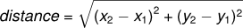

..  Copyright (C)  Jeffrey Elkner, Peter Wentworth, Allen B. Downey, Chris
    Meyers, and Dario Mitchell.  Permission is granted to copy, distribute
    and/or modify this document under the terms of the GNU Free Documentation
    License, Version 1.3 or any later version published by the Free Software
    Foundation; with Invariant Sections being Forward, Prefaces, and
    Contributor List, no Front-Cover Texts, and no Back-Cover Texts.  A copy of
    the license is included in the section entitled "GNU Free Documentation
    License".
    
..  shortname:: MaisSobreFuncoes
..  description:: Este módulo contém mais detalhes sobre funções

Functions Revisited
===================

.. index:: comando return, valor retornado, variável temporária,
           código morto, None, código inatingível

.. index::
    single: valor
    single: variável; temporário

.. index:: scaffolding, desenvolvimento incremental

Desenvolvimento de programas
----------------------------

A essa altura você já deve ser capaz de olhar para uma função completa
e dizer o que ela faz. Além disso, se você tem feito os exercícios,
você já escreveu algumas funções simples. Ao escrever funções mais
complexas, você pode encontrar algumas dificuldades, em particular com
erros semânticos e em tempo de execução.

Para trabalhar com programas cada vez mais complexos, nós vamos
sugerir o uso da técnica chamada de **desenvolvimento incremental**. O
objetivo do desenvolvimento incremental é evitar longas sessões de
depuração por meio da adição e teste de pequenas porções de código de
cada vez.

Como exemplo, imagine que você deseje calcular a distância entre dois pontos, dados pelas coordenadas (x\ :sub:`1`\ , y\ :sub:`1`\ ) e
(x\ :sub:`2`\ , y\ :sub:`2`\ ). Pelo teorema de Pytágoras, a distância é dada por:

O primeiro passo é considerar como a função ``distancia`` deve se parecer em Python. Em outras palavras, quais são as entradas (parâmetros) e qual a saída (valor retornado)?

Nesse caso, os dois pontos formam a entrada, que podemos representar por meio de quatro parâmetros. O valor retornado é a distância, que é um valor real (ponto flutuante). 

Já podemos começar escrevendo um esboço da função que captura o nosso pensamento até agora.

.. sourcecode:: python
    
    def distancia(x1, y1, x2, y2):
        return 0.0

Obviamente, esta versão da função não calcula distâncias; ela sempre retorna zero. Mas ela está sintaticamente correta e pode ser executada, o que significa que podemos testá-la antes de torná-la mais complexa. 

Para testar a nova função, podemos chamá-la com valores pré determinados.

.. activecode:: ch06_distance1
    
    def distancia(x1, y1, x2, y2):
        return 0.0

    print(distancia(1, 2, 4, 6))

Esses valores foram escolhidos para que a distância horizontal seja 3 e a vertical 4; dessa forma, o resultado da função deve ser 5 (que corresponde a hipotenusa do triângulo 3-4-5). Ao testar uma função, é importante conhecer a resposta correta para cada entrada fornecida.

Com esse teste inicial podemos confirmar que a função está sintaticamente correta e agora podemos começar a adicionar linhas de código. Após cada mudança incremental, testamos a função novamente. Caso um erro acontecer nesse ponto, sabemos onde ele deve estar, no pedaço que foi adicionado por último.

Um primeiro passo para computar a distância é encontrar as diferenças
x\ :sub:`2`\ - x\ :sub:`1`\  e y\ :sub:`2`\ - y\ :sub:`1`\ . Vamos armazenar esses valores em variáveis temporárias de nome ``dx`` e ``dy``.

.. sourcecode:: python
    
    def distancia(x1, y1, x2, y2):
        dx = x2 - x1
        dy = y2 - y1
        return 0.0

A seguir calculamos a soma dos quadrados de ``dx`` e ``dy``.

.. sourcecode:: python
    
    def distancia(x1, y1, x2, y2):
        dx = x2 - x1
        dy = y2 - y1
        dsquared = dx**2 + dy**2
        return 0.0

Novamente, podemos executar o programa novamente para verificar o valor de ``dsquared`` (que deve ser 25).

Finalmente, usando o expoente fracionário ``0.5`` para encontrar a raiz quadrada, calculamos e retornamos o resultado.

.. activecode:: ch06_distancefinal
    
    def distancia(x1, y1, x2, y2):
        dx = x2 - x1
        dy = y2 - y1
        dsquared = dx**2 + dy**2
        result = dsquared**0.5
        return result

    print(distancia(1, 2, 4, 6))

Se tudo funcionar corretamente, acabamos. Caso contrário, podemos imprimir o valor de ``result`` antes do comando return.

Quando você estiver começando a programar, o melhor é adicionar apenas uma ou duas linhas de código de cada vez. À medida que você ganhar mais experiência, você vai conseguir escrever e depurar blocos cada vez maiores. Essa forma de aprender é muito parecida com a forma que aprendemos a ler, primeiro as letras, depois sílabas, palavras, frases, sentenças, parágrafos, etc., ou a maneira que aprendemos a representar música --- a partir de notas individuais para acordes, barras, frases, e assim por diante. 

Os aspectos principais do processo são:

#. Começe com um esqueleto funcional do programa e faça pequenas mudanças incrementais. A qualquer momento, caso ocorrer um erro, você sabe exatamente onde ele se encontra.
#. Use variáveis temporárias para manter valores intermediários. Dessa forma é fácil inspecionar os seus valores.
#. Uma vez que o programa esteja funcionando, você pode consolidar vários comandos em expressões compostas. Mas faça isso apenas quando a alteração não torne o programa mais difícil de ler. 

   
.. index:: composição, composição de funções

Composição
----------

Como já vimos, é possível chamar uma função de dentro de outra. Esse recurso é chamado de **composição**.

Por exemplo, vamos escrever uma função que recebe dois pontos, o centro de um círculo e um ponto no perímetro, e computa a área do círculo.

Considere que o ponto central é armazenado nas variáveis ``xc`` e ``yc``, e o ponto no perímetro em ``xp`` e ``yp``. O primeiro passo é encontrar o raio do círculo, que é a distância entre os dois pontos.
Felizmente, nós acabamos de escrever a função ``distancia`` e podemos reutilizá-la.

.. sourcecode:: python
    
    radius = distancia(xc, yc, xp, yp)

O segundo passo é encontrar a área do círculo usando o raio e retornar o resultado. Vamos usar uma de nossas funções anteriores novamente:

.. sourcecode:: python
    
    result = area(radius)
    return result

Encapsulando tudo em uma função temos:

.. activecode:: ch06_newarea
    
    def distancia(x1, y1, x2, y2):
	    dx = x2 - x1
	    dy = y2 - y1
	    dsquared = dx**2 + dy**2
	    result = dsquared**0.5
	    return result

    def area(radius):
        b = 3.14159 * radius**2
        return b

    def area2(xc, yc, xp, yp):
        radius = distancia(xc, yc, xp, yp)
        result = area(radius)
        return result

    print(area2(0,0,1,1))

Vamos chamar esta função de ``area2`` para distingui-la da função ``area`` definida anteriormente. Dentro de um módulo, cada função deve ter o seu próprio nome (único, diferente de outros nomes).

Note que poderíamos ter escrito a composição sem armazenar os valores intermediários.

.. sourcecode:: python
    
    def area2(xc, yc, xp, yp):
        return area(distancia(xc, yc, xp, yp))

.. index:: função booleana

Função Booleana
---------------

Funções booleanas retornam valores booleanos que são muito convenientes para esconder testes complicados dentro de funções. Por exemplo:

.. activecode:: ch06_boolfun1
    
    def eDivisivel(x, y):
        if x % y == 0:
            return True 
        else:
            return False 

    print(eDivisivel(10,5))

O nome da função é ``eDivisivel``. É comum atribuir a **funções booleanas** nomes que soem como perguntas. ``eDivisivel`` (é divisível?) retorna ``True`` ou ``False`` para indicar se ``x`` é ou não divisível por ``y``.

Podemos fazer a função mais concisa se aproveitarmos o fato da condição do comando ``if`` ser, ela mesma, uma expressão booleana. Podemos retornar o valor da expressão diretamente, evitando assim o uso do comando ``if``:

.. sourcecode:: python
    
    def eDivisivel(x, y):
        return x % y == 0

Funções booleanas são frequentemente usadas em comandos condicionais:

.. sourcecode:: python
    
    if eDivisivel(x, y):
        ... # faça isso ...
    else:
        ... # faça outra coisa ...

Pode ser tentador escrever algo como:

.. sourcecode:: python
    
    if eDivisivel(x, y) == True:

mas a comparação não é necessária.

.. activecode:: ch06_boolfun2
    
    def eDivisivel(x, y):
        if x % y == 0:
            return True 
        else:
            return False 

    if eDivisivel(10,5):
        print("That works")
    else:
        print("Those values are no good")

Teste usando alguns outros pares de valores para ver os resultados.

.. index:: estilo

Programando Com Estilo
----------------------

É muito importante deixar o programa fácil de ler pois, na prática, programas são lidos e modificados com muito mais frequencia com que são escritos.

.. Todos os exemplos de código
.. neste livro serão consistentes com o *Python Enhancement Proposal 8*
.. (`PEP 8 <http://www.python.org/dev/peps/pep-0008/>`__), um guia de estilo desenvolvido pela comunidade Python.

Vamos falar mais sobre estilo a medida que nossos programas se tornem mais complexos, mas alguns pontos já podem ser considerados:

* use 4 espaços para tabulação
* imports devem ser colocados no início do arquivo
* a definição de funções devem ser separadas por duas linhas em branco
* mantenha a definição de funções juntas no início do arquivo.
* mantenha os comandos do programa principal (ou nível mais alto), incluindo as chamadas de funções, juntas no final do arquivo.

Glossário
---------

.. glossary::

    código morto
        Parte de um programa que nunca é executado, em geral 
        por aparecer após um comando ``return``.

    composição (de funções)
        Chamada de uma função dentro do corpo de outra função,
        ou usar o valor de uma função como argumento na chamada
        de outra função.

    desenvolvimento incremental
        Um método de desenvolvimento de programas que simplifica
        a depuração por adicionar e testar apenas pequenas porções
        de código de cada vez.

    função chatterbox
        Uma função que interage com o usuário (usando ``input`` 
        ou ``print``) quando não deveria. Funções silenciosas 
        que apenas convertem os valores da entrada no resultado 
        da saída são as mais úteis em geral.
        
    função produtiva (fruitful)
        Uma função que retorna um valor ao invés de ``None``.
        
    None
        Um valor especial em Python. Um uso comum de ``None`` 
        é em funções que não retornam valor (terminam sem retornar 
        um valor).

    scaffolding
        Código usado durante o desenvolvimento do programa para ajudar
        no desenvolvimento e depuração. O código de teste unitário
        que usamos nesse capítulo são exemplos de scaffolding.

    valor de retorno
        O valor produzido como resultado da chamada de uma função.

    variável temporária
        Uma variável usada para armazenar um valor intermediário em
        uma computação complexa.
       

Exercícios
----------

#. Escreva uma função ``para_segundos`` que converte horas, minutos e segundos em um número total de segundos.
       
#. Estenda a função ``para_segundos`` para que ela trabalhe com
   valores reais como entrada (exemplo: 1.5 minuto). A função deve
   retornar sempre um valor inteiro de segundos (truncando a parte
   fracionária).

#. Escreva três funções que são o inverso de ``para_segundos``:

   #. ``horas_em`` retorna o número de horas completas dentro 
      de um número de segundos

   #. ``minutos_em`` retorna o número de minutos completos 
      restantes dentro de um número de segundos, 
      após a remoção das horas.

   #. ``segundos_em`` retorna o número de segundos restantes
      após a remoção das horas e minutos completos.
       
   Você pode assumir que o número total de segundos passado para essas funções é um inteiro.

#. Escreva uma função ``compare`` que retorna ``1`` se ``a > b``, ``0`` se ``a == b``, e ``-1`` se ``a < b``.

#. Escreva uma função chamada ``hipotenusa`` que retorna o comprimento da hipotenusa de um triângulo retângulo dados os comprimentos dos dois lados como parâmetros.

#. Escreva uma função ``inclinacao(x1, y1, x2, y2)`` que 
   retorna a inclinação da linha que passa pelos pontos 
   ``(x1, y1)`` e ``(x2, y2)``.
    
   A seguir use a função ``inclinacao`` em outra função chamada
   ``intersecta(x1, y1, x2, y2)`` que retorna a altura 
   (interseção com y) do ponto onde a linha que passa pelos 
   pontos ``(x1, y1)`` e ``(x2, y2)`` cruza o eixo y.

#. Escreva a função ``f2c(t)`` que retorna o valor em 
   graus Celsius dada uma temperatura em 
   Fahrenheit.

#. Agora o contrário, escreva a função ``c2f`` que converte
   Celsius em Fahrenheit.

