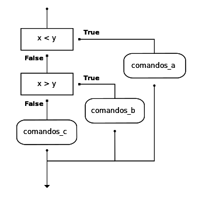

..  Copyright (C)  Brad Miller, David Ranum, Jeffrey Elkner, Peter Wentworth, Allen B. Downey, Chris
    Meyers, and Dario Mitchell.  Permission is granted to copy, distribute
    and/or modify this document under the terms of the GNU Free Documentation
    License, Version 1.3 or any later version published by the Free Software
    Foundation; with Invariant Sections being Forward, Prefaces, and
    Contributor List, no Front-Cover Texts, and no Back-Cover Texts.  A copy of
    the license is included in the section entitled "GNU Free Documentation
    License".
    
..  shortname:: Seleção
..  description:: Este módulo apresenta as estruturas de controle de seleção (if, ifelse, elif)

Decisões e Seleção
===================

.. index::
    single: operador módulo
    single: módulo; operador

.. index::
    single: valor booleano
    single: booleano; valor
    single: expressão booleana
    single: booleana; expressão
    single: operador lógico
    single: lógico; operador
    single: comparação; operador de
    single: operador de comparação

Valores booleanos e expressões booleanas
----------------------------------------

.. video:: booleanexpressions
   :controls:
   :thumb: ../_static/booleanexpressions.png

   http://media.interactivepython.org/thinkcsVideos/booleanexpressions.mov
   http://media.interactivepython.org/thinkcsVideos/booleanexpressions.webm

O tipo em Python para armazenar os valores verdadeiro e falso é
chamado de ``bool``, em homenagem ao matemático britânico George
Boole. George Boole criou a *Álgebra Booleana*, que é a base de toda a
aritmética computacional moderna.

Existem apenas dois **valores booleanos**. Eles são ``True`` e
``False``. As iniciais maiúsculas são importantes, uma vez que
``true`` e ``false`` não são valores booleanos (lembre-se de que
maiúsculas e minúsculas fazem diferença para o Python).

.. activecode:: ch05_1
    
    print(True)
    print(type(True))
    print(type(False))

.. note:: Valores booleanos não são strings!

    É extremamente importante perceber que True e False não são 
    strings.   Eles não estão entre aspas. Eles são somente dois
    valores do tipo de dados ``bool``. Olhe atentamente os tipos
    mostrados abaixo.

.. activecode:: ch05_1a

    print(type(True))
    print(type("True"))

Uma **expressão booleana** é uma expressão que resulta em um valor
booleano. O operador de igualdade, ``==``, compara dois valores e
produz um valor booleano correspondente aos dois valores serem ou não
iguais entre si.

.. activecode:: ch05_2
    
    print(5 == 5)
    print(5 == 6)

No primeiro comando, os dois operandos são iguais, de forma que a
expressão tem valor ``True``.  No segundo comando, 5 não é igual a
6, de forma que obtemos ``False``.

O operador ``==`` é um dos seis **operadores de comparação** comuns;
os outros são:

.. sourcecode:: python
    
    x != y               # x não é igual a y
    x > y                # x é maior do que y
    x < y                # x é menor do que y
    x >= y               # x é maior ou igual a y
    x <= y               # x é menor ou igual a y

Embora essas operações sejam provavelmente familiares a você, os
símbolos em Python são diferentes dos símbolos matemáticos.
Um erro comum é usar somente um símbolo de igual (``=``) em vez de
dois sinais iguais (``==``). Lembre-se de que ``=`` é um operador de
atribuição e o ``==`` é um operador de comparação. Também, os operadores
``=<`` ou ``=>`` não existem.

.. Isso é comentário?
.. With reassignment it is especially important to distinguish between an
.. assignment statement and a boolean expression that tests for equality. 
.. Because Python uses the equal token (``=``) for assignment, 
.. it is tempting to interpret a statement like
.. ``a = b`` as a boolean test.  Unlike mathematics, it is not!  Remember that the Python token
.. for the equality operator is ``==``.

Note também que um teste de igualdade é simétrico, mas atribuição não
é. Por exemplo, se ``a == 7`` então ``7 == a``.  Mas, em Python, a expressão ``a = 7``
é válida e ``7 = a`` não é. (Você pode explicar por que?)

.. admonition:: Rascunho

    .. actex:: scratch_6_1

**Teste seu entendimento**

.. mchoice:: test_question6_1_1
   :answer_a: True
   :answer_b: 3 == 4
   :answer_c: 3 + 4
   :answer_d: 3 + 4 == 7
   :answer_e: &quot;False&quot;
   :correct: a,b,d
   :feedback_a: True e False são ambas  literais booleanas.
   :feedback_b: A comparação entre dois números usando == resulta em True ou False (neste caso False), ambos valores booleanos.
   :feedback_c:  3+4 resulta em 7, que é um número, não um valor booleano.
   :feedback_d: 3+4 resulta em 7.  7 == 7 então resulta em True, que é um valor booleano. 
   :feedback_e: Entre aspas, False é interpretado como um string, não como um valor booleano.  Se as aspas não fossem incluídas, False sozinho seria de fato um valor booleano

   Quais das seguintes é uma expressão booleana?  Selecione todos que são.

.. index::
    single: operador lógico
    single: lógico; operador
    
Operadores lógicos
------------------

Existem três **operadores lógicos**: ``and``, ``or`` e ``not``. A
semântica (significado) desses operadores é similar ao significado
deles em português.
Por exemplo, ``x > 0 and x < 10`` é verdadeiro somente se ``x`` é
maior do que 0  *e* ao mesmo tempo, x é menor do que 10.  Como você
descreveria isso em palavras?  Você diria que x está entre 0 e 10, não
incluindo as extremidades.

``n % 2 == 0 or n % 3 == 0`` é verdadeiro se *uma* das condições é verdadeira,
isto é, se o número é divisível por  2 *ou* divisível por 3.  Neste
caso, uma, ou a outra, ou ambos as partes tem que ser verdadeira para o
resultado ser verdadeiro.

Finalmente, o operador ``not`` nega uma expressão booleana, de forma
que ``not  x > y`` é verdadeiro se ``x > y`` é falso, isto é, se ``x``
é menor ou igual a ``y``.

.. activecode:: chp05_3

    x = 5
    print(x>0 and x<10)
 
    n = 25
    print(n%2 == 0 or n%3 == 0)

.. admonition:: Erro comum!

	Existe um erro muito comum que ocorre quando programadores tentam escrever expressões booleanas. Por exemplo, suponha que queremos verificar se uma variável ``número`` tem valor 5, 6, or 7.  Em palavras, podemos dizer: "número é igual a 5 ou 6 ou 7".  Entretanto, se traduzimos isto em Python, ``número == 5 or 6 or 7``, isso não será correto.  O operador ``or`` precisa juntar a verificação das três igualdades.  A forma correta de escrever isto é ``número == 5 or número == 6 or número == 7``. Isto pode parecer como um monte de digitação mas é absolutamente necessário.  Não dá para fazer de forma mais compacta.

.. admonition:: Rascunho

    .. actex:: scratch_6_2

**Teste seu entendimento**

.. mchoice:: test_question6_2_1
   :answer_a: x &gt; 0 and &lt; 5
   :answer_b: 0 &lt; x &lt; 5
   :answer_c: x &gt; 0 or x &lt; 5
   :answer_d: x &gt; 0 and x &lt; 5
   :correct: d
   :feedback_a: Cada comparação deve ser exatamente entre dois valores. Neste caso, na comparação da direita falta um valor do lado esquerdo da expressão &lt; 5.
   :feedback_b: Esta é sutil.  Embora a maior parte das linguagens de programação não permite esta sintaxe, em Python, esta sintaxe é permitida.  Entretanto, você não deveria usá-la.  Em vez disso, faça comparações múltiplas usando and ou or.
   :feedback_c: Embora esta sintaxe seja legal em Python,a expressão está incorreta.  Ela terá valor verdadeiro para todos os números que são ou maiores do que zero ou menores do que 5.  Como todos os números são ou maiores do que zero ou menores do que 5, esta expressão será sempre verdadeira.
   :feedback_d: Sim, com o operador and ambas as expressões devem ser verdadeiras de forma que para a expressão ser verdadeira, o número deve ser maior do que 0 e menor do que 5.

   Qual é a expressão correta em Python para verificar se um número armazenado na variável x está entre 0 e 5.
 
Precedência de operadores
-------------------------

Adicionamos um certo número de operadores àqueles que aprendemos nos capítulos anteriores. É importante entender como os operadores se relacionam entre si em relação à precedência. Python sempre usará os operadores aritméticos primeiro (exponenciação primeiro, depois multiplicação/divisão e depois adição/subtração). Depois vêm os operadores relacionais. Finalmente, os operadores lógicos vêm por último. Isto quer dizer que o valor da expressão ``x*5 >= 10 and y-6 <= 20`` será determinado de forma que as operações aritméticas são feitas e depois as relações. O ``and`` será deixado por último. Embora muitos programadores poderiam colocar parentêses nas expressões relacionais, isto não é necessário.

A tabela seguinte resume a precedência dos operadores em Python do maior ao menor. A tabela completa da linguagem pode ser encontrada em `Python Documentation <http://docs.python.org/py3k/reference/expressions.html#expression-lists>`_.

========   ==============  ===============
Nível      Categoria        Operadores
========   ==============  ===============
7(alto)    exponenciação   \**
6          multiplicação   \*,/,//,%
5          adição          +,-
4          relacional      ==,!=,<=,>=,>,<
3          lógico          not
2          lógico          and
1(baixo)   lógico          or
========   ==============  ===============

.. admonition:: Rascunho

    .. actex:: scratch_6_3

**Teste seu entendimento**

.. mchoice:: test_question6_3_1
   :answer_a: ((5*3) &gt; 10) and ((4+6) == 11)
   :answer_b: (5*(3 &gt; 10)) and (4 + (6 == 11))
   :answer_c: ((((5*3) &gt; 10) and 4)+6) == 11
   :answer_d: ((5*3) &gt; (10 and (4+6))) == 11
   :correct: a
   :feedback_a: Sim, * e + têm as maiores precedências, seguidos por &gt; e == e então o operador &quot;and&quot;
   :feedback_b: Operadores aritméticos (*, +) têm maior precedência do que os operadores de comparação (&gt;, ==)
   :feedback_c: Este agrupamento assume que Python simplesmente prioriza da esquerda para a direita, o que é incorreto. O agrupamento correto segue a precedência listada na tabela nesta seção.
   :feedback_d: Este agrupamento assume que &quot;and&quot; tem uma precedência maior que que ==, o que não é verdadeiro. 

   Quais das seguintes expressões corresponde, usando parênteses, à seguinte expressão: 5*3 > 10 and 4+6==11

.. index:: desvion condicional, execução condicional, if, elif, else,
           comando if, comando composto, comandos de bloco, bloco, corpo,
           comando pass

.. index::
    single: if; comando
    single: comando composto; cabeçalho
    single: comando composto; corpo
    single: comando condicional
    single: pass; comando

Execução condicional: seleção binária
-------------------------------------

.. video:: binaryselection
   :controls:
   :thumb: ../_static/binaryselection.png

   http://media.interactivepython.org/thinkcsVideos/binaryselection.mov
   http://media.interactivepython.org/thinkcsVideos/binaryselection.webm

Com a finalidade de escrever programas úteis, quase sempre temos a
necessidade de verificar condições e alterar o comportamento do
programa de acordo com os resultados das condições.  **Comandos de
seleção**, algumas vezes também denominados de  **comandos
condicionais** nos dá essa habilidade. A forma mais simples de seleção
é o comando **if**.  Ele é algumas vezes denominado de **seleção binária** uma vez que admite dois possíveis caminhos de execução.

.. activecode:: ch05_4
    
    x = 15

    if x % 2 == 0:
        print(x, "e' par")
    else:
        print(x, "e' impar")    

A sintaxe de um comando ``if`` se parece com:

::

    if EXPRESSÃO BOOLEANA:
        COMANDOS_1        # executados se condição tem valor True
    else:
        COMANDOS_2        # executados se condição tem valor False

A expressão booleana depois do ``if`` é chamada de **condição**.
Se é verdadeira, então os comandos tabulados (COMANDOS_1) são executados. Se não,
então os comandos tabulados depois do `else` são executados. 

.. sidebar::  Fluxograma de um comando  **if** com um  **else** 

   .. image:: Figures/fluxograma_if_else.png

Assim como a definição de função do último capítulo e outros comandos
compostos como ``for``, o comando ``if`` consiste de uma linha de
cabeçalho e um corpo. A linha de cabeçalho começa com a palavra
``if`` seguida por uma *expressão booleana* e termina com dois pontos (:).

Os comandos tabulados que seguem é chamado de **bloco**. O primeiro
comando com tabulação diferente marca o fim do bloco.

Cada comando dentro do primeiro bloco de comandos é executado em ordem
se a expressão booleana tem valor ``True``. Todo o primeiro bloco de
comandos é pulado se a expressão booleana tem valor ``False`` e todos
os comandos sob o ``else`` são executados.

Não há limite no número de comandos que podem aparecer nos dois blocos
de um comando ``if``, mas tem que haver pelo menos um comando em cada
bloco. 

.. admonition:: Lab

    * `Simulação para Approximar Pi <../Labs/montepi.html>`_ Neste
      exercício de laboratório trabalhamos um problema de
      aproximar o valor de pi usando números aleatórios.

.. admonition:: Rascunho

    .. actex:: scratch_6_4

**Teste seu entendimento**

.. mchoice:: test_question6_4_1
   :answer_a: Exatamente um.
   :answer_b: Zero ou mais.
   :answer_c: Um ou mais.
   :answer_d: Um ou mais e cada um precisa conter o mesmo número.
   :correct: c
   :feedback_a: Cada bloco pode também conter mais do que um.
   :feedback_b: Cada bloco deve conter pelo menos um comando.
   :feedback_c: Sim, um bloco deve conter pelo menos um comando e pode ter vários comandos.
   :feedback_d: Os blocos podem conter números diferentes de comandos.

   Quantos comandos podem aparecer em cada bloco (o do if e o do else) em um comando condicional?

.. mchoice:: test_question6_4_2
   :answer_a: Saída a
   :answer_b: Saída b
   :answer_c: Saída c
   :answer_d: Nada será impresso
   :correct: b
   :feedback_a: VERDADEIRO é impresso pelo bloco do if, o qual é executado somente se o condicional (neste caso, 4+5 == 10) é verdadeiro. Neste caso, 5+4 não é igual a 10.
   :feedback_b: Como 4+5==10 tem valor False, Python pulará o bloco do if e executará o comando do bloco do else.
   :feedback_c: Python nunca imprimirá ambos VERDADEIRO e FALSO porque ele executará ou o bloco do if ou o bloco do else, mas nunca ambos.
   :feedback_d: Python sempre executará ou o bloco do if (se a condição é verdadeira) ou o bloco do else (se a condição é falsa).  Ele nunca pulará os dois blocos.

   O que o seguinte código imprime (escolha entre as saídas a, b, c ou nada).
   <pre>
   if (4 + 5 == 10):
       print("VERDADEIRO")
   else:
       print("FALSO")
   </pre>
   a.
   <pre>
   VERDADEIRO
   </pre>
   b.
   <pre>
   FALSO
   </pre>
   c.
   <pre>
   VERDADEIRO
   FALSO
   </pre>

.. mchoice:: test_question6_4_3
   :answer_a: Saída a
   :answer_b: Saída b
   :answer_c: Saída c
   :answer_d: Saída d
   :correct: c
   :feedback_a: Embora VERDADEIRO seja impresso depois que o comando if-else termina, cada bloco dentro do comando if-else imprime algo também.  Neste caso, Python teria que ter pulado ambos os blocos do comando if-else, o que ele nunca faria.
   :feedback_b: Como há um VERDADEIRO impresso depois que o comando if-else termina, Python sempre imprimirá VERDADEIRO por último.
   :feedback_c: Python imprimirá FALSO dentro do bloco do else (porque 5+4 não é igual a 10), e então imprimirá VERDADEIRO depois de completar o comando  if-else.
   :feedback_d: Para imprimir estas três linhas, Python teria que executar ambos os blocos do comando  if-else, o que ele nunca fará.

   O que o seguinte código imprime?
   <pre>
   if (4 + 5 == 10):
       print("VERDADEIRO")
   else:
       print("FALSO")
   print("VERDADEIRO")
   </pre>
    a.
   <pre>
   VERDADEIRO
   </pre>
   b.
   <pre>
   VERDADEIRO
   FALSO
   </pre>
   c.
   <pre>
   FALSO
   VERDADEIRO
   </pre>
   d.
   <pre>
   VERDADEIRO
   FALSO
   VERDADEIRO
   </pre>

.. index:: execução alternativa, ramificação

Seleção unária: omissão do ``else``
-----------------------------------

.. video:: unaryselection
   :controls:
   :thumb: ../_static/unaryselection.png

   http://media.interactivepython.org/thinkcsVideos/unaryselection.mov
   http://media.interactivepython.org/thinkcsVideos/unaryselection.webm

.. sidebar::  Fluxograma de um **if** sem **else** 

   .. image:: Figures/fluxograma_if_apenas.png

Outra forma do comando  ``if`` é um no qual o ``else`` é totalmente omitido.  
Isso cria um mecanismo chamado **seleção unária**.
Neste caso, quando a condição tem valor ``True``, os comando são executados. 
Caso contrário, o fluxo de execução continua no comando depois do ``if``.

      
.. activecode:: ch05_unaryselection
    
    x = 10
    if x < 0:
        print("O numero negativo ",  x, " nao e' valido aqui.")
    print("Isto e' sempre impresso.")   

O que é impresso quando o valor de `` x`` é  negativo?  Tente isso.

.. admonition:: Rascunho

    .. actex:: scratch_6_5

**Teste seu entendimento**

.. mchoice:: test_question6_5_1
   :answer_a: Saída a
   :answer_b: Saída b
   :answer_c: Saída c
   :answer_d: Causará um erro porque todo if deve ter um else.
   :correct: b
   :feedback_a: Porque -10 é menor do que 0, Python executará o corpo do comando if aqui.
   :feedback_b: Python executa o corpo do bloco do if bem como o comando que segue o bloco do if.
   :feedback_c: Python executará o comando que segue o bloco if (porque ele está no bloco do else, mas como um comando normal).
   :feedback_d: É válido ter um bloco do if sem um bloco do else correspondente (embora você não possa ter um bloco do else sem um bloco do if correspondente).

   O que o seguinte código imprime?
   <pre>
   x = -10
   if x < 0:
       print("O número negativo ",  x, " não é válido aqui.")
   print("Isto é sempre impresso.")
   </pre>
   a.
   <pre>
   Isto é sempre impresso.
   </pre>
   b.
   <pre>
   O número negativo -10 não é válido aqui.
   Isto é sempre impresso.
   </pre>
   c.
   <pre>
   O número negativo -10 não é válido aqui.
   </pre>

.. mchoice:: test_question6_5_2
   :answer_a: Não
   :answer_b: Sim
   :correct: b
   :feedback_a: Cada bloco de else precisa ter exatamente um bloco de if correspondente.  Se você quer encadear comandos if-else juntos, você precisa usar a construção else, descrita na seção 6.7.
   :feedback_b: Isto causará um erro porque o segundo bloco de else não está relacionado com nenhum bloco de if.

   O seguinte código causará um erro? 
   <pre>
   x = -10
   if x < 0:
       print("O número negativo ",  x, " não é válido aqui.")
   else:
       print(x, " é um número positivo.")
   else:
       print("Isto é sempre impresso.")
   </pre>

.. index::
    single: condicionais aninhados
    single: aninhados; condicionais

Condicionais aninhados
----------------------

Um condicional pode também ser **aninhado** dentro de outro. Por exemplo, assuma que temos duas variáveis inteiras ``x`` e ``y``.
O seguinte padrão de seleção mostra como podemos decidir como eles são relacionados entre si.

.. sourcecode:: python

    if x < y:
        print("x e' menor do que y.")
    else:
        if x > y:
            print("x e' maior do que y.")
        else:
            print("x e y devem ser iguais.")

O condicional externo tem duas ramificações.
A segunda ramificação (o else externo) contém outro comando ``if``, o qual
tem outras duas ramificações. Aquelas duas ramificações podem também 
conter comandos condicionais.

O fluxo de controle pode ser visto nesta ilustração do fluxograma.

.. image:: Figures/fluxograma_condicional_aninhado.png

Abaixo você encontra um programa completo que define valores para ``x`` and ``y``. Execute o programa e veja o resultado. Então mude os valores das variáveis para mudar o fluxo de controle.

.. activecode:: sel2

    x = 10
    y = 10

    if x < y:
        print("x e' menor do que y.")
    else:
        if x > y:
            print("x e' maior do que y.")
        else:
            print("x e y devem ser iguais.")

.. note::

	Em algumas linguagens de programação, encontrar o if
	correspondente a um else pode ser um problema.  Entretanto, em Python isto não é o caso.
	O padrão de tabulação nos diz exatamente qual else corresponde a qual if.
        
Se você está ainda inseguro, aqui vai a mesma seleção do exemplo codelens.  Simule passo-a-passo para ver como o ``print`` correto é escolhido.

.. codelens:: sel1
    :showoutput:
    
    x = 10
    y = 10

    if x < y:
        print("x e' menor do que y.")
    else:
        if x > y:
            print("x e' maior do que y.")
        else:
            print("x e y devem ser iguais.")

.. admonition:: Rascunho

    .. actex:: scratch_6_6

**Teste seu entendimento**

.. mchoice:: test_question6_6_1
   :answer_a: Não
   :answer_b: Sim
   :correct: a
   :feedback_a: Este é um comando if-else aninhado legítimo.  O comando if-else interno está completamente contido no corpo do bloco do else externo.
   :feedback_b: Este é um comando if-else aninhado legítimo.  O comando if-else interno está completamente contido no corpo do bloco do else externo.

   O seguinte código causará um erro? 
   <pre>
   x = -10
   if x < 0:
       print("O número negativo ",  x, " não é válido aqui.")
   else:
       if x > 0:
           print(x, " é um número positivo.")
       else:
           print(x," é 0.")
   </pre>

.. index::
    single: condicionais aninhados 
    single: aninhados; condicionais

Condicionais encadeados
-----------------------

Python provê uma forma alternativa de escrever seleções aninhadas como as mostradas na seção anterior.
Isto é chamado algumas vezes como  **condicionais encadeadas**
   
.. sourcecode:: python
    
    if x < y:
        print("x e' menor do que y.")
    elif x > y:
        print("x e' maior do que y.")
    else:
        print("x e y devem ser iguais.")

O fluxo de controle pode ser desenhado com uma orientação diferente mas o padrão resultante é idêntico ao mostrado acima.

        
``elif`` é uma abreviação de ``else if``. Novamente, exatamente uma ramificação será
executada. Não há limites no número de ``elif`` mas apenas um simples (e opcional) 
``else`` final é permitido e precisa ser a última ramificação do comando.

Cada condição é verificada em ordem. Se a primeira é falsa, a próxima é então verificada ,
e assim por dianta. Se uma delas é verdadeira, a ramificação correspondente é executada e 
o comando termina. Mesmo que mais do que uma condição seja verdadeira, apenas a ramificação 
da primeira verdadeira é executada.

Aqui vai o mesmo programa usando ``elif``.

.. activecode:: sel4

    x = 10
    y = 10

    if x < y:
        print("x e' menor do que y.")
    elif x > y:
        print("x e' maior do que y.")
    else:
        print("x e y devem ser iguais.")

.. admonition:: Rascunho

    .. actex:: scratch_6_7

**Teste seu entendimento**

.. mchoice:: test_question6_7_1
   :answer_a: I somente
   :answer_b: II somente
   :answer_c: III somente
   :answer_d: II e III
   :answer_e: I, II e III
   :correct: b
   :feedback_a: Você não pode usar uma expressão booleana depois de um else.
   :feedback_b: Sim, II dará o mesmo resultado.
   :feedback_c: Não, III não dará o mesmo resultado.  O primeiro comando if será verdadeiro, mas o segundo será falso, de forma que os comandos do bloco do else serão executados.
   :feedback_d: Não, embora II seja correta, III não dará o mesmo resultado.  Teste isso.
   :feedback_e: Não, em I você não pode ter uma expressão booleana depois de um else.

   Quais dentre I, II e III abaixo dá o mesmo resultado que o seguinte if aninhado?
   <pre>
   # comando if-else aninhado
   x = -10
   if x < 0:
       print("O número negativo ",  x, " não é válido aqui.")
   else:
       if x > 0:
           print(x, " é um número positivo.")
       else:
           print(x, " é 0.")
   </pre>
   I.
   <pre>
   if x < 0:
       print("O número negativo ",  x, " não é válido aqui.")
   else (x > 0): 
       print(x, " é um número positivo.")
   else:
       print(x, " é 0.")
   </pre>
   II.
     <pre>
   if x < 0:
       print("O número negativo ",  x, " não é válido aqui.")
   elif (x > 0): 
       print(x, " é um número positivo.")
   else:
       print(x, " é 0.")
   </pre>
   III. 
     <pre>
   if x < 0:
       print("O número negativo ",  x, " não é válido aqui.")
   if (x > 0): 
       print(x, " é um número positivo.")
   else:
       print(x, " é 0.")
   </pre>

.. mchoice:: test_question6_7_2
   :answer_a: a
   :answer_b: b
   :answer_c: c
   :correct: c
   :feedback_a: Enquanto o valor de x é menor do que o valor de y (3 é menor do que 5) ele não é menor do que o valor de z (3 não é menor do que 2).
   :feedback_b: O valor de y não é menor do que o valor de x (5 não é menor do que 3).  
   :feedback_c: Como as duas primeiras expressões booleanas são falsas, o else será executado.   

   O que o seguinte código imprimirá se x = 3, y = 5 e z = 2?
   <pre>
   if x < y and x < z:
       print ("a")
   elif y < x and y < z:
       print ("b")
   else:
       print ("c")
   </pre>
  

Funções booleanas
-----------------

Funções podem retornar valores booleanos, o que é frequentemente conveniente para esconder dentro de 
funções testes complidados. Por exemplo:

.. activecode:: ch06_boolfun1
    
    def eDivisivel(x, y):
        if x % y == 0:
            result = True 
        else:
            result = False

        return result 

    print(eDivisivel(10,5))

O nome desta função é ``eDivisivel``. É comum dar nomes a 
**funções booleanas** que lembrem questões sim/não.  ``eDivisivel`` retorna
ou ``True`` ou ``False`` para indicar se ``x`` é ou não divisível por
``y``.

Podemos fazer a função mais compacta tirando vantagem do fato que a
condição do comando if é ele próprio uma expressão booleana. Podemos
retorná-lo diretamente, evitando todo o comando ``if``:

.. sourcecode:: python
    
    def eDivisivel(x, y):
        return x % y == 0

Funções booleanas são usadas frequentemente em comandos condicionais:

.. sourcecode:: python
    
    if eDivisivel(x, y):
        ... # faça alguma coisa ...
    else:
        ... # faça outra coisa ...

Pode ser tentador escrever algo como
``if eDivisivel(x, y) == True:``
mas a comparação extra não é necessária.  O seguinte exemplo mostra uma aplicação da função ``eDivisivel``.
Teste isto com uns alguns outros argumentos para ver o que é impresso.

.. activecode:: ch06_boolfun2
    
    def eDivisivel(x, y):
        if x % y == 0:
            result = True 
        else:
            result = False 

        return result

    if eDivisivel(10,5):
        print("Funciona")
    else:
        print("Esses valores nao sao bons")

Abaixo você encontra mesmo programa em codelens.

.. codelens:: ch06_boolcodelens
    :showoutput:
    
    def eDivisivel(x, y):
        if x % y == 0:
            result = True 
        else:
            result = False 

        return result

    if eDivisivel(10,5):
        print("Funciona")
    else:
        print("Esses valores nao sao bons")

.. admonition:: Rascunho

    .. actex:: scratch_6_8

**Teste seu entendimento**

.. mchoice:: test_question6_8_1
   :answer_a: Uma função que retorna True ou False
   :answer_b: Uma função que usa True ou False como argument
   :answer_c: O mesmo que uma expressão booleana
   :correct: a
   :feedback_a: Uma função booleana é como outra função qualquer, mas ela sempre retorna True ou False.
   :feedback_b: Uma função booleana pode ter qualquer número de argumentos (incluindo 0, embora seja raro), de qualquer tipo.
   :feedback_c: Uma expressão booleana é um comando com valor True ou False, e.g. 5+3==8.  Uma função é uma série de comandos agrupados com um nome que somente são executados quando você chama a função.

   O que é uma função booleana?

.. mchoice:: test_question6_8_2
   :answer_a: Sim
   :answer_b: Não
   :correct: a
   :feedback_a: É perfeitamente válido retornar o resultado calculado por uma expressão booleana.
   :feedback_b: x + y < z é uma expressão booleana válida, a qual terá valor True ou False.  É perfeitamente legal uma função retornar True ou False e ter uma expressão calculada na mesma linha do return.

   O seguinte comando é legal em Python (assumindo que x, y e z são definidos como números)?
   <pre>
   return x + y < z
   </pre>

Glossário
---------

.. glossary::

    aninhamento
        Uma estrutura de programa dentro de outra, tal como um comando
        condicional dentro de uma ramificação de um outro comando
        condicional.

    bloco
        Um grupo de comandos consecutivos com a mesma tabulação.

    comando condicional
        Um comando que controla o fluxo de execução dependendo de
        alguma condição. Em Python, ``if``, ``elif`` e ``else`` são
        usados para comandos condicionais.

    condição
        Uma expressão booleana em um comando condicional que determina
        a ramificação a ser executada.

    condicional encadeada
        Uma ramificação condicional com mais do que dois fluxos de
        execução possíveis. Em Python, condicionais encadeadas são
        escritas com comandos ``if ... elif ... else``.

    corpo
        Um bloco de comandos em um comando composto que segue o cabeçalho.

    expressão booleana
        Uma expressão que é ou verdadeira ou falsa.

    função booleana
        Uma função que retorna um valor booleano.  O valores possíveis
        do tipo ``bool`` são ``False`` e ``True``.

    operador de comparação
        Um dos operadores que compara dois valores: ``==``, ``!=``, ``>``,
        ``<``, ``>=``, and ``<=``.

    operador lógico
        Um dos operadores que combinam expressões booleanas: ``and``,
        ``or`` e ``not``.

    operador módulo
        Um operador, denotado por um sinal de porcentagem ( ``%``),
        que calcula o resto da divisão de um número por outro,
        considerando que o valor da divisão é um número inteiro.

    ramificação
        Um dos possíveis caminhos do fluxo de execução determinado por uma
        execução condicional.

    valor booleano
        Existem exatamente dois valores booleanos: ``True`` e ``False``. Valores
        booleanos são resultados de cálculos de expressões booleanas.
        Eles são do tipo ``bool``.

Exercicíos
----------

#.  Qual o valor de cada uma das expressões?

    #.  ``3 == 3``
    #.  ``3 != 3``
    #.  ``3 >= 4``
    #.  ``not (3 < 4)``

        .. actex:: ex_6_1

   
#.  Descreva os **opostos lógicos** de cada uma das condições. Não é permitido usar o operador ``not``.
    
    #.  ``a > b`` 
    #.  ``a >= b``
    #.  ``a >= 18  and  dia == 3``
    #.  ``a >= 18  and  dia != 3``
    
        .. actex:: ex_6_2
    
#.  Escreva uma função que, dada uma nota, retorna um string --- o grau da nota de acordo com o esquema:
    
    .. table::  
    
       =======   =====
       Nota      Grau
       =======   =====
       >= 90     A  
       [80-90)   B   
       [70-80)   C   
       [60-70)   D 
       < 60      F   
       =======   =====    
    
    Os colchetes e os parênteses denotam intervalos fechados e abertos.
    Um intervalo fechado inclui o número enquanto um intervalo aberto
    o exclui.  Logo,  79.99999 corresponde a grau C, mas 80 corresponde a grau B.
    
    Seja ``xs = [83, 75, 74.9, 70, 69.9, 65, 60, 59.9, 55, 50, 49.9, 45, 44.9, 40, 39.9, 2, 0]`` 
    
    Teste sua função imprimindo o grau para cada elemento da lista.
    
    .. actex:: ex_6_3

#.  Modifique o programa de diagrama de barras da tartaruga para que
    as barras, para qualquer valor de 200 ou mais, sejam preenchida com
    vermelho; para valores entre [100 e 200) sejam preenchidas com
    amarelo e barras representando valores menores do que 100 sejam
    preenchidas com verde.
  
    .. actex:: ex_6_4

#.  No programa do diagrama de barras da tartaruga, o que você espera
    acontecer se um ou mais dos valores dados na lista é negativo?
    Teste isto. Mude o programa de forma que quando ele imprime um texto
    para barras negativas, esse texto apareça embaixo da barra.
  
    .. actex:: ex_6_5

#.  Escreva uma função ``acheHipot`` que, dados os comprimento de dois
    lados de um triângulo retângulo, retorna o comprimento da hipotenusa.
    (Dica:  o valor de ``x ** 0.5`` é a raiz quadrada, ou use ``sqrt`` do
    módulo matemático)
    
    .. actex:: ex_6_6

        from test import testEqual

        def acheHipot(a,b):
            # your code here

        testEqual(acheHipot(12.0,5.0), 13.0)
        testEqual(acheHipot(14.0,48.0), 50.0)
        testEqual(acheHipot(21.0,72.0), 75.0)
        testEqual(acheHipot(1,1.73205), 1.999999)

#. Escreva uma função chamada ``é_par(n)`` que recebe como argumento
   um inteiro e retorna ``True`` se o argumento é um **número par** e
   ``False`` se ele é **ímpar**.

    
   .. actex:: ex_6_7

       from test import testEqual

       def é_par(n):
           # your code here

       testEqual(é_par(10), True)
       testEqual(é_par(5), False)
       testEqual(é_par(1), False)
       testEqual(é_par(0), True)

#. Agora escreva a função ``é_ímpar(n)`` que retorna ``True`` quando
   ``n`` é ímpar e ``False`` caso contrário.

   .. actex:: ex_6_8

       from test import testEqual

       def é_ímpar(n):
           # your code here

       testEqual(é_ímpar(10), False)
       testEqual(é_ímpar(5), True)
       testEqual(é_ímpar(1), True)
       testEqual(é_ímpar(0), False)

#. Modifique ``é_ímpar`` de forma que ela use uma chamada para
   ``é_par`` para determinar se o argumento é um inteiro par ou ímpar.

   .. actex:: ex_6_9

       from test import testEqual

       def é_ímpar(n):
           # your code here

       testEqual(é_ímpar(10), False)
       testEqual(é_ímpar(5), True)
       testEqual(é_ímpar(1), True)
       testEqual(é_ímpar(0), False)

#.  Escreva uma função ``é_ânguloreto`` que, dado o comprimento de
    três lados de um triângulo, determina se o triângulo é
    retângulo. Asssuma que o terceiro argumento é sempre o lado
    maior. Ela retorna ``True`` se é um triângulo retângulo, ou
    ``False`` caso contrário.
    
    Dica: aritimética de ponto flutuante não é sempre exatamente
    precisa, de forma que não é seguro testar números em ponto
    flutuante para igualdade. Se um bom programador deseja saber se
    ``x`` é igual ou suficientemente perto de ``y``, ele provavelmente
    usaria em seu código
    
    .. sourcecode:: python
    
      if  abs(x-y) < 0.000001:      # se x é aproximadamente igual a  y
          ...    
   

    .. actex:: ex_6_10
    
        from test import testEqual

        def é_ânguloreto(a,b,c):
            # your code here

        testEqual(é_ânguloreto(1.5,2.0,2.5), True)
        testEqual(é_ânguloreto(4.0,8.0,16.0), False)
        testEqual(é_ânguloreto(4.1,8.2,9.1678787077), True)
        testEqual(é_ânguloreto(4.1,8.2,9.16787), True)
        testEqual(é_ânguloreto(4.1,8.2,9.168), False)
        testEqual(é_ânguloreto(0.5,0.4,0.64031), True)

#.  Estenda o programa acima de forma que os lados possam ser dados à função em qualquer ordem.

    .. actex:: ex_6_11

        from test import testEqual

        def é_ânguloreto(a,b,c):
            # your code here

        testEqual(é_ânguloreto(1.5,2.0,2.5), True)
        testEqual(é_ânguloreto(16.0,4.0,8.0, False)
        testEqual(é_ânguloreto(4.1,9.1678787077,8.2), True)
        testEqual(é_ânguloreto(9.16787,4.1,8.2), True)
        testEqual(é_ânguloreto(4.1,8.2,9.168), False)
        testEqual(é_ânguloreto(0.5,0.64031,0.4), True)

#.  Um ano é **bissexto** se ele é divisível por 4 a menos que seja um século que não é divisível por 400.
    Escreva uma função que receba um ano como argumento e retorna ``True`` se o ano é bissexto e ``False`` caso contrário.

    .. actex:: ex_6_12

        from test import testEqual

        def éBissexto(year):
            # your code here

        testEqual(éBissexto(1944), True)
        testEqual(éBissexto(2011), False)
        testEqual(éBissexto(1986), False)
        testEqual(éBissexto(1800), False)
        testEqual(éBissexto(1900), False)
        testEqual(éBissexto(2000), True)
        testEqual(éBissexto(2056), True)

#.  Implemente o programa da data da Páscoa descrito em classe.

    .. actex:: ex_6_13

.. admonition:: Rascunho

    .. actex:: scratch_6_9

.. toctree::
    :hidden:

    ../Labs/montepi

