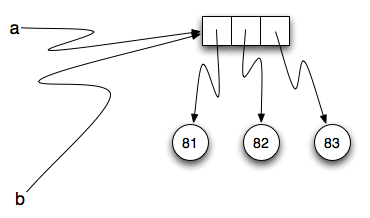
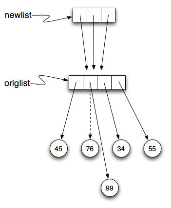

..  Copyright (C)  Brad Miller, David Ran-um, Jeffrey Elkner, Peter Wentworth, Allen B. Downey, Chris
    Meyers, and Dario Mitchell.  Permission is granted to copy, distribute
    and/or modify this document under the terms of the GNU Free Documentation
    License, Version 1.3 or any later version published by the Free Software
    Foundation; with Invariant Sections being Forward, Prefaces, and
    Contributor List, no Front-Cover Texts, and no Back-Cover Texts.  A copy of
    the license is included in the section entitled "GNU Free Documentation
    License".
    
..  shortname:: Listas
..  description:: Tipo de dado lista em python

.. index:: lista, elemento, item, sequência, coleção    
    
Listas
=======

Uma **lista** (*list*) em Python é uma sequência ou coleção ordenada
de valores.  Cada valor na lista é identificado por um índice.  O
valores que formam uma lista são chamados **elementos** ou **itens**.
Listas são similares a strings, que são uma sequência de caracteres,
no entanto, diferentemente de strings, os itens de uma lista podem ser
de tipos diferentes.

.. A **list** is a sequential collection of Python data values, where
   each value is identified by an
.. index. The values that make up a list are called its **elements**. Lists are
.. similar to strings, which are ordered collections of characters,
   except that the
.. elements of a list can have any type and for any one list, the
   items can be of different types.
 

.. index:: lista aninhada; lista; aninhada

.. List Values
.. -----------

Valores em uma lista
--------------------

.. There are several ways to create a new list.  The simplest is to enclose the
.. elements in square brackets ( ``[`` and ``]``).

Existem várias maneiras de se criar uma nova lista.
A maneira mais simples é envolver os elementos da lista por colchetes  
( ``[`` e ``]``).

.. sourcecode:: python
    
    [10, 20, 30, 40]
    ["spam", "bungee", "swallow"]

.. The first example is a list of four integers. The second is a list of three
.. strings. As we said above, the elements of a list don't have to be the same type.  The following
.. list contains a string, a float, an integer, and
.. another list.

O primeiro exemplo é uma lista de quatro inteiros.
O segundo é uma lista de três strings.
Como dissemos anteriormente, os elementos de uma lista não precisam
ser do mesmo tipo. A lista a seguir contém um string, um float, um
inteiro e uma outra lista.

.. sourcecode:: python
    
    ["oi", 2.0, 5, [10, 20]]

.. A list within another list is said to be **nested** and the inner list is often called a **sublist**.
.. Finally, there is a special list that contains no elements. It is called the
.. empty list, and is denoted ``[]``.

Um lista em uma outra lista é dita **aninhada** (*nested*) e a lista
mais interna é chamada frequentemente de **sublista** (*sublist*).
Finalemente, existe uma lista especial que não contém elemento
algum. Ela é chamada de lista vazia e é denotada por ``[]``.

.. As you would expect, we can also assign list values to variables
   and pass lists as parameters to functions.

Como você esperaria, podemos também atribuir listas a variáveis 
e termos listas como parâmetro de funções.

.. activecode:: chp09_01

    vocabulario = ["iteracao", "selecao", "controle"]
    numeros = [17, 123]
    vazia = []
    lista_mista = ["ola", 2.0, 5*2, [10, 20]]

    print(numeros)
    print(lista_mista)
    nova_lista = [numeros, vocabulario]
    print(nova_lista)

**Teste seu entendimento**

.. mchoice:: test_question9_1_1 
   :answer_a: Falso
   :answer_b: Verdadeiro
   :correct: a
   :feedback_a: Diferentemente de strings, listas podem ser formadas por valores de tipos diferentes.
   :feedback_b: Listas são heterogêneas, o que significa que elas podem ter valores de tipos diferentes. 

   Uma lista só pode conter números inteiros?

.. index:: índices de listas;, índices; list traversal

Comprimento de uma lista
------------------------

.. As with strings, the function ``len`` returns the length of a list (the number
.. of items in the list).  However, since lists can have items which are themselves lists, it important to note
.. that ``len`` only returns the top-most length.  In other words, sublists are considered to be a single
.. item when counting the length of the list.

Da mesma forma que occore com strings, a função ``len`` retorna o
comprimento de uma lista (o número de elementos na lista).
Entretanto, como listas podem conter itens que são listas, é
importante notar que ``len`` somente retorna o comprimento da lista
mais externa. Em outras palavras, sublistas de uma lista são
consideradas como sendo um elemento simples quando contamos o
comprimento da lista.

.. activecode:: chp09_01a

    uma_lista =  ["ola", 2.0, 5, [10, 20]]
    print(len(uma_lista))
    print(len(['spam!', 1, ['Brie', 'Roquefort', 'Pol le Veq'], [1, 2, 3]]))

**Teste seu entendimento**

.. mchoice:: test_question9_2_1 
   :answer_a: 4
   :answer_b: 5
   :correct: b
   :feedback_a: len retorna o número de itens em uma lista, não o maior índice
   :feedback_b: Sim, a lista é formada por 5 itens.

   O que é impresso pelo trecho de código a seguir?
   
   <pre>
   uma_lista = [3, 67, "gato", 3.14, False]
   print(len(uma_lista))
   </pre>
   
.. mchoice:: test_question9_2_2
   :answer_a: 7
   :answer_b: 8
   :correct: a
   :feedback_a: Sim, existem 7 itens na lista, sendo que dois itens são listas.
   :feedback_b: len retorna o número de itens na lista. O número de itens nas sublistas não são contados.

   O que é impresso pelo trecho de código a seguir?
   
   <pre>
   uma_lista = [3, 67, "gato", [56, 57, "cachorro"], [ ], 3.14, False]
   print(len(uma_lista))
   </pre> 
   

Acessando os elementos
----------------------

.. The syntax for accessing the elements of a list is the same as the syntax for
.. accessing the characters of a string.  We use the index operator ( ``[]`` -- not to
.. be confused with an empty list). The expression inside the brackets specifies
.. the index. Remember that the indices start at 0.  Any integer expression can be used
.. as an index and as with strings, negative index values will locate items from the right instead
.. of from the left.

A sintaxe para acessar um elemento de uma lista é a mesma usada para
acessar um caractere de um string. Nós usamos o operador de indexação
( ``[]`` -- não confundir com a lista vazia). A expressão dentro dos
conchetes especifica o índice. Lembrar que o índice do primeiro
elemento é 0. Qualquer expressão que tenha como resultado um número
inteiro pode ser usada como índice e como com strings, índices
negativos indicarão elementos da direita para a esquerda ao invés de
da esquerda para a direita. 

.. activecode:: chp09_02
    
    numeros = [17, 123, 87, 34, 66, 8398, 44]
    print(numeros[2])
    print(numeros[9-8])
    print(numeros[-2])
    print(numeros[len(numeros)-1])
    
**Teste seu entendimento**
 
.. mchoice:: test_question9_3_1
   :answer_a: [ ]
   :answer_b: 3.14
   :answer_c: False
   :correct: b
   :feedback_a: O índice da lista vazia é 4.
   :feedback_b: Sim, 3.14 é o item de índice 5 já que o índice do primeiro elemento é 0 e sublistas contam com um elemento.
   :feedback_c: False é o item de índice 6.
   
   O que é impresso pelo trecho de código a seguir?
   
   <pre>
   uma_lista = [3, 67, "gato", [56, 57, "cachorro"], [ ], 3.14, False]
   print(uma_lista[5])
   </pre>
   
.. mchoice:: test_question9_3_2
   :answer_a: Error, you cannot use the upper method on a list.
   :answer_b: 2
   :answer_c: GATO
   :correct: c
   :feedback_a: uma_list[2] é o string 'gato' logo o método upper (maiúsculo) é legal.
   :feedback_b: 2 é o índice.  Nós querenos o item que tem esse índice.
   :feedback_c: Sim, o string 'gato' transformado pelo método upper em maiúsculo é GATO.
   
   O que é impresso pelo trecho de código a seguir?

   <pre>
   uma_lista = [3, 67, "gato", [56, 57, "cachorro"], [ ], 3.14, False]
   print(uma_lista[2].upper())
   </pre>
   
.. mchoice:: test_question9_3_3
   :answer_a: 56
   :answer_b: g
   :answer_c: gato
   :answer_d: Error, you cannot have two index values unless you are using slicing.
   :correct: b
   :feedback_a: Índices começam de 0 e não de 1.
   :feedback_b: Sim, o primeiro caractere do string de índice 2 é g.
   :feedback_c: 'gato' é o item de índice 2, mas devemos determinar ainda o caractere de índice 0.
   :feedback_d: Usar mais de um índice é correto.  Você deve ler da esquerda para a direita.
   
   O que é impresso pelo trecho de código a seguir?
   
   <pre>
   uma_lista = [3, 67, "gato", [56, 57, "cachorro"], [ ], 3.14, False]
   print(uma_lista[2][0])
   </pre>
   
.. List Membership

Pertinência em uma Lista
------------------------

.. ``in`` and ``not in`` are boolean operators that test membership in a sequence. We
.. used them previously with strings and they also work here.

``in`` e ``not in`` são operadores booleanos ou lógicos que testam a pertinência
(*membership*) em uma sequência. Já usamos esses operadores com
strings e eles também funcionam aqui.

.. activecode:: chp09_4
    
    frutas = ["maca", "laranja", "banana", "cereja"]

    print("maca" in frutas)
    print("pera" in frutas)

**Teste seu entendimento**

.. mchoice:: test_question9_4_1
   :answer_a: True
   :answer_b: False
   :correct: a
   :feedback_a: Sim, 3.14 é um item da lista uma_lista.
   :feedback_b: Existem 7 itens na lista, 3.14 é um deles. 
   
   O que é impresso pelo trecho de código a seguir?

   <pre>
   uma_lista = [3, 67, "gato", [56, 57, "cachorro"], [ ], 3.14, False]
   print(3.14 in uma_lista)
   </pre>

.. mchoice:: test_question9_4_2
   :answer_a: True
   :answer_b: False
   :correct: b
   :feedback_a: É retornado True apenas para itens na lista mais externa.  57 é um item de uma sublista.
   :feedback_b: Sim, 57 não é um item da lista mais externa.  57 é um item de uma sublista.
   
   O que é impresso pelo trecho de código a seguir?
   
   <pre>
   uma_lista = [3, 67, "gato", [56, 57, "cachorro"], [ ], 3.14, False]
   print(57 in uma_lista)
   </pre>

.. Concatenation and Repetition

Concatenação e repetição
------------------------

.. Again, as with strings, the ``+`` operator concatenates lists.  
.. Similarly, the ``*`` operator repeats the items in a list a given number of times.

Novamente, como com strings, o operador ``+`` concatena listas.
Analogamente, o operador ``*`` repete os itens em uma lista 
um dado número de vezes.

.. activecode:: chp09_5

    frutas = ["maca", "laranja", "banana", "cereja"]
    print([1, 2] + [3, 4])
    print(frutas + [6, 7, 8, 9])

    print([0] * 4)
    print([1, 2, ["ola", "adeus"]]*2)

.. It is important to see that these operators create new lists from the
.. elements of the operand lists.  If you concatenate a list with 2 items
.. and a list with 4 items, you will get a new list with 6 items (not a
.. list with two sublists).  Similarly, repetition of a list of 2 items 4
.. times will give a list with 8 items.

É importante perceber que esses operadores criam novas listas a partir
dos elementos da lista dada. Se você concatena uma lista com 2 itens
com uma lista com 4 itens, você obterá uma nova lista com 6 itens (não
uma lista com duas sublistas). Similarmente, repetição de uma lista de 2
itens 4 vezes resultará em uma lista com 8 itens.
 

.. One way for us to make this more clear is to run a part of this
.. example in codelens.  As you step thru the code, you will see the
.. variables being created and the lists that they refer to.  Pay
.. particular attention to the `id` tag that is shown after the data type
.. descriptor (``list (id = 12)``).  The **id** in Python corresponds to
.. a unique identifier for that particular object.  You can tell if you
.. have different objects by comparing the ids.

Uma maneira de fazermos isto mais claro é executar uma parte desses
exemplos no codelens. A medida que cada passo do código é executado,
você verá as variáveis sendo criadas e as listas as quais elas  se referem.
Preste atenção particularmente ao rótulo (*tag*) `id` que é mostrado
depois do descritor do tipo de dado (``list (id = 12))``). Em Python o
**id** corresponde a um único identificador para aquele objeto
particular.  Você pode dizer se são objetos diferentes através da
comparação dos seus ids. 
 
 

.. codelens:: chp09_concatid

    frutas = ["maca", "laranja", "banana", "cereja"]
    num_lista = [6,7]

    nova_lista = frutas + num_lista

    zeros = [0] * 4

.. The statement ``newlist = fruit + numlist`` creates a new list object
.. with the contents of the list ``fruit`` followed by the contents of the
.. list ``numlist``. We can see it is a new list by looking at the ids.
.. The id of ``newlist`` is not the same as the others.  It is extremely
.. important to know whether you are creating a new list or just modifying
.. an existing list.  Again, the ids can help.

O comando ``nova_lista = frutas + num_lista`` cria uma nova lista de
objetos com o contéudo da lista ``frutas`` seguido pelo conteúdo da lista
``num_lista``. Podemos ver que está é uma lista nova olhando os ids.
O id da ``nova_lista`` não e o mesmo que o das outras. É extremamente
importante que você saiba quando está criando uma nova lista ou apenas
alterando uma lista existente. Novamente, os ids podem ajudar nessa
tarefa.

.. In Python, there is a built-in function that can be called on any object
.. to return its unique id.  The function is appropriately called ``id``
.. and takes a single parameter, the object that you are interested in
.. knowing about.  You can see in the example below that a real id is
.. usually a very large integer value (corresponding to an address in
.. memory).

Python possui uma função nativa (*build-in*) que recebe um objeto
como argumento e retorna o seu id. A função é comvenientemente chamada
de ``id`` e tem um único parâmetro, o objeto que você está interessado
em descobrir o id. Você pode ver no examplo abaixo que o id real é
usualmente um número inteiro muito grande (correspondente a um endereço
na memória).

.. sourcecode:: python

    >>> uma_lista = [4,5,6]
    >>> id(uma_lista)
    4300840544
    >>> 

**Teste seu entendimento**

.. mchoice:: test_question9_5_1
   :answer_a: 6
   :answer_b: [1,2,3,4,5,6]
   :answer_c: [1,3,5,2,4,6]
   :answer_d: [3,7,11]
   :correct: c
   :feedback_a: Concatenação não soma soma os comprimentos da listas.
   :feedback_b: Concatenação não reordena os itens. 
   :feedback_c: Sim, uma nova lista com os itens da primeira lista seguidos pelos itens da segunda lista.
   :feedback_d: Concatenação não adiciona os itens da listas.
   
   O que é impresso pelo trecho de código a seguir?
   
   <pre>
   uma_lista = [1, 3, 5]
   outra_lista = [2, 4, 6]
   print(uma_lista + outra_lista)
   </pre>
   
   
.. mchoice:: test_question9_5_2
   :answer_a: 9
   :answer_b: [1, 1, 1, 3, 3, 3, 5, 5, 5]
   :answer_c: [1, 3, 5, 1, 3, 5, 1, 3, 5]
   :answer_d: [3, 9, 15]
   :correct: c
   :feedback_a: Repetição não multiplica o comprimento das listas. Ela repete os itens.
   :feedback_b: Repetição não repete cada item individualmente.
   :feedback_c: Sim, a lista é repetida 3 vezes inteiramente, uma vez atrás da outra.
   :feedback_d: Repetição não multiplica os itens da lista individualmente.

   O que é impresso pelo trecho de código a seguir?
   
   <pre>
   uma_lista = [1, 3, 5]
   print(uma_lista * 3)
   </pre>

   

.. List Slices

Fatias de listas 
-----------------

.. The slice operation we saw with strings also work on lists.  
.. Remember that the first index the starting point for the slice 
.. and the second number is one index past the end of the slice 
.. (up to but not including that element).

A operação de fatiar (*slice*) que  vimos com strings também pode ser
aplicada sobre listas. Lembre que o primeiro índice indica o ponto do
início da fatia e o segundo índice é um depois do final da fatia (o
elemento com esse índice não faz parte da fatia).

.. activecode:: chp09_6
    
    uma_lista = ['a', 'b', 'c', 'd', 'e', 'f']
    print(uma_lista[1:3])
    print(uma_lista[:4])
    print(uma_lista[3:])
    print(uma_lista[:])

**Teste seu entendimento**

.. mchoice:: test_question9_6_1
   :answer_a: [ [ ], 3.14, False]
   :answer_b: [ [ ], 3.14]
   :answer_c: [ [56, 57, "cachorro"], [ ], 3.14, False]
   :correct: a
   :feedback_a: Sim, a fatia começa no item de índice 4 e termina no  último item da lista.
   :feedback_b: Não colocando o limite superior da fatia incluímos até o último item.
   :feedback_c: Índices começam de 0.
   
   O que é impresso pelo trecho de código a seguir?
   
   <pre>
   uma_lista = [3, 67, "gato", [56, 57, "cachorro"], [ ], 3.14, False]
   print(uma_lista[4:])
   </pre>

.. index:: mutável; atribuição de item; imutável
    
.. Lists are Mutable

Listas são mutáveis
-------------------

.. Unlike strings, lists are **mutable**.  This means we can change an item
.. in a list by accessing it directly as part of the assignment
.. statement. Using the indexing operator (square brackets) on the left
.. side of an assignment, we can update one of the list items.

Diferentemente de strings, listas são **mutáveis** (*mutable*). 
Isto significa que podemos alterar um item em uma lista acessando-o
diretamente como parte do comando de atribuição. Usando o operador e
indexação (colchetes) à esquerda de um comando de atribuição, podemos
atualizar um dos itens de uma lista. 

.. activecode:: ch09_7
    
    frutas = ["banana", "maca", "cereja"]
    print(frutas)

    frutas[0] = "pera"
    frutas[-1] = "laranja"
    print(frutas)

.. An
.. assignment to an element of a list is called **item assignment**. Item
.. assignment does not work for strings.  Recall that strings are immutable.

Uma atribuição a um elemento de uma lista é chamada de **atribuição a um
item** (*item assignment*). Atribuição a itens não funciona com strings.
Lembre-se que strings são imutáveis.

.. Here is the same example in codelens so that you can step thru the
.. statements and see the changes to the list elements.

Aqui está o mesmo exemplo com o codelens para que você possa executar 
comando após comando e veja as mudanças na lista de elementos.

.. codelens:: item_assign
    
    frutas = ["banana", "maça", "cereja"]

    frutas[0]  = "pera"
    frutas[-1] = "laranja"

.. By combining assignment with the slice operator we can update several elements at once.

Combinando uma atribuição com o operador de fatiamento podemos atualizar
vários elementos de uma só vez.

.. activecode:: ch09_8
    
    uma_lista = ['a', 'b', 'c', 'd', 'e', 'f']
    uma_lista[1:3] = ['x', 'y']
    print(uma_lista)

.. We can also remove elements from a list by assigning the empty list to them.

Também podemosremover elementos de uma lista atribuindo a lista vazia a
eles.

.. activecode:: ch09_9
    
    uma_lista = ['a', 'b', 'c', 'd', 'e', 'f']
    uma_lista[1:3] = []
    print(uma_lista)

.. We can even insert elements into a list by squeezing them into an empty slice at the
.. desired location.

Podemos inserir elementos em uma lista espremendo-os em uma fatia vazia
na posição desejada.

.. activecode:: ch09_10
    
    uma_lista = ['a', 'd', 'f']
    uma_lista[1:1] = ['b', 'c']
    print(uma_lista)
    uma_lista[4:4] = ['e']
    print(uma_lista)

**Teste seu entendimento**

.. mchoice:: test_question9_7_1
   :answer_a: [4, 2, True, 8, 6, 5]
   :answer_b: [4, 2, True, 6, 5]
   :answer_c: Erro, é uma atribuição ilegal
   :correct: b
   :feedback_a: Atribuição de item não insere o novo item na lista.
   :feedback_b: Sim, o valor True é colocado na posição de índice 2 da lista, 8 é trocado por True.
   :feedback_c: Atribuição de item é permida em listas.  Listas são mutáveis.
   
   O que é impresso pelo trecho de código a seguir?
   
   <pre>
   uma_lista = [4, 2, 8, 6, 5]
   uma_lista[2] = True
   print(uma_lista)
   </pre>

.. index:: comando del; comando; del

.. List Deletion

Remoção em listas 
-----------------

.. Using slices to delete list elements can be awkward, and therefore error-prone.
.. Python provides an alternative that is more readable.
.. The ``del`` statement removes an element from a list by using its position.

Usando fatiamento para remover elementos de uma lista pode ser complicado,
e portanto propagador de erros. Python oferece uma maneira alternativa
que é mais legível. O comando ``del`` remove um elemento de uma lista
usando a sua posição.

.. activecode:: ch09_11
    
    a = ['um', 'dois', 'três']
    del a[1]
    print(a)

    lista = ['a', 'b', 'c', 'd', 'e', 'f']
    del lista[1:5]
    print(lista)

Como você pode esperar, ``del`` também manipula índices negativos e
produz um erro de execução se o índice estiver foram do intervalo da
lista. Além disso, você pode usar uma fatia como argumento para ``del``.
Como é usual, fatias selecionam todos os elementos até, mas não
incluindo, o segundo índice.

.. As you might expect, ``del`` handles negative indices and causes a runtime
.. error if the index is out of range.
.. In addition, you can use a slice as an index for ``del``.
.. As usual, slices select all the elements up to, but not including, the second
.. index.

.. index:: operador is; is; objetos e valores

.. Objects and References

Objetos e referências
---------------------

.. If we execute these assignment statements,

Se executamos as seguintes atribuições,
 
.. sourcecode:: python
    
    a = "banana"
    b = "banana"

.. we know that ``a`` and ``b`` will refer to a string with the letters
.. ``"banana"``. But we don't know yet whether they point to the *same* string.

sabemos que ``a`` e ``b`` farão referência ao string
``"banana"``. Entretanto,
ainda não sabemos se eles se referem ao *mesmo* string.
 

.. There are two possible ways the Python interpreter could arrange its internal states:

Existem duas possibilidades para o Python interpretar internamente essas
atribuições:

.. image:: Figures/refdiag1.png
   :alt: List illustration 

ou

.. In one case, ``a`` and ``b`` refer to two different string objects
.. that have the same value. In the second case, they refer to the same
.. object. Remember that an object is something a variable can refer to.

Em uma das interpretações ``a`` e ``b`` se referem a dois strings ou objetos
diferentes que têm o mesmo valor. Na segunda interpretação, eles se
referem ao mesmo objeto. Lembre-se que um objeto é uma valor ao qual uma
variável pode se referir ou apontar. 
 
.. We already know that objects can be identified using their unique
.. identifier.  We can also test whether two names refer to the same object
.. using the *is* operator.  The *is* operator will return true if the two
.. references are to the same object.  In other words, the references are
.. the same.  Try our example from above.

Já sabemos que objetos podem ser identificados usando seus
identificadores que são únicos. Podemos também testar se dois nomes se
referem ao mesmo objeto usando o operador ``is``. O operador *is*
retorna ``True`` se as duas referências são ao mesmo objeto. Em outras
palavras, as referências são a mesma. Teste esse conceito com os
exemplos acima.
 
.. activecode:: chp09_is1

    a = "banana"
    b = "banana"

    print(a is b)

.. The answer is ``True``.  This tells us that both ``a`` and ``b``
.. refer to the same object, and that it is the second of the two
.. reference diagrams that describes the relationship.  Since strings
.. are *immutable*, Python optimizes resources by making two
.. names.. that refer to the same string value refer to the same object.

A resposta é ``True``. Isto nos diz que ambos ``a`` e ``b`` se referem
ao mesmo objeto, e que o segundo dos diagramas de referências descreve a
relação. Como strings são *imutáveis* (*immutable*), Python optimiza
recursos fazendo dois que se referem ao mesmo string se referirem ao
mesmo objeto.

.. This is not the case with lists.  Consider the following example.  Here,
.. ``a`` and ``b`` refer to two different lists, each of which happens to
.. have the same element values.

Este não é o caso com listas. 
Considere o exemplo seguir. Aqui ``a`` e
``b`` se referem a duas listas diferentes, cada uma por acaso tem os 
mesmo elementos como valores.

.. activecode:: chp09_is2
    
    a = [81, 82, 83]
    b = [81, 82, 83]

    print(a is b)

    print(a == b)  

.. The reference diagram for this example looks like this:

O diagrama de referências para este exemplo se parece com o seguinte.

.. image:: Figures/refdiag3.png
   :alt: Reference diagram for equal different lists 

.. ``a`` and ``b`` have the same value but do not refer to the same object.

``a`` e ``b`` tem o mesmo valor mas não se referem ao mesmo objeto.

.. There is one other important thing to notice about this reference
.. diagram.  The variable ``a`` is a reference to a **collection of
.. references**.  Those references actually refer to the integer values in
.. the list.  In other words, a list is a collection of references to
.. objects.  Interestingly, even though ``a`` and ``b`` are two different
.. lists (two different collections of references), the integer object
.. ``81`` is shared by both.  Like strings, integers are also immutable so
.. Python optimizes and lets everyone share the same object.

Existe ainda um outro ponto importante a ser notado a respeito
desse diagrama de referências. O valor ``a`` é uma referência a uma
**coleção de referências** (*collection of references*). Essas
referências na realidade se referem a valores inteiros em uma lista. Em
outras palavras, um lista é uma coleção de referências para objetos.
É interessante que apesar de ``a`` e ``b`` serem duas listas distintas 
(duas coleções de diferentes de referências), o objeto inteiro ``81`` é
compartilhado por ambos. Como strings, inteiros são também imutáveis
portanto Python optimiza e permite que todos compartilhem o mesmo objeto.

.. Here is the example in codelens.  Pay particular attention to the `id` values.

Aqui esta o exemplo no codelens. 
Preste atenção particularmente nos valores dos `id`.
 
.. codelens:: chp09_istrace
    :showoutput:
 
    a = [81, 82, 83]
    b = [81, 82, 83]

    print(a is b)
    print(a == b)

.. index:: aliases, apelidos

.. Aliasing
.. --------

Apelidos (*Aliasing*)
---------------------

.. Since variables refer to objects, if we assign one variable to another, both
.. variables refer to the same object:

Como variáveis fazem referência a objetos, se atribuimos uma variável
a outra, ambas as variáveis passam a fazer referência ao mesmo objeto.

.. activecode:: listalias1
    
    a = [81, 82, 83]
    b = a
    print(a is b)
    
.. In this case, the reference diagram looks like this:

Nesse caso, o diagrama de referências se parece com:

.. Because the same list has two different names, ``a`` and ``b``, we say
.. that it is **aliased**. Changes made with one alias affect the other.
.. In the codelens example below, the `ids` of ``a`` and ``b`` become the
.. same after executing the assignment statement ``b = a``.

Como a mesma lista tem dois nomes diferentes, ``a`` e ``b``, dizemos
que a lista tem **apelidos** (*aliased*). 
Mudanças feitas com um apelido afeta o outro.
No exemplo do codelens a seguir, os `ids` de ``a`` e ``b`` são os mesmos
depois da execução do comando de atribuição ``b = a``. 

.. codelens:: chp09_is3
    :showoutput:
    
    a = [81, 82, 83]
    b = [81, 82, 83]

    print(a == b)
    print(a is b)

    b = a
    print(a == b)
    print(a is b)

    b[0] = 5
    print(a)
    

.. Although this behavior can be useful, it is sometimes unexpected or
.. undesirable. In general, it is safer to avoid aliasing when you are working
.. with mutable objects. Of course, for immutable objects, there's no problem.
.. That's why Python is free to alias strings and integers when it sees an opportunity to
.. economize.

Apesar desse comportamento ser útil, ele é algumas vezes inesperado
ou indesejável. Em geral, é mais seguro evitar apelidos (*aliasing*)
quando você está trabalhando com objetos mutáveis. 
É evidente que com objetos imutáveis não há problema. 
Por isto, Python é livre para usar apelidos (*alias*) de strings e
inteiros quando surge uma oportunidade para economizar espaço.

**Teste seu entendimento**

.. mchoice:: test_question9_10_1
   :answer_a: [4, 2, 8, 6, 5]
   :answer_b: [4, 2, 8, 999, 5]
   :correct: b
   :feedback_a: lista_b não é uma cópia de a_lista, ela é uma referência para a lista a qual lista_a faz referência.
   :feedback_b: Sim, como lista_a e lista_b fazem referência a mesma lista, mudança em uma também altera a outra.
   
   O que é impresso pelo trecho de código a seguir?
   
   <pre>
   lista_a = [4, 2, 8, 6, 5]
   lista_b = lista_a
   lista_b[3] = 999
   print(lista_a)
   </pre>

.. index:: clone

.. Cloning Lists

Clonando listas 
---------------

.. If we want to modify a list and also keep a copy of the original, we need to be
.. able to make a copy of the list itself, not just the reference. This process is
.. sometimes called **cloning**, to avoid the ambiguity of the word copy.

Se desejamos modificar uma lista e também manter uma cópia da lista
original, temos que ser capazes de fazer uma cópia da lista, não apenas
da referência. Este processo é algumas vezes chamado de **clonar**
(*cloning*), para evitar a ambiguidade da palavra cópia.

.. The easiest way to clone a list is to use the slice operator.

A maneira mais fácil de clonarmos uma lista é usar o operador de 
fatiação.

.. Taking any slice of ``a`` creates a new list. In this case the slice happens to
.. consist of the whole list.

Tomar qualquer fatia de ``a`` cria uma nova lista.
Para clonar uma lista basta tomarmos a fatia como sendo a lista toda.

.. codelens:: chp09_is4
    :showoutput:
    
    a = [81, 82, 83]

    b = a[:]       # cria um clone com fatia
    print(a == b)
    print(a is b)

    b[0] = 5

    print(a)
    print(b)

.. Now we are free to make changes to ``b`` without worrying about ``a``.
.. Note also that the `id` of b is different from the ``id`` of a.  It is
.. an entirely different list.

Agora estamos livres para modicar ``b`` sem nos preocuparmos com ``a``.
Note também que o ``id`` de b é diferente do ``id`` de a. Ela é uma lista
completamente diferente.

.. Repetition and References

Repetições e referências
------------------------

.. We have already seen the repetition operator working on strings as well
.. as lists.  For example,

Já vimos que o operador de repetição trabalho sobre strings e também sobre 
listas.  Por exemplo.

.. activecode:: repref1

    lista_original = [45, 76, 34, 55]
    print(lista_original*3)

.. With a list, the repetition operator creates copies of the references.
.. Although this may seem simple enough, when we allow a list to refer to
.. another list, a subtle problem can arise.

Como uma lista, o operador de repetição cria cópias das referências.
Apesar desse comportamento parecer simples, quando permitimos 
que uma lista ter referências a uma outra lista, podemos nos confrontar
com alguns problemas sutis.

.. Consider the following extension on the previous example.

Considere a seguinte extensão do exemplo anterior.

.. activecode:: repref2

    lista_original = [45, 76, 34, 55]
    print(lista_original*3)

    lista_nova = [lista_original] * 3

    print(lista_nova)

.. ``lista_nova`` is a list of three references to ``origlist`` that were
.. created by the repetition operator.  The reference diagram is shown
.. below.

``lista_nova`` é uma lista com três referências para a ``lista_original``
que foram criadas pelo operador de repetição.

.. image:: Figures/refrep1.png
   :alt: Repetition of a nested list

.. Now, what happens if we modify a value in ``origlist``.

Agora, o que acontece se modificamos um valor da ``lista_original``?

.. activecode:: repref3

    lista_original = [45, 76, 34, 55]

    lista_nova = [lista_original] * 3

    print(lista_nova)

    lista_original[1] = 99

    print(lista_nova)

.. ``newlist`` shows the change in three places.  This can easily be seen
.. by noting that in the reference diagram, there is only one ``origlist``,
.. so any changes to it appear in all three references from ``newlist``.

``lista_nova`` mostra a mudança em três lugares.  Isto pode ser
facilmente entendido através do diagrama de referências, já que existe
apenas uma ``lista_original``. Logo, qualquer alteração na
``lista_original`` aparece em cada uma das três referências da
``nova_lista``.

.. Here is the same example in codelens.  
.. Step through the code until paying particular attention to the result
.. of executing the assignment statement ``origlist[1] = 99``.

Aqui está o mesmo exemplo no codelens.
Execute o código passo a passo e preste particular atenção
à execução do comando de atribuição ``lista_original[1] = 99``. 

.. codelens:: reprefstep
    :showoutput:

    lista_original = [45, 76, 34, 55]

    lista_nova = [lista_original] * 3

    print(lista_nova)

    lista_original[1] = 99

    print(lista_nova)

**Teste seu entendimento**

.. mchoice:: test_question9_12_1
   :answer_a: [4, 2, 8, 999, 5, 4, 2, 8, 6, 5]
   :answer_b: [4, 2, 8, 999, 5]
   :answer_c: [4, 2, 8, 6, 5]
   :correct: c
   :feedback_a: print(lista_a) não print(lista_b)
   :feedback_b: lista_b é alterada, lista_a não é.
   :feedback_c: Sim, lista_a não foi alterada pela atribuição. lista_b é uma cópia das referência na lista a.
   
   O que é impresso pelo trecho de código a seguir?
   
   <pre>
   lista_a = [4, 2, 8, 6, 5]
   lista_b = lista_a * 2
   lista_b[3] = 999
   print(lista_a)
   </pre>

.. mchoice:: test_question9_12_2
   :answer_a: [4,2,8,999,5,4,2,8,999,5]
   :answer_b: [[4,2,8,999,5],[4,2,8,999,5]]
   :answer_c: [4,2,8,6,5]
   :answer_d: [[4,2,8,999,5],[4,2,8,6,5]]
   :correct: b
   :feedback_a: [lista_a] * 2 cria uma lista contendo a lista_a repetida 2 vezes
   :feedback_b: Sim, lista_b contém duas referência, ambas para a lista_a.
   :feedback_c: print(lista_b)
   :feedback_d: lista_b contém duas referências, ambas para lista_a. Logo, alterações na lista_a aparecem em ambas as referências.
   
   O que é impresso pelo trecho de código a seguir?
   
   <pre>
   lista_a = [4, 2, 8, 6, 5]
   lista_b = [lista_a] * 2
   lista_a[3] = 999
   print(lista_b)
   </pre>

.. index:: lista; concatenação; append

.. List Methods

Métodos de listas
-----------------

.. The dot operator can also be used to access built-in methods of list objects.  
.. ``append`` is a list method which adds the argument passed to it to the end of
.. the list. Continuing with this example, we show several other list methods.  Many of them are
.. easy to understand.  

O operador ponto também pode ser usado para acessar métodos nativos
(*built-in*) de objetos que são listas. ``append`` é um método de listas
que insere o argumento passado para ele no final da lista. 
O exemplo a seguir mostra vários outros métodos. 
Alguns deles são muito fáceis de serem compreendidos.

.. activecode:: chp09_meth1

    minha_lista = []
    minha_lista.append(5)
    minha_lista.append(27)
    minha_lista.append(3)
    minha_lista.append(12)
    print(minha_lista)

    minha_lista.insert(1, 12)
    print(minha_lista)
    print(minha_lista.count(12))

    print(minha_lista.index(3))
    print(minha_lista.count(5))

    minha_lista.reverse()
    print(minha_lista)

    minha_lista.sort()
    print(minha_lista)

    minha_lista.remove(5)
    print(minha_lista)

    ultimo_item = minha_lista.pop()
    print(ultimo_item)
    print(minha_lista)

.. There are two ways to use the ``pop`` method.  The first, with no
.. parameter, will remove and return the last item of the list.  If you
.. provide a parameter for the position, ``pop`` will remove and return the
.. item at that position.  Either way the list is changed.

Existem duas maneiras de usar o método ``pop`` .
A primeira, sem parâmetros, remove e retorna o último item da lista.
Se for dado um argumento para a posição, ``pop`` remove e
retorna o item da posição. De qualquer maneira a lista é alterada.

.. The following table provides a summary of the list methods shown above.
.. Be sure to experiment with these methods to gain a better understanding
.. of what they do.

A tabela a seguir mostra um resumo dos métodos de listas mostrados acima.
Faça testes com esses métodos para ganhar uma melhor compreensão do que 
eles fazem. 

..
   ==========  ==============  ============  ================================================
   Method      Parameters       Result       Description
   ==========  ==============  ============  ================================================
   append      item            mutator       Adds a new item to the end of a list
   insert      position, item  mutator       Inserts a new item at the position given
   pop         none            hybrid        Removes and returns the last item
   pop         position        hybrid        Removes and returns the item at position
   sort        none            mutator       Modifies a list to be sorted
   reverse     none            mutator       Modifies a list to be in reverse order
   index       item            return idx    Returns the position of first occurrence of item
   count       item            return ct     Returns the number of occurrences of item
   remove      item            mutator       Removes the first occurrence of item
   ==========  ==============  ============  ================================================

==========  ==============  ============  ================================================
Método      Parâmetros      Resultado     Descrição
==========  ==============  ============  ================================================
append      item            mutador       Acrescenta um novo item no final da lista
insert      posição, item   mutador       Insere um novo item na posição dada
pop         nenhum          híbrido       Remove e returno o último item
pop         posição         híbrido       Remove e retorna o item da posição.
sort        nenhum          mutador       Ordena a lista
reverse     nenhum          mutador       Ordena a lista em ordem reversa
index       item            retorna idx   Retorna a posição da primeira ocorrência do item
count       item            retorna ct    Retorna o número de ocorrências do item
remove      item            mutador       Remove a primeira ocorrência do item
==========  ==============  ============  ================================================

..
   Details for these and others can be found in the `Python Documentation
   <http://docs.python.org/py3k/library/stdtypes.html#sequence-types-str-bytes-bytearray-list-tuple-range>`_.

Detalhes desses e de outros métodos podem ser vistos em `Python Documentation
<http://docs.python.org/py3k/library/stdtypes.html#sequence-types-str-bytes-bytearray-list-tuple-range>`_.

..
   It is important to note that ``append``, ``sort``, and ``reverse`` all
   return ``None``.  This means that re-assigning ``minha_lista`` to the result
   of sorting ``minha_lista`` will result in losing the entire list.

É importante notar que ``append``, ``sort``, e ``reverse`` retornam ``None``.
Isto significa que atribuira a ``minha_lista`` o resultado da
ordenação de ``minha_lista`` resultará na perda da lista.

.. activecode:: chp09_meth2

    minha_lista = []
    minha_lista.append(5)
    minha_lista.append(27)
    minha_lista.append(3)
    minha_lista.append(12)
    print(minha_lista)

    minha_lista = minha_lista.sort()   # possivel erro
    print(minha_lista)

**Teste seu entendimento**

.. mchoice:: test_question9_13_1
   :answer_a: [4, 2, 8, 6, 5, False, True]
   :answer_b: [4, 2, 8, 6, 5, True, False]
   :answer_c: [True, False, 4, 2, 8, 6, 5]
   :correct: b
   :feedback_a: True foi inserido primeiro, False foi inserido por último.
   :feedback_b: Sim, cada item é inserido no final da lista.
   :feedback_c: append insere um item no final da lista e não no início.

..   :feedback_a: True was added first, then False was added last.
..   :feedback_b: Yes, each item is added to the end of the list.
..   :feedback_c: append adds at the end, not the beginning.
   
   O que é impresso pelo trecho de código a seguir?
   
   <pre>
   uma_lista = [4,2,8,6,5]
   uma_lista.append(True)
   uma_lista.append(False)
   print(uma_lista)
   </pre>

.. mchoice:: test_question9_13_2
   :answer_a: [False, 4, 2, True, 8, 6, 5]
   :answer_b: [4, False, True, 2, 8, 6, 5]
   :answer_c: [False, 2, True, 6, 5]
   :correct: a
   :feedback_a: Sim, primeiro True foi inserido na posição de índice 2, depois False foi inserido na posição 0.
   :feedback_b: insert coloca itens na posição especificada e desloca os itens à direita dessa posição.
   :feedback_c: insert não remove ou troca item algum.
   
   O que é impresso pelo trecho de código a seguir?
   
   <pre>
   uma_lista = [4, 2, 8, 6, 5]
   uma_lista.insert(2,True)
   uma_lista.insert(0,False)
   print(uma_lista)
   </pre>

.. mchoice:: test_question9_13_3
   :answer_a: [4, 8, 6]
   :answer_b: [2, 6, 5]
   :answer_c: [4, 2, 6]
   :correct: c
   :feedback_a: pop(2) remove o item na posição de índice 2, não remove o valor 2.
   :feedback_b: pop() remove o último item, não o primeiro.
   :feedback_c: Sim, primeiro 8 foi removido, depois o último item, que era 5.

..   :feedback_a: pop(2) removes the item at index 2, not the 2 itself.
..   :feedback_b: pop() removes the last item, not the first.
..   :feedback_c: Yes, first the 8 was removed, then the last item, which was 5.
   
   O que é impresso pelo trecho de código a seguir?
   
   <pre>
   uma_lista = [4, 2, 8, 6, 5]
   temp = uma_lista.pop(2)
   temp = uma_lista.pop()
   print(uma_lista)
   </pre>
   
   
.. mchoice:: test_question9_13_4
   :answer_a: [2, 8, 6, 5]
   :answer_b: [4, 2, 8, 6, 5]
   :answer_c: 4
   :answer_d: None
   :correct: c
   :feedback_a: uma_lista é agora o valor que foi retornado por pop(0).
   :feedback_b: pop(0) altera a lista removendo o último elemento.
   :feedback_c: Sim, primeiro 4 foi removido da lista, então retornado e atribuído a uma_lista.  A  lista foi perdida.
   :feedback_d: pop(0) retorna o primeiro item da list, logo uma_lista foi alterada.

..   :feedback_a: uma_lista is now the value that was returned from pop(0).
..   :feedback_b: pop(0) changes the list by removing the first item.
..   :feedback_c: Yes, first the 4 was removed from the list, then returned and assigned to uma_lista.  The list is lost.
..   :feedback_d: pop(0) returns the first item in the list so uma_lista has now been changed.
 
   O que é impresso pelo trecho de código a seguir?
   
   <pre>
   uma_lista = [4, 2, 8, 6, 5]
   uma_lista = uma_lista.pop(0)
   print(uma_lista)
   </pre>

.. admonition:: Scratch Editor

	.. actex:: scratch_9_1

.. The Return of L-Systems
.. -----------------------

Retorno a sistemas-L
--------------------

.. Lets return the the L-systems we introduced in the previous chapter and
.. introduce a very interesting new feature that requires the use of lists.

Retornemos aos sistemas-L que foram introduzidos na capítulo anterior e
trataremos de uma característica interessante que usa listas.

.. Suppose we have the following grammar::

Suponha que temos a seguinte gramática::

    X
    X --> F[-X]+X
    F --> FF

..
   This L-system looks very similar to the old L-system except that we've added
   one change.  We've added the characters '[' and ']'.  The meaning of these
   characters adds a very interesting new dimension to our L-Systems.  The '['
   character indicates that we want to save the state of our turtle,
   namely its position and its heading so that we can come back to this position
   later.  The ']' tells the turtle to warp to the most recently saved position.
   The way that we will accomplish this is to use lists.  We can save the
   heading and position of the turtle as a list of 3 elements.  ``[heading x
   y]``  The first index position in the list holds the heading,
   the second index position in the list holds the x coordinate,
   and the third index position holds the y coordinate.

Este sistema-L é muito similar ao sistema-L já visto exceto que
adicionamos uma mudança. Acrescentamos os caracteres '[' e ']'.  O
significado desses caracteres inclui uma nova dimensão bastante
interessante ao nosso sistema-L.  O caractere '[' indica que desejamos
salvar o estado na nossa tartaruga, a saber a sua posição e sua
sentido de tal maneira que possamos voltar a esta posição mais tarde.
O ']' diz a tartaruga para voltar para a última posição salva.  A
maneira que utilizaremos para realizar essas tarefas será através do
uso de listas.  Podemos salvar a sentido e posição de uma tartaruga
como uma lista de 3 elementos ``[sentido, x, y]`` .  A primeira
posição da lista armazena a sentido, a segunda armazena a coordenada x
e a terceira a coordenada y.

..
   Now, if we create an empty list and every time we see a '[' we append the
   list that contains ``[heading, x, y]`` we create a history of saved places
   the turtle has been where the most recently saved location will always be at
   the end of the list.  When we find a ']' in the string we use the pop
   function to remove the the most recently appended information.

Agora, se criarmos uma lista vazia e cada vez que virmos um '[' 
usarmos a função ``append`` para inserir no seu final
a lista contendo ``[sentido, x, y]`` teremos um históricos das 
posições em que a tartaruga esteve.
A última posição salva estará sempre no final da lista. 
Quando encontrarmos um ']' no string, usamos a função ``pop``  
para remover a última informação inserida na lista.

.. Lets modify our ``drawLsystem`` function to begin to implement this new
   behavior.

Modifiquemos nossa função ``drawLsystem`` para iniciarmos a
implementação do comportamento descrito.

.. activecode:: list_lsys1

    import turtle

    def drawLsystem(aTurtle,instructions,angle,distance):
        savedInfoList = []
        for cmd in instructions:
            if cmd == 'F':
                aTurtle.forward(distance)
            elif cmd == 'B':
                aTurtle.backward(distance)
            elif cmd == '+':
                aTurtle.right(angle)
            elif cmd == '-':
                aTurtle.left(angle)
            elif cmd == '[':
                savedInfoList.append([aTurtle.heading(),aTurtle.xcor(),aTurtle.ycor()])
                print(savedInfoList)
            elif cmd == ']':
                newInfo = savedInfoList.pop()
                print(newInfo)
                print(savedInfoList)
            else:
                print('Error:', cmd, 'is an unknown command')

    t = turtle.Turtle()
    inst = "FF[-F[-X]+X]+F[-X]+X"
    drawLsystem(t,inst,60,20)

..
   When we run this example we can see that the picture is not very interesting,
   but notice what gets printed out, and how the saved information about the
   turtle gets added and removed from the end of the list.  In the next example
   we'll make use of the information from the list to save and restore the
   turtle's position and heading when needed.  We'll use a longer example here
   so you get an idea of what the kind of drawing the L-System can really make.

Quando executamos este exemplo vemos que a figura não é muito interessante,
mas note que é exibido e como salvamos a informação sobre as tartarugas e 
acrescentada e removida do final da lista. No próximo exemplo faremos
uso da informação da lista para salvar e recuperar as posições da
tartaruga e o seu sentido quando necessário. Usaremos um exemplo mais
longo para que você tenha uma ideia de que tipo de desenho podemos 
obter através de um sistema-L.

.. activecode:: list_lsys2

    import turtle

    def drawLsystem(aTurtle,instructions,angle,distance):
        savedInfoList = []
        for cmd in instructions:
            if cmd == 'F':
                aTurtle.forward(distance)
            elif cmd == 'B':
                aTurtle.backward(distance)
            elif cmd == '+':
                aTurtle.right(angle)
            elif cmd == '-':
                aTurtle.left(angle)
            elif cmd == '[':
                savedInfoList.append([aTurtle.heading(),aTurtle.xcor(),aTurtle.ycor()])
                print(savedInfoList)
            elif cmd == ']':
                newInfo = savedInfoList.pop()
                aTurtle.setheading(newInfo[0])
                aTurtle.setposition(newInfo[1],newInfo[2])
            else:
                print('Error:', cmd, 'is an unknown command')

    t = turtle.Turtle()
    inst = "FFFFFFFFFFFFFFFFFFFFFFFFFFFFFFFF[-FFFFFFFFFFFFFFFF[-FFFFFFFF[-FFFF[-FF[-F[-X]+X]+F[-X]+X]+FF[-F[-X]+X]+F[-X]+X]+FFFF[-FF[-F[-X]+X]+F[-X]+X]+FF[-F[-X]+X]+F[-X]+X]+FFFFFFFF[-FFFF[-FF[-F[-X]+X]+F[-X]+X]+FF[-F[-X]+X]+F[-X]+X]+FFFF[-FF[-F[-X]+X]+F[-X]+X]+FF[-F[-X]+X]+F[-X]+X]+FFFFFFFFFFFFFFFF[-FFFFFFFF[-FFFF[-FF[-F[-X]+X]+F[-X]+X]+FF[-F[-X]+X]+F[-X]+X]+FFFF[-FF[-F[-X]+X]+F[-X]+X]+FF[-F[-X]+X]+F[-X]+X]+FFFFFFFF[-FFFF[-FF[-F[-X]+X]+F[-X]+X]+FF[-F[-X]+X]+F[-X]+X]+FFFF[-FF[-F[-X]+X]+F[-X]+X]+FF[-F[-X]+X]+F[-X]+X"
    t.setposition(0,-200)
    t.left(90)
    drawLsystem(t,inst,30,2)

..
   Rather than use the ``inst`` string supplied here, use the code from the string
   chapter, and write your own applyRules function to implement this L-system.
   This example only uses 6 expansions.  Try it out with a larger number of
   expansions.  You may also want to try this example with different values for
   the angle and distance parameters.

Em vez de usar o string ``inst`` fornecido aqui, use o código do
capítulo String, e escreve suas próprias função ``applyRules`` para
implementar o sistema-L.  Este exemplo usa apenas 6 expansões. Teste
com um número maior de expansões.  Você também pode desejar executar
com um exemplo com valores diferentes para o ângulo e a distância.

.. admonition:: Scratch Editor

	.. actex:: scratch_9_2

..
   Append versus Concatenate
   -------------------------

Append versus concatenação
--------------------------

..
   The ``append`` method adds a new item to the end of a list.  It is
   also possible to add a new item to the end of a list by using the
   concatenation operator.  However, you need to be careful.

O método ``append`` acrescenta um novo item no final da lista.
É possível acrescentar um item no final da lista usando o operador
``+`` de concatenação. Entretanto, precisamos ser cuidadosos.

..
   Consider the following example.  The original list has 3 integers.  We
   want to add the word "cat" to the end of the list.

Considere o exemplo a seguir.
A lista original contém 3 inteiros.
Nós inserimos a palavra "gato" no final da lista.

.. codelens:: appcon1

    lista_orig = [45,32,88]

    lista_orig.append("gato")

..
   Here we have used ``append`` which simply modifies the list.  In order
   to use concatenation, we need to write an assignment statement that
   uses the accumulator pattern::

..    origlist = origlist + ["cat"]

Aqui usamos ``append`` que simplesmente modifica a lista.
A fim de concatenar necessitamos usar o comando de atribuição::

    lista_orig = [45, 32, 88]

    lista_orig = lista_orig + ["gato"]

..
   Note that the word "cat" needs to be placed in a list since the
   concatenation operator needs two lists to do its work.

Note que a palavra "gato" necessita ser colocada em uma lista já
que o operador concatenação exige duas listas para fazer o seu trabalho.

.. codelens:: appcon2

    lista_orig = [45, 32, 88]

    lista_orig = lista_orig + ["gato"]

..
   It is also important to see that with append, the original list is
   simply modified.  You can see this by watching the `id` of
   ``origlist``.  It stays the same before and after the append.

É importante observar que com ``append``, a lista original é
simplemente *modificada*.  É possível ver isto observando o `id` de
``lista_orig``.  O `id` é o mesmo antes e depois de executarmos
append.

..
   On the other hand, with concatenation, you will see that the `id` of
   the original list is not the same as the `id` of the result after the
   assignment statement. Step through both examples very slowly to see
   this important difference.

Por outro lado, com concatenação, você verá que o `id` da lista
original não é o mesmo que o `id` da resultado depois do comando 
de atribuição. Execute um passo a passo cuidadoso de ambos os exemplos
para notar a diferença. Com a concatenação um *nova* lista é criada.

**Teste seu entendimento**

.. mchoice:: test_question9_15_1
   :answer_a: [4, 2, 8, 6, 5, 999]
   :answer_b: Erro, não podemos concatenar uma lista e um inteiro.
   :correct: b
   :feedback_a: Você não pode concatenar uma lista e um inteiro.
   :feedback_b: Sim, para executarmos a concatenação necessitamos escrever uma_lista+[999].  Devemos ter duas listas.
   
   O que é impresso pelo trecho de código a seguir?
   
   <pre>
   uma_lista = [4, 2, 8, 6, 5]
   uma_lista = uma_lista + 999
   print(uma_lista)
   </pre>

.. index:: for loop, enumerate, comando for

.. index:: for loop, comando for

.. Lists and ``for`` loops
.. -----------------------

Listas e o laço ``for``
-----------------------

.. It is also possible to perform **list traversal** using iteration by
   item as well as iteration by index.

É possível **percorrermos uma lista** (*list traversal*) iterando 
através de itens ou iterando através de índices.  

.. activecode:: chp09_03a

    frutas = ["pera", "laranja", "banana", "cereja"]

    for uma_fruta in frutas:     # por item
        print(uma_fruta)

É quase como leríamos em linguagem natural: para (cada) fruta) em 
(a lista de) frutas, escreva (o nome da) fruta.

.. It almost reads like natural language: For (every) fruit in (the list
   of) fruits, print (the name of the) fruit.

.. We can also use the indices to access the items in an iterative fashion.

Podemos também usar o índice para acessar os itens iterativamente.

.. activecode:: chp09_03b

    frutas = ["pera", "laranja", "banana", "cereja"]

    for posicao in range(len(frutas)):     # por índice
        print(frutas[posicao])

Neste exemplo, em cada iteração do laço, a variável ``posição``
é usada como um índice da lista, imprimindo o  ``posicao``-ésimo item.
Note que usamos ``len`` como limite superior do intervalo 
de tal forma que podemos iterar corretamente independentemente do
número de itens na lista.

..
   In this example, each time through the loop, the variable ``position``
   is used as an index into the list, printing the ``position``-eth
   element. Note that we used ``len`` as the upper bound on the range so
   that we can iterate correctly no matter how many items are in the
   list.

.. Any sequence expression can be used in a ``for`` loop.  For example,
   the ``range`` function returns a sequence of integers.

Qualquer expressão sequencial pode ser usada em um laço ``for``.
Por exemplo, a função ``range`` retornal uma sequência de inteiros.

.. activecode:: chp09_for3
    
    for numero in range(21):
        if numero % 3 == 0:
            print(numero)

Este exemplo exibe todos os multiplos de 3 entre 0 e 20.

.. This example prints all the multiples of 3 between 0 and 19.

.. Since lists are mutable, it is often desirable to traverse a list, modifying
   each of its elements as you go. The following code squares all the
   numbers from ``1`` to ``5`` using iteration by position.

Como listas são mutáveis, é frequentemente desejável que 
modifiquemos os elementos de uma lista a medida que ela é percorrida.
No código a seguir todos os números inteiros entre ``1`` e ``5`` são
elevados ao quadrado utilizando iteração por posição.

.. activecode:: chp09_for4

    numeros = [1, 2, 3, 4, 5]
    print(numeros)

    for i in range(len(numeros)):
        numeros[i] = numeros[i]**2

    print(numeros)

..
   Take a moment to think about ``range(len(numbers))`` until you understand how
   it works. We are interested here in both the *value* and its *index* within the
   list, so that we can assign a new value to it.

Para um minuto para refretir sobre ``range(len(numeros)`` até que
você entenda como  funciona. Estamos interessados aqui sobre ambos
o *valor* e o *índice* de uma posição da lista de tal maneira que
atribuir un novo valor à posição.

.. admonition:: Scratch Editor

	.. actex:: scratch_9_3

**Teste seu entendimento**

.. mchoice:: test_question9_16_1
   :answer_a: [4, 2, 8, 6, 5]
   :answer_b: [4, 2, 8, 6, 5, 5]
   :answer_c: [9, 7, 13, 11, 10]
   :answer_d: Erro, não podemos concatenar dentro de um append.
   :correct: c
   :feedback_a: 5 is adicionado a cada item antes que o append seja executado.
   :feedback_b: Existem muitos item na lista.  Somente 5 operações append são executadas.
   :feedback_c: Sim, o laço for processa cada item da lista: 5 is adicionado antes que o valor resultante seja inserido na nova lista.
   :feedback_d: 5 is adicionado a cada item da lista antes que a função append seja executada.
   
   O que é impresso pelo trecho de código a seguir?
   
   <pre>
   lista = [4, 2, 8, 6, 5]
   nova_lista = [ ]
   for item in lista:
      nova_lista.append(item+5)
   print(nova_lista)
   </pre>

.. index:: parameter

.. index:: parametro

.. index:: side effect, modifier

.. index:: efeito colateral, modificador

.. Using Lists as Parameters
   -------------------------

Listas como parâmetros
----------------------

..
   Functions which take lists as arguments and change them during execution are
   called **modifiers** and the changes they make are called **side effects**.
   Passing a list as an argument actually passes a reference to the list, not a
   copy of the list. Since lists are mutable changes made to the 
   elements referenced by the parameter change
   the same list that the argument is referencing. 
   For example, the function below takes a list as an
   argument and multiplies each element in the list by 2:

Funções que recebem listas como argumentos e as alteram durante a
execução são chamadas de **modificadoras** (*modifiers*) e as
mudanças elas realizam são chamadas **efeitos colaterais** (*side
effects*).  Ao passar uma lista como argumento estamos realmente
passando para a função uma *referência* para a lista e não um *cópia*
(*clone*) da lista. Como listas são mutáveis as alterações feitas nos
elementos referenciados pelos parâmetros mudarão a lista que o
argumento está referenciando.  Por exemplo, a função a seguir recebe
uma lista como argumento e multiplica cada elemento da lista por 2:

.. activecode:: chp09_parm1
    
    def double_stuff(lista):
        """ (list) -> None
        Recebe uma lista referenciada por 
        'lista' e sobreescreve cada 
        elemento da lista com o dobro do 
        seu valor. 
        """
        for posicao in range(len(lista)):
            lista[posicao] = 2 * lista[posicao]

    things = [2, 5, 9]
    print(things)
    double_stuff(things)
    print(things)
    

O parâmetro ``lista`` e a variável (argumento) ``things`` são
apelidos para o mesmo objeto.

..
   The parameter ``uma_lista`` and the variable ``things`` are aliases for the
   same object.  

.. image:: Figures/references4.png
   :alt: State snapshot for multiple references to a list as a parameter
   
..
   Since the list object is shared by two references, there is only one
   copy.  If a function modifies the elements of a list parameter, the
   caller sees the change since the change is occurring to the original.

Como a lista de objetos é compartilhada por duas referências, 
existe apenas uma cópia. Se a função modifica os elementos da lista 
parâmetros, o função que fez a chamada também enxerga as alterações,
já que as alterações estão ocorrendo no original.

This can be easily seen in codelens.  Note that after the call to
``double_stuff``, the `id` of the formal parameter ``uma_lista`` is the
same as the `id` of ``things``. 

.. codelens:: chp09_parm1_trace

    def double_stuff(lista):
        """ (list) -> None
        Recebe uma lista referenciada por 
        'lista' e sobreescreve cada elemento 
        da lista com o dobro do seu valor. 
        """
        for posicao in range(len(lista)):
            lista[posicao] = 2 * lista[posicao]

    things = [2, 5, 9]

    double_stuff(things)
 

.. index:: pure function

.. index:: função pura

.. _pure-func-mod:

.. Pure Functions
   --------------

Função pura
-----------

..
   A **pure function** does not produce side effects. It communicates
   with the calling program only through parameters, which it does not
   modify, and a return value. Here is the ``doubleStuff`` function from
   the previous section written as a pure function.  To use the pure
   function version of ``double_stuff`` to modify ``things``, you would
   assign the return value back to ``things``.

Uma **função pura** (*pure function*) não produz efeito colateral.
Sua comunicação com a função que a chamou é somente através do 
parâmetros, que não são modificados e um valor é retornado.
Aqui está um versão pura da função ``double_stuff`` da seção anterior.
Para usar versão pura de ``double_stuff`` e modificar ``things``, 
devemos atribuir o valor retornado a ``things`` :

.. activecode:: ch09_mod2

    def double_stuff(lista):
        """ (list) -> list
        Recebe uma lista referenciada por 
        'lista' e cria e retorna uma nova 
        lista em que cada elemento e' o 
        dobro do valor correspondente 
        na lista original.
        """
        nova_lista = []
        for valor in lista:
           novo_elemento = 2 * valor
           nova_lista.append(novo_elemento) 
        return nova_lista

    things = [2, 5, 9]
    print(things)
    things = double_stuff(things)
    print(things)

Mais uma vez, codelens nos ajuda a ver as referências e os objetos 
passados como parâmetros e retornados.

..
   Once again, codelens helps us to see the actual references and 
   objects as they are passed and returned.

.. codelens:: ch09_mod3

    def double_stuff(lista):
        """ (list) -> list
        Recebe uma lista referenciada por 
        'lista' e cria e retorna uma nova 
        lista em que cada elemento e' o 
        dobro do valor correspondente 
        na lista original.
        """
        nova_lista = []
        for valor in lista:
           novo_elemento = 2 * valor
           nova_lista.append(novo_elemento) 
        return nova_lista

    things = [2, 5, 9]
    things = double_stuff(things)

.. admonition:: Scratch Editor

	.. actex:: scratch_9_4

.. Which is Better?
   ----------------

Qual é melhor?
--------------

..
   Anything that can be done with modifiers can also be done with pure functions.
   In fact, some programming languages only allow pure functions. There is some
   evidence that programs that use pure functions are faster to develop and less
   error-prone than programs that use modifiers. Nevertheless, modifiers are
   convenient at times, and in some cases, functional programs are less efficient.

Tudo que é feito com uma função modificadora pode também ser realizado
com uma função pura.  De fato, algumas linguagens de programação
somente permitem funções puras. Existe alguma evidência que programas
que usam funções puras são desenvolvidos mais rapidamente e propagam
menos erros que programas que usam funções modificadoras.  No entanto,
modificadoras são as vezes convenientes e em alguns casos, programas
funcionais não menos eficientes.

..
   In general, we recommend that you write pure functions whenever it is
   reasonable to do so and resort to modifiers only if there is a compelling
   advantage. This approach might be called a *functional programming style*.

Em geral, recomendamos que você escreva funções puras sempre que for
razoável fazer isso é apele para modificadoras somente se existe
uma boa vantagem em fazer isso. Este método pode ser chamado de
**estilo funcional de programação** (*functional programming style*).
 

.. Functions that Produce Lists
.. ----------------------------

Funções que produzem listas
---------------------------

..
   The pure version of ``doubleStuff`` above made use of an 
   important **pattern** for your toolbox. Whenever you need to
   write a function that creates and returns a list, the pattern is
   usually::

       initialize a result variable to be an empty list
       loop
          create a new element 
          append it to result
       return the result

A versão pura da função ``double_stuff`` acima faz uso de um **padrão** 
(*pattern*) que você deve guardar na sua caixa de ferramentas. Sempre
que você necessitar escrever uma função que cria e retorna uma lista,
o padrão usualmente é::

    inicialize uma variável para a lista nova com a lista vazia
    itere
        crie um novo elemento
        append esse novo elemento a lista nova
    retorne a lista nova

..
   Let us show another use of this pattern.  Assume you already have a function
   ``is_prime(x)`` that can test if x is prime.  Now, write a function
   to return a list of all prime numbers less than n::

      def primes_upto(n):
          """ Return a list of all prime numbers less than n. """
          result = []
          for i in range(2, n):
              if is_prime(i):
                  result.append(i)
          return result

Vejamos outro uso desse padrão.
Suponha que tenhamos uma função ``primo(x)`` que recebe um número inteiro ``x``
e retorna ``True`` se o valor de ``x`` é primo e ``False`` em caso contrário.
Agora, escrevemos uma função que recebe um número inteiro ``n`` e cria
e retorna uma lista com todos os números primos menores que ``n``::

    def primos_ate(n):
        """ (int) -> list 
        Recebe um inteiro n e cria e retorna a lista dos números
        primos menores que n.
        """
        lista_primos = [] 
        for i in range(2,n):
            if primo(i):
                lista_primos.append(i);

        return lista_primos

List comprehensions
-------------------

..
   The previous example creates a list from a sequence of values based on
   some selection criteria.  An easy way to do this type of processing in
   Python is to use a **list comprehension**.  List comprehensions are
   concise ways to create lists.  The general syntax is::

      [<expression> for <item> in <sequence> if  <condition>]

   where the if clause is optional.  For example,

   .. activecode:: listcomp1

       minha_lista = [1,2,3,4,5]

       yourlist = [item ** 2 for item in minha_lista]

       print(yourlist)

No exemplo anterior criamos uma lista de uma sequência de valores (os inteiros
entre 2 e ``n``) baseados em um critério de seleção (ser primo).
Um maneira simples para realizar em Python esse tipo de processamento  
é o uso de **list comprehension**. (N.d.T. também traduzido para o português como *abrangência de listas*. 
Ver o comentário em: `List comprehensions ou abrangências de listas <http://turing.com.br/pydoc/2.7/tutorial/datastructures.html#list-comprehensions-ou-abrangencias-de-listas>`__.)

*List comprehension* é uma maneira compacta de criar listas. 
A forma geral para obter esse efeito 
é::  

    [<expressão> for <item> in <sequência> if <condição>]

onde a cláusula ``if`` é opcional. Por exemplo,

.. activecode:: list comprehension

    minha_lista = [1, 2, 3, 4, 5]

    sua_lista = [item ** 2 for item in minha_lista] 

    print(sua_lista)

..
   The expression describes each element of the list that is being built.
   The ``for`` clause iterates thru each item in a sequence.  The items
   are filtered by the ``if`` clause if there is one.  In the example
   above, the ``for`` statement lets ``item`` take on all the values in
   the list ``minha_lista``.  Each item is then squared before it is
   added to the list that is being built.  The result is a list of
   squares of the values in ``minha_lista``.

A expressão descreve cada elemento da lista que está sendo criada.
A cláusula ``for`` itera sobre cada elemento da sequencia. 
Os itens são filtrados pela cláusula ``if`` se existe alguma.
No exemplo acima, o comando ``for``faz com que a variável ``item``
assuma todos os valores na lista ``minha_lista``. 
Cada item é elevado ao quadrado antes de ser inserido na lista que
está sendo construída. 
O resultados é a lista dos quadrados dos valores em ``minha_lista``.

..
   To write the ``primes_upto`` function we will use the ``is_prime``
   function to filter the sequence of integers coming from the ``range``
   function.  In other words, for every integer from 2 up to but not
   including ``n``, if the integer is prime, keep it in the list.

Para escrever a função ``primos_ate`` usaremos a função ``primos``
como um filtro dos inteiros na sequência resultante de 
``range``. Em outras palavras, para cada inteiro de 2 até ``n``,
exclusive ``n``, se o inteiro é primo, ele será mantido na lista
resultante.

..
    def primes_upto(n):
        """ Return a list of all prime numbers less than n using a list comprehension. """

        result = [num for num in range(2,n) if is_prime(num)]
        return result

.. sourcecode:: python

    def primes_ate(n):
        """ (int) -> list 
        Recebe um inteiro n e cria e retorna a lista dos números
        primos menores que n usando 'list comprehension'.
        """
        lista_primos = [num for num in range(2,n) if primo(num)]
	return lista_primos

.. admonition:: Scratch Editor

	.. actex:: scratch_9_5

**Teste seu entendimento**

.. mchoice:: test_question9_20_1
   :answer_a: [4, 2, 8, 6, 5]
   :answer_b: [8, 4, 16, 12, 10]
   :answer_c: 10
   :answer_d: [10].
   :correct: d
   :feedback_a: Item de uma_lista são dobrados antes de serem colocados em outra_lista
   :feedback_b: Nem todo os items em uma_lista são inseridos em outra_lista. Veja a cláusula if.
   :feedback_c: O resultado é do tipo list.
   :feedback_d: Sim, 5 é o único número ímpar em uma_lista.  Ele é dobrado antes de ser inserido em outra_lista.
   
   O que é impresso pelo trecho de código a seguir?
   
   <pre>
   uma_lista = [4,2,8,6,5]
   outra_lista = [num*2 for num in uma_lista if num%2==1]
   print(outra_lista)
   </pre>

.. index:: nested list, list; nested

.. index:: lista aninhada, lista; aninhamento
       
.. Nested Lists
.. ------------

Listas aninhadas
----------------

..
   A nested list is a list that appears as an element in another list. In
   this list, the element with index 3 is a nested list.  If we
   print(``nested[3]``), we get ``[10, 20]``. To extract an element from
   the nested list, we can proceed in two steps.  First, extract the
   nested list, then extract the item of interest.  It is also possible
   to combine those steps using bracket operators that evaluate from left
   to right.

Uma **lista aninhada** (*nested list*) é uma lista que aparece como um
elemento em uma outra lista. Nessa lista, o elemento com índice 3 é 
uma lista aninhada. Se executarmos print(``lista[3]``), obteremos 
``[10, 20]``. Para acessar um elemento de uma lista aninhada podemos
proceder em dois passos. Primeiro, acessamos a lista aninhada, 
depois acessamos o item de interesse. Também é possível combinar
esses passos usando o operador colchetes que são aplicados 
da esquerda para a direita.

.. activecode:: chp09_nest
    
    lista = ["oi", 2.0, 5, [10, 20]]
    lista_aninhada = lista[3]
    print(lista_aninhada)
    item = lista_aninhada[1]
    print(item)

    print(lista[3][1])

.. index:: matrix

**Teste seu entendimento**

.. mchoice:: test_question9_21_1
   :answer_a: 6
   :answer_b: 8
   :answer_c: 888
   :answer_d: 999
   :correct: c
   :feedback_a: 6 está na lista errada.  lista[1] se refere ao segundo item de lista, a saber [888,999].
   :feedback_b: 8 esta na lista errada.  lista[1] se refere ao segundo item de lista, a saber [888,999].
   :feedback_c: Sim, lista[0][1][0] é True e lista[1] é a segunda lista, o primeiro item é 888.
   :feedback_d: lista[0][1][0] is False.  Olhe novamente o comando.
   
   O que é impresso pelo trecho de código a seguir?
   
   <pre>
   lista = [ [4, [True, False], 6, 8], [888, 999] ]
   if lista[0][1][0]:
      print(lista[1][0])
   else:
      print(lista[1][1])
   </pre>

.. index:: strings and lists, split, join

.. index:: strings e listas, split, join

.. Strings and Lists
.. -----------------

Strings e listas
----------------

..
   Two of the most useful methods on strings involve lists of
   strings. The ``split`` method
   breaks a string into a list of words.  By
   default, any number of whitespace characters is considered a word boundary.

Dois dos métodos mais úteis que operam sobre strings envolvem listas de
strings. O método ``split`` quebra um string em uma lista de palavras.
Por palavra entenda-se um string limitado por um conjunto de 
caracteres pré-definidos. 
Em caso de omissão (*default*), qualquer número de caracteres brancos (*whitespace characters*) é considerado como limite de uma palavra.   
 

.. activecode:: ch09_split1
    
    musica = "Eduardo e Monica um dia se encontraram sem querer..."
    lista_palavras = musica.split()
    print(lista_palavras)

..
   An optional argument called a **delimiter** can be used to specify which
   characters to use as word boundaries. The following example uses the string
   ``ai`` as the delimiter:

Um argumento opcional chamado de **delimitador** (*delimiter*) 
pode ser usado para especificar quais caracteres serão usados como 
fronteira de palavras.
No exemplo a seguir usamos o string "se" 

.. activecode:: ch09_split2

    musica = "Eduardo e Monica um dia se encontraram sem querer..."
    lista_palavras = musica.split("se")
    print(lista_palavras)

.. Notice that the delimiter doesn't appear in the result.

Note que o delimitador não aparece no resultado.

..
   The inverse of the ``split`` method is ``join``.  You choose a
   desired **separator** string, (often called the *glue*) 
   and join the list with the glue between each of the elements.

O método ``join`` faz o trabalho inverso do método ``split``.
Determinamos um string **separador** (*separator*), frequentemente chamado
de *cola* (*glue*) e juntamos os elementos na lista utilizando a cola entre 
cada par de elemento. 

.. activecode:: ch09_join

    lista = ["vermelho", "azul", "verde"]
    cola = ';'
    s = cola.join(lista)
    print(s)
    print(lista)

    print("***".join(lista))
    print("".join(lista))

A lista que estamos grudando (``lista`` no exemplo) não é modificada.
É possível utilizar qualquer string como cola, inclusive o string vazio.

..
   The list that you glue together (``wds`` in this example) is not modified.  
   Also, you can use empty glue or multi-character strings as glue.

.. admonition:: Scratch Editor

   .. actex:: scratch_9_6

**Teste seu entendimento**

.. mchoice:: test_question9_22_1
   :answer_a: Jesus
   :answer_b: CarolinaMariadeJesus
   :answer_c: CMdJ
   :answer_d: Clarice Lispector
   :correct: c
   :feedback_a: lista_de_nomes é a lista com as palavras no nome.
   :feedback_b: Muitos caracteres.  Deveria conter apenas uma letra de cada nome.
   :feedback_c: Sim, split cria uma lista com quatro palavras. O laço for itera sobre cada palavra criando um string com o primeiro caractere de cada uma.
   :feedback_d: Isso não faz sentido, mas ambas são excelentes escritoras.

   O que é impresso pelo trecho de código a seguir?

   <pre>
   escritora = "Carolina Maria de Jesus"
   lista_de_nomes = escritora.split()
   inic = ""
   for nome in lista_de_nomes:
      inic = inic + nome[0]
   print(inic)
   </pre>

    
.. ``list`` Type Conversion Function
.. ---------------------------------
   

Função de conversão ``list``
----------------------------
 
..
   Python has a built-in type conversion function called ``list`` that
   tries to turn whatever you give it into a list.  For example, try the
   following:

Python possui uma função nativa chamada ``list`` que procura converter
o seu argumento para o tipo list.
 
.. activecode:: ch09_list1
    
    xs = list("Crunchy Frog")
    print(xs)

..
   The string "Crunchy Frog" is turned into a list by taking each
   character in the string and placing it in a list.  In general, any
   sequence can be turned into a list using this function.  The result
   will be a list containing the elements in the original sequence.  It
   is not legal to use the ``list`` conversion function on any argument
   that is not a sequence.

O string "Crunchy Frog" é transformado em uma lista que contem cada
caractere do string. Em geral, qualquer sequência pode ser convertida em
uma lista usando esta função. O resultado sera a lista contendo os 
elementos na sequência original. Não é válido usar a função ``list`` sobre
qualquer argumento que não seja uma sequência.
 

..
   It is also important to point out that the ``list`` conversion
   function will place each element of the original sequence in the new
   list.  When working with strings, this is very different than the
   result of the ``split`` method.  Whereas ``split`` will break a string
   into a list of "words", ``list`` will always break it into a list of
   characters.

É importante  observar que a função de conversão ``list`` colocará cada 
elemento da sequência original em uma nova lista. Quando estamos trabalhando 
com strings isto é muito diferente do resultado do método ``split``.
Enquanto que ``split`` quebra uma string em um lista de "palavras", ``list``
sempre quebra o string em uma lista de caracteres.
   

.. Tuples and Mutability
.. ---------------------

.. index:: tuples

.. index:: tuplas

Tuplas e mutabilidade
---------------------

..
   So far you have seen two types of sequential collections: strings,
   which are made up of characters; and lists, which are made up of
   elements of any type.  One of the differences we noted is that the
   elements of a list can be modified, but the characters in a string
   cannot. In other words, strings are **immutable** and lists are
   **mutable**.

Até agora vimos dois tipos de coleções sequenciais de objetos:
strings, que são compostos de caracteres; e listas. que são formados
por elementos de um qualquer tipo. Uma das diferenças que notados 
é que os elementos de uma lista podem ser modificados,
mas os caracteres de um string não podem.
Em outras palavras, strings são **imutáveis** (*immutable*) e
listas são **mutáveis** (*mutable*).   

..
   A **tuple**, like a list, is a sequence of items of any type. Unlike
   lists, however, tuples are immutable. Syntactically, a tuple is a
   comma-separated sequence of values.  Although it is not necessary, it
   is conventional to enclose tuples in parentheses:

Uma **tupla** (**tuple**), como uma lista, é um sequência de items de qualquer tipo.
Entretanto, diferentemente de listas, tuples são imutáveis. Sintaticamente,
uma tupla é uma sequência de valores separadas por uma vírgula.
Apesar de não ser necessário, há a convenção de se envolver uma tupla entre 
parêntese: 

.. sourcecode:: python

    fernanda = ("Fernanda", "Montenegro", 1929, "Central do Brasil", 1998, "Atriz", "Rio de Janeiro, RJ")

..
   Tuples are useful for representing what other languages often call *records* ---
   some related information that belongs together, like your student record.  There is
   no description of what each of these *fields* means, but we can guess.  A tuple
   lets us "chunk" together related information and use it as a single thing.

Tuplas são úteis para representarmos o que em outras linguagens frequentemente chamamos de
*registros* (*records*) --- alguma informação relacionada, como o seu histórico escolar,
Não há descrição do que cada um desses *campos* (*fields*) significam, mas podemos
ter um palpite. Uma tupla nos permite agruparmos informações relacionadas e usá-la 
como um único objeto.

..
   Tuples support the same sequence operations as strings and
   lists. 
   For example, the index operator selects an element from a tuple.

Tuplas admitem a mesma sequência de operações que strings e listas.
Por exemplo, com o operador de indexação selecionamos um elemento de uma tupla.
 
..
   As with strings, if we try to use item assignment to modify one of the elements of the
   tuple, we get an error.

Como strings, se tentarmos utilizar o operador de atribuição para modificarmos um 
elemento da tupla, obteremos um erro.

.. sourcecode:: python

    fernanda[0] = 'X'
    TypeError: 'tuple' object does not support item assignment

..
   Of course, even if we can't modify the elements of a tuple, we can
   make a variable reference a new tuple holding different information.
   To construct the new tuple, it is convenient that we can slice parts
   of the old tuple and join up the bits to make the new tuple.  So
   ``julia`` has a new recent film, and we might want to change her
   tuple.  We can easily slice off the parts we want and concatenate them
   with the new tuple.

É claro que, mesmo que não seja possível modificarmos os elementos de uma tupla,
nós podemos fazer com que uma variável faça referência a uma nova tupla que
armazena indormações diferentes. Para construirmos uma nova tupla é conveniente
que utilizemos fatiamento para selecionar as partes da tupla original e juntemos 
com outras informações a fim de obtermos uma nova tupla. Assim,
``fernanda`` tem um filme mais recente e nós podemos desejar alterar a sua
tupla. Podemos facilmente usar fatiar as partes da tupla original que 
desejamos concatenar  a fim de obtermos uma nova tupla.   
 

.. activecode:: ch09_tuple1

    fernanda = ("Fernanda", "Montenegro", 1929, "Central do Brasil", 1998, "Atriz", "Rio de Janeiro, RJ")
    print(fernanda[2])
    print(fernanda[2:6])

    print(len(fernanda))

    fernanda = fernanda[:3] + ("Boa Sorte", 2014) + fernanda[5:]
    print(fernanda)

..
   To create a tuple with a single element (but you're probably not
   likely to do that too often), we have to include the final comma,
   because without the final comma, Python treats the ``(5)`` below as an
   integer in parentheses:

Para criar uma tupla com um único elemento (mas você provavelmente
não fará isso frequentemente), podemos incluir no final uma vírgula,
já que sem a vírgula no final, Python tratará ``(5)`` abaixo como um número inteiro
entre parenteses:

.. activecode:: chp09_tuple2

    tup = (5,)
    print(type(tup))

    x = (5)
    print(type(x))
 

.. index::
    single: assignment; tuple 
    single: tuple; assignment  

.. index::
    single: atribuição; tupla 
    single: tupla; atribuição  

..
   Tuple Assignment
   ----------------

Atribuição de tuplas
--------------------

..
   Python has a very powerful **tuple assignment** feature that allows a
   tuple of variables on the left of an assignment to be assigned values
   from a tuple on the right of the assignment.

Python tem um mecanismo muito poderoso de **atribuição de tuplas** (*tuple assignment*)
que permite uma tupla de variáveis na esquerda receber valore de uma tupla 
de variáveis a direita do operador ``=`` de atribuição.

.. sourcecode:: python

    (nome, sobrenome, ano_de_nascimento, filme, ano_do_filme, profissao, local_de_nascimento) = fernanda

..
   This does the equivalent of seven assignment statements, all on one easy line.  
   One requirement is that the number of variables on the left must match the number
   of elements in the tuple. 

Isso é equivalente a sete comandos de atribuição, tudo em um linha e de maneira simples.
Um requisito é que o número de variáveis a esquerda deve ser o mesmo que o número 
de valores na tupla.

..
   Once in a while, it is useful to swap the values of two variables.  With
   conventional assignment statements, we have to use a temporary variable. For
   example, to swap ``a`` and ``b``:

Frequentemente, é útil trocarmos os valores de duas variáveis.
Com o comando de atribuição convencional necessitamos de uma variável temporária.
Por exemplo, para trocar os valores de ``a`` e ``b``:

.. sourcecode:: python

    temp = a
    a = b
    b = temp

.. Tuple assignment solves this problem neatly:

Atribuição entre tuplas faz o mesmo serviço de uma maneira muito elegante:

.. sourcecode:: python

    (a, b) = (b, a)

..
   The left side is a tuple of variables; the right side is a tuple of values.
   Each value is assigned to its respective variable. All the expressions on the
   right side are evaluated before any of the assignments. This feature makes
   tuple assignment quite versatile.

.. Naturally, the number of variables on the left and the number of values on the
.. right have to be the same.

Naturalmente, o número de variáveis a esquerda e o número de valores a direita
devem ser o mesmo.

.. sourcecode:: python

    >>> (a, b, c, d) = (1, 2, 3)
    ValueError: need more than 3 values to unpack 

.. index::
    single: tuple; return value 

.. index::
    single: tupla; valor de retorno 

.. Tuples as Return Values
.. -----------------------

Tuplas como valor de retorno
----------------------------

..
   Functions can return tuples as return values. This is very useful ---
   we often want to know some batsman's highest and lowest score, or we
   want to find the mean and the standard deviation, or we want to know
   the year, the month, and the day, or if we're doing some some
   ecological modeling we may want to know the number of rabbits and the
   number of wolves on an island at a given time.  In each case, a
   function (which can only return a single value), can create a single
   tuple holding multiple elements.

Funções podem retornar tuplas como valor de retorno.  Isto é muito
conveniente --- frequentemente desejamos saber qual foi o maior número
de gols marcados e o maior número de gols sofridos por um time, ou
desejamos o média e desvio padrão de um conjunto de dados, ou sejamos
saber um dia, mês e ano ou se estamos fazendo alguma modelagem
ecológica desejamos saber o número de coelho e lobos em uma ilha em um
certo momento. Em cada um desses casos, uma função (que só pode
retornar um único valor), pode cria uma tupla formada por vários
valores.

..
   For example, we could write a function that returns both the area and the circumference
   of a circle of radius r.

Por exemplo, podemos escrever uma função que retorna a área de um círculo e comprimento 
de uma circunferência de um dado raio.

.. activecode:: chp09_tuple3

    
    def circInfo(r):
        """ (numero) -> (float,float)
        Recebe um numero r e retorna o comprimento da circunferencia 
        de raio r e a area do circulo de raio r.
        """
        c = 2 * 3.14159 * r
        a = 3.14159 * r * r
        return (c, a)

    print(circInfo(10))

.. admonition:: Scratch Editor

	.. actex:: scratch_9_7

.. Glossary
.. --------

..
   aliases
   Multiple variables that contain references to the same object.

..
   clone
   To create a new object that has the same value as an existing object.
   Copying a reference to an object creates an alias but doesn't clone the
   object.

.. delimiter
..     A character or string used to indicate where a string should be split.

.. element
..     One of the values in a list (or other sequence). The bracket operator
       selects elements of a list.

.. index
..     An integer variable or value that indicates an element of a list.

Glossário
---------

.. glossary::

    apelidos (*aliases*) 
        Várias variáveis fazendo referência a um mesmo objeto.
        

    clonar (*clone*)
        Criar um novo objeto com os mesmo valores de um objeto existente.
        Copiar uma referência de um objeto cria um apelido mas *não* cria um 
        clone do objeto. 

    delimitador (*delimiter*)
        Um caractere ou string usado para indicar onde um string deve ser
        "quebrado". 

    efeito colateral (*side effect*) 
        Um mudança no estado de um programa feito por uma função que foi invocada
        que não é o resultado do valor retornado pela função. Efeitos colaterais
        só podem ser produzidos por função midificadoras.

    elemento 
        Um dos valores em uma lista (ou outra sequência). O operador colchetes
        seleciona elementos de uma lista.

    função pura (*pure functon*)
        Uma função que não produz efeitos colaterais. Funções puras apenas 
        alteram os estado (variáveis) das funções que a chamam através de 
        valores de retorno.

    índice (*index*) 
        Uma variável, valor ou expressão do tipo ``int`` que indica um elemento de
        uma lista, string ou tupla.

    lista (*list*)
        Uma coleção de objetos, onde cada objeto é identificado por um índice.
        Como outros tipos ``str``, ``int``, ``float``, etc. existe também
        a função ``list`` que procura converter o seu argumento para uma
        lista.

    lista aninhada (*nested list*)
        Uma lista que é um elemento de uma outra lista.

    modificadora (*modifier*)
        Uma função que altera os seus argumntos. Somente argumentos de tipos 
        mutáveis podem ser alterados por funções modificadoras.

    objeto (*object*) 
        Um valor a que uma variável pode se referir.
        
    percorrer um lista (*list traversal*)
        Acesso sequencial a cada elemneto em uma lista.
        
    padrão (*pattern*) 
        Uma sequência de comandos ou um estilo de escrever código que é 
        potencialmente aplicável em várias situações. Parte de se tornar
        um cientista da computação madura está em aprender e estabelecer
        padrões e algoritmos que formam a sua caixa de ferramentas. Padrões 
        frequentemente correspondem ao seu "mental chunking".

    sequência (*sequence*) 
        Qualquer tipo de dados que consiste de uma coleção ordenada de elementos,
        com cada elemento identificado por um índice.

    tipo de dado mutável (*mutable data type*)
        Um tipo de dado em que seu elementos podem ser modificados. Todos os 
        tipos mutáveis são compostos por outros tipos. Listas são mutáveis;
        strings e tuplas não são mutáveis.

.. Exercises
.. ---------

Exercícios
----------

#. Desenhe um diagrama de referências para ``a`` e ``b`` antes e depois de ser 
   executada a terceira linha do seguinte trecho de código:

   .. sourcecode:: python
    
      a = [1, 2, 3]
      b = a[:]
      b[0] = 5

#. Cria uma lista chamada ``minha_lista`` com os seguinte items: 76, 92.3, "oi", True, 4, 76.

   .. actex:: ex_9_2

 
#. Escreva comandos para:
    
   a. Inserir "pera" e 76 no final da lista.
   #. Inserir o valor "gato" na posição de índice 3.
   #. Inserir o valor 99 no início da lista.
   #. Encontrar o índice de "oi".
   #. Contar o número de ocorrências de 76 na lista.
   #. Remover a primeira ocorrência de 76 da lista.
   #. Remover True True da lista usando ``pop`` e ``index``.

   .. actex:: ex_9_3

#. Crie uma lista contendo 100 números inteiros aleatórios entre 
   0 e 1000 (usando iteração, ´´append´´ e o módulo random). 
   Escreva uma função ``media`` que recebe uma lista de números
   como parâmetros e retorna a média dos valores na lista.

   .. actex:: ex_9_4

#. Escreva uma função que recebe a lista de inteiros do exercício 
   anterior e retorna o maior valor na lista. (Observação: existe
   uma a função nativa ``max`` que faz o serviço, mas você não 
   deve usá-la.)

   .. actex:: ex_9_5

#. Escreva uma função ``soma_de_quadrados(xs)`` que recebe uma lista
   de números xs e retorna a soma dos quadrados dos números na lista.
   Por exemplo ``soma_dos_quadrados([2, 3, 4])`` deve retorna 
   4+9+16 que é 29.

   .. actex:: ex_7_11

#. Escreva uma função que recebe uma lista de números inteiros e 
   retorna a quantida de números ímpares na lista.

   .. actex:: ex_9_6

#. Escreva uma função que recebe uma lista de números inteiros 
   e retorna a soma dos números pares na lista.

   .. actex:: ex_9_7

#. Escreva uma função que recebe uma lista de números e retorna a soma 
   dos números negativos na lista.

   .. actex:: ex_9_8

#. Escreva uma função que recebe uma lista de palavras (strings) e retorna 
   o número de palavras na lista que tem comprimento 5.

   .. actex:: ex_9_9

#. Escreva uma função que recebe uma lista de números inteiros e
   retorna a soma dos números na lista exclusive o primeiro 
   número par.

   .. actex:: ex_9_10

#. Escreva uma função que recebe uma lista de palavras (strings) e retorna o número 
   de palavras que ocorre na lista até e inclusive a primeira ocorrência 
   da palavra "sam".

   .. actex:: ex_9_11

#. Apesar de Python nós fornecer uma grande lista de métodos 
   nativos é uma boa prática e instrutivo pensar sobre como 
   elas podem ser implementadas. Implemente uma função 
   que se comporte como: 

    a. count
    #. in
    #. reverse
    #. index
    #. insert
   
    .. actex:: ex_9_12

#. Escreva uma função ``troca(s, velho, novo)`` que recebe os strings ``s``, 
   ``velho`` e ``novo`` e troca em ``s`` todas as ocorrências de ``velho``
   por ``novo``::

      test(troca('Mississippi', 'i', 'I'), 'MIssIssIppI')
      
      s = 'I love spom!  Spom is my favorite food.  Spom, spom, spom, yum!'
      test(troca(s, 'om', 'am'),
             'I love spam!  Spam is my favorite food.  Spam, spam, spam, yum!')
    
      test(troca(s, 'o', 'a'),
             'I lave spam!  Spam is my favarite faad.  Spam, spam, spam, yum!')

   *Dica*: use os métodos  ``split`` e ``join``.

   .. actex:: ex_9_13

#. Aqui estão as regras para um sistema-L que cria algo que lembra um 
   jardim comum de evas. Implemente as regras a seguir e teste-as. Use o ângulo
   de 25.7 graus.::

       H
       H --> HFX[+H][-H]
       X --> X[-FFF][+FFF]FX

   .. actex:: ex_9_14

#. Aqui está outro sistema-L. Use o ângulo de 25 graus::

       F
       F --> F[-F]F[+F]F

   .. actex:: ex_9_15

