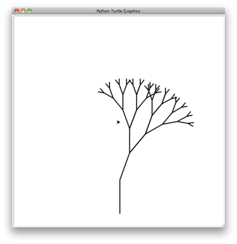

..  Copyright (C)  Brad Miller, David Ranum
    Permission is granted to copy, distribute and/or modify this document
    under the terms of the GNU Free Documentation License, Version 1.3 or 
    any later version published by the Free Software Foundation; with 
    Invariant Sections being Forward, Prefaces, and Contributor List, 
    no Front-Cover Texts, and no Back-Cover Texts.  A copy of the license
    is included in the section entitled "GNU Free Documentation License".
    
..  shortname:: RecursaoGrafica
..  description:: Visualizando recursão usando desenhos de tartarugas

Visualizando recursão
=====================

Na seção anterio vimos alguns problemas que eram fáceis de resolver usando recursão; no entanto, pode ainda ser difícil encontrar um modelo mental ou uma maneira de visualizar o que está acontecendo em uma função recursiva. Isso pode fazer a recursividade difícil para as pessoas compreenderem. Neste
seção, vamos ver alguns exemplos de uso de recursão para desenhar
algumas figuras interessantes. À medida que você vê essas figuras se formando você vai ganhar uma nova visão sobre o processo recursivo que pode ser útil para cimentar a sua compreensão sobre recursão.

A ferramenta que usaremos para nossas ilustrações é o módulo gráfico de tartarugas do Python chamado ``turtle``. O módulo ``turtle`` é padrão em todas as versões do Python e é muito fácil de usar. A metáfora é bastante
simples. Você pode criar uma tartaruga e a tartaruga pode se mover para frente, para trás, virar à esquerda, virar à direita, etc. A tartaruga pode ter sua cauda para cima ou para baixo. Quando a cauda da tartaruga está voltada para baixo ela desenha uma linha ao se mover.
Para aumentar o valor artístico da tartaruga você pode
alterar a largura da cauda, bem como a cor da tinta que é carregada na cauda.

Vamos ilustrar algumas noções básicas de gráficos de tartaruga com um
exemplo simples. Usaremos o módulo turtle para desenhar uma espiral de
forma recursiva. O :ref:`programa 1 <lst_turt1>` mostra como isso é
feito. Depois de importar o módulo ``turtle`` criamos uma
tartaruga. Quando a tartaruga é criado ele também cria uma janela para
si onde pode desenhar. Em seguida, definimos a função drawSpiral. 
O caso básico dessa função é quando o comprimento da linha que desejamos desenhar, dado pelo parâmetro ``len``, é menor ou igual a zero. Se o comprimento da linha é maior do que zero, nós instruímos a tartaruga a ir para a frente por ``len`` unidades e, em seguida, virar 90 graus à direita.
O passo recursivo é quando chamamos drawSpiral novamente com um comprimento reduzido. No fim do :ref:`programa 1 <lst_turt1>` você vai notar que chamamos a função ``myWin.exitonclick()``. Este é um método bem prático da
janela que coloca a tartaruga em modo de espera até que você clique no interior da janela, depois do qual o programa realiza a limpeza e termina.

.. lst_turt1:

.. activecode:: lst_turt1

    import turtle

    myTurtle = turtle.Turtle()
    myWin = turtle.Screen()

    def drawSpiral(myTurtle, lineLen):
        if lineLen > 0:
            myTurtle.forward(lineLen)
            myTurtle.right(90)
            drawSpiral(myTurtle,lineLen-5)

    drawSpiral(myTurtle,100)
    myWin.exitonclick()

Isso é realmente tudo que você precisa saber sobre gráficos de
tartaruga para fazer alguns desenhos bastante impressionantes.
Em nosso próximo programa vamos desenhar uma árvore fractal.
Fractais são estudados em um ramo da matemática e têm muito em comum com a recursividade. A definição de um fractal é que, quando você olha para ele, o fractal tem a mesma forma básica não importa o quanto você a amplia. Alguns exemplos da natureza são as costas dos continentes, flocos de neve, montanhas e até mesmo árvores ou arbustos. A natureza fractal de muitos destes fenômenos naturais torna possível aos programadores gerar cenários por computador muito realistas usados em filmes. Em nosso próximo exemplo vamos gerar uma árvore fractal.

Para entender como isso vai funcionar, é útil pensar em como nós poderíamos descrever uma árvore usando um vocabulário fractal. Lembre-se que dissemos
acima que um fractal é algo que parece ser o mesmo em todos os níveis de ampliação. Se traduzirmos isto para árvores e arbustos nós podemos dizer que mesmo um pequeno galho tem a mesma forma e características de 
uma árvore inteira. Usando essa idéia, poderíamos dizer que uma *árvore* é um tronco,
com uma *árvore* menor indo para a direita e outra *árvore* mais pequena indo para a esquerda. Se você pensar nessa definição recursivamente, isso
significa que vamos aplicar a definição recursiva de uma árvore para ambas
as árvores menores, à esquerda e à direita.

Vamos traduzir essa idéia para algum código em Python. O :ref:`programa 2 <lst_fractree>` mostra como nós podemos usar nossa tartaruga para gerar uma árvore fractal. Vamos ver o código um pouco mais de perto. Você pode ver que, nas linhas 5 e 7 fazemos chamadas recursivas. Na linha 5 fazemos a chamada recursiva logo após a tartaruga virar 20 graus para a direita; esta é a árvore direita mencionada acima. Em seguida, na linha 7 a tartaruga faz outra chamada recursiva, mas desta vez depois de virar 40 graus à esquerda. A razão pela qual a tartaruga deve virar 40 graus à esquerda é que ela precisa desfazer a virada inicial de 20 graus para a direita e, em seguida, virar mais 20 graus para a esquerda, a fim de desenhar a árvore esquerda. Além disso, observe que cada vez que fazemos uma chamada recursiva para ``tree`` subtraímos uma certa quantidade do parâmetro ``branchLen``; isso é para se certificar de que as árvores recursivas fiquem cada vez menores. Você também deve reconhecer o comando ``if`` inicial na linha 2 como um teste do caso básico quando ``branchLen`` fica muito pequeno.

.. _lst_fractree:

::

    def tree(branchLen,t):
        if branchLen > 5:
            t.forward(branchLen)
            t.right(20)
            tree(branchLen-15,t)
            t.left(40)
            tree(branchLen-10,t)
            t.right(20)
            t.backward(branchLen)

A janela activecode abaixo mostra um programa completo para este exemplo de árvore (:ref:`programa 3 <lst_complete_tree>`). Antes de executar o código pense em como você espera ver a árvore tomar forma. Observe as chamadas recursivas e pense em como esta árvore vai se desdobrar. Será que ela vai
ser desenhada de forma simétrica com as metades direita e esquerda da árvore
sendo moldadas simultaneamente? Ou será que lado direito vai ser desenhado primeiro e depois o lado esquerdo?

.. lst_complete_tree:

.. activecode:: lst_complete_tree

    import turtle
    
    def tree(branchLen,t):
        if branchLen > 5:
            t.forward(branchLen)
            t.right(20)
            tree(branchLen-15,t)
            t.left(40)
            tree(branchLen-15,t)
            t.right(20)
            t.backward(branchLen)

    def main():
        t = turtle.Turtle()
        myWin = turtle.Screen()
        t.left(90)
        t.up()
        t.backward(100)
        t.down()
        t.color("green")
        tree(75,t)
        myWin.exitonclick()
        
    main()

Observe como cada ponto de ramificação na árvore corresponde a uma chamada recursiva, e observe como a árvore é desenhada para a direita, o caminho  todo até chegar no seu galho mais curto. Você pode ver isso na :ref:`figura 1 <fig_tree1>`. Agora, observe
como o programa trabalha o seu caminho de volta no tronco até que todo o lado direito da árvore é desenhado. Você pode ver a metade direita da árvore na :ref:`figura 2 <fig_tree2>`. Em seguida, o lado esquerdo da árvore é desenhado, mas não indo para a esquerda tão longe quanto possível. Em vez disso, uma vez mais, o
lado direito da árvore esquerda é desenhado totalmente. Esse processo se repete até que, finalmente, o menor galho à esquerda é desenhado.

.. _fig_tree1:

.. figure:: Figures/tree1.png
   :align: center

   O início de uma árvore fractal
   
.. _fig_tree2:

   A primeira metade da árvore

Este simples programa de árvore é apenas um ponto de partida. Você vai
notar que a árvore não parece ser particularmente realista porque a natureza
não é tão simétrica quanto um programa de computador. Os exercícios no final
do capítulo vão lhe dar algumas idéias de como explorar algumas
opções interessantes para fazer a sua árvore parecer mais realista.

.. admonition:: Experimente

    Modifique o programa recursivo de árvore utilizando um ou todas as seguintes idéias:

    - Modifique a espessura dos ramos de modo que à medida que ``branchLen`` fica menor, a linha fica mais fina.

    - Modifique a cor dos ramos de modo que à medida que ``branchLen`` fica muito pequeno, ele é colorido como uma folha.

    - Modifique o ângulo utilizado para virar a tartaruga para que em cada ramo o ângulo seja selecionado aleatoriamente dentro de algum intervalo. Por exemplo, sorteie um ângulo entre 15 e 45 graus. Experimente vários valores até achar valores bons.

    - Modifique o ``branchLen`` de forma recursiva para que em vez de sempre subtrair a mesma quantidade, subtraia uma quantidade aleatória dentro de algum intervalo.

   .. actex:: recursion_sc_3

Triângulo de Sierpinski
-----------------------

Outro fractal que apresenta a propriedade de auto-similaridade é o
Triângulo de Sierpinski. Um exemplo é mostrado na :ref:`figura 3 <fig_sierpinski>`. O
Triângulo de Sierpinski ilustra um algoritmo recursivo de três vias. O
processo de desenhar um triângulo de Sierpinski com a mão é simples. Comece
com um único triângulo grande. Divida este triângulo grande em quatro novos
triângulos, ligando o ponto médio de cada lado. Ignorando o
triângulo central que você acabou de criar, aplique o mesmo procedimento para cada um dos demais três triângulos. Cada vez que você criar um novo conjunto de triângulos, aplique recursivamente este procedimento para os três triângulos de menores dos cantos. Você pode continuar a aplicar este procedimento indefinidamente se você tiver um lápis suficientemente afiado. Antes de continuar a leitura, experimente desenhar o triângulo de Sierpinski você mesmo, usando o método descrito.

.. _fig_sierpinski:

.. figure:: Figures/sierpinski.png
     :align: center

     O triângulo de Sierpinski

Como podemos continuar aplicando o algoritmo indefinidamente, qual o caso básico? Veremos que o caso básico é definido arbitrariamente pelo número de vezes que desejamos dividir o triângulo em pedaços. Às vezes chamamos este número de "grau" do fractal. Cada vez que fazemos uma chamada recursiva, subtraímos 1 do grau até chegarmos a 0. Quando 
chegarmos a um grau de 0, paramos de fazer chamadas recursivas. O código que
gerou o triângulo de Sierpinski na :ref:`figura 3 <fig_sierpinski>` é mostrado no :ref:`programa 4 <lst_st>`.

.. lst_st:

.. activecode:: lst_st

    import turtle

    def drawTriangle(points,color,myTurtle):
        myTurtle.fillcolor(color)
        myTurtle.up()
        myTurtle.goto(points[0][0],points[0][1])
        myTurtle.down()
        myTurtle.begin_fill()
        myTurtle.goto(points[1][0],points[1][1])
        myTurtle.goto(points[2][0],points[2][1])
        myTurtle.goto(points[0][0],points[0][1])
        myTurtle.end_fill()

    def getMid(p1,p2):
        return ( (p1[0]+p2[0]) / 2, (p1[1] + p2[1]) / 2)

    def sierpinski(points,degree,myTurtle):
        colormap = ['blue','red','green','white','yellow',
                    'violet','orange']
        drawTriangle(points,colormap[degree],myTurtle)
        if degree > 0:
            sierpinski([points[0],
                            getMid(points[0], points[1]),
                            getMid(points[0], points[2])],
                       degree-1, myTurtle)
            sierpinski([points[1],
                            getMid(points[0], points[1]),
                            getMid(points[1], points[2])],
                       degree-1, myTurtle)
            sierpinski([points[2],
                            getMid(points[2], points[1]),
                            getMid(points[0], points[2])],
                       degree-1, myTurtle)

    def main():
       myTurtle = turtle.Turtle()
       myWin = turtle.Screen()
       myPoints = [[-100,-50],[0,100],[100,-50]]
       sierpinski(myPoints,3,myTurtle)
       myWin.exitonclick()

    main()

    
    
O programa em :ref:`programa 4 <lst_st>` segue as ideias descritas acima. A
primeira coisa que ``sierpinski`` faz é desenhar o triângulo exterior. Em seguida, há três chamadas recursivas, uma para cada um dos triângulos novos nos cantos, criados quando ligamos os pontos médios. Mais uma vez, usamos o módulo padrão turtle que vem com o Python. Você pode aprender todos os detalhes dos métodos disponíveis no módulo turtle usando
``help('turtle')`` no prompt do Python.

Veja o código e pense sobre a ordem em que os triângulos
serão desenhados. Embora a ordem exata dos cantos depende de como o
conjunto inicial é especificado, vamos supor que os cantos são ordenados da seguinte forma: 
inferior esquerdo, superior e inferior direito. Devido à forma como a função ``sierpinski`` chama a si mesma, ``sierpinski`` realiza o seu trabalho até o menor triângulo permitido no canto inferior esquerdo, e então começa a preencher o resto dos triângulos em seu caminho de volta. Em seguida, ele preenche os triângulos no canto superior, realizando o trabalho em direção ao menor triângulo superior.
Finalmente, ele preenche os triângulos do canto inferior direito, realizando o trabalho em direção ao
menor triângulo no canto inferior direito.

Às vezes, é útil pensar em um algoritmo recursivo em termos de um
diagrama de chamadas de função. A :ref:`figura 4 <fig_stcalltree>` mostra que as chamadas recursivas são feitas sempre indo para a esquerda. As funções ativas são mostradas em preto e as chamadas de função inativas estão em cinza. 
Quanto mais fundo você olha na :ref:`figura 4 <fig_stcalltree>`, menor
ficam os triângulos. A função termina desenhando um nível de cada vez;
uma vez que ela termina o canto inferior esquerdo ela se move para o canto superior e assim por diante.

.. _fig_stcalltree:

.. figure:: Figures/stCallTree.png
    :align: center   
   
    Construindo um triângulo de Sierpinski

A função ``sierpinski`` depende muito da função ``getMid``.
``getMid`` usa como argumentos dois pontos finais e retorna o ponto médio entre eles. Além disso, o :ref:`programa 4 <lst_st>` tem uma função que
desenha um triângulo preenchido usando os métodos ``begin_fill`` e ``end_fill`` de turtle. Isto significa que cada grau do triângulo de Sierpinsky é desenhado em uma cor diferente.

