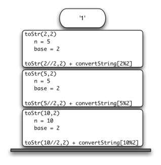

..  Copyright (C)  Brad Miller, David Ranum
    Permission is granted to copy, distribute and/or modify this document
    under the terms of the GNU Free Documentation License, Version 1.3 or 
    any later version published by the Free Software Foundation; with 
    Invariant Sections being Forward, Prefaces, and Contributor List, 
    no Front-Cover Texts, and no Back-Cover Texts.  A copy of the license
    is included in the section entitled "GNU Free Documentation License".
    
..  shortname:: IntroduçãoARecursão
..  description:: Esta é uma breve introdução à ideia de recursão

Recursão
--------

Objetivos
---------

Os objetivos deste capítulo são os seguintes:

-  Entender que alguns problemas muito complexos podem ter uma
   solução recursiva simples. 

-  Aprender a formular programas de forma recursiva.

-  Entender e aplicar as três leis da recursão.

-  Entender a recursão como uma forma de iteração.

-  Implementar a formulação recursiva de um problema.

-  Entender como a recursão é implementada por um sistema computacional.

O que é recursão?
-----------------

**Recursão** é um método de resolução de problemas que envolve quebrar
um problema em subproblemas menores e menores até chegar a um problema
pequeno o suficiente para que ele possa ser resolvido
trivialmente. Normalmente recursão envolve uma função que chama a si
mesma. Embora possa não parecer muito, a recursão nos permite escrever
soluções elegantes para problemas que, de outra forma, podem ser muito
difíceis de programar. 

Calculando a soma de uma lista de números
~~~~~~~~~~~~~~~~~~~~~~~~~~~~~~~~~~~~~~~~~

Vamos começar a nossa investigação com um problema simples que você já
sabe como resolver sem o uso de recursão. Suponha que você deseja
calcular a soma de uma lista de números, tais como: 
:math:`[1, 3, 5, 7, 9]`. Uma função iterativa que calcula a soma
é mostrada em :ref:`Programa 1 <lst_itsum>`. A função usa uma variável
acumuladora (``theSum``) para calcular o total de todos os números da
lista iniciando com :math:`0` e somando cada número da lista.

.. _lst_itsum:

.. activecode:: lst_itsum

    def listsum(numList):
        theSum = 0
        for i in numList:
            theSum = theSum + i
        return theSum
        
    print(listsum([1,3,5,7,9]))

Imaginem por um minuto que você não tem laços ``while`` ou
``for``. Como você calcularia a soma de uma lista de números? Se você
fosse um matemático poderia começar recordando que a adição é uma
função definida para dois parâmetros, um par de números. Para
redefinir o problema da adição de uma lista para a adição de pares de
números, podemos reescrever a lista como uma expressão totalmente
entre parênteses. Tal expressão poderia ser algo como: 

.. math::
    ((((1 + 3) + 5) + 7) + 9)
    
Poderíamos também colocar os parênteses na ordem reversa,

.. math::

     (1 + (3 + (5 + (7 + 9)))) 

Observe que o par de parênteses mais interno, :math:`(7 + 9)`, é um
problema que podemos resolver sem um laço ou qualquer construção
especial. Na verdade, pode-se utilizar a seguinte sequência de
simplificações para calcular uma soma final. 

.. math::

    total = \  (1 + (3 + (5 + (7 + 9)))) \\
    total = \  (1 + (3 + (5 + 16))) \\
    total = \  (1 + (3 + 21)) \\
    total = \  (1 + 24) \\
    total = \  25

Como podemos usar essa ideia e transformá-la em um programa Python? Em primeiro lugar,
vamos reformular o problema soma em termos de listas de Python. Poderíamos dizer que
a soma da lista ``numList`` é a soma do primeiro elemento da lista
(``numList [0]``), com a soma dos números no resto da lista (``numList
[1:]``). De forma funcional podemos escrever: 

.. math::

      listSum(numList) = first(numList) + listSum(rest(numList))
    \label{eqn:listsum}

Nesta equação :math:`first(numList)` retorna o primeiro elemento da
lista e :math:`rest(numList)` retorna a lista com tudo menos o
primeiro elemento. 
Isso pode ser expresso facilmente em Python como no 
:ref:`Programa 2 <lst_recsum>`.

.. _lst_recsum:

.. activecode:: lst_recsum

    def listsum(numList):
        if len(numList) == 1:
            return numList[0]
        else:
            return numList[0] + listsum(numList[1:])
            
    print(listsum([1,3,5,7,9]))

Existem algumas ideias-chave nesse programa para se estudar. Em
primeiro lugar, na linha 2 estamos verificando se a lista possui
apenas um elemento. Esse teste é fundamental e é a nossa cláusula de
escape da função. A soma de uma lista de comprimento 1 é trivial; ela
é o número na lista. 
Em segundo lugar, na linha 5, nossa função chama a si mesma! Esta é a
razão pela qual chamamos ``listsum`` de algoritmo recursivo. Uma função recursiva
é uma função que chama a si mesma.

A :ref:`Figura 1 <fig_recsumin>` mostra a série de **chamadas recursivas** 
necessária para somar a lista :math:`[1, 3, 5, 7, 9]`. Você deve pensar
nessa série de chamadas como uma série de simplificações. Cada vez que fazemos uma
chamada recursiva estamos resolvendo um problema menor, até chegar ao
ponto em que o problema não pode ficar menor. 

.. _fig_recsumin:

.. figure:: Figures/sumlistIn.png
   :align: center
   :alt: image

   Série de Chamadas Recursivas Somando uma Lista de Números

Quando chegarmos ao ponto em que o problema é tão simples quanto ele
pode ficar,  começamos a juntar as soluções de cada um dos pequenos
problemas até que o problema inicial seja resolvido. A :ref:`Figura
2 <fig_recsumout>` mostra as adições que são executadas a medida que
``listsum`` percorre o seu caminho para trás através de uma série de
chamadas. Quando ``listsum`` retorna do problema mais alto, obtemos a
solução para todo o problema. 

.. _fig_recsumout:

.. figure:: Figures/sumlistOut.png
   :align: center
   :alt: image

   Série de Retornos Recursivos da Adição de uma Lista de Números

As três leis da recursão
~~~~~~~~~~~~~~~~~~~~~~~~

Assim como os robôs de Asimov, todos os algoritmos recursivos devem
obedecer a três leis importantes: 

#. Um algoritmo recursivo deve ter um *caso básico*
   
#. Um algoritmo recursivo deve mudar o seu estado e se aproximar do caso básico.

#. Um algoritmo recursivo deve chamar a si mesmo, recursivamente.

Vamos olhar para cada uma dessas leis com mais detalhes e ver como elas foram
utilizadas no algoritmo ``listsum``. Em primeiro lugar, um caso básico é a condição
que permite que o algoritmo recursivo pare de recorrer. Um caso básico
é tipicamente um problema que é suficientemente pequeno para resolver
diretamente. No caso do algoritmo ``listsum`` o caso básico é uma
lista de comprimento 1. 

Para obedecer a segunda lei, temos de arranjar uma mudança de estado que leve
o algoritmo para o caso básico. A mudança de estado significa que alguns
dados utilizados pelo algoritmo são modificados. Normalmente, os dados que
representam o problema são reduzidos de alguma forma. No algoritmo
``listsum`` nossa estrutura de dados primária é uma lista, por isso
temos de concentrar o nosso esforço de mudança de estado na
lista. Como o caso básico é uma lista de comprimento 1, uma progressão
natural para o caso básico é encurtar a lista. Este é exatamente o que
acontece na linha 5 do :ref:`Programa 2 <lst_recsum>` quando chamamos
``listsum`` com uma lista mais curta. 

A última lei é que o algoritmo deve chamar a si mesmo. Esta é a própria
definição de recursão. A recursão é um conceito confuso para muitos
programadores iniciantes. Como um programador novato, você aprendeu que
funções são boas porque você pode ter um grande problema e dividi-lo
em problemas menores. Os problemas menores podem ser resolvidos escrevendo uma
função para resolver cada problema. Quando falamos de recursão pode parecer
que estamos a falar em círculos. Nós temos um problema a resolver
com uma função, mas a função resolve o problema chamando a si mesma!
Mas a lógica não é circular de maneira alguma; a lógica de recursão é uma
expressão elegante de resolver um problema por dividi-lo em
problemas menores e mais fáceis.

No restante deste capítulo, vamos ver outros exemplos de
recursão. Em cada caso, vamos nos concentrar na concepção de uma solução para um
problema usando as três leis da recursão.

.. Self Check
.. admonition:: Teste seu entendimento

   .. mchoice:: question_recsimp_1
      :correct: c
      :answer_a: 6
      :answer_b: 5
      :answer_c: 4
      :answer_d: 3
      :feedback_a: Há apenas cinco números na lista, o número de chamadas recursivas não será maior que o tamanho da lista.
      :feedback_b: A primeira chamada de listsum não é uma chamada recursiva.
      :feedback_c: A primeira chamada recursiva passa a lista [4,6,8,10], a segunda [6,8,10] e assim por diante até [10].
      :feedback_d: Esse número de chamadas não seria suficiente para cobrir todos os números da lista.

      Quantas chamadas recursivas são feitas ao computar a soma da lista [2,4,6,8,10]?

   .. mchoice:: question_recsimp_2    
      :correct: d
      :answer_a: n == 0
      :answer_b: n == 1
      :answer_c: n &gt;= 0
      :answer_d: n &lt;= 1
      :feedback_a:  Embora seja possível já que fat(0) é o mesmo que fat(1), há opção melhor e um pouco mais eficiente.
      :feedback_b: Essa é uma boa escolha, mas o que aconteceria se você chamar fat(0)?
      :feedback_c: Esse caso básico seria verdadeiro para todos os números maiores que zero e assim o fat de qualquer número positivo seria 1.
      :feedback_d: Excelente, essa é a forma mais eficiente e impede que o seu programa quebre ao tentar calcular o fatorial de um número negativo.

      Suponha que você precisa escrever uma função recursiva para calcular o fatorial de um número. A função fat(n) retorna n * n-1 * n-2 * ... Onde o fatorial de zero é definido como 1. Qual seria o caso básico mais apropriado?

Convertendo um inteiro para um string em qualquer base
~~~~~~~~~~~~~~~~~~~~~~~~~~~~~~~~~~~~~~~~~~~~~~~~~~~~~~

Suponha que você queira converter um inteiro para uma cadeia em alguma
base entre binário e hexadecimal. Por exemplo, converter o número
inteiro 10 para um string com sua representação em decimal como
``"10"``, ou um string com a sua representação em binário como
``"1010"``. Embora existam muitos algoritmos para resolver este
problema, incluindo o algoritmo discutido na sessão sobre pilha, a
formulação recursiva do problema é muito elegante. 

Vejamos um exemplo concreto usando base 10 e o número 769. Suponha que
temos uma sequência de caracteres que corresponde aos primeiros 10
dígitos, como ``convString = "0123456789"``. É fácil converter um
número inferior a 10 para o seu string equivalente simplesmente
acessando a sequência. Por exemplo, se o número é 9, então o string é
``convString[9]`` ou ``"9"``. Se pudermos quebrar o número 769 em três
números de um dígito, 7, 6 e 9, então convertê-lo para uma string é
simples. Um número inferior a 10 parece ser um bom caso básico. 

O nosso caso básico sugere que o algoritmo geral terá os seguintes
três componentes: 

#. Reduzir o número original para uma série de números de um dígito.

#. Converter o número de um dígito para um string usando convString.

#. Concatenar os strings de um dígito para formar o resultado final.

O próximo passo é descobrir como mudar de estado e fazer progressos
para o caso básico. Como estamos trabalhando com um número inteiro, vamos
considerar que operações matemáticas podemos utilizar para reduzir um
número. Os candidatos mais prováveis são divisão e subtração. Embora
subtração possa ser útil, não é claro o que devemos subtrair do quê. A
divisão inteira com resto nos dá uma direção clara. Vejamos o que
acontece se dividirmos um número pela base que estamos tentando
converter. 

Usando divisão inteira para dividir 769 por 10, temos 76 com um resto
de 9. Isso nos fornece dois bons resultados. Em primeiro lugar, a
parte restante é um número menor que a base que pode ser convertido
para um string imediatamente usando convString. Em segundo lugar,
temos um número que é menor do que o original e nos move em direção ao
caso básico de ter um número menor que a base. Agora o nosso trabalho
é converter 76 na sua representação em string. Usaremos novamente a
divisão inteira com resto para obter os resultados 7 e 6
respectivamente. Finalmente, reduzimos o problema para converter 7,
que podemos fazer facilmente uma vez que satisfaz a condição do caso
básico de :math:`n < base`, onde :math:`base = 10`. A série de
operações que acabamos de realizar é ilustrada na :ref:`Figura 3
<fig_tostr>`. Note que os números que queremos guardar estão nas
caixas de resto ao longo do lado direito do diagrama. 

.. _fig_tostr:

.. figure:: Figures/toStr.png
   :align: center
   :alt: image

   image

    Convertendo um inteiro em um string na base 10

O :ref:`Programa 3 <lst_rectostr>` mostra o código em Python que
implementa o algoritmo descrito acima para qualquer base entre 2
e 16. 

.. _lst_rectostr:

.. activecode:: lst_rectostr

    def toStr(n,base):
       convertString = "0123456789ABCDEF"
       if n < base:
          return convertString[n]
       else:
          return toStr(n//base,base) + convertString[n%base]

    print(toStr(1453,16))

Observe que na linha 3 testamos o caso básico, onde ``n`` é menor que
a base para a qual estamos convertendo. Quando detectamos o caso
básico, paramos a recursão e retornamos o string em
``convertString``. Na linha 6 nós satisfazemos tanto a segunda quanto
a terceira lei fazendo a chamada recursiva e reduzindo o tamanho do
problema usando divisão. 

Vamos simular o algoritmo de novo; desta vez, vamos converter o número 10
em um string com sua representação na base 2 (``"1010"``).

.. _fig_tostr2:

.. figure:: Figures/toStrBase2.png
   :align: center
   :alt: image

   Convertendo o número 10 para um string com sua representação na base 2

A :ref:`Figura 4 <fig_tostr2>` mostra que obtemos o resultado que
estamos procurando, mas parece que a ordem dos dígitos está errada. O
algoritmo funciona corretamente porque nós fazemos a chamada recursiva
primeiro na linha 6 e então concatenamos o string com o restante. 
Se revertêssemos a ordem, concatenando os resultados de
``convertString`` com ``toStr``, a cadeia resultante ficaria
invertida! Mas, se esperarmos para concatenar após o retorno da
chamada recursiva, obteremos o resultado na ordem correta. Isso é
semelhante a nossa discussão de pilhas feita no capítulo anterior. 

.. admonition:: Teste seu entendimento

   Escreva uma função que recebe um string como parâmetro e retorna um
   novo string que é o reverso do string de entrada. 

   .. actex:: recursion_sc_1

      from test import testEqual
      def reverse(s):
          return s
      
      testEqual(reverse("hello"),"olleh")
      testEqual(reverse("l"),"l")      
      testEqual(reverse("follow"),"wollof")
      testEqual(reverse(""),"")

   Escreva uma função que recebe um string como um parâmetro e retorna
   True se o string é um palíndromo, False contrário. Lembre-se que um
   string é um palíndromo se ele é o mesmo quando escrito de trás para
   a frente. Por exemplo: radar é um palíndromo. Como um bônus,
   palíndromos também podem ser frases, mas você precisa remover os
   espaços e pontuação antes de verificar. Por exemplo: "madam i'm
   adam" é um palíndromo. Outros palíndromos divertidas incluem: 
   
   * kayak
   * aibohphobia
   * Live not on evil
   * Reviled did I live, said I, as evil I did deliver
   * Go hang a salami; I'm a lasagna hog.
   * Able was I ere I saw Elba
   * Kanakanak --  uma cidade no Alaska
   * Wassamassaw -- uma cidade em South Dakota

   .. actex:: recursion_sc_2

      from test import testEqual
      def removeWhite(s):
          return s

      def isPal(s):
          return False
      
      testEqual(isPal(removeWhite("x")),True)            
      testEqual(isPal(removeWhite("radar")),True)
      testEqual(isPal(removeWhite("hello")),False)
      testEqual(isPal(removeWhite("")),True)                  
      testEqual(isPal(removeWhite("hannah")),True)      
      testEqual(isPal(removeWhite("madam i'm adam")),True)

Pilha de execução: implementando recursão
-----------------------------------------

Suponha que, em vez de concatenar o resultado da chamada recursiva
para ``toStr`` com o string de ``convertString``, modificamos nosso
algoritmo para empilhar os strings em uma pilha antes de fazer a
chamada recursiva. O código para esta algoritmo modificado é mostrado
no :ref:`Programa 4 <lst_recstack>`.

.. _lst_recstack:

.. activecode:: lst_recstack

    rStack = Stack()

    def toStr(n,base):
        convertString = "0123456789ABCDEF"
        if n < base:                 
            rStack.push(convertString[n])
        else:
            rStack.push(convertString[n % base])
            toStr(n // base, base)     
            
    print(toStr(1453,16))

Cada vez que fazemos uma chamada para ``toStr``, empilhamos um caractere na pilha.
Voltando ao exemplo anterior, podemos ver que após a quarta chamada
para ``toStr`` a pilha seria algo como :ref:`Figura 5
<fig_recstack>`. Observe que agora podemos simplesmente desempilhar os
caracteres da pilha e concatená-los para criar o resultado final,
``"1010"``. 

.. _fig_recstack:

.. figure:: Figures/recstack.png
   :align: center

   Strings colocados em uma pilha durante a conversão

O exemplo anterior nos fornece algumas dicas sobre como o Python
implementa uma chamada de função recursiva. Quando uma função é
chamada em Python, uma **pilha de execução** é alocado para lidar com
as variáveis locais da função. Quando a função retorna, o valor de
retorno é deixado no topo da pilha para ser acessado pela função de
chamada. A :ref:`Figura 6 <fig_callstack>` ilustra a pilha de execução
após a instrução de retorno na linha 4. 

.. _fig_callstack:

   Pilha de execução gerada por ``toStr(10,2)``

Note que a chamada para ``toStr(2//2,2)`` deixa o valor de retorno
``"1"`` na pilha. Este valor de retorno é então usado em lugar da
chamada de função (``toStr(1,2)``) na expressão
``"1"+convertString[2%2]``, que vai deixar o string ``"10"`` no topo
da pilha. Desta forma, a pilha de chamadas do Python funciona a pilha
que usamos explicitamente no :ref:`Programa 4 <lst_recstack>`. Em
nosso exemplo de soma de lista, você pode considerar que o valor de
retorno na pilha toma o lugar de uma variável acumuladora. 

A pilha de execução também proporcionar um escopo para as variáveis utilizadas pela
função. Ainda que estejamos chamando a mesma função várias vezes,
cada chamada cria um novo escopo para as variáveis locais da função.

Se você mantiver essa idéia da pilha em sua cabeça, você vai ver que é
muito mais fácil escrever uma função recursiva corretamente. 
