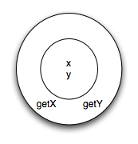
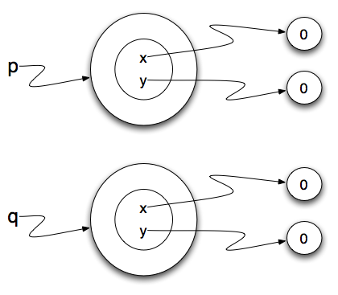

..  Copyright (C)  Brad Miller, David Ranum, Jeffrey Elkner, Peter Wentworth, Allen B. Downey, Chris
    Meyers, and Dario Mitchell.  Permission is granted to copy, distribute
    and/or modify this document under the terms of the GNU Free Documentation
    License, Version 1.3 or any later version published by the Free Software
    Foundation; with Invariant Sections being Forward, Prefaces, and
    Contributor List, no Front-Cover Texts, and no Back-Cover Texts.  A copy of
    the license is included in the section entitled "GNU Free Documentation
    License".
    
..  shortname:: IntroClasses
..  description:: Essa é uma introdução à ideia de construir uma classe

Classes e Objetos - Fundamentos
================================

.. index:: programação orientada à objetos

Programação orientada à objetos 
-------------------------------

O Python é uma **linguagem de programação orientada à objetos**, o que
significa que ela possui recursos que dão suporte à `programação
orientada à objetos
<http://en.wikipedia.org/wiki/Object-oriented_programming>`__
(**POO**).

A programação orientada à objetos tem suas origens na década de 1960,
mas somente em meados da década de 1980 ela se tornou no principal
`paradigma de programação
<http://en.wikipedia.org/wiki/Programming_paradigm>`__ utilizado na
criação de software. O paradigma foi desenvolvido como forma de tratar
o rápido aumento no tamanho e complexidade dos sistemas de software e
facilitar a modificação desses sistemas grandes e complexos ao longo
do tempo.

Até agora, o paradigma de `programação procedural
<http://en.wikipedia.org/wiki/Procedural_programming>`__ foi utilizado 
em alguns programas que escrevemos. Na programação procedural o foco é
na escrita de funções ou *procedimentos* que operam sobre os dados. Na
programação orientada à objetos o foco é na criação de **objetos** que
contem tanto os dados quanto as funcionalidades. Em geral, a definição
de cada objeto corresponde a algum objeto ou conceito no mundo real e
as funções que operam sobre tal objeto correspondem as formas que os
objetos reais interagem. 

Uma mudança de perspectiva
--------------------------

Nos capítulos anteriores escrevemos funções e as chamamos usando uma
sintaxe como ``desenheCirculo(tess)``. Isso sugere que a função é um
agente ativo, que diz algo como, *"Ei, função desenheCirculo!
Aqui está um objeto tartaruga para você desenhar. "*

Em programação orientada à objetos, os objetos são os agentes
ativos. Por exemplo, em nossa introdução às tartarugas, utilizamos um
estilo de orientação à objetos, de forma que nós escrevemos
``tess.forward(100)``, que pede para a tartaruga se mover um certo
número de passos para a frente.
Uma chamada do tipo ``tess.circle()`` quer dizer *"Ei tess! Por favor
use seu método circle!"*

Essa mudança de perspectiva pode parecer mais educada, mas não
necessariamente útil inicialmente. Em geral, transferir a
responsabilidade da função para um objeto torna possível escrever
funções mais versáteis e facilita a manutenção e reuso do código.

A vantagem mais importante do estilo de orientação à objetos é que ele
é mais adequado ao nosso processo mental de agrupamento e mais perto
da nossa experiência do mundo real.
No mundo real nosso método para ``cozinhar`` é parte do nosso
forno de microondas --- nós não temos uma função ``cozinhar`` guardada
na gaveta do armário que nós passamos para o microondas.
Da mesma forma, usamos métodos do telefone celular para enviar um SMS, ou
mudar o seu estado para silencioso. As funcionalidades de um objeto do
mundo real tendem a ser intrínsecas a esse objeto. A POO nos permite
representar essas funcionalidades com precisão ao organizar nossos
programas. 

Revisão de Objetos
------------------

Em Python, todo valor é na verdade um objeto. Seja uma tartaruga, uma
lista, ou mesmo um inteiro, todos são objetos. Programas manipulam
esses objetos realizando computações diretamente com eles ou chamando
os seus métodos (ou seja, pedindo que esses objetos executem seus
métodos). Para ser mais específico, nós dizemos que um objeto possui
um **estado** e uma coleção de **métodos** que ele pode executar. O
estado de um objeto representa as coisas que o objeto sabe sobre si
mesmo. Por exemplo, como vimos com os objetos tartaruga, cada
tartaruga possui um estado que representa a sua posição, sua cor, sua
direção, etc. Cada tartaruga também tem a capacidade de se mover para
a frente, para trás, ou virar para a direita ou esquerda. Cada
tartaruga é diferente pois, embora sejam todas tartarugas, cada uma
tem um estado diferente (como posições diferentes, ou orientações, etc). 

.. image:: Figures/objectpic1.png
   :alt: Um objeto simples possui um estado e métodos

.. index:: tipo de dado composto

Classes definidas pelo usuário
------------------------------

Nós já vimos classes como ``str``, ``int``, ``float`` e ``Turtle``. Estas foram definidos pelo Python e disponibilizadas para nós usarmos. No entanto, em muitos casos quando estamos resolvendo problemas, precisamos criar objetos de dados
relacionados ao problema que estamos tentando resolver. Precisamos criar nossas próprias classes.

Como um exemplo, considere o conceito de um ponto matemático. Em duas dimensões, um ponto é representado por dois números (coordenadas) que são tratadas em conjunto como um único objeto.
Os pontos são muitas vezes escritos entre parênteses com uma vírgula
separando as coordenadas. Por exemplo, ``(0, 0)`` representa a origem, e
``(x, y)`` representa o ponto ``x`` unidades para a direita e ``y`` unidades para cima da origem. Este ``(x, y)`` é o estado do ponto.

Pensando em nosso diagrama acima, podemos desenhar um objeto ``ponto`` como mostrado aqui.

.. image:: Figures/objectpic2.png
   :alt: Um ponto possui um x e um y

Algumas das operações típicas que se associa com pontos poderiam ser a de pedir
o ponto pela sua coordenada x, ``getX``, ou para pedir a sua coordenada y, ``getY``. Você também pode calcular a distância de um ponto a partir da origem, ou a partir de outro ponto, ou encontrar um ponto médio de dois pontos, ou perguntar se um ponto está dentro de um dado retângulo ou círculo. Nós logo veremos como podemos organizar isso em conjunto com os dados.

Agora que entendemos como um objeto ``ponto`` deve se parecer, podemos definir uma nova **classe**.
Nós queremos que os nossos pontos tenham um atributo ``x`` e um ``y``,
assim a nossa primeira definição da classe se parece com isso.

.. sourcecode:: python
    :linenos:
    
    class Point:
        """ Point class for representing and manipulating x,y coordinates. """
        
        def __init__(self):
            """ Create a new point at the origin """
            self.x = 0
            self.y = 0          

As definições de classes podem aparecer em qualquer lugar em um programa, mas são geralmente perto do início (após as comandos ``import``). As regras de sintaxe para a definição de uma classe são as mesmas de outros comandos compostas. Há um cabeçalho
que começa com a palavra-chave ``class``, seguido pelo nome da classe
e terminando com dois pontos.

Se a primeira linha após o cabeçalho de classe é um string, ele se torna
o docstring da classe, e será reconhecido por diversas ferramentas. (Este
é também a maneira como docstrings funciona com funções.)

Toda classe deve ter um método com o nome especial ``__init__``.
Este **método de inicialização**, muitas vezes referido como o **construtor**, é chamado automaticamente sempre que uma nova
instância de ``Point`` é criada. Ela dá ao programador a oportunidade
de configurar os atributos necessários dentro da nova instância, dando-lhes
seus estaduais / valores iniciais. O parâmetro ``self`` (você poderia escolher qualquer outro nome, mas ninguém nunca faz!) é definido automaticamente para referenciar o objeto recém-criado que precisa ser inicializado.

Então, vamos usar a nossa nova classe Point agora.

.. activecode:: chp13_classes1
    
    class Point:
        """ Point class for representing and manipulating x,y coordinates. """
        
        def __init__(self):
 
            self.x = 0
            self.y = 0
    
    p = Point()         # Instantiate an object of type Point
    q = Point()         # and make a second point

    print("Nothing seems to have happened with the points")
    
   
Durante a inicialização dos objetos, criamos dois atributos chamados `x` e `y` para cada um, ambos com o valor 0. Você vai notar que quando você executar o
programa, nada acontece. Felizmente este não é bem o caso. De fato, dois ``Points`` foram criados, cada um com coordenadas x e y com valor 0. No entanto, como nós não pedimos aos pontos para fazerem alguma coisa, não vemos resultado algum.

O seguinte programa adiciona alguns comandos para impressão. Observe que a saída sugere que cada um é um ``objeto Point``.
No entanto, observe que o operador ``is`` retorna ``False``, o que significa que eles são objetos diferentes (vamos discutir mais sobre isso nos próximos capítulos).

.. activecode:: chp13_classes2
    
    class Point:
        """ Point class for representing and manipulating x,y coordinates. """
        
        def __init__(self):
 
            self.x = 0
            self.y = 0
    
    p = Point()         # Instantiate an object of type Point
    q = Point()         # and make a second point

    print(p)
    print(q)

    print(p is q)

Isso deve lhe parecer familiar --- nós usamos classes antes para criar mais de um objeto:

.. sourcecode:: python

    from turtle import Turtle    
    
    tess = Turtle()     # Instantiate objects of type Turtle   
    alex = Turtle()  
 
As variáveis ``p`` e ``q`` recebem referências a dois novos objetos ``Point``.
Uma função como ``Turtle`` ou ``Point`` que cria uma nova instância do objeto
é chamado de **construtor**, e cada classe fornece automaticamente uma
função construtora que tem o mesmo nome da classe.

Pode ser útil considerar que uma classe seja uma fábrica que faz objetos.
A classe em si não é uma instância de um ponto, mas contém a maquinaria
para fazer instancias de pontos. Cada vez que você chamar o construtor, você está pedindo à fábrica para lhe fazer um novo objeto. À medida que o objeto sai da
linha de produção, o seu método de inicialização é executado para inicializá-lo
com a configuração padrão de fábrica.

O processo combinado de "crie um novo objeto" e "inicialize com a configuração padrão de fábrica" é chamado **instanciação**.

Melhorando o Nosso Construtor
-----------------------------

Até agora o nosso construtor só pode criar pontos na posição ``(0,0)``. Para criar um ponto na posição (7, 6) é preciso fornecer alguma capacidade adicional para passar informações para o construtor. Como os construtores são simplesmente funções com nomes especiais, podemos usar parâmetros (como vimos antes) para fornecer as informações específicas.

Nós podemos tornar o construtor  da nossa classe mais geral, colocando parâmetros extras no método ``__init__``, como mostrado neste exemplo.

.. activecode:: chp13_classes3
    
    class Point:
        """ Point class for representing and manipulating x,y coordinates. """
        
        def __init__(self, initX, initY):
 
            self.x = initX
            self.y = initY
    
    p = Point(7,6)

Agora quando nós criamos novos pontos, podemos simplesmente fornecer os valores de x e y como argumentos. Quando o ponto é criado, os valores de ``initX`` e ``initY`` são atribuidos ao estado do objeto.

.. image:: Figures/objectpic5.png
   :alt: Simple object has state and methods

       
Adicionando Outros Métodos à Nossa Classe
-----------------------------------------
          
A principal vantagem de usar uma classe como ``Point`` em vez de algo como uma simples
tupla ``(7, 6)`` agora se torna aparente. Podemos acrescentar métodos para
a classe ``Point`` que são operações úteis para trabalhar com pontos. Se tivéssemos optado por usar uma simples tupla para representar o ponto, não teríamos essa capacidade.
Criar uma classe como ``Point`` traz um "poder organizacional"
excepcional para nossos programas e para o nosso pensamento.
Podemos agrupar as operações que fazem sentido, e os tipos de dados
a que pertencem, e cada instância da classe pode ter seu próprio estado.

Um **método** se comporta como uma função, mas ele é chamado de uma instância específica. Por exemplo, com uma tartaruga chamada ``tesss``, ``tess.right(90)`` pede ao objeto ``tess`` para executar o seu método ``right`` e virar 90 graus. Os métodos são acessados usando a notação de ponto.

Vamos adicionar dois métodos simples para permitir um ponto de nos dar informações sobre o seu estado. O método ``getX``, quando invocado, irá retornar o valor da coordenada x. A implementação deste método é muito simples uma vez que já sabemos como escrever funções que retornam valores. Uma coisa a notar é que mesmo que o método ``getX`` não precise de qualquer outra informação como parâmetro para fazer o seu trabalho, ainda há um parâmetro formal, ``self``. Como dissemos anteriormente, todo método definido em uma classe que opere em objetos dessa classe terá ``self`` como seu primeiro parâmetro. Mais uma vez, este serve como referência para o objeto em si, que por sua vez permite o acesso aos dados de estado no interior do objeto.

.. activecode:: chp13_classes4
    
    class Point:
        """ Point class for representing and manipulating x,y coordinates. """
        
        def __init__(self, initX, initY):
 
            self.x = initX
            self.y = initY

        def getX(self):
            return self.x

        def getY(self):
            return self.y

    
    p = Point(7,6)
    print(p.getX())
    print(p.getY())

Da mesma forma, o método ``getY`` tem o mesmo jeito.

Vamos adicionar um outro método, ``distanceFromOrigin``, para ver melhor como os métodos funcionam. Este método também não vai precisar de nenhuma informação adicional para realizar o seu trabalho, mas realizará uma tarefa mais complexa.

.. activecode:: chp13_classes5
    
    class Point:
        """ Point class for representing and manipulating x,y coordinates. """
        
        def __init__(self, initX, initY):
 
            self.x = initX
            self.y = initY

        def getX(self):
            return self.x

        def getY(self):
            return self.y

        def distanceFromOrigin(self):
            return ((self.x ** 2) + (self.y ** 2)) ** 0.5

    
    p = Point(7,6)
    print(p.distanceFromOrigin())

Note que o chamador de ``distanceFromOrigin`` não fornece nenhum argumento para suprir o valor do parâmetro ``self``. Isso é verdade também para todas as chamadas de métodos. A definição sempre terá um parâmetro adicional (``self``) quando comparado a chamada.

    
Objetos Como Argumentos e Parâmetros
------------------------------------

Você pode passar um objeto como um argumento da forma habitual. Nós já vimos
isso em alguns dos exemplos da tartaruga, onde a tartaruga é passada para
alguma função como ``drawRectangle`` para que a função possa
controlar e usar qualquer instância de tartaruga que lhe seja passada.

Esta é uma função simples que envolve nossos novos objetos ``Point``.
 
.. activecode:: chp13_classes6

    import math
    
    class Point:
        """ Point class for representing and manipulating x,y coordinates. """
        
        def __init__(self, initX, initY):
 
            self.x = initX
            self.y = initY

        def getX(self):
            return self.x

        def getY(self):
            return self.y

        def distanceFromOrigin(self):
            return ((self.x ** 2) + (self.y ** 2)) ** 0.5

    def distance(point1, point2):
        xdiff = point2.getX()-point1.getX()
        ydiff = point2.getY()-point1.getY()

        dist = math.sqrt(xdiff**2 + ydiff**2)
        return dist
    
    p = Point(4,3)
    q = Point(0,0)
    print(distance(p,q))

``distance`` recebe dois pontos e retorna a distância entre eles. Note que ``distance`` **não** é um método da classe Point. Você pode ver isso pelo padrão de tabulação, que não está dentro da classe Point. Outra forma para sabermos que ``distance`` não é um método de Point é que ``self`` não está incluido como parâmetro formal. Além disso, nós não chamamos ``distance`` usando a notação de ponto.

Conversão de um Objeto para um String
-------------------------------------

A maioria dos programadores de orientação à objetos não fariam o que acabamos de fazer em ``print_point``. Quando trabalhamos com classes e objetos, uma alternativa é incluir um novo método na classe, mas não gostamos de métodos tagarelas que chamam ``print``. A melhor alternativa é ter um método para que toda instância possa produzir um string que o represente. Vamos inicialmente chamar esse método de ``to_string``:

.. activecode:: chp13_classesstr1
    
    class Point:
        """ Point class for representing and manipulating x,y coordinates. """
        
        def __init__(self, initX, initY):
 
            self.x = initX
            self.y = initY

        def getX(self):
            return self.x

        def getY(self):
            return self.y

        def distanceFromOrigin(self):
            return ((self.x ** 2) + (self.y ** 2)) ** 0.5

    
    p = Point(7,6)
    print(p)

A função ``print`` mostrada acima produz um string que representa o Ponto ``p``. O padrão fornecido pelo Python diz que ``p`` é um objeto do tipo ``Point``. No entanto, ele não diz nada sobre o estado específico do ponto.

Nós podemos melhorar esta representação se incluirmos um método especial chamado ``__str__``. Observe que este método usa a mesma convenção de nomes como o construtor, que é dois sublinhados antes e depois do nome. É comum no Python
utilizar essa técnica para dar nomes aos métodos especiais.

O método ``__str__`` é responsável por retornar uma representação na forma de um string, tal como definido pelo criador da classe. Em outras palavras, você, como programador, deve escolher como um ``Point`` deve ser impresso. Neste caso, decidimos que a representação em string irá incluir os valores de x e y, bem como algum texto de identificação. É necessário que o método ``__str__`` crie e *retorne* um string.

.. activecode:: chp13_classesstr2

    class Point:
        """ Point class for representing and manipulating x,y coordinates. """

        def __init__(self, initX, initY):

            self.x = initX
            self.y = initY

        def getX(self):
            return self.x

        def getY(self):
            return self.y

        def distanceFromOrigin(self):
            return ((self.x ** 2) + (self.y ** 2)) ** 0.5
          
        def __str__(self):
            return "x=" + str(self.x) + ", y=" + str(self.y)

    p = Point(7,6)
    print(p)

Quando executar o programa acima, você pode ver que a função ``print`` agora mostra o string que escolhemos.

Agora, você pode perguntar, mas já não temos uma função de conversão de tipo ``str`` que pode transformar o nosso objeto em um string? Sim, nós temos!

E o ``print`` já não usa essa função automaticamente ao imprimir as coisas? Sim, de novo!

Mas esses mecanismos automáticos ainda não fazem exatamente o que queremos. O Python fornece muitas implementações padrão para métodos que nós, como programadores, provavelmente desejamos alterar. Quando um programador muda o significado de um método especial dizemos que **substituimos** o método. Note também que a função ``str`` para conversão de tipo usa o método ``__str__`` que nós fornecemos.

Instâncias e Valores de Retorno
-------------------------------

Funções e métodos podem retornar objetos. Esta é, na verdade, nada de novo, já que tudo em Python é um objeto e temos retornado valores por algum tempo. A diferença aqui é que nós queremos que o método crie um objeto usando o construtor e depois que retorne o novo objeto como o valor do método.

Suponha que você tenha um objeto ponto e deseja encontrar o ponto médio entre ele e algum outro ponto alvo. Nós gostaríamos de escrever um método, chamado de ``halfway`` que recebe outro ``Point`` como parâmetro e retorna o ``Point`` que está a meio caminho entre o ponto e o alvo.

.. activecode:: chp13_classesmid1

    class Point:

        def __init__(self, initX, initY):

            self.x = initX
            self.y = initY

        def getX(self):
            return self.x

        def getY(self):
            return self.y

        def distanceFromOrigin(self):
            return ((self.x ** 2) + (self.y ** 2)) ** 0.5
          
        def __str__(self):
            return "x=" + str(self.x) + ", y=" + str(self.y)

        def halfway(self, target): 
             mx = (self.x + target.x)/2
             my = (self.y + target.y)/2
             return Point(mx, my)

    p = Point(3,4)
    q = Point(5,12)
    mid = p.halfway(q)

    print(mid)
    print(mid.getX())
    print(mid.getY())
       

O ponto resultante, ``mid``, tem um valor de x de 4 e um valor de y de 8. Nós também podemos usar qualquer outro método de ``mid`` pois ele é um objeto ``Point``.

    

Glossário
---------

.. glossary::

    atributo
        Um dos itens nomeados de dados que compõem uma instância.

    classe
        Um tipo de composto definido pelo usuário.
	Uma classe também pode ser pensada como um modelo para os objetos
	que são instâncias da mesma. (O iPhone é uma classe. Até dezembro de
	2010, as estimativas são de que 50 milhões de instâncias
	tinham sido vendidas!)
	
    construtor
        Cada classe tem uma "fábrica", chamada pelo mesmo nome da classe, por
        fazer novas instâncias. Se a classe tem um *método de inicialização*,
	este método é usado para obter os atributos (ou seja, o estado) do novo
	objeto adequadamente configurado.
	
    instância
        Um objeto cujo tipo é de alguma classe. Instância e objeto são usados como
	sinônimos.
	
    instanciar
        Significa criar uma instância de uma classe e executar o seu
	método de inicialização.
	
    linguagem orientada a objetos
        Uma linguagem que fornece recursos, como as classes definidas pelo usuário e
        herança, que facilitam a programação orientada a objetos.
	
    método
        Uma função que é definida dentro de uma definição de classe e é chamado em
        instâncias dessa classe.

    método de inicialização
        Um método especial em Python (chamado ``__init__``)
        que é chamado automaticamente para configurar um objeto recém-criado
        no seu estado inicial (padrão de fábrica).
	
    objeto
        Um tipo de dados composto que é frequentemente usado para modelar
	uma coisa ou conceito do mundo real. Ele agrupa os dados e as operações que
        são relevantes para esse tipo de dados. Instância e objeto são usados como
	sinônimos.

    programação orientada a objetos
        Um estilo poderoso de programação em que os dados e as operações
        que os manipulam são organizados em classes e métodos.

Exercícios
----------

#. Escreva uma função ``distancia`` que recebe
   dois ``Point``\ s como parâmetros e retorna a distância euclidiana entre eles.
   
#. Crie um método ``reflect_x`` na classe Point que retorna um novo Point,
   que é a reflexão do ponto no eixo x. Por exemplo,  
   ``Point(3, 5).reflect_x()`` é (3, -5)

#. Crie um método ``slope_from_origin`` que retorna a inclinação da linha
   que liga o ponto à origem. Por exemplo, ::
   
      >>> Point(4, 10).slope_from_origin()
      2.5     
      
   Quais os casos onde esse método falha?
   
#. A equação de uma reta é "y = ax + b", (ou talvez "y = mx + c").
   Os coeficientes a e b são suficientes para descrever a linha.
   Escreva um método na classe Point que recebe outra instância de Point e calcula
   a equação da reta que liga os dois pontos. O método deve retornar os
   dois coeficientes na forma de um tuple com dois valores. Por exemplo, ::
   
      >>> print(Point(4, 11).get_line_to(Point(6, 15))) 
      >>> (2, 3)
 
   Isso nos diz que a equação da linha que liga os dois pontos é "y = 2x + 3".
   Quais os casos onde esse método falha?
   
#. Dados quatro pontos sobre uma circunferência, encontre o ponto centro
   da circunferência.
   Quando a sua função falha?

   *Dica:* Você *deve* saber como resolver o problema geometricamente *antes*
   de fazer qualquer coisa relacionada a programação.
   Você não pode programar uma solução para um problema se você não entende
   o que você quer que o computador faça.
      
   
   

