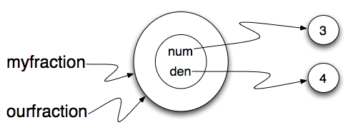

..  Copyright (C)  Brad Miller, David Ranum.  Permission is granted to copy, distribute
    and/or modify this document under the terms of the GNU Free Documentation
    License, Version 1.3 or any later version published by the Free Software
    Foundation; with Invariant Sections being Forward, Prefaces, and
    Contributor List, no Front-Cover Texts, and no Back-Cover Texts.  A copy of
    the license is included in the section entitled "GNU Free Documentation
    License".
    
..  shortname:: ExemploClasseFracoes
..  description:: Esse é um exemplo de classe que representa uma fração

Classes e Objetos - Indo um pouco mais fundo
============================================

.. index:: frações

Frações
-------

Todos nós já tivemos de trabalhar com frações quando éramos mais
jovens. Ou talvez você cozinha bastante e tem que lidar com medições 
dos ingredientes. De qualquer jeito, as frações são algo que estamos
familiarizados.
Neste capítulo vamos desenvolver uma classe para representar uma
fração incluindo alguns dos métodos mais comuns que nós 
gostaríamos que as frações fossem capazes de fazer.

Uma fração é mais comumente vista como dois inteiros, um sobre o
outro, com uma linha separando os dois. O número 
na parte superior é chamado de numerador e o número na parte inferior é
chamado de denominador. Às vezes, as pessoas usam uma barra 
para a linha e, outras vezes, eles usam uma linha reta. O fato é que
isso realmente não importa, desde que você saiba qual 
é o numerador e qual é o denominador.

Para projetar a nossa classe, nós simplesmente precisamos usar a
análise acima para perceber que o `estado` de um objeto fração pode ser 
completamente descrito por dois números inteiros que o
representam. Podemos começar pela implementação da classe
``Fraction`` e o método ``__init__`` que permitirá que o usuário
forneça o numerador e o denominador da fração a ser criada.

.. activecode:: fractions_init

    class Fraction:

        def __init__(self,top,bottom):

            self.num = top        #the numerator is on top
            self.den = bottom     #the denominator is on the bottom

        def __str__(self):
            return str(self.num) + "/" + str(self.den)

        def getNum(self):
            return self.num

        def getDen(self):
            return self.den

    myfraction = Fraction(3,4)
    print(myfraction)

    print(myfraction.getNum())
    print(myfraction.getDen())

Observe que o método ``__str__`` fornece um visual típico de fração
usando uma barra entre o numerador e o denominador.
A figura abaixo mostra o estado de ``myfraction``. Nós também
incluímos alguns métodos simples de acesso, ``getNum`` e ``getDen``,
que retornam os valores do estado da fração.

.. image:: Figures/fractionpic1.png
   
.. index:: tipo de dado mutável

Objetos são Mutáveis
--------------------

Nós podemos mudar o estado de um objeto fazendo uma atribuição a uma
das variáveis da instância. 
Por exemplo, pode-se alterar o numerador da fracção através da
atribuição de um novo valor para ``self.num``. Da mesma forma, nós
poderíamos fazer a mesma coisa para ``self.den``. 

Um lugar onde este tipo de modificação faz sentido é quando
**simplificamos** uma fração. Uma fração completamente simplificada  
significa que o numerador e o denominador não compartilham fatores
comuns. Por exemplo, ``12 / 16`` é uma fracção, mas não
está completamente simplificada pois é possível dividir 12 e 16
por 2, ou seja, 2 é um **divisor comum**. Se dividirmos o numerador
eo denominador por um divisor comum, temos uma fração equivalente. Se
dividirmos pelo **máximo divisor comum**, 
vamos obter a fração completamente simplificada.
Neste caso 4 seria o máximo divisor comum e a fração simplificada
seria 3/4.

Há um método iterativo muito elegante para calcular o maior divisor
comum de dois inteiros. Tente executar a função para vários exemplos
diferentes. 

.. activecode:: fractions_gcd

	def gcd(m,n):
	    while m%n != 0:
	        oldm = m
	        oldn = n

	        m = oldn
	        n = oldm%oldn
            
	    return n

	print(gcd(12,16))

Agora que temos uma função para encontrar o máximo
divisor comum, podemos usá-la para implementar um método fração
chamado ``simplify``.
Vamos pedir à fração que ela se "simplifique completamente".

O método ``simplify`` vai passar o numerador e o denominador para a
função ``gcd`` para encontrar o máximo divisor comum. A instância
então se modificará, dividindo o seu ``num`` e o
seu ``den`` por esse valor.

.. activecode:: fractions_simplify

    def gcd(m,n):
        while m%n != 0:
            oldm = m
            oldn = n

            m = oldn
            n = oldm%oldn

        return n

    class Fraction:

        def __init__(self,top,bottom):

            self.num = top        #the numerator is on top
            self.den = bottom     #the denominator is on the bottom

        def __str__(self):
            return str(self.num) + "/" + str(self.den)

        def simplify(self):
            common = gcd(self.num, self.den)

            self.num = self.num // common
            self.den = self.den // common

    myfraction = Fraction(12,16)

    print(myfraction)
    myfraction.simplify()
    print(myfraction)

Há duas coisas importantes a serem observadas nessa
implementação. Em primeiro lugar, a função ``gcd`` não é 
um método da classe. Ele não pertence a ``Fraction``. Em vez disso, é
uma função que é usado por ``Fraction`` para 
auxiliar em uma tarefa que precisa ser realizada.
Esse tipo de função é muitas vezes chamado de uma **função
auxiliar**. Em segundo lugar,
o método ``simplify`` não retorna nada. Sua função é modificar o
objeto em si. Este tipo de método é 
conhecido como um método **modificador** (*mutator*) porque ele realiza
modificações ou mutações do estado interno do objecto. 

.. index:: igualdade, igualdade; produnda, igualdade; rasa, igualdade
	   rasa, igualdade profunda

Igualdade
---------

O significado da palavra *mesmo* parece perfeitamente claro até que
você pense um pouco mais e então perceba que há mais do que você imaginava.

Por exemplo, se você diz, Chris e eu temos o mesmo carro, você quer
dizer que seu carro e o dele são da mesma marca e modelo, mas que eles
são dois carros diferentes. se 
você diz, Chris e eu temos a mesma mãe, você quer dizer que sua mãe e seu
são a mesma pessoa.

Quando você fala sobre os objetos, há uma ambigüidade similar. Por exemplo, se dois
``Fractions``\ s são os mesmos, isso significa que eles contêm os mesmos dados
(o mesmo numerador e o mesmo denominador), ou que são, na verdade, o mesmo objeto?

Nós já vimos o operador ``is`` no capítulo sobre listas, onde nós
falou sobre apelidos (aliases).
Ela nos permite descobrir se duas referências se referem ao mesmo
objeto.

.. activecode:: fractions_is

    class Fraction:

        def __init__(self,top,bottom):

            self.num = top        #the numerator is on top
            self.den = bottom     #the denominator is on the bottom

        def __str__(self):
            return str(self.num) + "/" + str(self.den)

    myfraction = Fraction(3,4)
    yourfraction = Fraction(3,4)
    print(myfraction is yourfraction)

    ourfraction = myfraction
    print(myfraction is ourfraction)

Embora ``myfraction`` e ``yourfraction`` tenham o mesmo numerodor e
denominador, eles não são o mesmo objeto. 

.. image:: Figures/fractionpic2.png

Se atribuirmos ``myfraction`` a ``ourfraction``, então as duas
variáveis são apelidos do mesmo objeto.

Este tipo de igualdade é chamado de **igualdade rasa** porque só compara
as referências, e não o conteúdo dos objectos. Usando o operador ==
para verificar a igualdade entre dois objetos definidos pelo usuário
retornará o resultado da igualdade rasa. Em outras palavras, os
objetos ``Fraction`` são iguais (==), se eles são o mesmo objeto. 

Obviamente podemos definir a igualdade para significar que as fracções
têm o mesmo numerador e o mesmo denominador. Por exemplo, aqui é uma
função booleana que realiza essa verificação.

.. sourcecode:: python

    def sameFraction(f1,f2):
        return (f1.getNum() == f2.getNum()) and (f1.getDen() == f2.getDen())

Esse tipo de igualdade é chamada de **igualdade profunda** pois
compara valores "profundos" no objeto, não apenas a referência ao objeto.
  
.. activecode:: fractions_eq1

    def sameFraction(f1,f2):
        return (f1.getNum() == f2.getNum()) and (f1.getDen() == f2.getDen())
 
    class Fraction:

        def __init__(self,top,bottom):

            self.num = top        #the numerator is on top
            self.den = bottom     #the denominator is on the bottom

        def __str__(self):
            return str(self.num) + "/" + str(self.den)

        def getNum(self):
            return self.num

        def getDen(self):
            return self.den

    myfraction = Fraction(3,4)
    yourfraction = Fraction(3,4)
    print(myfraction is yourfraction)
    print(sameFraction(myfraction,yourfraction))

Obviamente, se duas variáveis se referem ao mesmo objeto, elas tem
igualdade rasa e profunda.

.. admonition:: Tenha cuidado com  == 

    "Quando eu uso uma palavra", disse Humpty Dumpty, em um tom
    bastante desdenhoso, "ela significa apenas o que eu quiser que
    ela signifique --- nem mais nem menos."    *Alice no País das
    Maravilhas* 
    
    O Python tem um poderoso recurso que permite que um designer de uma
    classe decida o que uma operação como ``==`` ou ``<`` deve
    significar. (Acabamos de mostrar como podemos controlar a forma
    como os nossos objetos são convertidos em strings, ou seja,
    já temos um começo!) Nós vamos ver mais detalhes mais tarde.
    Mas às vezes os implementadores usam igualdade rasas, e outras
    igualdade profunda, como mostrado neste pequeno experimento:

    .. sourcecode:: python
    
        p = Point(4, 2)
        s = Point(4, 2)
        print("== on Points returns", p == s)  # by default, == does a shallow equality test here

        a = [2,3]
        b = [2,3]
        print("== on lists returns",  a == b)  # by default, == does a deep equality test on lists

    Que resulta na saída::
    
        == on Points returns False
        == on lists returns True  
        
    Assim, podemos concluir que, mesmo que duas listas (ou tuplas,
    etc.) sejam objetos distintos, com diferentes endereços de
    memória, em um caso o operador relacional ``==`` testa por
    igualdade profunda, enquanto que no caso de pontos faz um teste
    raso. 

Métodos aritméticos
-------------------

Vamos concluir este capítulo, acrescentando mais alguns métodos para a
nossa classe ``Fraction``. Em particular, vamos implementar
aritmética. Para começar, considere o que significa adicionar duas
frações. Lembre-se que você só pode adicionar frações se elas tiverem
o mesmo denominador. A maneira mais fácil de encontrar um denominador
comum é multiplicar os dois denominadores. Tudo o que fazemos para o
denominador precisa ser feito para o numerador. Isso nos dá a seguinte
equação para soma de frações ::
  
     a/b + c/d = (ad + cb)/bd

Nosso método ``add`` vai receber um ``Fraction`` como um
parâmetro. Ele irá retornar um novo ``Fraction`` que representa a
soma. Nós vamos usar a equação mostrada acima para calcular o novo
numerador e o novo denominador. Uma vez que esta equação não vai
resultar em uma fração simplificada, vamos usar uma técnica semelhante
a que foi usada no método ``simplify`` para encontrar o
máximo divisor comum e, em seguida, dividir cada parte da nova fração.

.. sourcecode:: python

	def add(self,otherfraction):

	    newnum = self.num*otherfraction.den + self.den*otherfraction.num
	    newden = self.den * otherfraction.den

	    common = gcd(newnum,newden)

	    return Fraction(newnum//common,newden//common)

Experimente o método de adição e então modifique as frações e tente de novo.

.. activecode:: fractions_add1

    def gcd(m,n):
        while m%n != 0:
            oldm = m
            oldn = n

            m = oldn
            n = oldm%oldn

        return n

    class Fraction:

        def __init__(self,top,bottom):

            self.num = top        #the numerator is on top
            self.den = bottom     #the denominator is on the bottom

        def __str__(self):
            return str(self.num) + "/" + str(self.den)

        def simplify(self):
            common = gcd(self.num, self.den)

            self.num = self.num // common
            self.den = self.den // common

        def add(self,otherfraction):

            newnum = self.num*otherfraction.den + self.den*otherfraction.num
            newden = self.den * otherfraction.den

            common = gcd(newnum,newden)

            return Fraction(newnum//common,newden//common)

    f1 = Fraction(1,2)
    f2 = Fraction(1,4)

    f3 = f1.add(f2)
    print(f3)

Uma modificação final para este método irá ser bastante útil. Em vez
de invocar o método ``add``, podemos usar o operador de adição
"+". Isso exige que implementemos outro método especial, desta vez
chamado ``__add__``.
Os detalhes do método são os mesmos.

.. sourcecode:: python

	def __add__(self,otherfraction):

	    newnum = self.num*otherfraction.den + self.den*otherfraction.num
	    newden = self.den * otherfraction.den

	    common = gcd(newnum,newden)

	    return Fraction(newnum//common,newden//common)

Porém, agora podemos fazer somas da maneira que estamos acostumados a
fazer com outros dados numéricos.

.. sourcecode:: python

	f1 = Fraction(1,2)
	f2 = Fraction(1,4)

	f3 = f1 + f2    # calls the __add__ method of f1
	print(f3)

.. admonition:: operador + versus método __add__

	Acontece que a adição é um método que existe para inteiros
	também. 4+5 pode ser escrito como (4).__add__(5). Estamos
	pedindo para o 4 invocar o seu método add, passando 5 como o
	outro valor. 

Glossário
---------

.. glossary::
        
    cópia profunda
        Para copiar o conteúdo de um objeto, bem como quaisquer
	objetos incorporados, e dos objetos embutidos neles, e assim
	por diante; implementado pela função ``deepcopy`` do módulo
	``copy``.
	
    cópia rasa
        Para copiar o conteúdo de um objeto, incluindo quaisquer
	referências a objetos embutidos; implementada pela função
	``copy`` no módulo ``copy``.
	
    igualdade profunda
        Igualdade de valores, ou duas referências que apontam para os
	objetos que têm o mesmo valor.

    igualdade rasa
        Igualdade de referências, ou duas referências que apontam para
	o mesmo objeto. 

Exercícios
----------
   
#. Inclua o método ``area`` à classe Rectangle
   que retorna a área de uma instância::

      r = Rectangle(Point(0, 0), 10, 5)
      test(r.area(), 50)

#. Escreva um método ``perimeter`` na classe Rectangle
   para que possamos encontrar o perímetro de uma instância de
   Rectangle::
        
      r = Rectangle(Point(0, 0), 10, 5)
      test(r.perimeter(), 30)

#. Escreva um método ``transpose`` na classe Rectangle
   que troca o largura e altura de uma instância de
   Rectangle::
        
      r = Rectangle(Point(100, 50), 10, 5)
      test(r.width, 10)
      test(r.height, 5)
      r.flip()
      test(r.width, 5)
      test(r.height, 10)
      
#. Escreva um novo método na classe Rectangle para testar se um Point
   está dentro de um Rectangle. Para esse exercício, assuma que o
   retângulo está em (0, 0) com largura 10 e altura 5 tem limites
   superiores *abertos* na largura e na altura, ou seja, ele se estica
   na direção x de [0 a 10), onde o 0 está dentro mas o 10 está fora,
   e de [0 a 5] na direção y. Assim o ponto (10, 2) está fora. Esses
   testes devem passar::
   
      r = Rectangle(Point(0, 0), 10, 5)
      test(r.contains(Point(0, 0)), True)
      test(r.contains(Point(3, 3)), True)
      test(r.contains(Point(3, 7)), False)
      test(r.contains(Point(3, 5)), False)
      test(r.contains(Point(3, 4.99999)), True)
      test(r.contains(Point(-3, -3)), False)
   
#. Em jogos, nós frequentemente colocamos uma moldura retangular ao
   redor de objetos do jogo. Assim fica mais fácil realizar a
   *detecção de colisão* entre objetos, como bombas e naves espaciais,
   verificando se há alguma região de sobreposição entre os
   retângulos.
   
   Escreva uma função para determinar se dois retângulos se
   colidem. *Dica: esse exercício pode ser muito difícil! Pense bem
   sobre todos os casos possíveis antes de programar.*

     
 
